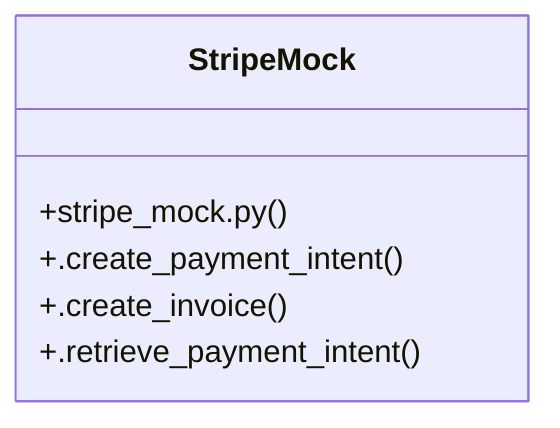

# Analytics Monitoring

> 5 nodes · cohesion 0.40

## Key Concepts

- [StripeMock](file:///E:/Non_Office/Dev_Space/vibe_skool/kloudShop/backend/shared/stripe_mock.py#L5) (4 connections)
- [.create_payment_intent()](file:///E:/Non_Office/Dev_Space/vibe_skool/kloudShop/backend/shared/stripe_mock.py#L6) (2 connections)
- [stripe_mock.py](file:///E:/Non_Office/Dev_Space/vibe_skool/kloudShop/backend/shared/stripe_mock.py#L1) (1 connections)
- [Mock Stripe PaymentIntent for B2C orders.](file:///E:/Non_Office/Dev_Space/vibe_skool/kloudShop/backend/shared/stripe_mock.py#L7) (1 connections)
- [.retrieve_payment_intent()](file:///E:/Non_Office/Dev_Space/vibe_skool/kloudShop/backend/shared/stripe_mock.py#L32) (1 connections)

## Class Diagram

## Relationships

- [[Community 32]] (1 shared connections)

## Source Files

- [E:\Non_Office\Dev_Space\vibe_skool\kloudShop\backend\shared\stripe_mock.py](file:///E:/Non_Office/Dev_Space/vibe_skool/kloudShop/backend/shared/stripe_mock.py)

## Audit Trail

- EXTRACTED: 9 (100%)
- INFERRED: 0 (0%)
- AMBIGUOUS: 0 (0%)

---

*Part of the graphify knowledge wiki. See [[index]] to navigate.*