# App Bootstrap

> 278 nodes · cohesion 0.02

## Key Concepts

- [Variant](file:///E:/Non_Office/Dev_Space/vibe_skool/kloudShop/backend/modules/catalog/models.py#L84) (104 connections)
- [Product](file:///E:/Non_Office/Dev_Space/vibe_skool/kloudShop/backend/modules/catalog/models.py#L10) (74 connections)
- **Base** (70 connections)
- [Fixture to override validate_token dependency.     Usage: auth_override(UserCla](file:///E:/Non_Office/Dev_Space/vibe_skool/kloudShop/backend/tests/conftest.py#L117) (66 connections)
- [StockLocation](file:///E:/Non_Office/Dev_Space/vibe_skool/kloudShop/backend/modules/inventory/models.py#L7) (63 connections)
- [Inventory](file:///E:/Non_Office/Dev_Space/vibe_skool/kloudShop/backend/modules/inventory/models.py#L39) (62 connections)
- [Fixture to override validate_token dependency.     Usage: auth_override(UserCla](file:///E:/Non_Office/Dev_Space/vibe_skool/kloudShop/backend/tests/conftest.py#L113) (58 connections)
- [Order](file:///E:/Non_Office/Dev_Space/vibe_skool/kloudShop/backend/modules/orders/models.py#L9) (50 connections)
- **str** (48 connections)
- [B2B Buyer places an order.     1. Validate Buyer Account     2. Calculate Tota](file:///E:/Non_Office/Dev_Space/vibe_skool/kloudShop/backend/modules/b2b/router.py#L347) (29 connections)
- [Returns the product catalog scoped for the B2B buyer,     including custom pric](file:///E:/Non_Office/Dev_Space/vibe_skool/kloudShop/backend/modules/b2b/router.py#L518) (29 connections)
- [Product](file:///E:/Non_Office/Dev_Space/vibe_skool/kloudShop/frontend/lib/models/catalog.dart) (28 connections)
- [B2BAccount](file:///E:/Non_Office/Dev_Space/vibe_skool/kloudShop/backend/modules/b2b/models.py#L10) (28 connections)
- [schemas.py](file:///E:/Non_Office/Dev_Space/vibe_skool/kloudShop/backend/modules/b2b/schemas.py#L1) (25 connections)
- [MockStripe](file:///E:/Non_Office/Dev_Space/vibe_skool/kloudShop/backend/modules/orders/router.py#L29) (24 connections)
- [router.py](file:///E:/Non_Office/Dev_Space/vibe_skool/kloudShop/backend/modules/b2b/router.py#L1) (21 connections)
- [schemas.py](file:///E:/Non_Office/Dev_Space/vibe_skool/kloudShop/backend/modules/orders/schemas.py#L1) (21 connections)
- [OrderItem](file:///E:/Non_Office/Dev_Space/vibe_skool/kloudShop/backend/modules/orders/models.py#L59) (20 connections)
- [Step 2: Verify payment and create order with atomic inventory decrement.     Pu](file:///E:/Non_Office/Dev_Space/vibe_skool/kloudShop/backend/modules/orders/router.py#L128) (20 connections)
- [Aggregate unique customers from the orders table.     For MVP, we return email,](file:///E:/Non_Office/Dev_Space/vibe_skool/kloudShop/backend/modules/orders/router.py#L313) (20 connections)
- [Export orders for the tenant as a CSV file.](file:///E:/Non_Office/Dev_Space/vibe_skool/kloudShop/backend/modules/orders/router.py#L344) (20 connections)
- [Refund an order via Stripe.](file:///E:/Non_Office/Dev_Space/vibe_skool/kloudShop/backend/modules/orders/router.py#L462) (20 connections)
- [List all orders for the authenticated consumer.](file:///E:/Non_Office/Dev_Space/vibe_skool/kloudShop/backend/modules/orders/router.py#L530) (20 connections)
- [Get details for a specific order owned by the consumer.](file:///E:/Non_Office/Dev_Space/vibe_skool/kloudShop/backend/modules/orders/router.py#L548) (20 connections)
- [Request a return for an order. Logs an event for merchant review.](file:///E:/Non_Office/Dev_Space/vibe_skool/kloudShop/backend/modules/orders/router.py#L573) (20 connections)
- *... and 253 more nodes in this community*

## Class Diagram

```mermaid
classDiagram
    class AICopywriterLog {
        +models.py()
    }
    class ApprovalRequest {
        +models.py()
    }
    class ApprovalWorkflow {
        +models.py()
    }
    class B2BAccount {
        +models.py()
    }
    class B2BInvoice {
        +models.py()
    }
    class BlogCategory {
        +models.py()
    }
    class BlogCategoryTranslation {
        +models.py()
    }
    class BlogPost {
        +models.py()
    }
    class BlogPostTranslation {
        +models.py()
    }
    class BlogTag {
        +models.py()
    }
    class BrandProfile {
        +models.py()
    }
    class CarrierCheckoutOption {
        +models.py()
    }
    class ChannelConnection {
        +models.py()
    }
    class ChannelSyncLog {
        +models.py()
    }
    class ExportJob {
        +models.py()
    }
    class Feature {
        +models.py()
    }
    class FeatureRequest {
        +models.py()
    }
    class FeatureRequestVote {
        +models.py()
    }
    class ImportMapping {
        +models.py()
    }
    class Inventory {
        +models.py()
    }
    class MerchantCarrierConnection {
        +models.py()
    }
    class OnboardingSession {
        +models.py()
    }
    class Order {
        +models.py()
    }
    class OrderEvent {
        +models.py()
    }
    class OrderItem {
        +models.py()
    }
    class OrderNote {
        +models.py()
    }
    class PackagingPreset {
        +models.py()
    }
    class PriceList {
        +models.py()
    }
    class PriceListItem {
        +models.py()
    }
    class PricingRule {
        +models.py()
    }
    class Product {
        +models.py()
    }
    class PurchaseOrder {
        +models.py()
    }
    class PurchaseOrderLine {
        +models.py()
    }
    class ShippingSettings {
        +models.py()
    }
    class StaffLocationAssignment {
        +models.py()
    }
    class StaticPage {
        +models.py()
    }
    class StockLocation {
        +models.py()
    }
    class StockTransfer {
        +models.py()
    }
    class StorefrontContent {
        +models.py()
    }
    class StoreNavigationItem {
        +models.py()
    }
    class StoreNavigationMenu {
        +models.py()
    }
    class StoreShippingProfile {
        +models.py()
    }
    class StoreShippingRate {
        +models.py()
    }
    class StoreShippingZone {
        +models.py()
    }
    class Supplier {
        +models.py()
    }
    class SupplierPerformanceEvent {
        +models.py()
    }
    class SupplierScoreWeights {
        +models.py()
    }
    class TenantFeatureActivation {
        +models.py()
    }
    class TenantFeatureConfig {
        +models.py()
    }
    class Variant {
        +models.py()
    }
    class MockStripe {
        +router.py()
        +.create_payment_intent()
        +.retrieve_payment_intent()
        +.create_refund()
        +.calculate_tax()
    }
    class AccountStatus {
        +schemas.py()
    }
    class ApprovalRequestResponse {
        +schemas.py()
    }
    class ApprovalStatus {
        +schemas.py()
    }
    class ApprovalWorkflowBase {
        +schemas.py()
    }
    class ApprovalWorkflowResponse {
        +schemas.py()
    }
    class ApprovalWorkflowUpdate {
        +schemas.py()
    }
    class B2BAccountBase {
        +schemas.py()
    }
    class B2BAccountCreate {
        +schemas.py()
    }
    class B2BAccountResponse {
        +schemas.py()
    }
    class B2BAccountUpdate {
        +schemas.py()
    }
    class B2BInvoiceResponse {
        +schemas.py()
    }
    class B2BPortalOrderRequest {
        +schemas.py()
    }
    class InventoryBase {
        +schemas.py()
    }
    class InventoryResponse {
        +schemas.py()
    }
    class InvoicePaymentStatus {
        +schemas.py()
    }
    class OrderConfirmRequest {
        +schemas.py()
    }
    class OrderFulfilRequest {
        +schemas.py()
    }
    class OrderNoteBase {
        +schemas.py()
    }
    class OrderNoteCreate {
        +schemas.py()
    }
    class OrderNoteResponse {
        +schemas.py()
    }
    class OrderRefundRequest {
        +schemas.py()
    }
    class OrderResponse {
        +schemas.py()
    }
    class OverrideType {
        +schemas.py()
    }
    class PaymentIntentRequest {
        +schemas.py()
    }
    class PaymentIntentResponse {
        +schemas.py()
    }
    class PriceListBase {
        +schemas.py()
    }
    class PriceListCreate {
        +schemas.py()
    }
    class PriceListItemBase {
        +schemas.py()
    }
    class PriceListItemCreate {
        +schemas.py()
    }
    class PriceListItemResponse {
        +schemas.py()
    }
    class PriceListResponse {
        +schemas.py()
    }
    class PriceListUpdate {
        +schemas.py()
    }
    class ReturnRequest {
        +schemas.py()
    }
    class StockLocationBase {
        +schemas.py()
    }
    class StockLocationCreate {
        +schemas.py()
    }
    class StockLocationResponse {
        +schemas.py()
    }
    class ChannelAdapter {
        +service.py()
    }
    class ChannelSyncService {
        +service.py()
        +.__init__()
        +.trigger_sync()
    }
    class FacebookAdapter {
        +service.py()
        +.__init__()
        +.sync_catalog()
    }
    class InstagramAdapter {
        +service.py()
        +.__init__()
        +.sync_catalog()
    }
    class TikTokAdapter {
        +service.py()
        +.__init__()
        +.sync_catalog()
    }
    ChannelConnection --> ChannelAdapter
    ChannelConnection --> TikTokAdapter
    ChannelConnection --> InstagramAdapter
    ChannelConnection --> FacebookAdapter
    ChannelConnection --> ChannelSyncService
    ChannelSyncLog --> ChannelAdapter
    ChannelSyncLog --> TikTokAdapter
    ChannelSyncLog --> InstagramAdapter
    ChannelSyncLog --> FacebookAdapter
    ChannelSyncLog --> ChannelSyncService
    Inventory --> MockStripe
    Order --> MockStripe
    OrderEvent --> MockStripe
    OrderItem --> MockStripe
    OrderNote --> MockStripe
    Product --> ChannelAdapter
    Product --> TikTokAdapter
    Product --> InstagramAdapter
    Product --> FacebookAdapter
    Product --> ChannelSyncService
    Product --> MockStripe
    StockLocation --> MockStripe
    Variant --> ChannelAdapter
    Variant --> TikTokAdapter
    Variant --> InstagramAdapter
    Variant --> FacebookAdapter
    Variant --> ChannelSyncService
    Variant --> MockStripe
    MockStripe --> Order
    MockStripe --> OrderItem
    MockStripe --> OrderEvent
    MockStripe --> OrderNote
    MockStripe --> StockLocation
    MockStripe --> Inventory
    MockStripe --> OrderResponse
    MockStripe --> PaymentIntentRequest
    MockStripe --> PaymentIntentResponse
    MockStripe --> OrderConfirmRequest
    MockStripe --> StockLocationResponse
    MockStripe --> StockLocationCreate
    MockStripe --> InventoryResponse
    MockStripe --> OrderFulfilRequest
    MockStripe --> OrderRefundRequest
    MockStripe --> ReturnRequest
    MockStripe --> Variant
    MockStripe --> Product
    ApprovalWorkflowUpdate <|-- ApprovalWorkflowBase
    ApprovalWorkflowResponse <|-- ApprovalWorkflowBase
    ApprovalWorkflowBase <|-- ApprovalWorkflowResponse
    ApprovalWorkflowBase <|-- ApprovalWorkflowUpdate
    B2BAccountCreate <|-- B2BAccountBase
    B2BAccountResponse <|-- B2BAccountBase
    B2BAccountBase <|-- B2BAccountCreate
    B2BAccountBase <|-- B2BAccountResponse
    InventoryResponse <|-- InventoryBase
    InventoryBase <|-- InventoryResponse
    InventoryResponse --> MockStripe
    OrderConfirmRequest --> MockStripe
    OrderFulfilRequest --> MockStripe
    OrderNoteCreate <|-- OrderNoteBase
    OrderNoteResponse <|-- OrderNoteBase
    OrderNoteBase <|-- OrderNoteCreate
    OrderNoteBase <|-- OrderNoteResponse
    OrderRefundRequest --> MockStripe
    OrderResponse --> MockStripe
    PaymentIntentRequest --> MockStripe
    PaymentIntentResponse --> MockStripe
    PriceListCreate <|-- PriceListBase
    PriceListResponse <|-- PriceListBase
    PriceListBase <|-- PriceListCreate
    PriceListItemCreate <|-- PriceListItemBase
    PriceListItemResponse <|-- PriceListItemBase
    PriceListItemBase <|-- PriceListItemCreate
    PriceListItemBase <|-- PriceListItemResponse
    PriceListBase <|-- PriceListResponse
    ReturnRequest --> MockStripe
    StockLocationCreate <|-- StockLocationBase
    StockLocationResponse <|-- StockLocationBase
    StockLocationBase <|-- StockLocationCreate
    StockLocationCreate --> MockStripe
    StockLocationBase <|-- StockLocationResponse
    StockLocationResponse --> MockStripe
    TikTokAdapter <|-- ChannelAdapter
    InstagramAdapter <|-- ChannelAdapter
    FacebookAdapter <|-- ChannelAdapter
    ChannelAdapter --> ChannelConnection
    ChannelAdapter --> ChannelSyncLog
    ChannelAdapter --> Product
    ChannelAdapter --> Variant
    ChannelSyncService --> ChannelConnection
    ChannelSyncService --> ChannelSyncLog
    ChannelSyncService --> Product
    ChannelSyncService --> Variant
    ChannelAdapter <|-- FacebookAdapter
    FacebookAdapter --> ChannelConnection
    FacebookAdapter --> ChannelSyncLog
    FacebookAdapter --> Product
    FacebookAdapter --> Variant
    ChannelAdapter <|-- InstagramAdapter
    InstagramAdapter --> ChannelConnection
    InstagramAdapter --> ChannelSyncLog
    InstagramAdapter --> Product
    InstagramAdapter --> Variant
    ChannelAdapter <|-- TikTokAdapter
    TikTokAdapter --> ChannelConnection
    TikTokAdapter --> ChannelSyncLog
    TikTokAdapter --> Product
    TikTokAdapter --> Variant
```

## Relationships

- [[Community 11]] (109 shared connections)
- [[Community 5]] (14 shared connections)
- [[Content & Features]] (9 shared connections)
- [[Community 14]] (2 shared connections)

## Source Files

- [E:\Non_Office\Dev_Space\vibe_skool\kloudShop\backend\modules\ai\models.py](file:///E:/Non_Office/Dev_Space/vibe_skool/kloudShop/backend/modules/ai/models.py)
- [E:\Non_Office\Dev_Space\vibe_skool\kloudShop\backend\modules\analytics\router.py](file:///E:/Non_Office/Dev_Space/vibe_skool/kloudShop/backend/modules/analytics/router.py)
- [E:\Non_Office\Dev_Space\vibe_skool\kloudShop\backend\modules\b2b\models.py](file:///E:/Non_Office/Dev_Space/vibe_skool/kloudShop/backend/modules/b2b/models.py)
- [E:\Non_Office\Dev_Space\vibe_skool\kloudShop\backend\modules\b2b\router.py](file:///E:/Non_Office/Dev_Space/vibe_skool/kloudShop/backend/modules/b2b/router.py)
- [E:\Non_Office\Dev_Space\vibe_skool\kloudShop\backend\modules\b2b\schemas.py](file:///E:/Non_Office/Dev_Space/vibe_skool/kloudShop/backend/modules/b2b/schemas.py)
- [E:\Non_Office\Dev_Space\vibe_skool\kloudShop\backend\modules\blog\models.py](file:///E:/Non_Office/Dev_Space/vibe_skool/kloudShop/backend/modules/blog/models.py)
- [E:\Non_Office\Dev_Space\vibe_skool\kloudShop\backend\modules\catalog\models.py](file:///E:/Non_Office/Dev_Space/vibe_skool/kloudShop/backend/modules/catalog/models.py)
- [E:\Non_Office\Dev_Space\vibe_skool\kloudShop\backend\modules\catalog\router.py](file:///E:/Non_Office/Dev_Space/vibe_skool/kloudShop/backend/modules/catalog/router.py)
- [E:\Non_Office\Dev_Space\vibe_skool\kloudShop\backend\modules\channels\models.py](file:///E:/Non_Office/Dev_Space/vibe_skool/kloudShop/backend/modules/channels/models.py)
- [E:\Non_Office\Dev_Space\vibe_skool\kloudShop\backend\modules\channels\router.py](file:///E:/Non_Office/Dev_Space/vibe_skool/kloudShop/backend/modules/channels/router.py)
- [E:\Non_Office\Dev_Space\vibe_skool\kloudShop\backend\modules\channels\service.py](file:///E:/Non_Office/Dev_Space/vibe_skool/kloudShop/backend/modules/channels/service.py)
- [E:\Non_Office\Dev_Space\vibe_skool\kloudShop\backend\modules\export\models.py](file:///E:/Non_Office/Dev_Space/vibe_skool/kloudShop/backend/modules/export/models.py)
- [E:\Non_Office\Dev_Space\vibe_skool\kloudShop\backend\modules\features\models.py](file:///E:/Non_Office/Dev_Space/vibe_skool/kloudShop/backend/modules/features/models.py)
- [E:\Non_Office\Dev_Space\vibe_skool\kloudShop\backend\modules\feeds\router.py](file:///E:/Non_Office/Dev_Space/vibe_skool/kloudShop/backend/modules/feeds/router.py)
- [E:\Non_Office\Dev_Space\vibe_skool\kloudShop\backend\modules\internal\provisioning.py](file:///E:/Non_Office/Dev_Space/vibe_skool/kloudShop/backend/modules/internal/provisioning.py)
- [E:\Non_Office\Dev_Space\vibe_skool\kloudShop\backend\modules\inventory\models.py](file:///E:/Non_Office/Dev_Space/vibe_skool/kloudShop/backend/modules/inventory/models.py)
- [E:\Non_Office\Dev_Space\vibe_skool\kloudShop\backend\modules\inventory\router.py](file:///E:/Non_Office/Dev_Space/vibe_skool/kloudShop/backend/modules/inventory/router.py)
- [E:\Non_Office\Dev_Space\vibe_skool\kloudShop\backend\modules\navigation\models.py](file:///E:/Non_Office/Dev_Space/vibe_skool/kloudShop/backend/modules/navigation/models.py)
- [E:\Non_Office\Dev_Space\vibe_skool\kloudShop\backend\modules\onboarding\models.py](file:///E:/Non_Office/Dev_Space/vibe_skool/kloudShop/backend/modules/onboarding/models.py)
- [E:\Non_Office\Dev_Space\vibe_skool\kloudShop\backend\modules\orders\models.py](file:///E:/Non_Office/Dev_Space/vibe_skool/kloudShop/backend/modules/orders/models.py)

## Audit Trail

- EXTRACTED: 722 (31%)
- INFERRED: 1577 (69%)
- AMBIGUOUS: 0 (0%)

---

*Part of the graphify knowledge wiki. See [[index]] to navigate.*