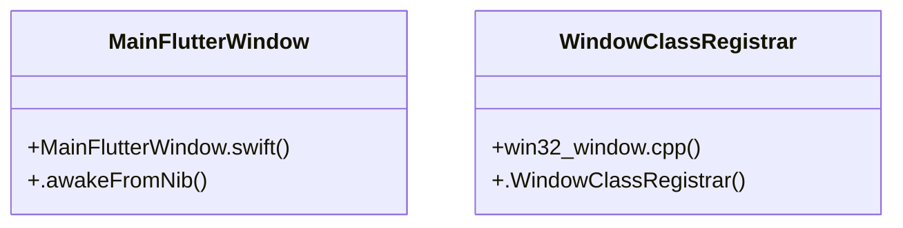

# Community 12

> 78 nodes · cohesion 0.03

## Key Concepts

- [win32_window.cpp](file:///E:/Non_Office/Dev_Space/vibe_skool/kloudShop/frontend/windows/runner/win32_window.cpp#L1) (19 connections)
- [Create()](file:///E:/Non_Office/Dev_Space/vibe_skool/kloudShop/frontend/windows/runner/win32_window.cpp#L123) (10 connections)
- [my_application.cc](file:///E:/Non_Office/Dev_Space/vibe_skool/kloudShop/frontend/linux/runner/my_application.cc#L1) (9 connections)
- [flutter_engine.cc](file:///E:/Non_Office/Dev_Space/vibe_skool/kloudShop/frontend/windows/flutter/ephemeral/cpp_client_wrapper/flutter_engine.cc#L1) (9 connections)
- [OnCreate()](file:///E:/Non_Office/Dev_Space/vibe_skool/kloudShop/frontend/windows/runner/flutter_window.cpp#L12) (7 connections)
- [Destroy()](file:///E:/Non_Office/Dev_Space/vibe_skool/kloudShop/frontend/windows/runner/win32_window.cpp#L224) (7 connections)
- [plugin_registrar.cc](file:///E:/Non_Office/Dev_Space/vibe_skool/kloudShop/frontend/windows/flutter/ephemeral/cpp_client_wrapper/plugin_registrar.cc#L1) (6 connections)
- [GetInstance()](file:///E:/Non_Office/Dev_Space/vibe_skool/kloudShop/frontend/windows/flutter/ephemeral/cpp_client_wrapper/plugin_registrar.cc#L49) (6 connections)
- [wWinMain()](file:///E:/Non_Office/Dev_Space/vibe_skool/kloudShop/frontend/windows/runner/main.cpp#L8) (5 connections)
- [MessageHandler()](file:///E:/Non_Office/Dev_Space/vibe_skool/kloudShop/frontend/windows/runner/win32_window.cpp#L176) (5 connections)
- [flutter_view_controller.cc](file:///E:/Non_Office/Dev_Space/vibe_skool/kloudShop/frontend/windows/flutter/ephemeral/cpp_client_wrapper/flutter_view_controller.cc#L1) (4 connections)
- [flutter_window.cpp](file:///E:/Non_Office/Dev_Space/vibe_skool/kloudShop/frontend/windows/runner/flutter_window.cpp#L1) (4 connections)
- [create_portal_session()](file:///E:/Non_Office/Dev_Space/vibe_skool/kloudShop/backend/modules/billing/router.py#L199) (4 connections)
- [GetClientArea()](file:///E:/Non_Office/Dev_Space/vibe_skool/kloudShop/frontend/windows/runner/win32_window.cpp#L252) (4 connections)
- [WndProc()](file:///E:/Non_Office/Dev_Space/vibe_skool/kloudShop/frontend/windows/runner/win32_window.cpp#L157) (4 connections)
- [utils.cpp](file:///E:/Non_Office/Dev_Space/vibe_skool/kloudShop/frontend/windows/runner/utils.cpp#L1) (3 connections)
- [ShutDown()](file:///E:/Non_Office/Dev_Space/vibe_skool/kloudShop/frontend/windows/flutter/ephemeral/cpp_client_wrapper/flutter_engine.cc#L70) (3 connections)
- [FlutterViewController()](file:///E:/Non_Office/Dev_Space/vibe_skool/kloudShop/frontend/windows/flutter/ephemeral/cpp_client_wrapper/flutter_view_controller.cc#L12) (3 connections)
- [MessageHandler()](file:///E:/Non_Office/Dev_Space/vibe_skool/kloudShop/frontend/windows/runner/flutter_window.cpp#L50) (3 connections)
- [RegisterPlugins()](file:///E:/Non_Office/Dev_Space/vibe_skool/kloudShop/frontend/windows/flutter/generated_plugin_registrant.cc#L15) (3 connections)
- [MainFlutterWindow](file:///E:/Non_Office/Dev_Space/vibe_skool/kloudShop/frontend/macos/Runner/MainFlutterWindow.swift#L4) (3 connections)
- [.awakeFromNib()](file:///E:/Non_Office/Dev_Space/vibe_skool/kloudShop/frontend/macos/Runner/MainFlutterWindow.swift#L5) (3 connections)
- [PluginRegistrar()](file:///E:/Non_Office/Dev_Space/vibe_skool/kloudShop/frontend/windows/flutter/ephemeral/cpp_client_wrapper/plugin_registrar.cc#L19) (3 connections)
- [GetCommandLineArguments()](file:///E:/Non_Office/Dev_Space/vibe_skool/kloudShop/frontend/windows/runner/utils.cpp#L24) (3 connections)
- [Utf8FromUtf16()](file:///E:/Non_Office/Dev_Space/vibe_skool/kloudShop/frontend/windows/runner/utils.cpp#L44) (3 connections)
- *... and 53 more nodes in this community*

## Class Diagram

## Relationships

- [[Community 13]] (1 shared connections)

## Source Files

- [E:\Non_Office\Dev_Space\vibe_skool\kloudShop\backend\modules\billing\router.py](file:///E:/Non_Office/Dev_Space/vibe_skool/kloudShop/backend/modules/billing/router.py)
- [E:\Non_Office\Dev_Space\vibe_skool\kloudShop\frontend\lib\providers\provisioning_provider.dart](file:///E:/Non_Office/Dev_Space/vibe_skool/kloudShop/frontend/lib/providers/provisioning_provider.dart)
- [E:\Non_Office\Dev_Space\vibe_skool\kloudShop\frontend\linux\flutter\generated_plugin_registrant.cc](file:///E:/Non_Office/Dev_Space/vibe_skool/kloudShop/frontend/linux/flutter/generated_plugin_registrant.cc)
- [E:\Non_Office\Dev_Space\vibe_skool\kloudShop\frontend\linux\runner\main.cc](file:///E:/Non_Office/Dev_Space/vibe_skool/kloudShop/frontend/linux/runner/main.cc)
- [E:\Non_Office\Dev_Space\vibe_skool\kloudShop\frontend\linux\runner\my_application.cc](file:///E:/Non_Office/Dev_Space/vibe_skool/kloudShop/frontend/linux/runner/my_application.cc)
- [E:\Non_Office\Dev_Space\vibe_skool\kloudShop\frontend\macos\Flutter\GeneratedPluginRegistrant.swift](file:///E:/Non_Office/Dev_Space/vibe_skool/kloudShop/frontend/macos/Flutter/GeneratedPluginRegistrant.swift)
- [E:\Non_Office\Dev_Space\vibe_skool\kloudShop\frontend\macos\Runner\MainFlutterWindow.swift](file:///E:/Non_Office/Dev_Space/vibe_skool/kloudShop/frontend/macos/Runner/MainFlutterWindow.swift)
- [E:\Non_Office\Dev_Space\vibe_skool\kloudShop\frontend\windows\flutter\ephemeral\cpp_client_wrapper\flutter_engine.cc](file:///E:/Non_Office/Dev_Space/vibe_skool/kloudShop/frontend/windows/flutter/ephemeral/cpp_client_wrapper/flutter_engine.cc)
- [E:\Non_Office\Dev_Space\vibe_skool\kloudShop\frontend\windows\flutter\ephemeral\cpp_client_wrapper\flutter_view_controller.cc](file:///E:/Non_Office/Dev_Space/vibe_skool/kloudShop/frontend/windows/flutter/ephemeral/cpp_client_wrapper/flutter_view_controller.cc)
- [E:\Non_Office\Dev_Space\vibe_skool\kloudShop\frontend\windows\flutter\ephemeral\cpp_client_wrapper\plugin_registrar.cc](file:///E:/Non_Office/Dev_Space/vibe_skool/kloudShop/frontend/windows/flutter/ephemeral/cpp_client_wrapper/plugin_registrar.cc)
- [E:\Non_Office\Dev_Space\vibe_skool\kloudShop\frontend\windows\flutter\generated_plugin_registrant.cc](file:///E:/Non_Office/Dev_Space/vibe_skool/kloudShop/frontend/windows/flutter/generated_plugin_registrant.cc)
- [E:\Non_Office\Dev_Space\vibe_skool\kloudShop\frontend\windows\runner\flutter_window.cpp](file:///E:/Non_Office/Dev_Space/vibe_skool/kloudShop/frontend/windows/runner/flutter_window.cpp)
- [E:\Non_Office\Dev_Space\vibe_skool\kloudShop\frontend\windows\runner\flutter_window.h](file:///E:/Non_Office/Dev_Space/vibe_skool/kloudShop/frontend/windows/runner/flutter_window.h)
- [E:\Non_Office\Dev_Space\vibe_skool\kloudShop\frontend\windows\runner\main.cpp](file:///E:/Non_Office/Dev_Space/vibe_skool/kloudShop/frontend/windows/runner/main.cpp)
- [E:\Non_Office\Dev_Space\vibe_skool\kloudShop\frontend\windows\runner\utils.cpp](file:///E:/Non_Office/Dev_Space/vibe_skool/kloudShop/frontend/windows/runner/utils.cpp)
- [E:\Non_Office\Dev_Space\vibe_skool\kloudShop\frontend\windows\runner\win32_window.cpp](file:///E:/Non_Office/Dev_Space/vibe_skool/kloudShop/frontend/windows/runner/win32_window.cpp)

## Audit Trail

- EXTRACTED: 168 (76%)
- INFERRED: 52 (24%)
- AMBIGUOUS: 0 (0%)

---

*Part of the graphify knowledge wiki. See [[index]] to navigate.*