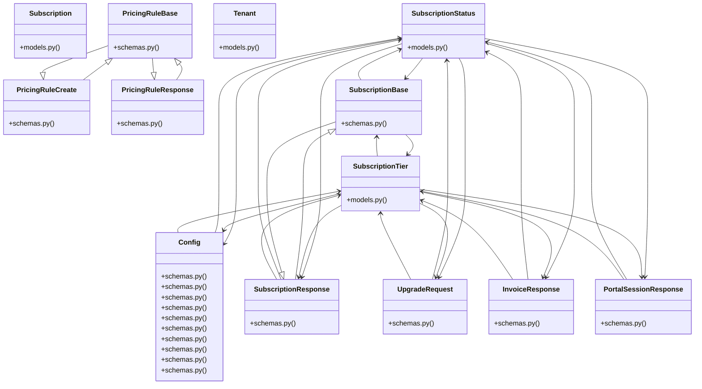

# Community 14

> 55 nodes · cohesion 0.10

## Key Concepts

- [Tenant](file:///E:/Non_Office/Dev_Space/vibe_skool/kloudShop/backend/modules/platform/models.py#L9) (38 connections)
- [Subscription](file:///E:/Non_Office/Dev_Space/vibe_skool/kloudShop/backend/modules/billing/models.py#L23) (25 connections)
- [SubscriptionStatus](file:///E:/Non_Office/Dev_Space/vibe_skool/kloudShop/backend/modules/billing/models.py#L10) (25 connections)
- [SubscriptionTier](file:///E:/Non_Office/Dev_Space/vibe_skool/kloudShop/backend/modules/billing/models.py#L17) (21 connections)
- [Config](file:///E:/Non_Office/Dev_Space/vibe_skool/kloudShop/backend/modules/tax/schemas.py#L18) (18 connections)
- [InvoiceResponse](file:///E:/Non_Office/Dev_Space/vibe_skool/kloudShop/backend/modules/billing/schemas.py#L26) (10 connections)
- [PortalSessionResponse](file:///E:/Non_Office/Dev_Space/vibe_skool/kloudShop/backend/modules/billing/schemas.py#L35) (10 connections)
- [SubscriptionResponse](file:///E:/Non_Office/Dev_Space/vibe_skool/kloudShop/backend/modules/billing/schemas.py#L10) (10 connections)
- [UpgradeRequest](file:///E:/Non_Office/Dev_Space/vibe_skool/kloudShop/backend/modules/billing/schemas.py#L21) (10 connections)
- [Finalizes an upgrade session.      In Stripe mode, this would verify the sessio](file:///E:/Non_Office/Dev_Space/vibe_skool/kloudShop/backend/modules/billing/router.py#L131) (9 connections)
- [Lists all invoices from Stripe for the current tenant.](file:///E:/Non_Office/Dev_Space/vibe_skool/kloudShop/backend/modules/billing/router.py#L169) (9 connections)
- [Creates a Stripe Billing Portal session.](file:///E:/Non_Office/Dev_Space/vibe_skool/kloudShop/backend/modules/billing/router.py#L204) (9 connections)
- [Manually trigger the trial expiration check.](file:///E:/Non_Office/Dev_Space/vibe_skool/kloudShop/backend/modules/billing/router.py#L231) (9 connections)
- [Fetch current subscription status for the tenant.](file:///E:/Non_Office/Dev_Space/vibe_skool/kloudShop/backend/modules/billing/router.py#L26) (9 connections)
- [Initiates a Stripe Checkout Session for tier upgrades.](file:///E:/Non_Office/Dev_Space/vibe_skool/kloudShop/backend/modules/billing/router.py#L51) (9 connections)
- [models.py](file:///E:/Non_Office/Dev_Space/vibe_skool/kloudShop/backend/modules/billing/models.py#L1) (8 connections)
- [router.py](file:///E:/Non_Office/Dev_Space/vibe_skool/kloudShop/backend/modules/billing/router.py#L1) (8 connections)
- [schemas.py](file:///E:/Non_Office/Dev_Space/vibe_skool/kloudShop/backend/modules/billing/schemas.py#L1) (8 connections)
- [List all merchants and their subscription status.](file:///E:/Non_Office/Dev_Space/vibe_skool/kloudShop/backend/modules/platform/router.py#L49) (8 connections)
- [Verify that a merchant can fetch their subscription.](file:///E:/Non_Office/Dev_Space/vibe_skool/kloudShop/backend/tests/test_billing.py#L11) (6 connections)
- [Verify that complete-upgrade correctly identifies and processes a mock session.](file:///E:/Non_Office/Dev_Space/vibe_skool/kloudShop/backend/tests/test_billing.py#L127) (6 connections)
- [Verify that list_invoices returns empty list if no stripe customer.](file:///E:/Non_Office/Dev_Space/vibe_skool/kloudShop/backend/tests/test_billing.py#L29) (6 connections)
- [Verify that creating portal session fails without a stripe customer.](file:///E:/Non_Office/Dev_Space/vibe_skool/kloudShop/backend/tests/test_billing.py#L45) (6 connections)
- [Verify that the trial check task suspends expired tenants.](file:///E:/Non_Office/Dev_Space/vibe_skool/kloudShop/backend/tests/test_billing.py#L61) (6 connections)
- [Verify that the success URL correctly appends session_id if missing.](file:///E:/Non_Office/Dev_Space/vibe_skool/kloudShop/backend/tests/test_billing.py#L88) (6 connections)
- *... and 30 more nodes in this community*

## Class Diagram

## Relationships

- [[App Bootstrap]] (8 shared connections)
- [[Community 5]] (8 shared connections)
- [[Community 10]] (4 shared connections)
- [[Content & Features]] (3 shared connections)

## Source Files

- [E:\Non_Office\Dev_Space\vibe_skool\kloudShop\backend\modules\billing\models.py](file:///E:/Non_Office/Dev_Space/vibe_skool/kloudShop/backend/modules/billing/models.py)
- [E:\Non_Office\Dev_Space\vibe_skool\kloudShop\backend\modules\billing\router.py](file:///E:/Non_Office/Dev_Space/vibe_skool/kloudShop/backend/modules/billing/router.py)
- [E:\Non_Office\Dev_Space\vibe_skool\kloudShop\backend\modules\billing\schemas.py](file:///E:/Non_Office/Dev_Space/vibe_skool/kloudShop/backend/modules/billing/schemas.py)
- [E:\Non_Office\Dev_Space\vibe_skool\kloudShop\backend\modules\billing\tasks.py](file:///E:/Non_Office/Dev_Space/vibe_skool/kloudShop/backend/modules/billing/tasks.py)
- [E:\Non_Office\Dev_Space\vibe_skool\kloudShop\backend\modules\billing\webhooks.py](file:///E:/Non_Office/Dev_Space/vibe_skool/kloudShop/backend/modules/billing/webhooks.py)
- [E:\Non_Office\Dev_Space\vibe_skool\kloudShop\backend\modules\feeds\router.py](file:///E:/Non_Office/Dev_Space/vibe_skool/kloudShop/backend/modules/feeds/router.py)
- [E:\Non_Office\Dev_Space\vibe_skool\kloudShop\backend\modules\platform\models.py](file:///E:/Non_Office/Dev_Space/vibe_skool/kloudShop/backend/modules/platform/models.py)
- [E:\Non_Office\Dev_Space\vibe_skool\kloudShop\backend\modules\platform\router.py](file:///E:/Non_Office/Dev_Space/vibe_skool/kloudShop/backend/modules/platform/router.py)
- [E:\Non_Office\Dev_Space\vibe_skool\kloudShop\backend\modules\pricing\schemas.py](file:///E:/Non_Office/Dev_Space/vibe_skool/kloudShop/backend/modules/pricing/schemas.py)
- [E:\Non_Office\Dev_Space\vibe_skool\kloudShop\backend\modules\tax\schemas.py](file:///E:/Non_Office/Dev_Space/vibe_skool/kloudShop/backend/modules/tax/schemas.py)
- [E:\Non_Office\Dev_Space\vibe_skool\kloudShop\backend\tests\test_billing.py](file:///E:/Non_Office/Dev_Space/vibe_skool/kloudShop/backend/tests/test_billing.py)
- [E:\Non_Office\Dev_Space\vibe_skool\kloudShop\frontend\lib\services\api_service.dart](file:///E:/Non_Office/Dev_Space/vibe_skool/kloudShop/frontend/lib/services/api_service.dart)

## Audit Trail

- EXTRACTED: 138 (36%)
- INFERRED: 248 (64%)
- AMBIGUOUS: 0 (0%)

---

*Part of the graphify knowledge wiki. See [[index]] to navigate.*