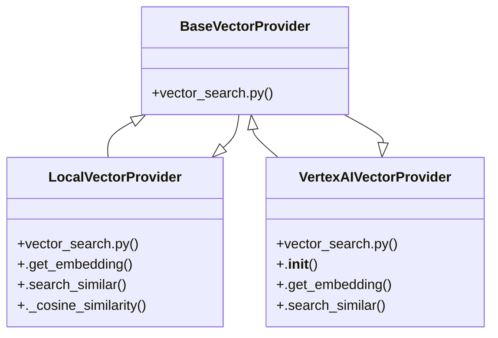

# Community 15

> 53 nodes · cohesion 0.05

## Key Concepts

- [router.py](file:///E:/Non_Office/Dev_Space/vibe_skool/kloudShop/backend/modules/storefront/router.py#L1) (23 connections)
- [LocalVectorProvider](file:///E:/Non_Office/Dev_Space/vibe_skool/kloudShop/backend/shared/vector_search.py#L14) (8 connections)
- [vector_search.py](file:///E:/Non_Office/Dev_Space/vibe_skool/kloudShop/backend/shared/vector_search.py#L1) (7 connections)
- [generate_meta_tags()](file:///E:/Non_Office/Dev_Space/vibe_skool/kloudShop/backend/shared/seo.py#L65) (6 connections)
- [VertexAIVectorProvider](file:///E:/Non_Office/Dev_Space/vibe_skool/kloudShop/backend/shared/vector_search.py#L63) (6 connections)
- [ssr_router.py](file:///E:/Non_Office/Dev_Space/vibe_skool/kloudShop/backend/modules/storefront/ssr_router.py#L1) (5 connections)
- **ABC** (4 connections)
- [resolve_locale()](file:///E:/Non_Office/Dev_Space/vibe_skool/kloudShop/backend/shared/locale.py#L4) (4 connections)
- [storefront_search()](file:///E:/Non_Office/Dev_Space/vibe_skool/kloudShop/backend/modules/storefront/router.py#L179) (4 connections)
- [generate_article_jsonld()](file:///E:/Non_Office/Dev_Space/vibe_skool/kloudShop/backend/shared/seo.py#L4) (4 connections)
- [generate_product_jsonld()](file:///E:/Non_Office/Dev_Space/vibe_skool/kloudShop/backend/shared/seo.py#L32) (4 connections)
- [serve_storefront_blog_post()](file:///E:/Non_Office/Dev_Space/vibe_skool/kloudShop/backend/modules/storefront/ssr_router.py#L110) (4 connections)
- [serve_storefront_product()](file:///E:/Non_Office/Dev_Space/vibe_skool/kloudShop/backend/modules/storefront/ssr_router.py#L65) (4 connections)
- [BaseVectorProvider](file:///E:/Non_Office/Dev_Space/vibe_skool/kloudShop/backend/shared/vector_search.py#L5) (4 connections)
- [seo.py](file:///E:/Non_Office/Dev_Space/vibe_skool/kloudShop/backend/shared/seo.py#L1) (3 connections)
- [get_storefront_blog_post()](file:///E:/Non_Office/Dev_Space/vibe_skool/kloudShop/backend/modules/storefront/router.py#L282) (3 connections)
- [serve_order_success()](file:///E:/Non_Office/Dev_Space/vibe_skool/kloudShop/backend/modules/storefront/ssr_router.py#L149) (3 connections)
- [serve_storefront_home()](file:///E:/Non_Office/Dev_Space/vibe_skool/kloudShop/backend/modules/storefront/ssr_router.py#L27) (3 connections)
- [get_vector_provider()](file:///E:/Non_Office/Dev_Space/vibe_skool/kloudShop/backend/shared/vector_search.py#L88) (3 connections)
- [.search_similar()](file:///E:/Non_Office/Dev_Space/vibe_skool/kloudShop/backend/shared/vector_search.py#L81) (3 connections)
- [create_brand_profile()](file:///E:/Non_Office/Dev_Space/vibe_skool/kloudShop/backend/modules/storefront/router.py#L341) (2 connections)
- [create_carrier_connection()](file:///E:/Non_Office/Dev_Space/vibe_skool/kloudShop/backend/modules/storefront/router.py#L492) (2 connections)
- [create_checkout_option()](file:///E:/Non_Office/Dev_Space/vibe_skool/kloudShop/backend/modules/storefront/router.py#L518) (2 connections)
- [create_static_page()](file:///E:/Non_Office/Dev_Space/vibe_skool/kloudShop/backend/modules/storefront/router.py#L408) (2 connections)
- [get_storefront_product()](file:///E:/Non_Office/Dev_Space/vibe_skool/kloudShop/backend/modules/storefront/router.py#L106) (2 connections)
- *... and 28 more nodes in this community*

## Class Diagram

## Relationships

- [[Community 14]] (6 shared connections)

## Source Files

- [E:\Non_Office\Dev_Space\vibe_skool\kloudShop\backend\modules\storefront\router.py](file:///E:/Non_Office/Dev_Space/vibe_skool/kloudShop/backend/modules/storefront/router.py)
- [E:\Non_Office\Dev_Space\vibe_skool\kloudShop\backend\modules\storefront\ssr_router.py](file:///E:/Non_Office/Dev_Space/vibe_skool/kloudShop/backend/modules/storefront/ssr_router.py)
- [E:\Non_Office\Dev_Space\vibe_skool\kloudShop\backend\shared\locale.py](file:///E:/Non_Office/Dev_Space/vibe_skool/kloudShop/backend/shared/locale.py)
- [E:\Non_Office\Dev_Space\vibe_skool\kloudShop\backend\shared\seo.py](file:///E:/Non_Office/Dev_Space/vibe_skool/kloudShop/backend/shared/seo.py)
- [E:\Non_Office\Dev_Space\vibe_skool\kloudShop\backend\shared\vector_search.py](file:///E:/Non_Office/Dev_Space/vibe_skool/kloudShop/backend/shared/vector_search.py)

## Audit Trail

- EXTRACTED: 113 (76%)
- INFERRED: 35 (24%)
- AMBIGUOUS: 0 (0%)

---

*Part of the graphify knowledge wiki. See [[index]] to navigate.*