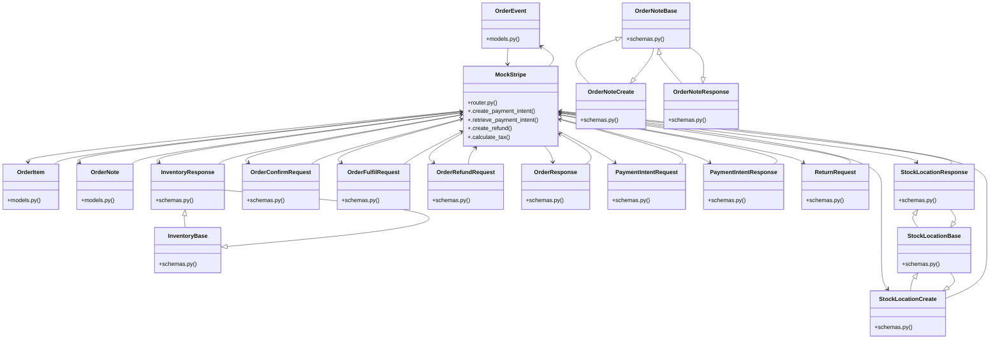

# Community 15

> 52 nodes · cohesion 0.14

## Key Concepts

- [MockStripe](file:///E:/Non_Office/Dev_Space/vibe_skool/kloudShop/backend/modules/orders/router.py#L29) (24 connections)
- [schemas.py](file:///E:/Non_Office/Dev_Space/vibe_skool/kloudShop/backend/modules/orders/schemas.py#L1) (21 connections)
- [Step 2: Verify payment and create order with atomic inventory decrement.     Pu](file:///E:/Non_Office/Dev_Space/vibe_skool/kloudShop/backend/modules/orders/router.py#L128) (20 connections)
- [Aggregate unique customers from the orders table.     For MVP, we return email,](file:///E:/Non_Office/Dev_Space/vibe_skool/kloudShop/backend/modules/orders/router.py#L313) (20 connections)
- [Export orders for the tenant as a CSV file.](file:///E:/Non_Office/Dev_Space/vibe_skool/kloudShop/backend/modules/orders/router.py#L344) (20 connections)
- [Refund an order via Stripe.](file:///E:/Non_Office/Dev_Space/vibe_skool/kloudShop/backend/modules/orders/router.py#L462) (20 connections)
- [List all orders for the authenticated consumer.](file:///E:/Non_Office/Dev_Space/vibe_skool/kloudShop/backend/modules/orders/router.py#L530) (20 connections)
- [Get details for a specific order owned by the consumer.](file:///E:/Non_Office/Dev_Space/vibe_skool/kloudShop/backend/modules/orders/router.py#L548) (20 connections)
- [Request a return for an order. Logs an event for merchant review.](file:///E:/Non_Office/Dev_Space/vibe_skool/kloudShop/backend/modules/orders/router.py#L573) (20 connections)
- [Step 1: Calculate total and create Stripe PaymentIntent.     Public storefront](file:///E:/Non_Office/Dev_Space/vibe_skool/kloudShop/backend/modules/orders/router.py#L72) (20 connections)
- [OrderItem](file:///E:/Non_Office/Dev_Space/vibe_skool/kloudShop/backend/modules/orders/models.py#L59) (19 connections)
- [OrderEvent](file:///E:/Non_Office/Dev_Space/vibe_skool/kloudShop/backend/modules/orders/models.py#L80) (18 connections)
- [router.py](file:///E:/Non_Office/Dev_Space/vibe_skool/kloudShop/backend/modules/orders/router.py#L1) (17 connections)
- [OrderNote](file:///E:/Non_Office/Dev_Space/vibe_skool/kloudShop/backend/modules/orders/models.py#L94) (13 connections)
- [PaymentIntentResponse](file:///E:/Non_Office/Dev_Space/vibe_skool/kloudShop/backend/modules/orders/schemas.py#L138) (13 connections)
- [InventoryResponse](file:///E:/Non_Office/Dev_Space/vibe_skool/kloudShop/backend/modules/orders/schemas.py#L40) (12 connections)
- [OrderConfirmRequest](file:///E:/Non_Office/Dev_Space/vibe_skool/kloudShop/backend/modules/orders/schemas.py#L144) (12 connections)
- [OrderFulfilRequest](file:///E:/Non_Office/Dev_Space/vibe_skool/kloudShop/backend/modules/orders/schemas.py#L156) (12 connections)
- [OrderRefundRequest](file:///E:/Non_Office/Dev_Space/vibe_skool/kloudShop/backend/modules/orders/schemas.py#L162) (12 connections)
- [OrderResponse](file:///E:/Non_Office/Dev_Space/vibe_skool/kloudShop/backend/modules/orders/schemas.py#L100) (12 connections)
- [PaymentIntentRequest](file:///E:/Non_Office/Dev_Space/vibe_skool/kloudShop/backend/modules/orders/schemas.py#L132) (12 connections)
- [ReturnRequest](file:///E:/Non_Office/Dev_Space/vibe_skool/kloudShop/backend/modules/orders/schemas.py#L167) (12 connections)
- [StockLocationCreate](file:///E:/Non_Office/Dev_Space/vibe_skool/kloudShop/backend/modules/orders/schemas.py#L21) (12 connections)
- [StockLocationResponse](file:///E:/Non_Office/Dev_Space/vibe_skool/kloudShop/backend/modules/orders/schemas.py#L24) (12 connections)
- [OrderEvent](file:///E:/Non_Office/Dev_Space/vibe_skool/kloudShop/frontend/lib/models/order.dart) (10 connections)
- *... and 27 more nodes in this community*

## Class Diagram

## Relationships

- [[Community 3]] (21 shared connections)
- [[Community 14]] (4 shared connections)
- [[Content & Features]] (3 shared connections)

## Source Files

- [E:\Non_Office\Dev_Space\vibe_skool\kloudShop\backend\modules\b2b\router.py](file:///E:/Non_Office/Dev_Space/vibe_skool/kloudShop/backend/modules/b2b/router.py)
- [E:\Non_Office\Dev_Space\vibe_skool\kloudShop\backend\modules\orders\models.py](file:///E:/Non_Office/Dev_Space/vibe_skool/kloudShop/backend/modules/orders/models.py)
- [E:\Non_Office\Dev_Space\vibe_skool\kloudShop\backend\modules\orders\router.py](file:///E:/Non_Office/Dev_Space/vibe_skool/kloudShop/backend/modules/orders/router.py)
- [E:\Non_Office\Dev_Space\vibe_skool\kloudShop\backend\modules\orders\schemas.py](file:///E:/Non_Office/Dev_Space/vibe_skool/kloudShop/backend/modules/orders/schemas.py)
- [E:\Non_Office\Dev_Space\vibe_skool\kloudShop\frontend\lib\models\order.dart](file:///E:/Non_Office/Dev_Space/vibe_skool/kloudShop/frontend/lib/models/order.dart)

## Audit Trail

- EXTRACTED: 138 (29%)
- INFERRED: 340 (71%)
- AMBIGUOUS: 0 (0%)

---

*Part of the graphify knowledge wiki. See [[index]] to navigate.*