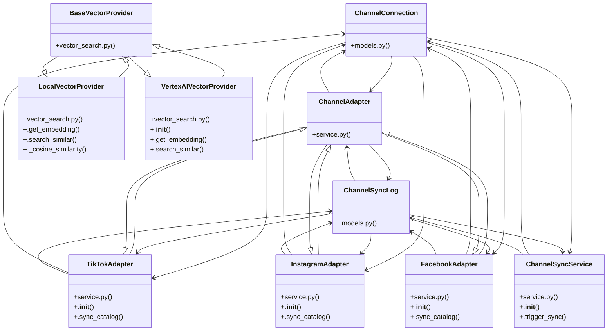

# Community 15

> 53 nodes · cohesion 0.06

## Key Concepts

- [ChannelConnection](file:///E:/Non_Office/Dev_Space/vibe_skool/kloudShop/backend/modules/channels/models.py#L7) (12 connections)
- [router.py](file:///E:/Non_Office/Dev_Space/vibe_skool/kloudShop/backend/modules/channels/router.py#L1) (10 connections)
- [ChannelSyncLog](file:///E:/Non_Office/Dev_Space/vibe_skool/kloudShop/backend/modules/channels/models.py#L27) (9 connections)
- [ChannelAdapter](file:///E:/Non_Office/Dev_Space/vibe_skool/kloudShop/backend/modules/channels/service.py#L8) (9 connections)
- [FacebookAdapter](file:///E:/Non_Office/Dev_Space/vibe_skool/kloudShop/backend/modules/channels/service.py#L103) (9 connections)
- [InstagramAdapter](file:///E:/Non_Office/Dev_Space/vibe_skool/kloudShop/backend/modules/channels/service.py#L61) (9 connections)
- [TikTokAdapter](file:///E:/Non_Office/Dev_Space/vibe_skool/kloudShop/backend/modules/channels/service.py#L16) (9 connections)
- [service.py](file:///E:/Non_Office/Dev_Space/vibe_skool/kloudShop/backend/modules/channels/service.py#L1) (8 connections)
- [ChannelSyncService](file:///E:/Non_Office/Dev_Space/vibe_skool/kloudShop/backend/modules/channels/service.py#L142) (8 connections)
- [LocalVectorProvider](file:///E:/Non_Office/Dev_Space/vibe_skool/kloudShop/backend/shared/vector_search.py#L14) (8 connections)
- [vector_search.py](file:///E:/Non_Office/Dev_Space/vibe_skool/kloudShop/backend/shared/vector_search.py#L1) (7 connections)
- [VertexAIVectorProvider](file:///E:/Non_Office/Dev_Space/vibe_skool/kloudShop/backend/shared/vector_search.py#L63) (6 connections)
- [.trigger_sync()](file:///E:/Non_Office/Dev_Space/vibe_skool/kloudShop/backend/modules/channels/service.py#L152) (5 connections)
- **ABC** (4 connections)
- [storefront_search()](file:///E:/Non_Office/Dev_Space/vibe_skool/kloudShop/backend/modules/storefront/router.py#L179) (4 connections)
- [sync_channel()](file:///E:/Non_Office/Dev_Space/vibe_skool/kloudShop/backend/modules/channels/router.py#L195) (4 connections)
- [.__init__()](file:///E:/Non_Office/Dev_Space/vibe_skool/kloudShop/backend/modules/channels/service.py#L143) (4 connections)
- [BaseVectorProvider](file:///E:/Non_Office/Dev_Space/vibe_skool/kloudShop/backend/shared/vector_search.py#L5) (4 connections)
- [models.py](file:///E:/Non_Office/Dev_Space/vibe_skool/kloudShop/backend/modules/channels/models.py#L1) (3 connections)
- [connect_channel()](file:///E:/Non_Office/Dev_Space/vibe_skool/kloudShop/backend/modules/channels/router.py#L25) (3 connections)
- [facebook_callback()](file:///E:/Non_Office/Dev_Space/vibe_skool/kloudShop/backend/modules/channels/router.py#L163) (3 connections)
- [instagram_callback()](file:///E:/Non_Office/Dev_Space/vibe_skool/kloudShop/backend/modules/channels/router.py#L122) (3 connections)
- [tiktok_callback()](file:///E:/Non_Office/Dev_Space/vibe_skool/kloudShop/backend/modules/channels/router.py#L76) (3 connections)
- [get_vector_provider()](file:///E:/Non_Office/Dev_Space/vibe_skool/kloudShop/backend/shared/vector_search.py#L88) (3 connections)
- [.search_similar()](file:///E:/Non_Office/Dev_Space/vibe_skool/kloudShop/backend/shared/vector_search.py#L81) (3 connections)
- *... and 28 more nodes in this community*

## Class Diagram

## Relationships

- [[Content & Features]] (12 shared connections)
- [[Community 4]] (1 shared connections)
- [[Community 3]] (1 shared connections)

## Source Files

- [E:\Non_Office\Dev_Space\vibe_skool\kloudShop\backend\modules\channels\models.py](file:///E:/Non_Office/Dev_Space/vibe_skool/kloudShop/backend/modules/channels/models.py)
- [E:\Non_Office\Dev_Space\vibe_skool\kloudShop\backend\modules\channels\router.py](file:///E:/Non_Office/Dev_Space/vibe_skool/kloudShop/backend/modules/channels/router.py)
- [E:\Non_Office\Dev_Space\vibe_skool\kloudShop\backend\modules\channels\service.py](file:///E:/Non_Office/Dev_Space/vibe_skool/kloudShop/backend/modules/channels/service.py)
- [E:\Non_Office\Dev_Space\vibe_skool\kloudShop\backend\modules\storefront\router.py](file:///E:/Non_Office/Dev_Space/vibe_skool/kloudShop/backend/modules/storefront/router.py)
- [E:\Non_Office\Dev_Space\vibe_skool\kloudShop\backend\shared\vector_search.py](file:///E:/Non_Office/Dev_Space/vibe_skool/kloudShop/backend/shared/vector_search.py)

## Audit Trail

- EXTRACTED: 134 (69%)
- INFERRED: 61 (31%)
- AMBIGUOUS: 0 (0%)

---

*Part of the graphify knowledge wiki. See [[index]] to navigate.*