# Community 17

> 46 nodes · cohesion 0.08

## Key Concepts

- [BrandProfile](file:///E:/Non_Office/Dev_Space/vibe_skool/kloudShop/backend/modules/storefront/models.py#L8) (19 connections)
- [Check if a tenant ID (slug) is available.](file:///E:/Non_Office/Dev_Space/vibe_skool/kloudShop/backend/modules/onboarding/router.py#L24) (12 connections)
- [Fetch tenant identity and configuration for the current merchant.](file:///E:/Non_Office/Dev_Space/vibe_skool/kloudShop/backend/modules/onboarding/router.py#L52) (12 connections)
- [Update merchant store details (name, config).](file:///E:/Non_Office/Dev_Space/vibe_skool/kloudShop/backend/modules/onboarding/router.py#L94) (12 connections)
- [router.py](file:///E:/Non_Office/Dev_Space/vibe_skool/kloudShop/backend/modules/onboarding/router.py#L1) (10 connections)
- [router.py](file:///E:/Non_Office/Dev_Space/vibe_skool/kloudShop/backend/modules/blog/router.py#L1) (8 connections)
- [schemas.py](file:///E:/Non_Office/Dev_Space/vibe_skool/kloudShop/backend/modules/onboarding/schemas.py#L1) (8 connections)
- [BlogPost](file:///E:/Non_Office/Dev_Space/vibe_skool/kloudShop/frontend/lib/models/blog.dart) (7 connections)
- [OnboardingSession](file:///E:/Non_Office/Dev_Space/vibe_skool/kloudShop/backend/modules/onboarding/models.py#L8) (7 connections)
- [ImportMapping](file:///E:/Non_Office/Dev_Space/vibe_skool/kloudShop/backend/modules/onboarding/models.py#L22) (6 connections)
- [ImportAnalysisResponse](file:///E:/Non_Office/Dev_Space/vibe_skool/kloudShop/backend/modules/onboarding/schemas.py#L17) (6 connections)
- [MigrationRunbookResponse](file:///E:/Non_Office/Dev_Space/vibe_skool/kloudShop/backend/modules/onboarding/schemas.py#L33) (6 connections)
- [ImportAnalysisRequest](file:///E:/Non_Office/Dev_Space/vibe_skool/kloudShop/backend/modules/onboarding/schemas.py#L13) (5 connections)
- [OnboardingStatusResponse](file:///E:/Non_Office/Dev_Space/vibe_skool/kloudShop/backend/modules/onboarding/schemas.py#L26) (5 connections)
- [RegionSelectionRequest](file:///E:/Non_Office/Dev_Space/vibe_skool/kloudShop/backend/modules/onboarding/schemas.py#L10) (5 connections)
- [SignupRequest](file:///E:/Non_Office/Dev_Space/vibe_skool/kloudShop/backend/modules/onboarding/schemas.py#L5) (5 connections)
- [test_jsonld_structured_data()](file:///E:/Non_Office/Dev_Space/vibe_skool/kloudShop/backend/tests/test_seo.py#L8) (5 connections)
- [test_sitemap_xml()](file:///E:/Non_Office/Dev_Space/vibe_skool/kloudShop/backend/tests/test_seo.py#L41) (5 connections)
- [test_blog.py](file:///E:/Non_Office/Dev_Space/vibe_skool/kloudShop/backend/tests/test_blog.py#L1) (4 connections)
- [main()](file:///E:/Non_Office/Dev_Space/vibe_skool/kloudShop/backend/scratch/seed_dev_sqlite.py#L37) (4 connections)
- [test_blog_translation()](file:///E:/Non_Office/Dev_Space/vibe_skool/kloudShop/backend/tests/test_blog.py#L97) (4 connections)
- [models.py](file:///E:/Non_Office/Dev_Space/vibe_skool/kloudShop/backend/modules/onboarding/models.py#L1) (3 connections)
- [blog.dart](file:///E:/Non_Office/Dev_Space/vibe_skool/kloudShop/frontend/lib/models/blog.dart) (3 connections)
- [BlogTag](file:///E:/Non_Office/Dev_Space/vibe_skool/kloudShop/frontend/lib/models/blog.dart) (3 connections)
- [create_post()](file:///E:/Non_Office/Dev_Space/vibe_skool/kloudShop/backend/modules/blog/router.py#L71) (3 connections)
- *... and 21 more nodes in this community*

## Class Diagram

```mermaid
classDiagram
    class BrandProfile {
        +models.py()
    }
    class ImportMapping {
        +models.py()
    }
    class OnboardingSession {
        +models.py()
    }
    class ImportAnalysisRequest {
        +schemas.py()
    }
    class ImportAnalysisResponse {
        +schemas.py()
    }
    class ImportExecutionRequest {
        +schemas.py()
    }
    class MigrationRunbookResponse {
        +schemas.py()
    }
    class OnboardingStatusResponse {
        +schemas.py()
    }
    class RegionSelectionRequest {
        +schemas.py()
    }
    class SignupRequest {
        +schemas.py()
    }
```

## Relationships

- [[Content & Features]] (4 shared connections)
- [[Community 3]] (3 shared connections)

## Source Files

- [E:\Non_Office\Dev_Space\vibe_skool\kloudShop\backend\modules\blog\router.py](file:///E:/Non_Office/Dev_Space/vibe_skool/kloudShop/backend/modules/blog/router.py)
- [E:\Non_Office\Dev_Space\vibe_skool\kloudShop\backend\modules\onboarding\models.py](file:///E:/Non_Office/Dev_Space/vibe_skool/kloudShop/backend/modules/onboarding/models.py)
- [E:\Non_Office\Dev_Space\vibe_skool\kloudShop\backend\modules\onboarding\router.py](file:///E:/Non_Office/Dev_Space/vibe_skool/kloudShop/backend/modules/onboarding/router.py)
- [E:\Non_Office\Dev_Space\vibe_skool\kloudShop\backend\modules\onboarding\schemas.py](file:///E:/Non_Office/Dev_Space/vibe_skool/kloudShop/backend/modules/onboarding/schemas.py)
- [E:\Non_Office\Dev_Space\vibe_skool\kloudShop\backend\modules\storefront\models.py](file:///E:/Non_Office/Dev_Space/vibe_skool/kloudShop/backend/modules/storefront/models.py)
- [E:\Non_Office\Dev_Space\vibe_skool\kloudShop\backend\scratch\seed_dev_sqlite.py](file:///E:/Non_Office/Dev_Space/vibe_skool/kloudShop/backend/scratch/seed_dev_sqlite.py)
- [E:\Non_Office\Dev_Space\vibe_skool\kloudShop\backend\tests\test_blog.py](file:///E:/Non_Office/Dev_Space/vibe_skool/kloudShop/backend/tests/test_blog.py)
- [E:\Non_Office\Dev_Space\vibe_skool\kloudShop\backend\tests\test_seo.py](file:///E:/Non_Office/Dev_Space/vibe_skool/kloudShop/backend/tests/test_seo.py)
- [E:\Non_Office\Dev_Space\vibe_skool\kloudShop\frontend\lib\models\blog.dart](file:///E:/Non_Office/Dev_Space/vibe_skool/kloudShop/frontend/lib/models/blog.dart)

## Audit Trail

- EXTRACTED: 90 (44%)
- INFERRED: 114 (56%)
- AMBIGUOUS: 0 (0%)

---

*Part of the graphify knowledge wiki. See [[index]] to navigate.*