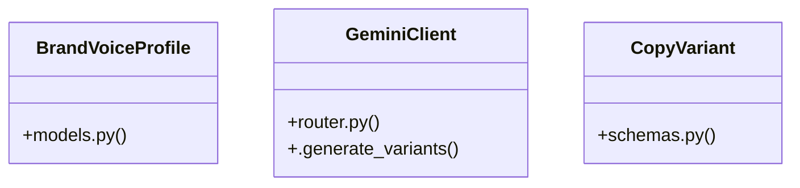

# Community 18

> 23 nodes · cohesion 0.10

## Key Concepts

- [router.py](file:///E:/Non_Office/Dev_Space/vibe_skool/kloudShop/backend/modules/features/router.py#L1) (9 connections)
- [router.py](file:///E:/Non_Office/Dev_Space/vibe_skool/kloudShop/backend/modules/ai/router.py#L1) (7 connections)
- [generate_copy_impl()](file:///E:/Non_Office/Dev_Space/vibe_skool/kloudShop/backend/modules/ai/router.py#L96) (7 connections)
- [BrandVoiceProfile](file:///E:/Non_Office/Dev_Space/vibe_skool/kloudShop/backend/modules/ai/models.py#L7) (6 connections)
- [GeminiClient](file:///E:/Non_Office/Dev_Space/vibe_skool/kloudShop/backend/modules/ai/router.py#L14) (4 connections)
- [Simulates the cloud tasks migration job described in US-049.     In production,](file:///E:/Non_Office/Dev_Space/vibe_skool/kloudShop/backend/modules/features/router.py#L15) (3 connections)
- [update_feature_config()](file:///E:/Non_Office/Dev_Space/vibe_skool/kloudShop/backend/modules/features/router.py#L126) (3 connections)
- [CopyVariant](file:///E:/Non_Office/Dev_Space/vibe_skool/kloudShop/backend/modules/ai/schemas.py#L25) (3 connections)
- [models.py](file:///E:/Non_Office/Dev_Space/vibe_skool/kloudShop/backend/modules/ai/models.py#L1) (2 connections)
- [activate_feature()](file:///E:/Non_Office/Dev_Space/vibe_skool/kloudShop/backend/modules/features/router.py#L51) (2 connections)
- [create_request()](file:///E:/Non_Office/Dev_Space/vibe_skool/kloudShop/backend/modules/features/router.py#L182) (2 connections)
- [.generate_variants()](file:///E:/Non_Office/Dev_Space/vibe_skool/kloudShop/backend/modules/ai/router.py#L16) (2 connections)
- [generate_product_description()](file:///E:/Non_Office/Dev_Space/vibe_skool/kloudShop/backend/modules/ai/router.py#L136) (2 connections)
- [generate_product_title()](file:///E:/Non_Office/Dev_Space/vibe_skool/kloudShop/backend/modules/ai/router.py#L128) (2 connections)
- [get_brand_voice()](file:///E:/Non_Office/Dev_Space/vibe_skool/kloudShop/backend/modules/ai/router.py#L37) (2 connections)
- [simulate_feature_migration()](file:///E:/Non_Office/Dev_Space/vibe_skool/kloudShop/backend/modules/features/router.py#L14) (2 connections)
- [update_brand_voice()](file:///E:/Non_Office/Dev_Space/vibe_skool/kloudShop/backend/modules/ai/router.py#L62) (2 connections)
- [vote_request()](file:///E:/Non_Office/Dev_Space/vibe_skool/kloudShop/backend/modules/features/router.py#L199) (2 connections)
- [accept_copy_variant()](file:///E:/Non_Office/Dev_Space/vibe_skool/kloudShop/backend/modules/ai/router.py#L144) (1 connections)
- [deactivate_feature()](file:///E:/Non_Office/Dev_Space/vibe_skool/kloudShop/backend/modules/features/router.py#L94) (1 connections)
- [get_feature_config()](file:///E:/Non_Office/Dev_Space/vibe_skool/kloudShop/backend/modules/features/router.py#L111) (1 connections)
- [list_features()](file:///E:/Non_Office/Dev_Space/vibe_skool/kloudShop/backend/modules/features/router.py#L27) (1 connections)
- [list_requests()](file:///E:/Non_Office/Dev_Space/vibe_skool/kloudShop/backend/modules/features/router.py#L155) (1 connections)

## Class Diagram

## Relationships

- [[App Bootstrap]] (2 shared connections)

## Source Files

- [E:\Non_Office\Dev_Space\vibe_skool\kloudShop\backend\modules\ai\models.py](file:///E:/Non_Office/Dev_Space/vibe_skool/kloudShop/backend/modules/ai/models.py)
- [E:\Non_Office\Dev_Space\vibe_skool\kloudShop\backend\modules\ai\router.py](file:///E:/Non_Office/Dev_Space/vibe_skool/kloudShop/backend/modules/ai/router.py)
- [E:\Non_Office\Dev_Space\vibe_skool\kloudShop\backend\modules\ai\schemas.py](file:///E:/Non_Office/Dev_Space/vibe_skool/kloudShop/backend/modules/ai/schemas.py)
- [E:\Non_Office\Dev_Space\vibe_skool\kloudShop\backend\modules\features\router.py](file:///E:/Non_Office/Dev_Space/vibe_skool/kloudShop/backend/modules/features/router.py)

## Audit Trail

- EXTRACTED: 50 (75%)
- INFERRED: 17 (25%)
- AMBIGUOUS: 0 (0%)

---

*Part of the graphify knowledge wiki. See [[index]] to navigate.*