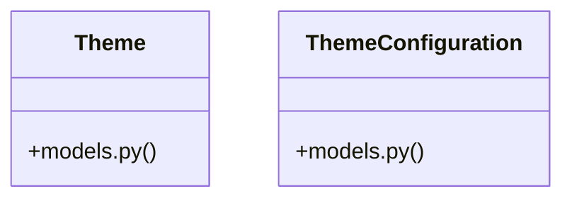

# Community 21

> 15 nodes · cohesion 0.16

## Key Concepts

- [router.py](file:///E:/Non_Office/Dev_Space/vibe_skool/kloudShop/backend/modules/themes/router.py#L1) (13 connections)
- [ThemeConfiguration](file:///E:/Non_Office/Dev_Space/vibe_skool/kloudShop/backend/modules/themes/models.py#L18) (6 connections)
- [Theme](file:///E:/Non_Office/Dev_Space/vibe_skool/kloudShop/backend/modules/themes/models.py#L8) (5 connections)
- [models.py](file:///E:/Non_Office/Dev_Space/vibe_skool/kloudShop/backend/modules/themes/models.py#L1) (3 connections)
- [clone_active_theme()](file:///E:/Non_Office/Dev_Space/vibe_skool/kloudShop/backend/modules/themes/router.py#L190) (2 connections)
- [list_themes()](file:///E:/Non_Office/Dev_Space/vibe_skool/kloudShop/backend/modules/themes/router.py#L21) (2 connections)
- [select_theme()](file:///E:/Non_Office/Dev_Space/vibe_skool/kloudShop/backend/modules/themes/router.py#L69) (2 connections)
- [delete_theme_config_by_id()](file:///E:/Non_Office/Dev_Space/vibe_skool/kloudShop/backend/modules/themes/router.py#L316) (1 connections)
- [get_active_theme_config()](file:///E:/Non_Office/Dev_Space/vibe_skool/kloudShop/backend/modules/themes/router.py#L52) (1 connections)
- [get_theme_config_by_id()](file:///E:/Non_Office/Dev_Space/vibe_skool/kloudShop/backend/modules/themes/router.py#L237) (1 connections)
- [list_theme_configurations()](file:///E:/Non_Office/Dev_Space/vibe_skool/kloudShop/backend/modules/themes/router.py#L222) (1 connections)
- [publish_theme_config()](file:///E:/Non_Office/Dev_Space/vibe_skool/kloudShop/backend/modules/themes/router.py#L167) (1 connections)
- [publish_theme_config_by_id()](file:///E:/Non_Office/Dev_Space/vibe_skool/kloudShop/backend/modules/themes/router.py#L283) (1 connections)
- [update_theme_config_by_id()](file:///E:/Non_Office/Dev_Space/vibe_skool/kloudShop/backend/modules/themes/router.py#L250) (1 connections)
- [update_theme_config_draft()](file:///E:/Non_Office/Dev_Space/vibe_skool/kloudShop/backend/modules/themes/router.py#L133) (1 connections)

## Class Diagram

## Relationships

- [[App Bootstrap]] (4 shared connections)

## Source Files

- [E:\Non_Office\Dev_Space\vibe_skool\kloudShop\backend\modules\themes\models.py](file:///E:/Non_Office/Dev_Space/vibe_skool/kloudShop/backend/modules/themes/models.py)
- [E:\Non_Office\Dev_Space\vibe_skool\kloudShop\backend\modules\themes\router.py](file:///E:/Non_Office/Dev_Space/vibe_skool/kloudShop/backend/modules/themes/router.py)

## Audit Trail

- EXTRACTED: 31 (76%)
- INFERRED: 10 (24%)
- AMBIGUOUS: 0 (0%)

---

*Part of the graphify knowledge wiki. See [[index]] to navigate.*