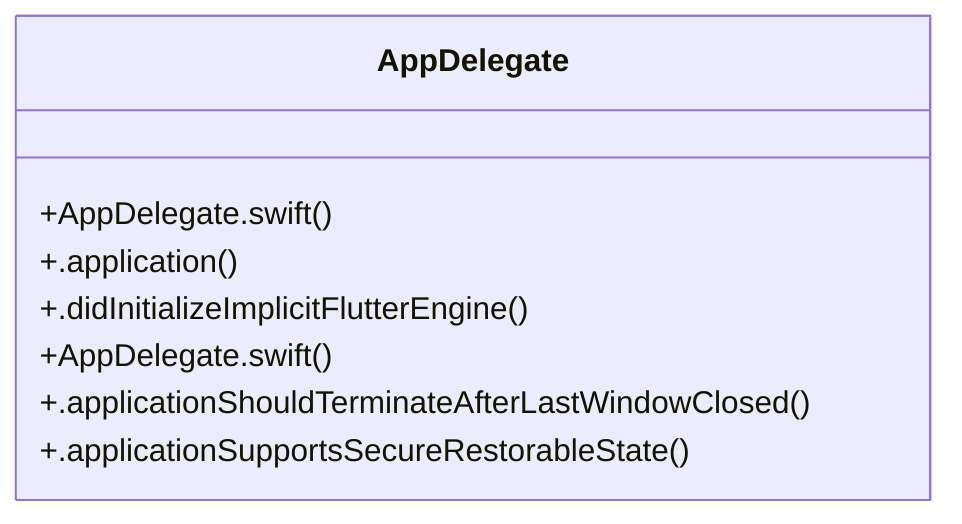

# Community 24

> 9 nodes · cohesion 0.22

## Key Concepts

- [AppDelegate](file:///E:/Non_Office/Dev_Space/vibe_skool/kloudShop/frontend/macos/Runner/AppDelegate.swift#L4) (8 connections)
- [.application()](file:///E:/Non_Office/Dev_Space/vibe_skool/kloudShop/frontend/ios/Runner/AppDelegate.swift#L6) (1 connections)
- [.applicationShouldTerminateAfterLastWindowClosed()](file:///E:/Non_Office/Dev_Space/vibe_skool/kloudShop/frontend/macos/Runner/AppDelegate.swift#L6) (1 connections)
- [.applicationSupportsSecureRestorableState()](file:///E:/Non_Office/Dev_Space/vibe_skool/kloudShop/frontend/macos/Runner/AppDelegate.swift#L10) (1 connections)
- [.didInitializeImplicitFlutterEngine()](file:///E:/Non_Office/Dev_Space/vibe_skool/kloudShop/frontend/ios/Runner/AppDelegate.swift#L13) (1 connections)
- [AppDelegate.swift](file:///E:/Non_Office/Dev_Space/vibe_skool/kloudShop/frontend/ios/Runner/AppDelegate.swift#L1) (1 connections)
- [AppDelegate.swift](file:///E:/Non_Office/Dev_Space/vibe_skool/kloudShop/frontend/macos/Runner/AppDelegate.swift#L1) (1 connections)
- **FlutterAppDelegate** (1 connections)
- **FlutterImplicitEngineDelegate** (1 connections)

## Class Diagram

## Relationships

- No strong cross-community connections detected

## Source Files

- [E:\Non_Office\Dev_Space\vibe_skool\kloudShop\frontend\ios\Runner\AppDelegate.swift](file:///E:/Non_Office/Dev_Space/vibe_skool/kloudShop/frontend/ios/Runner/AppDelegate.swift)
- [E:\Non_Office\Dev_Space\vibe_skool\kloudShop\frontend\macos\Runner\AppDelegate.swift](file:///E:/Non_Office/Dev_Space/vibe_skool/kloudShop/frontend/macos/Runner/AppDelegate.swift)

## Audit Trail

- EXTRACTED: 16 (100%)
- INFERRED: 0 (0%)
- AMBIGUOUS: 0 (0%)

---

*Part of the graphify knowledge wiki. See [[index]] to navigate.*