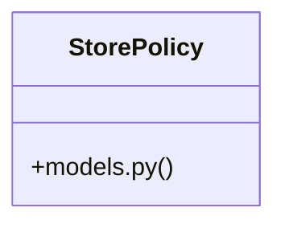

# Community 27

> 13 nodes · cohesion 0.17

## Key Concepts

- [router.py](file:///E:/Non_Office/Dev_Space/vibe_skool/kloudShop/backend/modules/policies/router.py#L1) (8 connections)
- [StorePolicy](file:///E:/Non_Office/Dev_Space/vibe_skool/kloudShop/backend/modules/policies/models.py#L6) (6 connections)
- [test_navigation_reorder_and_resolver()](file:///E:/Non_Office/Dev_Space/vibe_skool/kloudShop/backend/tests/test_navigation_resolver.py#L12) (5 connections)
- [models.py](file:///E:/Non_Office/Dev_Space/vibe_skool/kloudShop/backend/modules/policies/models.py#L1) (2 connections)
- [test_policies_versioning.py](file:///E:/Non_Office/Dev_Space/vibe_skool/kloudShop/backend/tests/test_policies_versioning.py#L1) (2 connections)
- [create_policy()](file:///E:/Non_Office/Dev_Space/vibe_skool/kloudShop/backend/modules/policies/router.py#L22) (2 connections)
- [test_policy_publish_validation_and_lifecycle()](file:///E:/Non_Office/Dev_Space/vibe_skool/kloudShop/backend/tests/test_policies_versioning.py#L42) (2 connections)
- [test_navigation_resolver.py](file:///E:/Non_Office/Dev_Space/vibe_skool/kloudShop/backend/tests/test_navigation_resolver.py#L1) (1 connections)
- [get_policy()](file:///E:/Non_Office/Dev_Space/vibe_skool/kloudShop/backend/modules/policies/router.py#L62) (1 connections)
- [list_policies()](file:///E:/Non_Office/Dev_Space/vibe_skool/kloudShop/backend/modules/policies/router.py#L46) (1 connections)
- [publish_policy()](file:///E:/Non_Office/Dev_Space/vibe_skool/kloudShop/backend/modules/policies/router.py#L99) (1 connections)
- [update_policy_draft()](file:///E:/Non_Office/Dev_Space/vibe_skool/kloudShop/backend/modules/policies/router.py#L76) (1 connections)
- [test_policy_draft_crud_and_seeding()](file:///E:/Non_Office/Dev_Space/vibe_skool/kloudShop/backend/tests/test_policies_versioning.py#L10) (1 connections)

## Class Diagram

## Relationships

- [[App Bootstrap]] (1 shared connections)

## Source Files

- [E:\Non_Office\Dev_Space\vibe_skool\kloudShop\backend\modules\policies\models.py](file:///E:/Non_Office/Dev_Space/vibe_skool/kloudShop/backend/modules/policies/models.py)
- [E:\Non_Office\Dev_Space\vibe_skool\kloudShop\backend\modules\policies\router.py](file:///E:/Non_Office/Dev_Space/vibe_skool/kloudShop/backend/modules/policies/router.py)
- [E:\Non_Office\Dev_Space\vibe_skool\kloudShop\backend\tests\test_navigation_resolver.py](file:///E:/Non_Office/Dev_Space/vibe_skool/kloudShop/backend/tests/test_navigation_resolver.py)
- [E:\Non_Office\Dev_Space\vibe_skool\kloudShop\backend\tests\test_policies_versioning.py](file:///E:/Non_Office/Dev_Space/vibe_skool/kloudShop/backend/tests/test_policies_versioning.py)

## Audit Trail

- EXTRACTED: 23 (70%)
- INFERRED: 10 (30%)
- AMBIGUOUS: 0 (0%)

---

*Part of the graphify knowledge wiki. See [[index]] to navigate.*