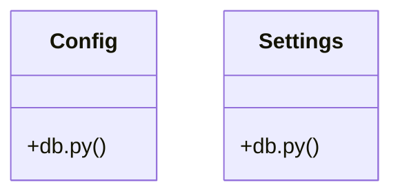

# Community 27

> 5 nodes · cohesion 0.40

## Key Concepts

- [db.py](file:///E:/Non_Office/Dev_Space/vibe_skool/kloudShop/backend/shared/db.py#L1) (3 connections)
- [Config](file:///E:/Non_Office/Dev_Space/vibe_skool/kloudShop/backend/shared/db.py#L20) (2 connections)
- [Settings](file:///E:/Non_Office/Dev_Space/vibe_skool/kloudShop/backend/shared/db.py#L7) (2 connections)
- **BaseSettings** (1 connections)
- [get_db()](file:///E:/Non_Office/Dev_Space/vibe_skool/kloudShop/backend/shared/db.py#L57) (1 connections)

## Class Diagram

## Relationships

- No strong cross-community connections detected

## Source Files

- [E:\Non_Office\Dev_Space\vibe_skool\kloudShop\backend\shared\db.py](file:///E:/Non_Office/Dev_Space/vibe_skool/kloudShop/backend/shared/db.py)

## Audit Trail

- EXTRACTED: 8 (89%)
- INFERRED: 1 (11%)
- AMBIGUOUS: 0 (0%)

---

*Part of the graphify knowledge wiki. See [[index]] to navigate.*