# Community 3

> 154 nodes · cohesion 0.07

## Key Concepts

- [Variant](file:///E:/Non_Office/Dev_Space/vibe_skool/kloudShop/backend/modules/catalog/models.py#L81) (100 connections)
- [Product](file:///E:/Non_Office/Dev_Space/vibe_skool/kloudShop/backend/modules/catalog/models.py#L10) (73 connections)
- [StockLocation](file:///E:/Non_Office/Dev_Space/vibe_skool/kloudShop/backend/modules/inventory/models.py#L7) (63 connections)
- [Inventory](file:///E:/Non_Office/Dev_Space/vibe_skool/kloudShop/backend/modules/inventory/models.py#L39) (61 connections)
- [ImportJob](file:///E:/Non_Office/Dev_Space/vibe_skool/kloudShop/backend/modules/catalog/models.py#L202) (40 connections)
- [Mark an order as fulfilled and log tracking information.](file:///E:/Non_Office/Dev_Space/vibe_skool/kloudShop/backend/modules/orders/router.py#L418) (40 connections)
- [router.py](file:///E:/Non_Office/Dev_Space/vibe_skool/kloudShop/backend/modules/catalog/router.py#L1) (35 connections)
- [Collection](file:///E:/Non_Office/Dev_Space/vibe_skool/kloudShop/backend/modules/catalog/models.py#L159) (28 connections)
- [CollectionProduct](file:///E:/Non_Office/Dev_Space/vibe_skool/kloudShop/backend/modules/catalog/models.py#L194) (27 connections)
- [RedirectRule](file:///E:/Non_Office/Dev_Space/vibe_skool/kloudShop/backend/modules/catalog/models.py#L237) (27 connections)
- [ProductResponse](file:///E:/Non_Office/Dev_Space/vibe_skool/kloudShop/backend/modules/catalog/schemas.py#L118) (27 connections)
- [Product](file:///E:/Non_Office/Dev_Space/vibe_skool/kloudShop/frontend/lib/models/catalog.dart) (26 connections)
- [ColorPreset](file:///E:/Non_Office/Dev_Space/vibe_skool/kloudShop/backend/modules/catalog/models.py#L257) (26 connections)
- [SkuExistsResponse](file:///E:/Non_Office/Dev_Space/vibe_skool/kloudShop/backend/modules/catalog/schemas.py#L209) (26 connections)
- [VariantCreate](file:///E:/Non_Office/Dev_Space/vibe_skool/kloudShop/backend/modules/catalog/schemas.py#L47) (26 connections)
- [schemas.py](file:///E:/Non_Office/Dev_Space/vibe_skool/kloudShop/backend/modules/catalog/schemas.py#L1) (25 connections)
- [Return sorted list of N for all Option{N} Name/Value pairs found in headers.](file:///E:/Non_Office/Dev_Space/vibe_skool/kloudShop/backend/modules/catalog/router.py#L1021) (25 connections)
- [Background task: parse file, upsert products+variants+inventory, update job, sen](file:///E:/Non_Office/Dev_Space/vibe_skool/kloudShop/backend/modules/catalog/router.py#L1042) (25 connections)
- [List products for the authenticated tenant.     Supports pagination and filteri](file:///E:/Non_Office/Dev_Space/vibe_skool/kloudShop/backend/modules/catalog/router.py#L134) (25 connections)
- [Download a pre-filled CSV template with all supported import column headers.](file:///E:/Non_Office/Dev_Space/vibe_skool/kloudShop/backend/modules/catalog/router.py#L1383) (25 connections)
- [Check which SKUs from the provided list already exist in this tenant's catalog.](file:///E:/Non_Office/Dev_Space/vibe_skool/kloudShop/backend/modules/catalog/router.py#L1421) (25 connections)
- [Upload a .csv or .xlsx file to bulk-import products and variants.     Returns a](file:///E:/Non_Office/Dev_Space/vibe_skool/kloudShop/backend/modules/catalog/router.py#L1443) (25 connections)
- [Returns all import jobs for this tenant, newest first.](file:///E:/Non_Office/Dev_Space/vibe_skool/kloudShop/backend/modules/catalog/router.py#L1495) (25 connections)
- [Poll the status of a specific import job.](file:///E:/Non_Office/Dev_Space/vibe_skool/kloudShop/backend/modules/catalog/router.py#L1510) (25 connections)
- [Update a product and its variants. If slug changes, create a 301 redirect.](file:///E:/Non_Office/Dev_Space/vibe_skool/kloudShop/backend/modules/catalog/router.py#L165) (25 connections)
- *... and 129 more nodes in this community*

## Class Diagram

```mermaid
classDiagram
    class Collection {
        +models.py()
    }
    class CollectionProduct {
        +models.py()
    }
    class ColorPreset {
        +models.py()
    }
    class ImportJob {
        +models.py()
    }
    class Inventory {
        +models.py()
    }
    class Product {
        +models.py()
    }
    class RedirectRule {
        +models.py()
    }
    class StaffLocationAssignment {
        +models.py()
    }
    class StockLocation {
        +models.py()
    }
    class Variant {
        +models.py()
    }
    class CollectionBase {
        +schemas.py()
    }
    class CollectionCreate {
        +schemas.py()
    }
    class CollectionResponse {
        +schemas.py()
    }
    class CollectionUpdate {
        +schemas.py()
    }
    class ColorPresetBase {
        +schemas.py()
    }
    class ColorPresetCreate {
        +schemas.py()
    }
    class ColorPresetResponse {
        +schemas.py()
    }
    class ImportJobResponse {
        +schemas.py()
    }
    class ProductAssignment {
        +schemas.py()
    }
    class ProductBase {
        +schemas.py()
    }
    class ProductCreate {
        +schemas.py()
    }
    class ProductResponse {
        +schemas.py()
    }
    class ProductUpdate {
        +schemas.py()
    }
    class RedirectRuleResponse {
        +schemas.py()
    }
    class SkuExistsRequest {
        +schemas.py()
    }
    class SkuExistsResponse {
        +schemas.py()
    }
    class VariantBase {
        +schemas.py()
    }
    class VariantCreate {
        +schemas.py()
    }
    class VariantResponse {
        +schemas.py()
    }
    CollectionCreate <|-- CollectionBase
    CollectionResponse <|-- CollectionBase
    CollectionBase <|-- CollectionCreate
    CollectionBase <|-- CollectionResponse
    ColorPresetCreate <|-- ColorPresetBase
    ColorPresetResponse <|-- ColorPresetBase
    ColorPresetBase <|-- ColorPresetCreate
    ColorPresetBase <|-- ColorPresetResponse
    ProductCreate <|-- ProductBase
    ProductResponse <|-- ProductBase
    ProductBase <|-- ProductCreate
    ProductBase <|-- ProductResponse
    VariantCreate <|-- VariantBase
    VariantResponse <|-- VariantBase
    VariantBase <|-- VariantCreate
    VariantBase <|-- VariantResponse
```

## Relationships

- [[Community 15]] (32 shared connections)
- [[Community 14]] (28 shared connections)
- [[Content & Features]] (11 shared connections)
- [[Community 12]] (2 shared connections)

## Source Files

- [E:\Non_Office\Dev_Space\vibe_skool\kloudShop\backend\modules\analytics\router.py](file:///E:/Non_Office/Dev_Space/vibe_skool/kloudShop/backend/modules/analytics/router.py)
- [E:\Non_Office\Dev_Space\vibe_skool\kloudShop\backend\modules\catalog\models.py](file:///E:/Non_Office/Dev_Space/vibe_skool/kloudShop/backend/modules/catalog/models.py)
- [E:\Non_Office\Dev_Space\vibe_skool\kloudShop\backend\modules\catalog\router.py](file:///E:/Non_Office/Dev_Space/vibe_skool/kloudShop/backend/modules/catalog/router.py)
- [E:\Non_Office\Dev_Space\vibe_skool\kloudShop\backend\modules\catalog\schemas.py](file:///E:/Non_Office/Dev_Space/vibe_skool/kloudShop/backend/modules/catalog/schemas.py)
- [E:\Non_Office\Dev_Space\vibe_skool\kloudShop\backend\modules\channels\router.py](file:///E:/Non_Office/Dev_Space/vibe_skool/kloudShop/backend/modules/channels/router.py)
- [E:\Non_Office\Dev_Space\vibe_skool\kloudShop\backend\modules\feeds\router.py](file:///E:/Non_Office/Dev_Space/vibe_skool/kloudShop/backend/modules/feeds/router.py)
- [E:\Non_Office\Dev_Space\vibe_skool\kloudShop\backend\modules\internal\provisioning.py](file:///E:/Non_Office/Dev_Space/vibe_skool/kloudShop/backend/modules/internal/provisioning.py)
- [E:\Non_Office\Dev_Space\vibe_skool\kloudShop\backend\modules\inventory\models.py](file:///E:/Non_Office/Dev_Space/vibe_skool/kloudShop/backend/modules/inventory/models.py)
- [E:\Non_Office\Dev_Space\vibe_skool\kloudShop\backend\modules\orders\router.py](file:///E:/Non_Office/Dev_Space/vibe_skool/kloudShop/backend/modules/orders/router.py)
- [E:\Non_Office\Dev_Space\vibe_skool\kloudShop\backend\modules\pos\models.py](file:///E:/Non_Office/Dev_Space/vibe_skool/kloudShop/backend/modules/pos/models.py)
- [E:\Non_Office\Dev_Space\vibe_skool\kloudShop\backend\scratch\test_product_insert.py](file:///E:/Non_Office/Dev_Space/vibe_skool/kloudShop/backend/scratch/test_product_insert.py)
- [E:\Non_Office\Dev_Space\vibe_skool\kloudShop\backend\scratch\test_row7_insert.py](file:///E:/Non_Office/Dev_Space/vibe_skool/kloudShop/backend/scratch/test_row7_insert.py)
- [E:\Non_Office\Dev_Space\vibe_skool\kloudShop\backend\tests\test_channels.py](file:///E:/Non_Office/Dev_Space/vibe_skool/kloudShop/backend/tests/test_channels.py)
- [E:\Non_Office\Dev_Space\vibe_skool\kloudShop\backend\tests\test_csv_import.py](file:///E:/Non_Office/Dev_Space/vibe_skool/kloudShop/backend/tests/test_csv_import.py)
- [E:\Non_Office\Dev_Space\vibe_skool\kloudShop\backend\tests\test_inventory.py](file:///E:/Non_Office/Dev_Space/vibe_skool/kloudShop/backend/tests/test_inventory.py)
- [E:\Non_Office\Dev_Space\vibe_skool\kloudShop\backend\tests\test_orders.py](file:///E:/Non_Office/Dev_Space/vibe_skool/kloudShop/backend/tests/test_orders.py)
- [E:\Non_Office\Dev_Space\vibe_skool\kloudShop\backend\tests\test_pos.py](file:///E:/Non_Office/Dev_Space/vibe_skool/kloudShop/backend/tests/test_pos.py)
- [E:\Non_Office\Dev_Space\vibe_skool\kloudShop\frontend\lib\models\catalog.dart](file:///E:/Non_Office/Dev_Space/vibe_skool/kloudShop/frontend/lib/models/catalog.dart)
- [E:\Non_Office\Dev_Space\vibe_skool\kloudShop\frontend\lib\providers\color_presets_provider.dart](file:///E:/Non_Office/Dev_Space/vibe_skool/kloudShop/frontend/lib/providers/color_presets_provider.dart)

## Audit Trail

- EXTRACTED: 339 (18%)
- INFERRED: 1562 (82%)
- AMBIGUOUS: 0 (0%)

---

*Part of the graphify knowledge wiki. See [[index]] to navigate.*