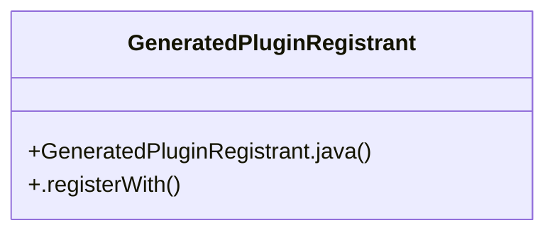

# Community 30

> 5 nodes · cohesion 0.40

## Key Concepts

- [GeneratedPluginRegistrant](file:///E:/Non_Office/Dev_Space/vibe_skool/kloudShop/frontend/ios/Runner/GeneratedPluginRegistrant.m#L63) (4 connections)
- [GeneratedPluginRegistrant.java](file:///E:/Non_Office/Dev_Space/vibe_skool/kloudShop/frontend/android/app/src/main/java/io/flutter/plugins/GeneratedPluginRegistrant.java#L1) (1 connections)
- [GeneratedPluginRegistrant.m](file:///E:/Non_Office/Dev_Space/vibe_skool/kloudShop/frontend/ios/Runner/GeneratedPluginRegistrant.m#L1) (1 connections)
- [.registerWith()](file:///E:/Non_Office/Dev_Space/vibe_skool/kloudShop/frontend/android/app/src/main/java/io/flutter/plugins/GeneratedPluginRegistrant.java#L17) (1 connections)
- [-registerWithRegistry](file:///E:/Non_Office/Dev_Space/vibe_skool/kloudShop/frontend/ios/Runner/GeneratedPluginRegistrant.m#L65) (1 connections)

## Class Diagram

## Relationships

- No strong cross-community connections detected

## Source Files

- [E:\Non_Office\Dev_Space\vibe_skool\kloudShop\frontend\android\app\src\main\java\io\flutter\plugins\GeneratedPluginRegistrant.java](file:///E:/Non_Office/Dev_Space/vibe_skool/kloudShop/frontend/android/app/src/main/java/io/flutter/plugins/GeneratedPluginRegistrant.java)
- [E:\Non_Office\Dev_Space\vibe_skool\kloudShop\frontend\ios\Runner\GeneratedPluginRegistrant.m](file:///E:/Non_Office/Dev_Space/vibe_skool/kloudShop/frontend/ios/Runner/GeneratedPluginRegistrant.m)

## Audit Trail

- EXTRACTED: 8 (100%)
- INFERRED: 0 (0%)
- AMBIGUOUS: 0 (0%)

---

*Part of the graphify knowledge wiki. See [[index]] to navigate.*