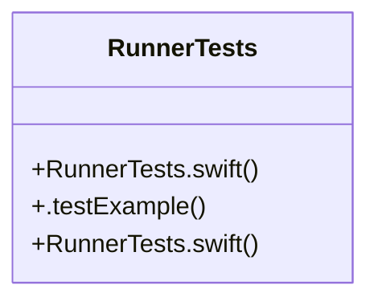

# Community 35

> 5 nodes · cohesion 0.40

## Key Concepts

- [RunnerTests](file:///E:/Non_Office/Dev_Space/vibe_skool/kloudShop/frontend/macos/RunnerTests/RunnerTests.swift#L5) (4 connections)
- [RunnerTests.swift](file:///E:/Non_Office/Dev_Space/vibe_skool/kloudShop/frontend/ios/RunnerTests/RunnerTests.swift#L1) (1 connections)
- [RunnerTests.swift](file:///E:/Non_Office/Dev_Space/vibe_skool/kloudShop/frontend/macos/RunnerTests/RunnerTests.swift#L1) (1 connections)
- [.testExample()](file:///E:/Non_Office/Dev_Space/vibe_skool/kloudShop/frontend/macos/RunnerTests/RunnerTests.swift#L7) (1 connections)
- **XCTestCase** (1 connections)

## Class Diagram

## Relationships

- No strong cross-community connections detected

## Source Files

- [E:\Non_Office\Dev_Space\vibe_skool\kloudShop\frontend\ios\RunnerTests\RunnerTests.swift](file:///E:/Non_Office/Dev_Space/vibe_skool/kloudShop/frontend/ios/RunnerTests/RunnerTests.swift)
- [E:\Non_Office\Dev_Space\vibe_skool\kloudShop\frontend\macos\RunnerTests\RunnerTests.swift](file:///E:/Non_Office/Dev_Space/vibe_skool/kloudShop/frontend/macos/RunnerTests/RunnerTests.swift)

## Audit Trail

- EXTRACTED: 8 (100%)
- INFERRED: 0 (0%)
- AMBIGUOUS: 0 (0%)

---

*Part of the graphify knowledge wiki. See [[index]] to navigate.*