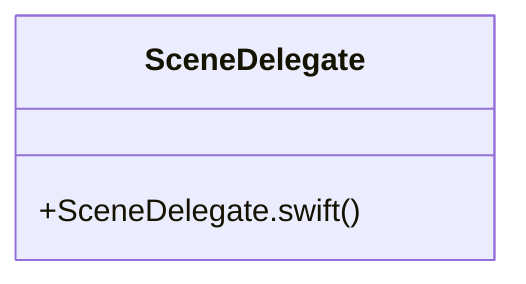

# Community 36

> 3 nodes · cohesion 0.67

## Key Concepts

- [SceneDelegate](file:///E:/Non_Office/Dev_Space/vibe_skool/kloudShop/frontend/ios/Runner/SceneDelegate.swift#L4) (2 connections)
- [SceneDelegate.swift](file:///E:/Non_Office/Dev_Space/vibe_skool/kloudShop/frontend/ios/Runner/SceneDelegate.swift#L1) (1 connections)
- **FlutterSceneDelegate** (1 connections)

## Class Diagram

## Relationships

- No strong cross-community connections detected

## Source Files

- [E:\Non_Office\Dev_Space\vibe_skool\kloudShop\frontend\ios\Runner\SceneDelegate.swift](file:///E:/Non_Office/Dev_Space/vibe_skool/kloudShop/frontend/ios/Runner/SceneDelegate.swift)

## Audit Trail

- EXTRACTED: 4 (100%)
- INFERRED: 0 (0%)
- AMBIGUOUS: 0 (0%)

---

*Part of the graphify knowledge wiki. See [[index]] to navigate.*