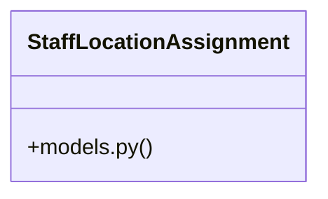

# Community 4

> 121 nodes · cohesion 0.03

## Key Concepts

- [auth_override()](file:///E:/Non_Office/Dev_Space/vibe_skool/kloudShop/backend/tests/conftest.py#L116) (44 connections)
- [UserClaims](file:///E:/Non_Office/Dev_Space/vibe_skool/kloudShop/frontend/lib/models/user_claims.dart) (44 connections)
- [Product](file:///E:/Non_Office/Dev_Space/vibe_skool/kloudShop/frontend/lib/models/catalog.dart) (28 connections)
- [Order](file:///E:/Non_Office/Dev_Space/vibe_skool/kloudShop/frontend/lib/models/order.dart) (16 connections)
- [StaffLocationAssignment](file:///E:/Non_Office/Dev_Space/vibe_skool/kloudShop/backend/modules/pos/models.py#L6) (10 connections)
- [seed_demo_data()](file:///E:/Non_Office/Dev_Space/vibe_skool/kloudShop/backend/modules/internal/provisioning.py#L217) (10 connections)
- [test_pos_sale_success()](file:///E:/Non_Office/Dev_Space/vibe_skool/kloudShop/backend/tests/test_pos.py#L35) (10 connections)
- [test_analytics_needs_attention()](file:///E:/Non_Office/Dev_Space/vibe_skool/kloudShop/backend/tests/test_analytics.py#L48) (9 connections)
- [test_pos_sale_insufficient_stock()](file:///E:/Non_Office/Dev_Space/vibe_skool/kloudShop/backend/tests/test_pos.py#L89) (9 connections)
- [conftest.py](file:///E:/Non_Office/Dev_Space/vibe_skool/kloudShop/backend/tests/conftest.py#L1) (7 connections)
- [test_b2b_invoice_generation()](file:///E:/Non_Office/Dev_Space/vibe_skool/kloudShop/backend/tests/test_b2b.py#L254) (7 connections)
- [router.py](file:///E:/Non_Office/Dev_Space/vibe_skool/kloudShop/backend/modules/pos/router.py#L1) (6 connections)
- [test_billing.py](file:///E:/Non_Office/Dev_Space/vibe_skool/kloudShop/backend/tests/test_billing.py#L1) (6 connections)
- [test_channels.py](file:///E:/Non_Office/Dev_Space/vibe_skool/kloudShop/backend/tests/test_channels.py#L1) (6 connections)
- [test_color_presets.py](file:///E:/Non_Office/Dev_Space/vibe_skool/kloudShop/backend/tests/test_color_presets.py#L1) (6 connections)
- [test_orders.py](file:///E:/Non_Office/Dev_Space/vibe_skool/kloudShop/backend/tests/test_orders.py#L1) (6 connections)
- [OrderItem](file:///E:/Non_Office/Dev_Space/vibe_skool/kloudShop/frontend/lib/models/order.dart) (5 connections)
- [create_pos_order()](file:///E:/Non_Office/Dev_Space/vibe_skool/kloudShop/backend/modules/pos/router.py#L55) (5 connections)
- [test_complete_upgrade_mock_success()](file:///E:/Non_Office/Dev_Space/vibe_skool/kloudShop/backend/tests/test_billing.py#L126) (5 connections)
- [test_create_checkout_session_url_logic()](file:///E:/Non_Office/Dev_Space/vibe_skool/kloudShop/backend/tests/test_billing.py#L87) (5 connections)
- [test_facebook_sync()](file:///E:/Non_Office/Dev_Space/vibe_skool/kloudShop/backend/tests/test_channels.py#L143) (5 connections)
- [test_instagram_sync()](file:///E:/Non_Office/Dev_Space/vibe_skool/kloudShop/backend/tests/test_channels.py#L105) (5 connections)
- [test_tiktok_sync()](file:///E:/Non_Office/Dev_Space/vibe_skool/kloudShop/backend/tests/test_channels.py#L67) (5 connections)
- [test_gdpr_erasure()](file:///E:/Non_Office/Dev_Space/vibe_skool/kloudShop/backend/tests/test_hygiene.py#L8) (5 connections)
- [test_provision_tenant_record_creation()](file:///E:/Non_Office/Dev_Space/vibe_skool/kloudShop/backend/tests/test_provisioning_extended.py#L73) (5 connections)
- *... and 96 more nodes in this community*

## Class Diagram

## Relationships

- [[App Bootstrap]] (12 shared connections)
- [[Community 13]] (5 shared connections)

## Source Files

- [E:\Non_Office\Dev_Space\vibe_skool\kloudShop\backend\modules\internal\provisioning.py](file:///E:/Non_Office/Dev_Space/vibe_skool/kloudShop/backend/modules/internal/provisioning.py)
- [E:\Non_Office\Dev_Space\vibe_skool\kloudShop\backend\modules\pos\models.py](file:///E:/Non_Office/Dev_Space/vibe_skool/kloudShop/backend/modules/pos/models.py)
- [E:\Non_Office\Dev_Space\vibe_skool\kloudShop\backend\modules\pos\router.py](file:///E:/Non_Office/Dev_Space/vibe_skool/kloudShop/backend/modules/pos/router.py)
- [E:\Non_Office\Dev_Space\vibe_skool\kloudShop\backend\tests\conftest.py](file:///E:/Non_Office/Dev_Space/vibe_skool/kloudShop/backend/tests/conftest.py)
- [E:\Non_Office\Dev_Space\vibe_skool\kloudShop\backend\tests\test_analytics.py](file:///E:/Non_Office/Dev_Space/vibe_skool/kloudShop/backend/tests/test_analytics.py)
- [E:\Non_Office\Dev_Space\vibe_skool\kloudShop\backend\tests\test_b2b.py](file:///E:/Non_Office/Dev_Space/vibe_skool/kloudShop/backend/tests/test_b2b.py)
- [E:\Non_Office\Dev_Space\vibe_skool\kloudShop\backend\tests\test_billing.py](file:///E:/Non_Office/Dev_Space/vibe_skool/kloudShop/backend/tests/test_billing.py)
- [E:\Non_Office\Dev_Space\vibe_skool\kloudShop\backend\tests\test_blog.py](file:///E:/Non_Office/Dev_Space/vibe_skool/kloudShop/backend/tests/test_blog.py)
- [E:\Non_Office\Dev_Space\vibe_skool\kloudShop\backend\tests\test_catalog.py](file:///E:/Non_Office/Dev_Space/vibe_skool/kloudShop/backend/tests/test_catalog.py)
- [E:\Non_Office\Dev_Space\vibe_skool\kloudShop\backend\tests\test_channels.py](file:///E:/Non_Office/Dev_Space/vibe_skool/kloudShop/backend/tests/test_channels.py)
- [E:\Non_Office\Dev_Space\vibe_skool\kloudShop\backend\tests\test_collections.py](file:///E:/Non_Office/Dev_Space/vibe_skool/kloudShop/backend/tests/test_collections.py)
- [E:\Non_Office\Dev_Space\vibe_skool\kloudShop\backend\tests\test_color_presets.py](file:///E:/Non_Office/Dev_Space/vibe_skool/kloudShop/backend/tests/test_color_presets.py)
- [E:\Non_Office\Dev_Space\vibe_skool\kloudShop\backend\tests\test_consumer_self_service.py](file:///E:/Non_Office/Dev_Space/vibe_skool/kloudShop/backend/tests/test_consumer_self_service.py)
- [E:\Non_Office\Dev_Space\vibe_skool\kloudShop\backend\tests\test_hygiene.py](file:///E:/Non_Office/Dev_Space/vibe_skool/kloudShop/backend/tests/test_hygiene.py)
- [E:\Non_Office\Dev_Space\vibe_skool\kloudShop\backend\tests\test_i18n.py](file:///E:/Non_Office/Dev_Space/vibe_skool/kloudShop/backend/tests/test_i18n.py)
- [E:\Non_Office\Dev_Space\vibe_skool\kloudShop\backend\tests\test_orders.py](file:///E:/Non_Office/Dev_Space/vibe_skool/kloudShop/backend/tests/test_orders.py)
- [E:\Non_Office\Dev_Space\vibe_skool\kloudShop\backend\tests\test_platform.py](file:///E:/Non_Office/Dev_Space/vibe_skool/kloudShop/backend/tests/test_platform.py)
- [E:\Non_Office\Dev_Space\vibe_skool\kloudShop\backend\tests\test_pos.py](file:///E:/Non_Office/Dev_Space/vibe_skool/kloudShop/backend/tests/test_pos.py)
- [E:\Non_Office\Dev_Space\vibe_skool\kloudShop\backend\tests\test_post_order_auth.py](file:///E:/Non_Office/Dev_Space/vibe_skool/kloudShop/backend/tests/test_post_order_auth.py)
- [E:\Non_Office\Dev_Space\vibe_skool\kloudShop\backend\tests\test_provisioning.py](file:///E:/Non_Office/Dev_Space/vibe_skool/kloudShop/backend/tests/test_provisioning.py)

## Audit Trail

- EXTRACTED: 214 (42%)
- INFERRED: 295 (58%)
- AMBIGUOUS: 0 (0%)

---

*Part of the graphify knowledge wiki. See [[index]] to navigate.*