# Community 5

> 145 nodes · cohesion 0.05

## Key Concepts

- [UserClaims](file:///E:/Non_Office/Dev_Space/vibe_skool/kloudShop/backend/shared/auth.py#L12) (143 connections)
- [StaffRoleAssignment](file:///E:/Non_Office/Dev_Space/vibe_skool/kloudShop/backend/modules/auth/models.py#L30) (41 connections)
- [StaffSecurityState](file:///E:/Non_Office/Dev_Space/vibe_skool/kloudShop/backend/modules/auth/models.py#L89) (33 connections)
- [StaffUser](file:///E:/Non_Office/Dev_Space/vibe_skool/kloudShop/backend/modules/auth/models.py#L22) (28 connections)
- [B2BInvitation](file:///E:/Non_Office/Dev_Space/vibe_skool/kloudShop/backend/modules/auth/models.py#L41) (26 connections)
- [Invitation](file:///E:/Non_Office/Dev_Space/vibe_skool/kloudShop/backend/modules/auth/models.py#L10) (25 connections)
- [BuyerUser](file:///E:/Non_Office/Dev_Space/vibe_skool/kloudShop/backend/modules/auth/models.py#L53) (22 connections)
- [ConsumerUser](file:///E:/Non_Office/Dev_Space/vibe_skool/kloudShop/backend/modules/auth/models.py#L62) (22 connections)
- [Generate Facebook OAuth authorization URL.](file:///E:/Non_Office/Dev_Space/vibe_skool/kloudShop/backend/modules/channels/router.py#L157) (21 connections)
- [router.py](file:///E:/Non_Office/Dev_Space/vibe_skool/kloudShop/backend/modules/auth/router.py#L1) (20 connections)
- [Invite a new staff member.](file:///E:/Non_Office/Dev_Space/vibe_skool/kloudShop/backend/modules/auth/router.py#L236) (20 connections)
- [List pending invitations for the current tenant.](file:///E:/Non_Office/Dev_Space/vibe_skool/kloudShop/backend/modules/auth/router.py#L253) (20 connections)
- [Cancel a pending invitation.](file:///E:/Non_Office/Dev_Space/vibe_skool/kloudShop/backend/modules/auth/router.py#L269) (20 connections)
- [Update a staff member's roles and sync with Firebase claims.](file:///E:/Non_Office/Dev_Space/vibe_skool/kloudShop/backend/modules/auth/router.py#L291) (20 connections)
- [Revoke a staff member's access to the current tenant.](file:///E:/Non_Office/Dev_Space/vibe_skool/kloudShop/backend/modules/auth/router.py#L335) (20 connections)
- [Transfer store ownership to another staff member.](file:///E:/Non_Office/Dev_Space/vibe_skool/kloudShop/backend/modules/auth/router.py#L364) (20 connections)
- [Register a B2B buyer using an invitation token.](file:///E:/Non_Office/Dev_Space/vibe_skool/kloudShop/backend/modules/auth/router.py#L422) (20 connections)
- [Register a DTC consumer (post-checkout).](file:///E:/Non_Office/Dev_Space/vibe_skool/kloudShop/backend/modules/auth/router.py#L479) (20 connections)
- [Checks the active cool-off and blocked status of a Gmail account.](file:///E:/Non_Office/Dev_Space/vibe_skool/kloudShop/backend/modules/auth/router.py#L547) (20 connections)
- [Logs a failed sign-in attempt and initiates a 180s cool-off or block.](file:///E:/Non_Office/Dev_Space/vibe_skool/kloudShop/backend/modules/auth/router.py#L581) (20 connections)
- [Sends a short-lived (180s TTL) unblock token email to the user (max 3/24h).](file:///E:/Non_Office/Dev_Space/vibe_skool/kloudShop/backend/modules/auth/router.py#L661) (20 connections)
- [Verifies the unblock token and unlocks the account (does not require login).](file:///E:/Non_Office/Dev_Space/vibe_skool/kloudShop/backend/modules/auth/router.py#L723) (20 connections)
- [Allows an administrator or store owner to unblock a locked staff account.](file:///E:/Non_Office/Dev_Space/vibe_skool/kloudShop/backend/modules/auth/router.py#L763) (20 connections)
- [StaffLoginHistory](file:///E:/Non_Office/Dev_Space/vibe_skool/kloudShop/backend/modules/auth/models.py#L72) (19 connections)
- [B2BBuyerRegistration](file:///E:/Non_Office/Dev_Space/vibe_skool/kloudShop/backend/modules/auth/schemas.py#L31) (16 connections)
- *... and 120 more nodes in this community*

## Class Diagram

```mermaid
classDiagram
    class UserClaims {
        +auth.py()
    }
    class B2BInvitation {
        +models.py()
    }
    class BuyerUser {
        +models.py()
    }
    class ConsumerUser {
        +models.py()
    }
    class Invitation {
        +models.py()
    }
    class StaffLoginHistory {
        +models.py()
    }
    class StaffRoleAssignment {
        +models.py()
    }
    class StaffSecurityState {
        +models.py()
    }
    class StaffUser {
        +models.py()
    }
    class PermissionChecker {
        +rbac.py()
        +.__init__()
        +.__call__()
    }
    class B2BBuyerRegistration {
        +schemas.py()
    }
    class ConsumerRegistration {
        +schemas.py()
    }
    class FailedLoginAlert {
        +schemas.py()
    }
    class InvitationCreate {
        +schemas.py()
    }
    class InvitationResponse {
        +schemas.py()
    }
    class OwnershipTransferRequest {
        +schemas.py()
    }
    class RoleUpdate {
        +schemas.py()
    }
    class UnblockRequest {
        +schemas.py()
    }
    class UnblockVerify {
        +schemas.py()
    }
    UserClaims --> StaffSecurityState
    UserClaims --> PermissionChecker
    StaffSecurityState --> UserClaims
    PermissionChecker --> UserClaims
```

## Relationships

- [[Analytics Dashboard]] (349 shared connections)
- [[Content & Features]] (67 shared connections)
- [[Community 8]] (23 shared connections)
- [[Community 4]] (21 shared connections)
- [[Community 14]] (20 shared connections)
- [[Community 24]] (16 shared connections)
- [[Community 11]] (3 shared connections)
- [[Community 23]] (1 shared connections)

## Source Files

- [E:\Non_Office\Dev_Space\vibe_skool\kloudShop\backend\alembic\env.py](file:///E:/Non_Office/Dev_Space/vibe_skool/kloudShop/backend/alembic/env.py)
- [E:\Non_Office\Dev_Space\vibe_skool\kloudShop\backend\migrations\env.py](file:///E:/Non_Office/Dev_Space/vibe_skool/kloudShop/backend/migrations/env.py)
- [E:\Non_Office\Dev_Space\vibe_skool\kloudShop\backend\modules\auth\models.py](file:///E:/Non_Office/Dev_Space/vibe_skool/kloudShop/backend/modules/auth/models.py)
- [E:\Non_Office\Dev_Space\vibe_skool\kloudShop\backend\modules\auth\router.py](file:///E:/Non_Office/Dev_Space/vibe_skool/kloudShop/backend/modules/auth/router.py)
- [E:\Non_Office\Dev_Space\vibe_skool\kloudShop\backend\modules\auth\schemas.py](file:///E:/Non_Office/Dev_Space/vibe_skool/kloudShop/backend/modules/auth/schemas.py)
- [E:\Non_Office\Dev_Space\vibe_skool\kloudShop\backend\modules\channels\router.py](file:///E:/Non_Office/Dev_Space/vibe_skool/kloudShop/backend/modules/channels/router.py)
- [E:\Non_Office\Dev_Space\vibe_skool\kloudShop\backend\modules\i18n\router.py](file:///E:/Non_Office/Dev_Space/vibe_skool/kloudShop/backend/modules/i18n/router.py)
- [E:\Non_Office\Dev_Space\vibe_skool\kloudShop\backend\shared\auth.py](file:///E:/Non_Office/Dev_Space/vibe_skool/kloudShop/backend/shared/auth.py)
- [E:\Non_Office\Dev_Space\vibe_skool\kloudShop\backend\shared\rbac.py](file:///E:/Non_Office/Dev_Space/vibe_skool/kloudShop/backend/shared/rbac.py)
- [E:\Non_Office\Dev_Space\vibe_skool\kloudShop\backend\tests\test_auth_extended.py](file:///E:/Non_Office/Dev_Space/vibe_skool/kloudShop/backend/tests/test_auth_extended.py)
- [E:\Non_Office\Dev_Space\vibe_skool\kloudShop\backend\tests\test_auth_lockout.py](file:///E:/Non_Office/Dev_Space/vibe_skool/kloudShop/backend/tests/test_auth_lockout.py)
- [E:\Non_Office\Dev_Space\vibe_skool\kloudShop\backend\tests\test_catalog.py](file:///E:/Non_Office/Dev_Space/vibe_skool/kloudShop/backend/tests/test_catalog.py)
- [E:\Non_Office\Dev_Space\vibe_skool\kloudShop\backend\tests\test_collections.py](file:///E:/Non_Office/Dev_Space/vibe_skool/kloudShop/backend/tests/test_collections.py)

## Audit Trail

- EXTRACTED: 317 (27%)
- INFERRED: 854 (73%)
- AMBIGUOUS: 0 (0%)

---

*Part of the graphify knowledge wiki. See [[index]] to navigate.*