# Community 8

> 107 nodes · cohesion 0.04

## Key Concepts

- [Fixture to override validate_token dependency.     Usage: auth_override(UserCla](file:///E:/Non_Office/Dev_Space/vibe_skool/kloudShop/backend/tests/conftest.py#L113) (59 connections)
- **str** (44 connections)
- [B2B Buyer places an order.     1. Validate Buyer Account     2. Calculate Tota](file:///E:/Non_Office/Dev_Space/vibe_skool/kloudShop/backend/modules/b2b/router.py#L347) (29 connections)
- [Returns the product catalog scoped for the B2B buyer,     including custom pric](file:///E:/Non_Office/Dev_Space/vibe_skool/kloudShop/backend/modules/b2b/router.py#L518) (29 connections)
- [B2BAccount](file:///E:/Non_Office/Dev_Space/vibe_skool/kloudShop/backend/modules/b2b/models.py#L10) (27 connections)
- [schemas.py](file:///E:/Non_Office/Dev_Space/vibe_skool/kloudShop/backend/modules/b2b/schemas.py#L1) (25 connections)
- [router.py](file:///E:/Non_Office/Dev_Space/vibe_skool/kloudShop/backend/modules/b2b/router.py#L1) (21 connections)
- [ApprovalWorkflow](file:///E:/Non_Office/Dev_Space/vibe_skool/kloudShop/backend/modules/b2b/models.py#L116) (17 connections)
- [ApprovalRequest](file:///E:/Non_Office/Dev_Space/vibe_skool/kloudShop/backend/modules/b2b/models.py#L135) (16 connections)
- [B2BInvoice](file:///E:/Non_Office/Dev_Space/vibe_skool/kloudShop/backend/modules/b2b/models.py#L163) (16 connections)
- [PriceList](file:///E:/Non_Office/Dev_Space/vibe_skool/kloudShop/backend/modules/b2b/models.py#L66) (16 connections)
- [PriceListItem](file:///E:/Non_Office/Dev_Space/vibe_skool/kloudShop/backend/modules/b2b/models.py#L92) (16 connections)
- [Verify that approval workflow can be retrieved and updated (upsert).](file:///E:/Non_Office/Dev_Space/vibe_skool/kloudShop/backend/tests/test_b2b.py#L102) (11 connections)
- [Verify B2B portal order placement and threshold-based approval.](file:///E:/Non_Office/Dev_Space/vibe_skool/kloudShop/backend/tests/test_b2b.py#L125) (11 connections)
- [Verify that an admin can invite a B2B buyer.](file:///E:/Non_Office/Dev_Space/vibe_skool/kloudShop/backend/tests/test_b2b.py#L15) (11 connections)
- [Verify B2B portal catalog returns custom pricing.](file:///E:/Non_Office/Dev_Space/vibe_skool/kloudShop/backend/tests/test_b2b.py#L194) (11 connections)
- [Verify that an invoice is generated upon B2B order approval.](file:///E:/Non_Office/Dev_Space/vibe_skool/kloudShop/backend/tests/test_b2b.py#L255) (11 connections)
- [Verify that inviting a duplicate email fails with 409.](file:///E:/Non_Office/Dev_Space/vibe_skool/kloudShop/backend/tests/test_b2b.py#L37) (11 connections)
- [Verify tenant isolation for B2B buyers.](file:///E:/Non_Office/Dev_Space/vibe_skool/kloudShop/backend/tests/test_b2b.py#L55) (11 connections)
- [Verify price list creation.](file:///E:/Non_Office/Dev_Space/vibe_skool/kloudShop/backend/tests/test_b2b.py#L85) (11 connections)
- [Verify that accessing B2B endpoints without a token returns 403.](file:///E:/Non_Office/Dev_Space/vibe_skool/kloudShop/backend/tests/test_b2b.py#L9) (11 connections)
- [test_get_b2b_catalog_overrides()](file:///E:/Non_Office/Dev_Space/vibe_skool/kloudShop/backend/tests/test_b2b.py#L193) (10 connections)
- [test_b2b.py](file:///E:/Non_Office/Dev_Space/vibe_skool/kloudShop/backend/tests/test_b2b.py#L1) (9 connections)
- [provision_tenant()](file:///E:/Non_Office/Dev_Space/vibe_skool/kloudShop/backend/modules/internal/provisioning.py#L41) (9 connections)
- [place_b2b_order()](file:///E:/Non_Office/Dev_Space/vibe_skool/kloudShop/backend/modules/b2b/router.py#L341) (9 connections)
- *... and 82 more nodes in this community*

## Class Diagram

```mermaid
classDiagram
    class Config {
        +db.py()
    }
    class Settings {
        +db.py()
    }
    class ApprovalRequest {
        +models.py()
    }
    class ApprovalWorkflow {
        +models.py()
    }
    class B2BAccount {
        +models.py()
    }
    class B2BInvoice {
        +models.py()
    }
    class PriceList {
        +models.py()
    }
    class PriceListItem {
        +models.py()
    }
    class TenantFeatureConfig {
        +models.py()
    }
    class AccountStatus {
        +schemas.py()
    }
    class ApprovalRequestResponse {
        +schemas.py()
    }
    class ApprovalStatus {
        +schemas.py()
    }
    class ApprovalWorkflowBase {
        +schemas.py()
    }
    class ApprovalWorkflowResponse {
        +schemas.py()
    }
    class ApprovalWorkflowUpdate {
        +schemas.py()
    }
    class B2BAccountBase {
        +schemas.py()
    }
    class B2BAccountCreate {
        +schemas.py()
    }
    class B2BAccountResponse {
        +schemas.py()
    }
    class B2BAccountUpdate {
        +schemas.py()
    }
    class B2BInvoiceResponse {
        +schemas.py()
    }
    class B2BPortalOrderRequest {
        +schemas.py()
    }
    class InvoicePaymentStatus {
        +schemas.py()
    }
    class OverrideType {
        +schemas.py()
    }
    class PriceListBase {
        +schemas.py()
    }
    class PriceListCreate {
        +schemas.py()
    }
    class PriceListItemBase {
        +schemas.py()
    }
    class PriceListItemCreate {
        +schemas.py()
    }
    class PriceListItemResponse {
        +schemas.py()
    }
    class PriceListResponse {
        +schemas.py()
    }
    class PriceListUpdate {
        +schemas.py()
    }
    class StripeMock {
        +stripe_mock.py()
        +.create_payment_intent()
        +.create_invoice()
        +.retrieve_payment_intent()
    }
    ApprovalWorkflowUpdate <|-- ApprovalWorkflowBase
    ApprovalWorkflowResponse <|-- ApprovalWorkflowBase
    ApprovalWorkflowBase <|-- ApprovalWorkflowResponse
    ApprovalWorkflowBase <|-- ApprovalWorkflowUpdate
    B2BAccountCreate <|-- B2BAccountBase
    B2BAccountResponse <|-- B2BAccountBase
    B2BAccountBase <|-- B2BAccountCreate
    B2BAccountBase <|-- B2BAccountResponse
    PriceListCreate <|-- PriceListBase
    PriceListResponse <|-- PriceListBase
    PriceListBase <|-- PriceListCreate
    PriceListItemCreate <|-- PriceListItemBase
    PriceListItemResponse <|-- PriceListItemBase
    PriceListItemBase <|-- PriceListItemCreate
    PriceListItemBase <|-- PriceListItemResponse
    PriceListBase <|-- PriceListResponse
```

## Relationships

- [[Community 14]] (104 shared connections)
- [[Content & Features]] (7 shared connections)
- [[Community 4]] (6 shared connections)
- [[Community 3]] (6 shared connections)
- [[Community 12]] (3 shared connections)

## Source Files

- [E:\Non_Office\Dev_Space\vibe_skool\kloudShop\backend\modules\b2b\models.py](file:///E:/Non_Office/Dev_Space/vibe_skool/kloudShop/backend/modules/b2b/models.py)
- [E:\Non_Office\Dev_Space\vibe_skool\kloudShop\backend\modules\b2b\router.py](file:///E:/Non_Office/Dev_Space/vibe_skool/kloudShop/backend/modules/b2b/router.py)
- [E:\Non_Office\Dev_Space\vibe_skool\kloudShop\backend\modules\b2b\schemas.py](file:///E:/Non_Office/Dev_Space/vibe_skool/kloudShop/backend/modules/b2b/schemas.py)
- [E:\Non_Office\Dev_Space\vibe_skool\kloudShop\backend\modules\features\models.py](file:///E:/Non_Office/Dev_Space/vibe_skool/kloudShop/backend/modules/features/models.py)
- [E:\Non_Office\Dev_Space\vibe_skool\kloudShop\backend\modules\features\router.py](file:///E:/Non_Office/Dev_Space/vibe_skool/kloudShop/backend/modules/features/router.py)
- [E:\Non_Office\Dev_Space\vibe_skool\kloudShop\backend\modules\internal\media_router.py](file:///E:/Non_Office/Dev_Space/vibe_skool/kloudShop/backend/modules/internal/media_router.py)
- [E:\Non_Office\Dev_Space\vibe_skool\kloudShop\backend\modules\internal\provisioning.py](file:///E:/Non_Office/Dev_Space/vibe_skool/kloudShop/backend/modules/internal/provisioning.py)
- [E:\Non_Office\Dev_Space\vibe_skool\kloudShop\backend\modules\platform\hygiene_router.py](file:///E:/Non_Office/Dev_Space/vibe_skool/kloudShop/backend/modules/platform/hygiene_router.py)
- [E:\Non_Office\Dev_Space\vibe_skool\kloudShop\backend\modules\storefront\router.py](file:///E:/Non_Office/Dev_Space/vibe_skool/kloudShop/backend/modules/storefront/router.py)
- [E:\Non_Office\Dev_Space\vibe_skool\kloudShop\backend\modules\storefront\ssr_router.py](file:///E:/Non_Office/Dev_Space/vibe_skool/kloudShop/backend/modules/storefront/ssr_router.py)
- [E:\Non_Office\Dev_Space\vibe_skool\kloudShop\backend\shared\db.py](file:///E:/Non_Office/Dev_Space/vibe_skool/kloudShop/backend/shared/db.py)
- [E:\Non_Office\Dev_Space\vibe_skool\kloudShop\backend\shared\seo.py](file:///E:/Non_Office/Dev_Space/vibe_skool/kloudShop/backend/shared/seo.py)
- [E:\Non_Office\Dev_Space\vibe_skool\kloudShop\backend\shared\stripe_mock.py](file:///E:/Non_Office/Dev_Space/vibe_skool/kloudShop/backend/shared/stripe_mock.py)
- [E:\Non_Office\Dev_Space\vibe_skool\kloudShop\backend\tests\conftest.py](file:///E:/Non_Office/Dev_Space/vibe_skool/kloudShop/backend/tests/conftest.py)
- [E:\Non_Office\Dev_Space\vibe_skool\kloudShop\backend\tests\test_b2b.py](file:///E:/Non_Office/Dev_Space/vibe_skool/kloudShop/backend/tests/test_b2b.py)

## Audit Trail

- EXTRACTED: 256 (37%)
- INFERRED: 445 (63%)
- AMBIGUOUS: 0 (0%)

---

*Part of the graphify knowledge wiki. See [[index]] to navigate.*