# Content & Features

> 169 nodes · cohesion 0.02

## Key Concepts

- **Base** (63 connections)
- [Fixture to override validate_token dependency.     Usage: auth_override(UserCla](file:///E:/Non_Office/Dev_Space/vibe_skool/kloudShop/backend/tests/conftest.py#L113) (59 connections)
- [router.py](file:///E:/Non_Office/Dev_Space/vibe_skool/kloudShop/backend/modules/storefront/router.py#L1) (19 connections)
- [router.py](file:///E:/Non_Office/Dev_Space/vibe_skool/kloudShop/backend/modules/inventory/router.py#L1) (15 connections)
- [models.py](file:///E:/Non_Office/Dev_Space/vibe_skool/kloudShop/backend/modules/inventory/models.py#L1) (13 connections)
- [router.py](file:///E:/Non_Office/Dev_Space/vibe_skool/kloudShop/backend/modules/themes/router.py#L1) (13 connections)
- [ChannelConnection](file:///E:/Non_Office/Dev_Space/vibe_skool/kloudShop/backend/modules/channels/models.py#L7) (12 connections)
- [router.py](file:///E:/Non_Office/Dev_Space/vibe_skool/kloudShop/backend/modules/channels/router.py#L1) (10 connections)
- [router.py](file:///E:/Non_Office/Dev_Space/vibe_skool/kloudShop/backend/modules/features/router.py#L1) (9 connections)
- [ChannelSyncLog](file:///E:/Non_Office/Dev_Space/vibe_skool/kloudShop/backend/modules/channels/models.py#L27) (9 connections)
- [ChannelAdapter](file:///E:/Non_Office/Dev_Space/vibe_skool/kloudShop/backend/modules/channels/service.py#L8) (9 connections)
- [FacebookAdapter](file:///E:/Non_Office/Dev_Space/vibe_skool/kloudShop/backend/modules/channels/service.py#L103) (9 connections)
- [InstagramAdapter](file:///E:/Non_Office/Dev_Space/vibe_skool/kloudShop/backend/modules/channels/service.py#L61) (9 connections)
- [TikTokAdapter](file:///E:/Non_Office/Dev_Space/vibe_skool/kloudShop/backend/modules/channels/service.py#L16) (9 connections)
- [service.py](file:///E:/Non_Office/Dev_Space/vibe_skool/kloudShop/backend/modules/channels/service.py#L1) (8 connections)
- [models.py](file:///E:/Non_Office/Dev_Space/vibe_skool/kloudShop/backend/modules/storefront/models.py#L1) (8 connections)
- [ChannelSyncService](file:///E:/Non_Office/Dev_Space/vibe_skool/kloudShop/backend/modules/channels/service.py#L142) (8 connections)
- [LocalVectorProvider](file:///E:/Non_Office/Dev_Space/vibe_skool/kloudShop/backend/shared/vector_search.py#L14) (8 connections)
- [vector_search.py](file:///E:/Non_Office/Dev_Space/vibe_skool/kloudShop/backend/shared/vector_search.py#L1) (7 connections)
- [VertexAIVectorProvider](file:///E:/Non_Office/Dev_Space/vibe_skool/kloudShop/backend/shared/vector_search.py#L63) (6 connections)
- [models.py](file:///E:/Non_Office/Dev_Space/vibe_skool/kloudShop/backend/modules/blog/models.py#L1) (5 connections)
- [models.py](file:///E:/Non_Office/Dev_Space/vibe_skool/kloudShop/backend/modules/features/models.py#L1) (5 connections)
- [test_features.py](file:///E:/Non_Office/Dev_Space/vibe_skool/kloudShop/backend/tests/test_features.py#L1) (5 connections)
- [BrandVoiceProfile](file:///E:/Non_Office/Dev_Space/vibe_skool/kloudShop/backend/modules/ai/models.py#L7) (5 connections)
- [Supplier](file:///E:/Non_Office/Dev_Space/vibe_skool/kloudShop/backend/modules/inventory/models.py#L68) (5 connections)
- *... and 144 more nodes in this community*

## Class Diagram

```mermaid
classDiagram
    class AICopywriterLog {
        +models.py()
    }
    class BlogCategory {
        +models.py()
    }
    class BlogCategoryTranslation {
        +models.py()
    }
    class BlogPost {
        +models.py()
    }
    class BlogPostTranslation {
        +models.py()
    }
    class BlogTag {
        +models.py()
    }
    class BrandVoiceProfile {
        +models.py()
    }
    class CarrierCheckoutOption {
        +models.py()
    }
    class ChannelConnection {
        +models.py()
    }
    class ChannelSyncLog {
        +models.py()
    }
    class ExportJob {
        +models.py()
    }
    class Feature {
        +models.py()
    }
    class FeatureRequest {
        +models.py()
    }
    class FeatureRequestVote {
        +models.py()
    }
    class MerchantCarrierConnection {
        +models.py()
    }
    class PackagingPreset {
        +models.py()
    }
    class PricingRule {
        +models.py()
    }
    class PurchaseOrder {
        +models.py()
    }
    class PurchaseOrderLine {
        +models.py()
    }
    class ShippingSettings {
        +models.py()
    }
    class StaticPage {
        +models.py()
    }
    class StockTransfer {
        +models.py()
    }
    class StorefrontContent {
        +models.py()
    }
    class Supplier {
        +models.py()
    }
    class SupplierPerformanceEvent {
        +models.py()
    }
    class SupplierScoreWeights {
        +models.py()
    }
    class TenantFeatureActivation {
        +models.py()
    }
    class TenantFeatureConfig {
        +models.py()
    }
    class Theme {
        +models.py()
    }
    class ThemeConfiguration {
        +models.py()
    }
    class ChannelAdapter {
        +service.py()
    }
    class ChannelSyncService {
        +service.py()
        +.__init__()
        +.trigger_sync()
    }
    class FacebookAdapter {
        +service.py()
        +.__init__()
        +.sync_catalog()
    }
    class InstagramAdapter {
        +service.py()
        +.__init__()
        +.sync_catalog()
    }
    class TikTokAdapter {
        +service.py()
        +.__init__()
        +.sync_catalog()
    }
    class BaseVectorProvider {
        +vector_search.py()
    }
    class LocalVectorProvider {
        +vector_search.py()
        +.get_embedding()
        +.search_similar()
        +._cosine_similarity()
    }
    class VertexAIVectorProvider {
        +vector_search.py()
        +.__init__()
        +.get_embedding()
        +.search_similar()
    }
    ChannelConnection --> ChannelAdapter
    ChannelConnection --> TikTokAdapter
    ChannelConnection --> InstagramAdapter
    ChannelConnection --> FacebookAdapter
    ChannelConnection --> ChannelSyncService
    ChannelSyncLog --> ChannelAdapter
    ChannelSyncLog --> TikTokAdapter
    ChannelSyncLog --> InstagramAdapter
    ChannelSyncLog --> FacebookAdapter
    ChannelSyncLog --> ChannelSyncService
    TikTokAdapter <|-- ChannelAdapter
    InstagramAdapter <|-- ChannelAdapter
    FacebookAdapter <|-- ChannelAdapter
    ChannelAdapter --> ChannelConnection
    ChannelAdapter --> ChannelSyncLog
    ChannelSyncService --> ChannelConnection
    ChannelSyncService --> ChannelSyncLog
    ChannelAdapter <|-- FacebookAdapter
    FacebookAdapter --> ChannelConnection
    FacebookAdapter --> ChannelSyncLog
    ChannelAdapter <|-- InstagramAdapter
    InstagramAdapter --> ChannelConnection
    InstagramAdapter --> ChannelSyncLog
    ChannelAdapter <|-- TikTokAdapter
    TikTokAdapter --> ChannelConnection
    TikTokAdapter --> ChannelSyncLog
    LocalVectorProvider <|-- BaseVectorProvider
    VertexAIVectorProvider <|-- BaseVectorProvider
    BaseVectorProvider <|-- LocalVectorProvider
    BaseVectorProvider <|-- VertexAIVectorProvider
```

## Relationships

- [[Community 4]] (1 shared connections)
- [[Community 3]] (1 shared connections)

## Source Files

- [E:\Non_Office\Dev_Space\vibe_skool\kloudShop\backend\modules\ai\models.py](file:///E:/Non_Office/Dev_Space/vibe_skool/kloudShop/backend/modules/ai/models.py)
- [E:\Non_Office\Dev_Space\vibe_skool\kloudShop\backend\modules\ai\router.py](file:///E:/Non_Office/Dev_Space/vibe_skool/kloudShop/backend/modules/ai/router.py)
- [E:\Non_Office\Dev_Space\vibe_skool\kloudShop\backend\modules\blog\models.py](file:///E:/Non_Office/Dev_Space/vibe_skool/kloudShop/backend/modules/blog/models.py)
- [E:\Non_Office\Dev_Space\vibe_skool\kloudShop\backend\modules\channels\models.py](file:///E:/Non_Office/Dev_Space/vibe_skool/kloudShop/backend/modules/channels/models.py)
- [E:\Non_Office\Dev_Space\vibe_skool\kloudShop\backend\modules\channels\router.py](file:///E:/Non_Office/Dev_Space/vibe_skool/kloudShop/backend/modules/channels/router.py)
- [E:\Non_Office\Dev_Space\vibe_skool\kloudShop\backend\modules\channels\service.py](file:///E:/Non_Office/Dev_Space/vibe_skool/kloudShop/backend/modules/channels/service.py)
- [E:\Non_Office\Dev_Space\vibe_skool\kloudShop\backend\modules\export\models.py](file:///E:/Non_Office/Dev_Space/vibe_skool/kloudShop/backend/modules/export/models.py)
- [E:\Non_Office\Dev_Space\vibe_skool\kloudShop\backend\modules\export\router.py](file:///E:/Non_Office/Dev_Space/vibe_skool/kloudShop/backend/modules/export/router.py)
- [E:\Non_Office\Dev_Space\vibe_skool\kloudShop\backend\modules\features\models.py](file:///E:/Non_Office/Dev_Space/vibe_skool/kloudShop/backend/modules/features/models.py)
- [E:\Non_Office\Dev_Space\vibe_skool\kloudShop\backend\modules\features\router.py](file:///E:/Non_Office/Dev_Space/vibe_skool/kloudShop/backend/modules/features/router.py)
- [E:\Non_Office\Dev_Space\vibe_skool\kloudShop\backend\modules\i18n\router.py](file:///E:/Non_Office/Dev_Space/vibe_skool/kloudShop/backend/modules/i18n/router.py)
- [E:\Non_Office\Dev_Space\vibe_skool\kloudShop\backend\modules\inventory\models.py](file:///E:/Non_Office/Dev_Space/vibe_skool/kloudShop/backend/modules/inventory/models.py)
- [E:\Non_Office\Dev_Space\vibe_skool\kloudShop\backend\modules\inventory\router.py](file:///E:/Non_Office/Dev_Space/vibe_skool/kloudShop/backend/modules/inventory/router.py)
- [E:\Non_Office\Dev_Space\vibe_skool\kloudShop\backend\modules\pricing\models.py](file:///E:/Non_Office/Dev_Space/vibe_skool/kloudShop/backend/modules/pricing/models.py)
- [E:\Non_Office\Dev_Space\vibe_skool\kloudShop\backend\modules\pricing\router.py](file:///E:/Non_Office/Dev_Space/vibe_skool/kloudShop/backend/modules/pricing/router.py)
- [E:\Non_Office\Dev_Space\vibe_skool\kloudShop\backend\modules\storefront\models.py](file:///E:/Non_Office/Dev_Space/vibe_skool/kloudShop/backend/modules/storefront/models.py)
- [E:\Non_Office\Dev_Space\vibe_skool\kloudShop\backend\modules\storefront\router.py](file:///E:/Non_Office/Dev_Space/vibe_skool/kloudShop/backend/modules/storefront/router.py)
- [E:\Non_Office\Dev_Space\vibe_skool\kloudShop\backend\modules\storefront\sitemap_router.py](file:///E:/Non_Office/Dev_Space/vibe_skool/kloudShop/backend/modules/storefront/sitemap_router.py)
- [E:\Non_Office\Dev_Space\vibe_skool\kloudShop\backend\modules\themes\models.py](file:///E:/Non_Office/Dev_Space/vibe_skool/kloudShop/backend/modules/themes/models.py)
- [E:\Non_Office\Dev_Space\vibe_skool\kloudShop\backend\modules\themes\router.py](file:///E:/Non_Office/Dev_Space/vibe_skool/kloudShop/backend/modules/themes/router.py)

## Audit Trail

- EXTRACTED: 437 (68%)
- INFERRED: 203 (32%)
- AMBIGUOUS: 0 (0%)

---

*Part of the graphify knowledge wiki. See [[index]] to navigate.*