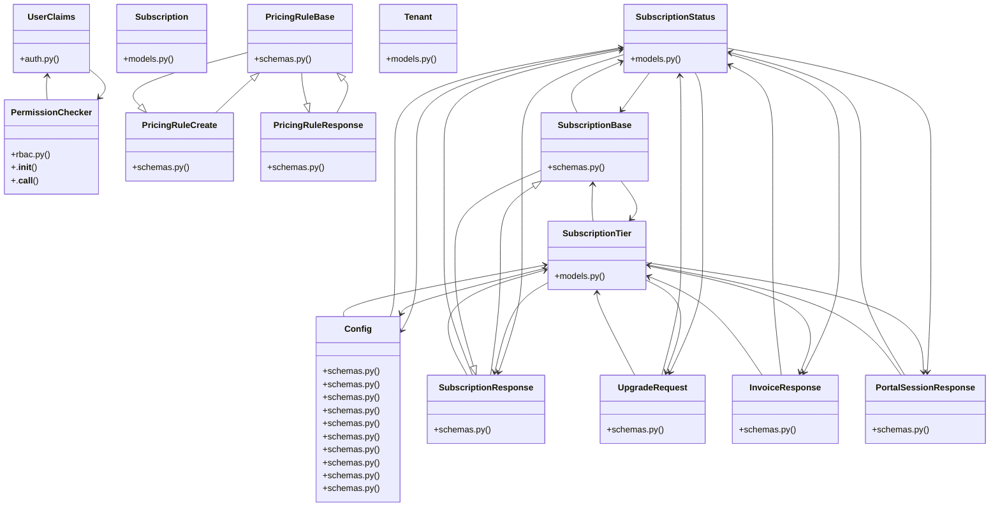

# Content & Features

> 187 nodes · cohesion 0.02

## Key Concepts

- [UserClaims](file:///E:/Non_Office/Dev_Space/vibe_skool/kloudShop/backend/shared/auth.py#L12) (142 connections)
- [auth_override()](file:///E:/Non_Office/Dev_Space/vibe_skool/kloudShop/backend/tests/conftest.py#L112) (44 connections)
- [UserClaims](file:///E:/Non_Office/Dev_Space/vibe_skool/kloudShop/frontend/lib/models/user_claims.dart) (44 connections)
- [Tenant](file:///E:/Non_Office/Dev_Space/vibe_skool/kloudShop/backend/modules/platform/models.py#L9) (35 connections)
- [SubscriptionStatus](file:///E:/Non_Office/Dev_Space/vibe_skool/kloudShop/backend/modules/billing/models.py#L10) (25 connections)
- [Subscription](file:///E:/Non_Office/Dev_Space/vibe_skool/kloudShop/backend/modules/billing/models.py#L23) (24 connections)
- [SubscriptionTier](file:///E:/Non_Office/Dev_Space/vibe_skool/kloudShop/backend/modules/billing/models.py#L17) (21 connections)
- [Order](file:///E:/Non_Office/Dev_Space/vibe_skool/kloudShop/frontend/lib/models/order.dart) (16 connections)
- [Config](file:///E:/Non_Office/Dev_Space/vibe_skool/kloudShop/backend/modules/pricing/schemas.py#L24) (14 connections)
- [InvoiceResponse](file:///E:/Non_Office/Dev_Space/vibe_skool/kloudShop/backend/modules/billing/schemas.py#L26) (10 connections)
- [PortalSessionResponse](file:///E:/Non_Office/Dev_Space/vibe_skool/kloudShop/backend/modules/billing/schemas.py#L35) (10 connections)
- [SubscriptionResponse](file:///E:/Non_Office/Dev_Space/vibe_skool/kloudShop/backend/modules/billing/schemas.py#L10) (10 connections)
- [UpgradeRequest](file:///E:/Non_Office/Dev_Space/vibe_skool/kloudShop/backend/modules/billing/schemas.py#L21) (10 connections)
- [test_catalog.py](file:///E:/Non_Office/Dev_Space/vibe_skool/kloudShop/backend/tests/test_catalog.py#L1) (9 connections)
- [Finalizes an upgrade session.      In Stripe mode, this would verify the sessio](file:///E:/Non_Office/Dev_Space/vibe_skool/kloudShop/backend/modules/billing/router.py#L131) (9 connections)
- [Lists all invoices from Stripe for the current tenant.](file:///E:/Non_Office/Dev_Space/vibe_skool/kloudShop/backend/modules/billing/router.py#L169) (9 connections)
- [Creates a Stripe Billing Portal session.](file:///E:/Non_Office/Dev_Space/vibe_skool/kloudShop/backend/modules/billing/router.py#L204) (9 connections)
- [Manually trigger the trial expiration check.](file:///E:/Non_Office/Dev_Space/vibe_skool/kloudShop/backend/modules/billing/router.py#L231) (9 connections)
- [Fetch current subscription status for the tenant.](file:///E:/Non_Office/Dev_Space/vibe_skool/kloudShop/backend/modules/billing/router.py#L26) (9 connections)
- [Initiates a Stripe Checkout Session for tier upgrades.](file:///E:/Non_Office/Dev_Space/vibe_skool/kloudShop/backend/modules/billing/router.py#L51) (9 connections)
- [test_analytics_needs_attention()](file:///E:/Non_Office/Dev_Space/vibe_skool/kloudShop/backend/tests/test_analytics.py#L48) (9 connections)
- [models.py](file:///E:/Non_Office/Dev_Space/vibe_skool/kloudShop/backend/modules/billing/models.py#L1) (8 connections)
- [router.py](file:///E:/Non_Office/Dev_Space/vibe_skool/kloudShop/backend/modules/billing/router.py#L1) (8 connections)
- [schemas.py](file:///E:/Non_Office/Dev_Space/vibe_skool/kloudShop/backend/modules/billing/schemas.py#L1) (8 connections)
- [List all merchants and their subscription status.](file:///E:/Non_Office/Dev_Space/vibe_skool/kloudShop/backend/modules/platform/router.py#L49) (8 connections)
- *... and 162 more nodes in this community*

## Class Diagram

## Relationships

- [[Community 12]] (113 shared connections)
- [[Community 4]] (58 shared connections)
- [[Community 3]] (38 shared connections)
- [[Community 10]] (34 shared connections)
- [[Community 14]] (12 shared connections)
- [[Community 15]] (8 shared connections)
- [[Community 17]] (6 shared connections)
- [[Community 8]] (1 shared connections)

## Source Files

- [E:\Non_Office\Dev_Space\vibe_skool\kloudShop\backend\modules\billing\models.py](file:///E:/Non_Office/Dev_Space/vibe_skool/kloudShop/backend/modules/billing/models.py)
- [E:\Non_Office\Dev_Space\vibe_skool\kloudShop\backend\modules\billing\router.py](file:///E:/Non_Office/Dev_Space/vibe_skool/kloudShop/backend/modules/billing/router.py)
- [E:\Non_Office\Dev_Space\vibe_skool\kloudShop\backend\modules\billing\schemas.py](file:///E:/Non_Office/Dev_Space/vibe_skool/kloudShop/backend/modules/billing/schemas.py)
- [E:\Non_Office\Dev_Space\vibe_skool\kloudShop\backend\modules\billing\tasks.py](file:///E:/Non_Office/Dev_Space/vibe_skool/kloudShop/backend/modules/billing/tasks.py)
- [E:\Non_Office\Dev_Space\vibe_skool\kloudShop\backend\modules\billing\webhooks.py](file:///E:/Non_Office/Dev_Space/vibe_skool/kloudShop/backend/modules/billing/webhooks.py)
- [E:\Non_Office\Dev_Space\vibe_skool\kloudShop\backend\modules\feeds\router.py](file:///E:/Non_Office/Dev_Space/vibe_skool/kloudShop/backend/modules/feeds/router.py)
- [E:\Non_Office\Dev_Space\vibe_skool\kloudShop\backend\modules\i18n\router.py](file:///E:/Non_Office/Dev_Space/vibe_skool/kloudShop/backend/modules/i18n/router.py)
- [E:\Non_Office\Dev_Space\vibe_skool\kloudShop\backend\modules\platform\models.py](file:///E:/Non_Office/Dev_Space/vibe_skool/kloudShop/backend/modules/platform/models.py)
- [E:\Non_Office\Dev_Space\vibe_skool\kloudShop\backend\modules\platform\router.py](file:///E:/Non_Office/Dev_Space/vibe_skool/kloudShop/backend/modules/platform/router.py)
- [E:\Non_Office\Dev_Space\vibe_skool\kloudShop\backend\modules\pricing\schemas.py](file:///E:/Non_Office/Dev_Space/vibe_skool/kloudShop/backend/modules/pricing/schemas.py)
- [E:\Non_Office\Dev_Space\vibe_skool\kloudShop\backend\shared\auth.py](file:///E:/Non_Office/Dev_Space/vibe_skool/kloudShop/backend/shared/auth.py)
- [E:\Non_Office\Dev_Space\vibe_skool\kloudShop\backend\shared\rbac.py](file:///E:/Non_Office/Dev_Space/vibe_skool/kloudShop/backend/shared/rbac.py)
- [E:\Non_Office\Dev_Space\vibe_skool\kloudShop\backend\tests\conftest.py](file:///E:/Non_Office/Dev_Space/vibe_skool/kloudShop/backend/tests/conftest.py)
- [E:\Non_Office\Dev_Space\vibe_skool\kloudShop\backend\tests\test_analytics.py](file:///E:/Non_Office/Dev_Space/vibe_skool/kloudShop/backend/tests/test_analytics.py)
- [E:\Non_Office\Dev_Space\vibe_skool\kloudShop\backend\tests\test_b2b.py](file:///E:/Non_Office/Dev_Space/vibe_skool/kloudShop/backend/tests/test_b2b.py)
- [E:\Non_Office\Dev_Space\vibe_skool\kloudShop\backend\tests\test_billing.py](file:///E:/Non_Office/Dev_Space/vibe_skool/kloudShop/backend/tests/test_billing.py)
- [E:\Non_Office\Dev_Space\vibe_skool\kloudShop\backend\tests\test_blog.py](file:///E:/Non_Office/Dev_Space/vibe_skool/kloudShop/backend/tests/test_blog.py)
- [E:\Non_Office\Dev_Space\vibe_skool\kloudShop\backend\tests\test_catalog.py](file:///E:/Non_Office/Dev_Space/vibe_skool/kloudShop/backend/tests/test_catalog.py)
- [E:\Non_Office\Dev_Space\vibe_skool\kloudShop\backend\tests\test_channels.py](file:///E:/Non_Office/Dev_Space/vibe_skool/kloudShop/backend/tests/test_channels.py)
- [E:\Non_Office\Dev_Space\vibe_skool\kloudShop\backend\tests\test_collections.py](file:///E:/Non_Office/Dev_Space/vibe_skool/kloudShop/backend/tests/test_collections.py)

## Audit Trail

- EXTRACTED: 368 (37%)
- INFERRED: 621 (63%)
- AMBIGUOUS: 0 (0%)

---

*Part of the graphify knowledge wiki. See [[index]] to navigate.*