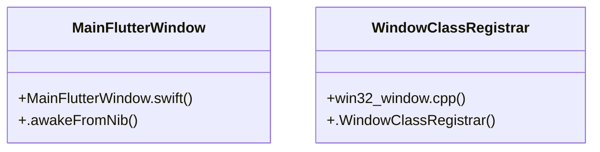

# Flutter Engine

> 113 nodes · cohesion 0.03

## Key Concepts

- [win32_window.cpp](file:///E:/Non_Office/Dev_Space/vibe_skool/kloudShop/frontend/windows/runner/win32_window.cpp#L1) (19 connections)
- [standard_codec.cc](file:///E:/Non_Office/Dev_Space/vibe_skool/kloudShop/frontend/windows/flutter/ephemeral/cpp_client_wrapper/standard_codec.cc#L1) (18 connections)
- [core_implementations.cc](file:///E:/Non_Office/Dev_Space/vibe_skool/kloudShop/frontend/windows/flutter/ephemeral/cpp_client_wrapper/core_implementations.cc#L1) (12 connections)
- [Create()](file:///E:/Non_Office/Dev_Space/vibe_skool/kloudShop/frontend/windows/runner/win32_window.cpp#L123) (10 connections)
- [flutter_engine.cc](file:///E:/Non_Office/Dev_Space/vibe_skool/kloudShop/frontend/windows/flutter/ephemeral/cpp_client_wrapper/flutter_engine.cc#L1) (9 connections)
- [WriteValue()](file:///E:/Non_Office/Dev_Space/vibe_skool/kloudShop/frontend/windows/flutter/ephemeral/cpp_client_wrapper/standard_codec.cc#L98) (8 connections)
- [OnCreate()](file:///E:/Non_Office/Dev_Space/vibe_skool/kloudShop/frontend/windows/runner/flutter_window.cpp#L12) (7 connections)
- [Destroy()](file:///E:/Non_Office/Dev_Space/vibe_skool/kloudShop/frontend/windows/runner/win32_window.cpp#L224) (7 connections)
- [plugin_registrar.cc](file:///E:/Non_Office/Dev_Space/vibe_skool/kloudShop/frontend/windows/flutter/ephemeral/cpp_client_wrapper/plugin_registrar.cc#L1) (6 connections)
- [GetInstance()](file:///E:/Non_Office/Dev_Space/vibe_skool/kloudShop/frontend/windows/flutter/ephemeral/cpp_client_wrapper/plugin_registrar.cc#L49) (6 connections)
- [wWinMain()](file:///E:/Non_Office/Dev_Space/vibe_skool/kloudShop/frontend/windows/runner/main.cpp#L8) (5 connections)
- [Resize()](file:///E:/Non_Office/Dev_Space/vibe_skool/kloudShop/frontend/windows/flutter/ephemeral/cpp_client_wrapper/include/flutter/method_channel.h#L130) (5 connections)
- [ReadValue()](file:///E:/Non_Office/Dev_Space/vibe_skool/kloudShop/frontend/windows/flutter/ephemeral/cpp_client_wrapper/standard_codec.cc#L92) (5 connections)
- [MessageHandler()](file:///E:/Non_Office/Dev_Space/vibe_skool/kloudShop/frontend/windows/runner/win32_window.cpp#L176) (5 connections)
- [SetMessageHandler()](file:///E:/Non_Office/Dev_Space/vibe_skool/kloudShop/frontend/windows/flutter/ephemeral/cpp_client_wrapper/core_implementations.cc#L116) (4 connections)
- [flutter_view_controller.cc](file:///E:/Non_Office/Dev_Space/vibe_skool/kloudShop/frontend/windows/flutter/ephemeral/cpp_client_wrapper/flutter_view_controller.cc#L1) (4 connections)
- [method_channel.h](file:///E:/Non_Office/Dev_Space/vibe_skool/kloudShop/frontend/windows/flutter/ephemeral/cpp_client_wrapper/include/flutter/method_channel.h#L1) (4 connections)
- [flutter_window.cpp](file:///E:/Non_Office/Dev_Space/vibe_skool/kloudShop/frontend/windows/runner/flutter_window.cpp#L1) (4 connections)
- [flutter()](file:///E:/Non_Office/Dev_Space/vibe_skool/kloudShop/frontend/windows/flutter/ephemeral/cpp_client_wrapper/include/flutter/method_codec.h#L15) (4 connections)
- [ReadValueOfType()](file:///E:/Non_Office/Dev_Space/vibe_skool/kloudShop/frontend/windows/flutter/ephemeral/cpp_client_wrapper/standard_codec.cc#L168) (4 connections)
- [GetClientArea()](file:///E:/Non_Office/Dev_Space/vibe_skool/kloudShop/frontend/windows/runner/win32_window.cpp#L252) (4 connections)
- [WndProc()](file:///E:/Non_Office/Dev_Space/vibe_skool/kloudShop/frontend/windows/runner/win32_window.cpp#L157) (4 connections)
- [ResizeChannel()](file:///E:/Non_Office/Dev_Space/vibe_skool/kloudShop/frontend/windows/flutter/ephemeral/cpp_client_wrapper/core_implementations.cc#L181) (3 connections)
- [Send()](file:///E:/Non_Office/Dev_Space/vibe_skool/kloudShop/frontend/windows/flutter/ephemeral/cpp_client_wrapper/core_implementations.cc#L87) (3 connections)
- [SetChannelWarnsOnOverflow()](file:///E:/Non_Office/Dev_Space/vibe_skool/kloudShop/frontend/windows/flutter/ephemeral/cpp_client_wrapper/core_implementations.cc#L194) (3 connections)
- *... and 88 more nodes in this community*

## Class Diagram

## Relationships

- No strong cross-community connections detected

## Source Files

- [E:\Non_Office\Dev_Space\vibe_skool\kloudShop\frontend\lib\providers\provisioning_provider.dart](file:///E:/Non_Office/Dev_Space/vibe_skool/kloudShop/frontend/lib/providers/provisioning_provider.dart)
- [E:\Non_Office\Dev_Space\vibe_skool\kloudShop\frontend\linux\runner\my_application.cc](file:///E:/Non_Office/Dev_Space/vibe_skool/kloudShop/frontend/linux/runner/my_application.cc)
- [E:\Non_Office\Dev_Space\vibe_skool\kloudShop\frontend\macos\Flutter\GeneratedPluginRegistrant.swift](file:///E:/Non_Office/Dev_Space/vibe_skool/kloudShop/frontend/macos/Flutter/GeneratedPluginRegistrant.swift)
- [E:\Non_Office\Dev_Space\vibe_skool\kloudShop\frontend\macos\Runner\MainFlutterWindow.swift](file:///E:/Non_Office/Dev_Space/vibe_skool/kloudShop/frontend/macos/Runner/MainFlutterWindow.swift)
- [E:\Non_Office\Dev_Space\vibe_skool\kloudShop\frontend\windows\flutter\ephemeral\cpp_client_wrapper\core_implementations.cc](file:///E:/Non_Office/Dev_Space/vibe_skool/kloudShop/frontend/windows/flutter/ephemeral/cpp_client_wrapper/core_implementations.cc)
- [E:\Non_Office\Dev_Space\vibe_skool\kloudShop\frontend\windows\flutter\ephemeral\cpp_client_wrapper\flutter_engine.cc](file:///E:/Non_Office/Dev_Space/vibe_skool/kloudShop/frontend/windows/flutter/ephemeral/cpp_client_wrapper/flutter_engine.cc)
- [E:\Non_Office\Dev_Space\vibe_skool\kloudShop\frontend\windows\flutter\ephemeral\cpp_client_wrapper\flutter_view_controller.cc](file:///E:/Non_Office/Dev_Space/vibe_skool/kloudShop/frontend/windows/flutter/ephemeral/cpp_client_wrapper/flutter_view_controller.cc)
- [E:\Non_Office\Dev_Space\vibe_skool\kloudShop\frontend\windows\flutter\ephemeral\cpp_client_wrapper\include\flutter\basic_message_channel.h](file:///E:/Non_Office/Dev_Space/vibe_skool/kloudShop/frontend/windows/flutter/ephemeral/cpp_client_wrapper/include/flutter/basic_message_channel.h)
- [E:\Non_Office\Dev_Space\vibe_skool\kloudShop\frontend\windows\flutter\ephemeral\cpp_client_wrapper\include\flutter\engine_method_result.h](file:///E:/Non_Office/Dev_Space/vibe_skool/kloudShop/frontend/windows/flutter/ephemeral/cpp_client_wrapper/include/flutter/engine_method_result.h)
- [E:\Non_Office\Dev_Space\vibe_skool\kloudShop\frontend\windows\flutter\ephemeral\cpp_client_wrapper\include\flutter\event_channel.h](file:///E:/Non_Office/Dev_Space/vibe_skool/kloudShop/frontend/windows/flutter/ephemeral/cpp_client_wrapper/include/flutter/event_channel.h)
- [E:\Non_Office\Dev_Space\vibe_skool\kloudShop\frontend\windows\flutter\ephemeral\cpp_client_wrapper\include\flutter\message_codec.h](file:///E:/Non_Office/Dev_Space/vibe_skool/kloudShop/frontend/windows/flutter/ephemeral/cpp_client_wrapper/include/flutter/message_codec.h)
- [E:\Non_Office\Dev_Space\vibe_skool\kloudShop\frontend\windows\flutter\ephemeral\cpp_client_wrapper\include\flutter\method_channel.h](file:///E:/Non_Office/Dev_Space/vibe_skool/kloudShop/frontend/windows/flutter/ephemeral/cpp_client_wrapper/include/flutter/method_channel.h)
- [E:\Non_Office\Dev_Space\vibe_skool\kloudShop\frontend\windows\flutter\ephemeral\cpp_client_wrapper\include\flutter\method_codec.h](file:///E:/Non_Office/Dev_Space/vibe_skool/kloudShop/frontend/windows/flutter/ephemeral/cpp_client_wrapper/include/flutter/method_codec.h)
- [E:\Non_Office\Dev_Space\vibe_skool\kloudShop\frontend\windows\flutter\ephemeral\cpp_client_wrapper\plugin_registrar.cc](file:///E:/Non_Office/Dev_Space/vibe_skool/kloudShop/frontend/windows/flutter/ephemeral/cpp_client_wrapper/plugin_registrar.cc)
- [E:\Non_Office\Dev_Space\vibe_skool\kloudShop\frontend\windows\flutter\ephemeral\cpp_client_wrapper\standard_codec.cc](file:///E:/Non_Office/Dev_Space/vibe_skool/kloudShop/frontend/windows/flutter/ephemeral/cpp_client_wrapper/standard_codec.cc)
- [E:\Non_Office\Dev_Space\vibe_skool\kloudShop\frontend\windows\flutter\generated_plugin_registrant.cc](file:///E:/Non_Office/Dev_Space/vibe_skool/kloudShop/frontend/windows/flutter/generated_plugin_registrant.cc)
- [E:\Non_Office\Dev_Space\vibe_skool\kloudShop\frontend\windows\runner\flutter_window.cpp](file:///E:/Non_Office/Dev_Space/vibe_skool/kloudShop/frontend/windows/runner/flutter_window.cpp)
- [E:\Non_Office\Dev_Space\vibe_skool\kloudShop\frontend\windows\runner\flutter_window.h](file:///E:/Non_Office/Dev_Space/vibe_skool/kloudShop/frontend/windows/runner/flutter_window.h)
- [E:\Non_Office\Dev_Space\vibe_skool\kloudShop\frontend\windows\runner\main.cpp](file:///E:/Non_Office/Dev_Space/vibe_skool/kloudShop/frontend/windows/runner/main.cpp)
- [E:\Non_Office\Dev_Space\vibe_skool\kloudShop\frontend\windows\runner\utils.cpp](file:///E:/Non_Office/Dev_Space/vibe_skool/kloudShop/frontend/windows/runner/utils.cpp)

## Audit Trail

- EXTRACTED: 254 (75%)
- INFERRED: 83 (25%)
- AMBIGUOUS: 0 (0%)

---

*Part of the graphify knowledge wiki. See [[index]] to navigate.*