# Knowledge Graph Index

> Auto-generated by graphify. Start here — read community articles for context, then drill into god nodes for detail.

**2634 nodes · 5357 edges · 107 communities**

---

## System Architecture Flowchart

```mermaid
flowchart TD
    C0["User Interface Layer (344 nodes)"]
    C1["App Bootstrap (277 nodes)"]
    C2["Content & Features (254 nodes)"]
    C3["Community 3 (171 nodes)"]
    C4["Community 4 (121 nodes)"]
    C5["Community 5 (117 nodes)"]
    C6["Analytics Dashboard (100 nodes)"]
    C7["Flutter Engine (96 nodes)"]
    C8["Community 8 (93 nodes)"]
    C9["Community 9 (91 nodes)"]
    C10["Community 10 (82 nodes)"]
    C11["Community 11 (78 nodes)"]
    C12["Community 12 (78 nodes)"]
    C13["Community 13 (69 nodes)"]
    C14["Community 14 (61 nodes)"]
    C15["Community 15 (53 nodes)"]
    C16["Community 16 (49 nodes)"]
    C17["Community 17 (48 nodes)"]
    C18["Community 18 (46 nodes)"]
    C19["Community 19 (37 nodes)"]
    C20["Community 20 (35 nodes)"]
    C21["Community 21 (33 nodes)"]
    C22["Community 22 (25 nodes)"]
    C23["Community 23 (23 nodes)"]
    C24["Community 24 (17 nodes)"]
    C25["Community 25 (15 nodes)"]
    C26["Community 26 (15 nodes)"]
    C27["Community 27 (13 nodes)"]
    C28["Analytics Monitoring (12 nodes)"]
    C29["unknown (9 nodes)"]
    C30["Community 30 (7 nodes)"]
    C31["Subscription Parsing (6 nodes)"]
    C32["Community 32 (5 nodes)"]
    C33["Community 33 (5 nodes)"]
    C34["Community 34 (5 nodes)"]
    C35["Community 35 (5 nodes)"]
    C36["Community 36 (5 nodes)"]
    C37["Community 37 (4 nodes)"]
    C38["unknown (4 nodes)"]
    C39["unknown (4 nodes)"]
    C40["unknown (4 nodes)"]
    C41["unknown (4 nodes)"]
    C42["unknown (3 nodes)"]
    C43["unknown (3 nodes)"]
    C44["unknown (3 nodes)"]
    C45["unknown (3 nodes)"]
    C46["unknown (3 nodes)"]
    C47["unknown (3 nodes)"]
    C48["unknown (3 nodes)"]
    C49["unknown (2 nodes)"]
    C50["unknown (2 nodes)"]
    C51["unknown (2 nodes)"]
    C52["unknown (2 nodes)"]
    C53["unknown (2 nodes)"]
    C54["unknown (2 nodes)"]
    C55["unknown (2 nodes)"]
    C56["User Interface (2 nodes)"]
    C57["Color Presets (2 nodes)"]
    C58["Customer Management (2 nodes)"]
    C59["Community 59 (2 nodes)"]
    C60["Community 60 (2 nodes)"]
    C61["Theme Management (2 nodes)"]
    C62["unknown (2 nodes)"]
    C63["unknown (2 nodes)"]
    C64["unknown (2 nodes)"]
    C65["unknown (2 nodes)"]
    C66["unknown (2 nodes)"]
    C67["unknown (2 nodes)"]
    C68["unknown (2 nodes)"]
    C69["unknown (2 nodes)"]
    C70["unknown (2 nodes)"]
    C71["unknown (2 nodes)"]
    C72["unknown (2 nodes)"]
    C73["unknown (2 nodes)"]
    C74["unknown (2 nodes)"]
    C75["unknown (2 nodes)"]
    C76["unknown (2 nodes)"]
    C77["unknown (2 nodes)"]
    C78["unknown (2 nodes)"]
    C79["unknown (2 nodes)"]
    C80["unknown (2 nodes)"]
    C81["unknown (2 nodes)"]
    C82["unknown (2 nodes)"]
    C83["unknown (2 nodes)"]
    C84["unknown (1 nodes)"]
    C85["unknown (1 nodes)"]
    C86["unknown (1 nodes)"]
    C87["unknown (1 nodes)"]
    C88["Community 88 (1 nodes)"]
    C89["unknown (1 nodes)"]
    C90["unknown (1 nodes)"]
    C91["unknown (1 nodes)"]
    C92["unknown (1 nodes)"]
    C93["unknown (1 nodes)"]
    C94["unknown (1 nodes)"]
    C95["unknown (1 nodes)"]
    C96["unknown (1 nodes)"]
    C97["unknown (1 nodes)"]
    C98["unknown (1 nodes)"]
    C99["unknown (1 nodes)"]
    C100["unknown (1 nodes)"]
    C101["unknown (1 nodes)"]
    C102["unknown (1 nodes)"]
    C103["unknown (1 nodes)"]
    C104["unknown (1 nodes)"]
    C105["unknown (1 nodes)"]
    C106["unknown (1 nodes)"]
    C8 -->|100 edges| C2
    C2 -->|91 edges| C8
    C6 -->|57 edges| C2
    C2 -->|50 edges| C4
    C1 -->|35 edges| C0
    C0 -->|30 edges| C1
    C3 -->|23 edges| C2
    C2 -->|22 edges| C6
    C2 -->|21 edges| C14
    C14 -->|20 edges| C2
    C0 -->|19 edges| C5
    C4 -->|17 edges| C2
    C2 -->|16 edges| C3
    C2 -->|13 edges| C11
    C8 -->|13 edges| C4
    C2 -->|12 edges| C15
    C11 -->|12 edges| C2
    C3 -->|11 edges| C8
    C14 -->|10 edges| C3
    C0 -->|10 edges| C10
    C0 -->|10 edges| C13
    C3 -->|9 edges| C6
    C2 -->|8 edges| C24
    C0 -->|8 edges| C16
    C3 -->|7 edges| C11
    C14 -->|7 edges| C4
    C1 -->|7 edges| C13
    C1 -->|7 edges| C5
    C6 -->|6 edges| C14
    C23 -->|6 edges| C2
    C2 -->|6 edges| C23
    C3 -->|6 edges| C14
    C4 -->|6 edges| C14
    C0 -->|6 edges| C20
    C0 -->|6 edges| C7
    C1 -->|6 edges| C7
    C9 -->|6 edges| C1
    C11 -->|5 edges| C14
    C11 -->|4 edges| C4
    C4 -->|4 edges| C8
    C25 -->|4 edges| C2
    C0 -->|4 edges| C22
    C0 -->|4 edges| C19
    C0 -->|4 edges| C18
    C0 -->|4 edges| C21
    C1 -->|4 edges| C9
    C1 -->|4 edges| C10
    C1 -->|4 edges| C20
    C1 -->|4 edges| C19
    C9 -->|4 edges| C0
    C10 -->|4 edges| C0
    C6 -->|3 edges| C11
    C8 -->|3 edges| C3
    C1 -->|3 edges| C22
    C1 -->|3 edges| C11
    C17 -->|3 edges| C12
    C2 -->|2 edges| C27
    C2 -->|2 edges| C25
    C3 -->|2 edges| C23
    C14 -->|2 edges| C12
    C4 -->|2 edges| C11
    C27 -->|2 edges| C3
    C4 -->|2 edges| C3
    C0 -->|2 edges| C9
    C0 -->|2 edges| C28
    C1 -->|2 edges| C16
    C1 -->|2 edges| C21
    C13 -->|2 edges| C1
    C5 -->|2 edges| C1
    C19 -->|2 edges| C0
    C6 -->|1 edges| C12
    C23 -->|1 edges| C3
    C14 -->|1 edges| C8
    C6 -->|1 edges| C3
    C2 -->|1 edges| C12
    C2 -->|1 edges| C42
    C12 -->|1 edges| C14
    C8 -->|1 edges| C27
    C2 -->|1 edges| C37
    C2 -->|1 edges| C31
    C11 -->|1 edges| C1
    C27 -->|1 edges| C2
    C2 -->|1 edges| C38
    C11 -->|1 edges| C15
    C15 -->|1 edges| C3
    C25 -->|1 edges| C3
    C32 -->|1 edges| C2
    C4 -->|1 edges| C6
    C6 -->|1 edges| C4
    C24 -->|1 edges| C4
    C27 -->|1 edges| C4
    C0 -->|1 edges| C11
    C9 -->|1 edges| C13
    C10 -->|1 edges| C1
    C1 -->|1 edges| C8
    C13 -->|1 edges| C16
    C1 -->|1 edges| C12
    C1 -->|1 edges| C18
    C1 -->|1 edges| C14
    C20 -->|1 edges| C7
    C5 -->|1 edges| C19
    C5 -->|1 edges| C0
    C16 -->|1 edges| C1
    C7 -->|1 edges| C21
    C28 -->|1 edges| C1
    C5 -->|1 edges| C11
    C12 -->|1 edges| C11
```

## Communities
(sorted by size, largest first)

- [[User Interface Layer]] — 344 nodes
- [[App Bootstrap]] — 277 nodes
- [[Content & Features]] — 254 nodes
- [[Community 3]] — 171 nodes
- [[Community 4]] — 121 nodes
- [[Community 5]] — 117 nodes
- [[Analytics Dashboard]] — 100 nodes
- [[Flutter Engine]] — 96 nodes
- [[Community 8]] — 93 nodes
- [[Community 9]] — 91 nodes
- [[Community 10]] — 82 nodes
- [[Community 11]] — 78 nodes
- [[Community 12]] — 78 nodes
- [[Community 13]] — 69 nodes
- [[Community 14]] — 61 nodes
- [[Community 15]] — 53 nodes
- [[Community 16]] — 49 nodes
- [[Community 17]] — 48 nodes
- [[Community 18]] — 46 nodes
- [[Community 19]] — 37 nodes
- [[Community 20]] — 35 nodes
- [[Community 21]] — 33 nodes
- [[Community 22]] — 25 nodes
- [[Community 23]] — 23 nodes
- [[Community 24]] — 17 nodes
- [[Community 25]] — 15 nodes
- [[Community 26]] — 15 nodes
- [[Community 27]] — 13 nodes
- [[Analytics Monitoring]] — 12 nodes
- [[unknown]] — 9 nodes
- [[Community 30]] — 7 nodes
- [[Subscription Parsing]] — 6 nodes
- [[Community 32]] — 5 nodes
- [[Community 33]] — 5 nodes
- [[Community 34]] — 5 nodes
- [[Community 35]] — 5 nodes
- [[Community 36]] — 5 nodes
- [[Community 37]] — 4 nodes
- [[unknown]] — 4 nodes
- [[unknown]] — 4 nodes
- [[unknown]] — 4 nodes
- [[unknown]] — 4 nodes
- [[unknown]] — 3 nodes
- [[unknown]] — 3 nodes
- [[unknown]] — 3 nodes
- [[unknown]] — 3 nodes
- [[unknown]] — 3 nodes
- [[unknown]] — 3 nodes
- [[unknown]] — 3 nodes
- [[unknown]] — 2 nodes
- [[unknown]] — 2 nodes
- [[unknown]] — 2 nodes
- [[unknown]] — 2 nodes
- [[unknown]] — 2 nodes
- [[unknown]] — 2 nodes
- [[unknown]] — 2 nodes
- [[User Interface]] — 2 nodes
- [[Color Presets]] — 2 nodes
- [[Customer Management]] — 2 nodes
- [[Community 59]] — 2 nodes
- [[Community 60]] — 2 nodes
- [[Theme Management]] — 2 nodes
- [[unknown]] — 2 nodes
- [[unknown]] — 2 nodes
- [[unknown]] — 2 nodes
- [[unknown]] — 2 nodes
- [[unknown]] — 2 nodes
- [[unknown]] — 2 nodes
- [[unknown]] — 2 nodes
- [[unknown]] — 2 nodes
- [[unknown]] — 2 nodes
- [[unknown]] — 2 nodes
- [[unknown]] — 2 nodes
- [[unknown]] — 2 nodes
- [[unknown]] — 2 nodes
- [[unknown]] — 2 nodes
- [[unknown]] — 2 nodes
- [[unknown]] — 2 nodes
- [[unknown]] — 2 nodes
- [[unknown]] — 2 nodes
- [[unknown]] — 2 nodes
- [[unknown]] — 2 nodes
- [[unknown]] — 2 nodes
- [[unknown]] — 2 nodes
- [[unknown]] — 1 nodes
- [[unknown]] — 1 nodes
- [[unknown]] — 1 nodes
- [[unknown]] — 1 nodes
- [[Community 88]] — 1 nodes
- [[unknown]] — 1 nodes
- [[unknown]] — 1 nodes
- [[unknown]] — 1 nodes
- [[unknown]] — 1 nodes
- [[unknown]] — 1 nodes
- [[unknown]] — 1 nodes
- [[unknown]] — 1 nodes
- [[unknown]] — 1 nodes
- [[unknown]] — 1 nodes
- [[unknown]] — 1 nodes
- [[unknown]] — 1 nodes
- [[unknown]] — 1 nodes
- [[unknown]] — 1 nodes
- [[unknown]] — 1 nodes
- [[unknown]] — 1 nodes
- [[unknown]] — 1 nodes
- [[unknown]] — 1 nodes
- [[unknown]] — 1 nodes

## God Nodes
(most connected concepts — the load-bearing abstractions)

- [[UserClaims]] — 143 connections
- [[Variant]] — 104 connections
- [[Product]] — 74 connections
- [[Fixture to override validate_token dependency.     Usage: auth_override(UserCla]] — 66 connections
- [[package:flutter/material.dart]] — 64 connections
- [[StockLocation]] — 63 connections
- [[Inventory]] — 62 connections
- [[package:flutter_riverpod/flutter_riverpod.dart]] — 60 connections
- [[Fixture to override validate_token dependency.     Usage: auth_override(UserCla]] — 58 connections
- [[Order]] — 50 connections

---

*Generated by [graphify](https://github.com/safishamsi/graphify)*