# Knowledge Graph Index

> Auto-generated by graphify. Start here — read community articles for context, then drill into god nodes for detail.

**2517 nodes · 5056 edges · 131 communities**

---

## System Architecture Flowchart

```mermaid
flowchart TD
    C0["User Interface Layer (339 nodes)"]
    C1["App Bootstrap (236 nodes)"]
    C2["Content & Features (169 nodes)"]
    C3["Community 3 (154 nodes)"]
    C4["Community 4 (133 nodes)"]
    C5["Community 5 (117 nodes)"]
    C6["Analytics Dashboard (116 nodes)"]
    C7["Flutter Engine (113 nodes)"]
    C8["Community 8 (112 nodes)"]
    C9["Community 9 (97 nodes)"]
    C10["Community 10 (91 nodes)"]
    C11["Community 11 (91 nodes)"]
    C12["Community 12 (79 nodes)"]
    C13["Community 13 (73 nodes)"]
    C14["Community 14 (72 nodes)"]
    C15["Community 15 (52 nodes)"]
    C16["Community 16 (50 nodes)"]
    C17["Community 17 (46 nodes)"]
    C18["Community 18 (46 nodes)"]
    C19["Community 19 (38 nodes)"]
    C20["Community 20 (34 nodes)"]
    C21["Community 21 (33 nodes)"]
    C22["Community 22 (15 nodes)"]
    C23["Community 23 (9 nodes)"]
    C24["Community 24 (7 nodes)"]
    C25["Community 25 (5 nodes)"]
    C26["Community 26 (5 nodes)"]
    C27["Community 27 (5 nodes)"]
    C28["Analytics Monitoring (5 nodes)"]
    C29["unknown (4 nodes)"]
    C30["Community 30 (4 nodes)"]
    C31["Subscription Parsing (4 nodes)"]
    C32["Community 32 (3 nodes)"]
    C33["Community 33 (3 nodes)"]
    C34["Community 34 (3 nodes)"]
    C35["Community 35 (3 nodes)"]
    C36["Community 36 (3 nodes)"]
    C37["Community 37 (3 nodes)"]
    C38["unknown (3 nodes)"]
    C39["unknown (2 nodes)"]
    C40["unknown (2 nodes)"]
    C41["unknown (2 nodes)"]
    C42["unknown (2 nodes)"]
    C43["unknown (2 nodes)"]
    C44["unknown (2 nodes)"]
    C45["unknown (2 nodes)"]
    C46["unknown (2 nodes)"]
    C47["unknown (2 nodes)"]
    C48["unknown (2 nodes)"]
    C49["unknown (2 nodes)"]
    C50["unknown (2 nodes)"]
    C51["unknown (2 nodes)"]
    C52["unknown (2 nodes)"]
    C53["unknown (2 nodes)"]
    C54["unknown (2 nodes)"]
    C55["unknown (2 nodes)"]
    C56["User Interface (2 nodes)"]
    C57["Color Presets (2 nodes)"]
    C58["Customer Management (2 nodes)"]
    C59["Community 59 (2 nodes)"]
    C60["Community 60 (2 nodes)"]
    C61["Theme Management (2 nodes)"]
    C62["unknown (2 nodes)"]
    C63["unknown (2 nodes)"]
    C64["unknown (2 nodes)"]
    C65["unknown (2 nodes)"]
    C66["unknown (2 nodes)"]
    C67["unknown (2 nodes)"]
    C68["unknown (2 nodes)"]
    C69["unknown (2 nodes)"]
    C70["unknown (2 nodes)"]
    C71["unknown (2 nodes)"]
    C72["unknown (2 nodes)"]
    C73["unknown (2 nodes)"]
    C74["unknown (2 nodes)"]
    C75["unknown (2 nodes)"]
    C76["unknown (2 nodes)"]
    C77["unknown (2 nodes)"]
    C78["unknown (2 nodes)"]
    C79["unknown (2 nodes)"]
    C80["unknown (2 nodes)"]
    C81["unknown (2 nodes)"]
    C82["unknown (2 nodes)"]
    C83["unknown (2 nodes)"]
    C84["unknown (2 nodes)"]
    C85["unknown (2 nodes)"]
    C86["unknown (2 nodes)"]
    C87["unknown (2 nodes)"]
    C88["Community 88 (2 nodes)"]
    C89["unknown (1 nodes)"]
    C90["unknown (1 nodes)"]
    C91["unknown (1 nodes)"]
    C92["unknown (1 nodes)"]
    C93["unknown (1 nodes)"]
    C94["unknown (1 nodes)"]
    C95["unknown (1 nodes)"]
    C96["unknown (1 nodes)"]
    C97["unknown (1 nodes)"]
    C98["unknown (1 nodes)"]
    C99["unknown (1 nodes)"]
    C100["unknown (1 nodes)"]
    C101["unknown (1 nodes)"]
    C102["unknown (1 nodes)"]
    C103["unknown (1 nodes)"]
    C104["unknown (1 nodes)"]
    C105["unknown (1 nodes)"]
    C106["unknown (1 nodes)"]
    C107["unknown (1 nodes)"]
    C108["unknown (1 nodes)"]
    C109["unknown (1 nodes)"]
    C110["unknown (1 nodes)"]
    C111["unknown (1 nodes)"]
    C112["unknown (1 nodes)"]
    C113["unknown (1 nodes)"]
    C114["unknown (1 nodes)"]
    C115["unknown (1 nodes)"]
    C116["unknown (1 nodes)"]
    C117["unknown (1 nodes)"]
    C118["unknown (1 nodes)"]
    C119["unknown (1 nodes)"]
    C120["unknown (1 nodes)"]
    C121["unknown (1 nodes)"]
    C122["unknown (1 nodes)"]
    C123["unknown (1 nodes)"]
    C124["unknown (1 nodes)"]
    C125["unknown (1 nodes)"]
    C126["unknown (1 nodes)"]
    C127["unknown (1 nodes)"]
    C128["unknown (1 nodes)"]
    C129["unknown (1 nodes)"]
    C130["unknown (1 nodes)"]
    C3 -->|60 edges| C15
    C3 -->|38 edges| C4
    C1 -->|34 edges| C0
    C3 -->|24 edges| C14
    C3 -->|24 edges| C2
    C0 -->|22 edges| C1
    C4 -->|20 edges| C12
    C0 -->|19 edges| C5
    C2 -->|18 edges| C4
    C4 -->|18 edges| C14
    C4 -->|18 edges| C10
    C14 -->|14 edges| C3
    C2 -->|13 edges| C3
    C12 -->|13 edges| C3
    C0 -->|13 edges| C9
    C8 -->|12 edges| C4
    C8 -->|12 edges| C3
    C8 -->|12 edges| C15
    C1 -->|12 edges| C9
    C4 -->|11 edges| C2
    C12 -->|11 edges| C4
    C0 -->|11 edges| C13
    C15 -->|10 edges| C4
    C8 -->|9 edges| C14
    C14 -->|9 edges| C15
    C3 -->|9 edges| C10
    C4 -->|9 edges| C15
    C10 -->|9 edges| C3
    C0 -->|9 edges| C6
    C4 -->|8 edges| C3
    C14 -->|8 edges| C10
    C1 -->|8 edges| C6
    C2 -->|7 edges| C12
    C8 -->|7 edges| C17
    C12 -->|7 edges| C8
    C14 -->|7 edges| C4
    C14 -->|7 edges| C2
    C12 -->|7 edges| C10
    C3 -->|7 edges| C17
    C1 -->|7 edges| C5
    C6 -->|7 edges| C1
    C2 -->|6 edges| C14
    C12 -->|6 edges| C14
    C3 -->|6 edges| C12
    C10 -->|6 edges| C12
    C0 -->|6 edges| C20
    C0 -->|6 edges| C11
    C1 -->|6 edges| C11
    C2 -->|5 edges| C17
    C2 -->|5 edges| C8
    C8 -->|5 edges| C12
    C12 -->|5 edges| C2
    C17 -->|5 edges| C2
    C0 -->|5 edges| C19
    C1 -->|5 edges| C13
    C6 -->|5 edges| C0
    C2 -->|4 edges| C15
    C14 -->|4 edges| C12
    C17 -->|4 edges| C12
    C10 -->|4 edges| C14
    C0 -->|4 edges| C18
    C0 -->|4 edges| C21
    C1 -->|4 edges| C20
    C4 -->|3 edges| C16
    C12 -->|3 edges| C15
    C17 -->|3 edges| C4
    C15 -->|3 edges| C2
    C15 -->|3 edges| C8
    C8 -->|2 edges| C2
    C12 -->|2 edges| C7
    C3 -->|2 edges| C8
    C12 -->|2 edges| C17
    C15 -->|2 edges| C10
    C17 -->|2 edges| C3
    C1 -->|2 edges| C19
    C1 -->|2 edges| C21
    C1 -->|2 edges| C16
    C13 -->|2 edges| C0
    C5 -->|2 edges| C9
    C9 -->|2 edges| C0
    C4 -->|1 edges| C7
    C4 -->|1 edges| C8
    C14 -->|1 edges| C8
    C12 -->|1 edges| C1
    C12 -->|1 edges| C16
    C15 -->|1 edges| C3
    C8 -->|1 edges| C10
    C10 -->|1 edges| C2
    C10 -->|1 edges| C4
    C17 -->|1 edges| C10
    C10 -->|1 edges| C16
    C0 -->|1 edges| C16
    C13 -->|1 edges| C19
    C13 -->|1 edges| C1
    C19 -->|1 edges| C0
    C19 -->|1 edges| C1
    C1 -->|1 edges| C3
    C1 -->|1 edges| C7
    C1 -->|1 edges| C18
    C1 -->|1 edges| C12
    C20 -->|1 edges| C1
    C5 -->|1 edges| C1
    C5 -->|1 edges| C0
    C9 -->|1 edges| C16
    C11 -->|1 edges| C21
    C5 -->|1 edges| C16
    C16 -->|1 edges| C7
```

## Communities
(sorted by size, largest first)

- [[User Interface Layer]] — 339 nodes
- [[App Bootstrap]] — 236 nodes
- [[Content & Features]] — 169 nodes
- [[Community 3]] — 154 nodes
- [[Community 4]] — 133 nodes
- [[Community 5]] — 117 nodes
- [[Analytics Dashboard]] — 116 nodes
- [[Flutter Engine]] — 113 nodes
- [[Community 8]] — 112 nodes
- [[Community 9]] — 97 nodes
- [[Community 10]] — 91 nodes
- [[Community 11]] — 91 nodes
- [[Community 12]] — 79 nodes
- [[Community 13]] — 73 nodes
- [[Community 14]] — 72 nodes
- [[Community 15]] — 52 nodes
- [[Community 16]] — 50 nodes
- [[Community 17]] — 46 nodes
- [[Community 18]] — 46 nodes
- [[Community 19]] — 38 nodes
- [[Community 20]] — 34 nodes
- [[Community 21]] — 33 nodes
- [[Community 22]] — 15 nodes
- [[Community 23]] — 9 nodes
- [[Community 24]] — 7 nodes
- [[Community 25]] — 5 nodes
- [[Community 26]] — 5 nodes
- [[Community 27]] — 5 nodes
- [[Analytics Monitoring]] — 5 nodes
- [[unknown]] — 4 nodes
- [[Community 30]] — 4 nodes
- [[Subscription Parsing]] — 4 nodes
- [[Community 32]] — 3 nodes
- [[Community 33]] — 3 nodes
- [[Community 34]] — 3 nodes
- [[Community 35]] — 3 nodes
- [[Community 36]] — 3 nodes
- [[Community 37]] — 3 nodes
- [[unknown]] — 3 nodes
- [[unknown]] — 2 nodes
- [[unknown]] — 2 nodes
- [[unknown]] — 2 nodes
- [[unknown]] — 2 nodes
- [[unknown]] — 2 nodes
- [[unknown]] — 2 nodes
- [[unknown]] — 2 nodes
- [[unknown]] — 2 nodes
- [[unknown]] — 2 nodes
- [[unknown]] — 2 nodes
- [[unknown]] — 2 nodes
- [[unknown]] — 2 nodes
- [[unknown]] — 2 nodes
- [[unknown]] — 2 nodes
- [[unknown]] — 2 nodes
- [[unknown]] — 2 nodes
- [[unknown]] — 2 nodes
- [[User Interface]] — 2 nodes
- [[Color Presets]] — 2 nodes
- [[Customer Management]] — 2 nodes
- [[Community 59]] — 2 nodes
- [[Community 60]] — 2 nodes
- [[Theme Management]] — 2 nodes
- [[unknown]] — 2 nodes
- [[unknown]] — 2 nodes
- [[unknown]] — 2 nodes
- [[unknown]] — 2 nodes
- [[unknown]] — 2 nodes
- [[unknown]] — 2 nodes
- [[unknown]] — 2 nodes
- [[unknown]] — 2 nodes
- [[unknown]] — 2 nodes
- [[unknown]] — 2 nodes
- [[unknown]] — 2 nodes
- [[unknown]] — 2 nodes
- [[unknown]] — 2 nodes
- [[unknown]] — 2 nodes
- [[unknown]] — 2 nodes
- [[unknown]] — 2 nodes
- [[unknown]] — 2 nodes
- [[unknown]] — 2 nodes
- [[unknown]] — 2 nodes
- [[unknown]] — 2 nodes
- [[unknown]] — 2 nodes
- [[unknown]] — 2 nodes
- [[unknown]] — 2 nodes
- [[unknown]] — 2 nodes
- [[unknown]] — 2 nodes
- [[unknown]] — 2 nodes
- [[Community 88]] — 2 nodes
- [[unknown]] — 1 nodes
- [[unknown]] — 1 nodes
- [[unknown]] — 1 nodes
- [[unknown]] — 1 nodes
- [[unknown]] — 1 nodes
- [[unknown]] — 1 nodes
- [[unknown]] — 1 nodes
- [[unknown]] — 1 nodes
- [[unknown]] — 1 nodes
- [[unknown]] — 1 nodes
- [[unknown]] — 1 nodes
- [[unknown]] — 1 nodes
- [[unknown]] — 1 nodes
- [[unknown]] — 1 nodes
- [[unknown]] — 1 nodes
- [[unknown]] — 1 nodes
- [[unknown]] — 1 nodes
- [[unknown]] — 1 nodes
- [[unknown]] — 1 nodes
- [[unknown]] — 1 nodes
- [[unknown]] — 1 nodes
- [[unknown]] — 1 nodes
- [[unknown]] — 1 nodes
- [[unknown]] — 1 nodes
- [[unknown]] — 1 nodes
- [[unknown]] — 1 nodes
- [[unknown]] — 1 nodes
- [[unknown]] — 1 nodes
- [[unknown]] — 1 nodes
- [[unknown]] — 1 nodes
- [[unknown]] — 1 nodes
- [[unknown]] — 1 nodes
- [[unknown]] — 1 nodes
- [[unknown]] — 1 nodes
- [[unknown]] — 1 nodes
- [[unknown]] — 1 nodes
- [[unknown]] — 1 nodes
- [[unknown]] — 1 nodes
- [[unknown]] — 1 nodes
- [[unknown]] — 1 nodes
- [[unknown]] — 1 nodes
- [[unknown]] — 1 nodes

## God Nodes
(most connected concepts — the load-bearing abstractions)

- [[UserClaims]] — 142 connections
- [[Variant]] — 100 connections
- [[Product]] — 73 connections
- [[StockLocation]] — 63 connections
- [[Inventory]] — 61 connections
- [[package:flutter/material.dart]] — 61 connections
- [[Fixture to override validate_token dependency.     Usage: auth_override(UserCla]] — 59 connections
- [[package:flutter_riverpod/flutter_riverpod.dart]] — 57 connections
- [[Order]] — 49 connections
- [[auth_override()]] — 44 connections

---

*Generated by [graphify](https://github.com/safishamsi/graphify)*