# Knowledge Graph Index

> Auto-generated by graphify. Start here — read community articles for context, then drill into god nodes for detail.

**2678 nodes · 5416 edges · 103 communities**

---

## System Architecture Flowchart

```mermaid
flowchart TD
    C0["User Interface Layer (451 nodes)"]
    C1["App Bootstrap (278 nodes)"]
    C2["Content & Features (207 nodes)"]
    C3["Community 3 (194 nodes)"]
    C4["Community 4 (162 nodes)"]
    C5["Community 5 (145 nodes)"]
    C6["Analytics Dashboard (129 nodes)"]
    C7["Flutter Engine (114 nodes)"]
    C8["Community 8 (97 nodes)"]
    C9["Community 9 (93 nodes)"]
    C10["Community 10 (92 nodes)"]
    C11["Community 11 (84 nodes)"]
    C12["Community 12 (82 nodes)"]
    C13["Community 13 (69 nodes)"]
    C14["Community 14 (55 nodes)"]
    C15["Community 15 (52 nodes)"]
    C16["Community 16 (49 nodes)"]
    C17["Community 17 (38 nodes)"]
    C18["Community 18 (23 nodes)"]
    C19["Community 19 (23 nodes)"]
    C20["Community 20 (17 nodes)"]
    C21["Community 21 (15 nodes)"]
    C22["Community 22 (15 nodes)"]
    C23["Community 23 (9 nodes)"]
    C24["Community 24 (8 nodes)"]
    C25["Community 25 (7 nodes)"]
    C26["Community 26 (6 nodes)"]
    C27["Community 27 (5 nodes)"]
    C28["Analytics Monitoring (5 nodes)"]
    C29["unknown (5 nodes)"]
    C30["Community 30 (5 nodes)"]
    C31["Subscription Parsing (5 nodes)"]
    C32["Community 32 (5 nodes)"]
    C33["Community 33 (4 nodes)"]
    C34["Community 34 (4 nodes)"]
    C35["Community 35 (4 nodes)"]
    C36["Community 36 (4 nodes)"]
    C37["Community 37 (4 nodes)"]
    C38["unknown (3 nodes)"]
    C39["unknown (3 nodes)"]
    C40["unknown (3 nodes)"]
    C41["unknown (3 nodes)"]
    C42["unknown (3 nodes)"]
    C43["unknown (3 nodes)"]
    C44["unknown (3 nodes)"]
    C45["unknown (2 nodes)"]
    C46["unknown (2 nodes)"]
    C47["unknown (2 nodes)"]
    C48["unknown (2 nodes)"]
    C49["unknown (2 nodes)"]
    C50["unknown (2 nodes)"]
    C51["unknown (2 nodes)"]
    C52["unknown (2 nodes)"]
    C53["unknown (2 nodes)"]
    C54["unknown (2 nodes)"]
    C55["unknown (2 nodes)"]
    C56["User Interface (2 nodes)"]
    C57["Color Presets (2 nodes)"]
    C58["Customer Management (2 nodes)"]
    C59["Community 59 (2 nodes)"]
    C60["Community 60 (2 nodes)"]
    C61["Theme Management (2 nodes)"]
    C62["unknown (2 nodes)"]
    C63["unknown (2 nodes)"]
    C64["unknown (2 nodes)"]
    C65["unknown (2 nodes)"]
    C66["unknown (2 nodes)"]
    C67["unknown (2 nodes)"]
    C68["unknown (2 nodes)"]
    C69["unknown (2 nodes)"]
    C70["unknown (2 nodes)"]
    C71["unknown (2 nodes)"]
    C72["unknown (2 nodes)"]
    C73["unknown (2 nodes)"]
    C74["unknown (2 nodes)"]
    C75["unknown (2 nodes)"]
    C76["unknown (2 nodes)"]
    C77["unknown (2 nodes)"]
    C78["unknown (2 nodes)"]
    C79["unknown (2 nodes)"]
    C80["unknown (1 nodes)"]
    C81["unknown (1 nodes)"]
    C82["unknown (1 nodes)"]
    C83["unknown (1 nodes)"]
    C84["unknown (1 nodes)"]
    C85["unknown (1 nodes)"]
    C86["unknown (1 nodes)"]
    C87["unknown (1 nodes)"]
    C88["Community 88 (1 nodes)"]
    C89["unknown (1 nodes)"]
    C90["unknown (1 nodes)"]
    C91["unknown (1 nodes)"]
    C92["unknown (1 nodes)"]
    C93["unknown (1 nodes)"]
    C94["unknown (1 nodes)"]
    C95["unknown (1 nodes)"]
    C96["unknown (1 nodes)"]
    C97["unknown (1 nodes)"]
    C98["unknown (1 nodes)"]
    C99["unknown (1 nodes)"]
    C100["unknown (1 nodes)"]
    C101["unknown (1 nodes)"]
    C102["unknown (1 nodes)"]
    C11 -->|95 edges| C1
    C1 -->|64 edges| C11
    C5 -->|58 edges| C1
    C1 -->|35 edges| C5
    C2 -->|30 edges| C1
    C0 -->|30 edges| C4
    C1 -->|28 edges| C2
    C0 -->|28 edges| C6
    C0 -->|25 edges| C3
    C11 -->|23 edges| C5
    C1 -->|21 edges| C10
    C5 -->|18 edges| C10
    C0 -->|18 edges| C8
    C4 -->|16 edges| C0
    C5 -->|14 edges| C14
    C1 -->|14 edges| C14
    C10 -->|14 edges| C1
    C0 -->|14 edges| C13
    C2 -->|13 edges| C5
    C1 -->|13 edges| C15
    C0 -->|13 edges| C12
    C2 -->|11 edges| C11
    C0 -->|11 edges| C16
    C2 -->|10 edges| C14
    C14 -->|10 edges| C2
    C9 -->|10 edges| C0
    C14 -->|9 edges| C1
    C14 -->|9 edges| C5
    C14 -->|7 edges| C10
    C1 -->|6 edges| C18
    C1 -->|6 edges| C20
    C10 -->|6 edges| C14
    C0 -->|5 edges| C9
    C3 -->|5 edges| C0
    C18 -->|4 edges| C1
    C21 -->|4 edges| C1
    C12 -->|4 edges| C0
    C3 -->|4 edges| C4
    C0 -->|3 edges| C19
    C6 -->|3 edges| C0
    C5 -->|2 edges| C17
    C1 -->|2 edges| C21
    C18 -->|2 edges| C5
    C2 -->|2 edges| C18
    C14 -->|2 edges| C7
    C1 -->|2 edges| C17
    C4 -->|2 edges| C3
    C0 -->|2 edges| C17
    C9 -->|2 edges| C4
    C3 -->|2 edges| C13
    C6 -->|2 edges| C17
    C13 -->|2 edges| C3
    C8 -->|2 edges| C3
    C8 -->|2 edges| C6
    C5 -->|1 edges| C7
    C18 -->|1 edges| C2
    C14 -->|1 edges| C11
    C5 -->|1 edges| C2
    C1 -->|1 edges| C7
    C1 -->|1 edges| C38
    C7 -->|1 edges| C14
    C11 -->|1 edges| C2
    C1 -->|1 edges| C33
    C1 -->|1 edges| C26
    C1 -->|1 edges| C3
    C1 -->|1 edges| C27
    C1 -->|1 edges| C34
    C15 -->|1 edges| C2
    C21 -->|1 edges| C2
    C28 -->|1 edges| C1
    C10 -->|1 edges| C5
    C20 -->|1 edges| C10
    C10 -->|1 edges| C17
    C0 -->|1 edges| C24
    C4 -->|1 edges| C9
    C4 -->|1 edges| C12
    C9 -->|1 edges| C13
    C3 -->|1 edges| C6
    C12 -->|1 edges| C3
    C6 -->|1 edges| C3
    C6 -->|1 edges| C13
    C3 -->|1 edges| C11
    C13 -->|1 edges| C16
    C3 -->|1 edges| C7
    C3 -->|1 edges| C8
    C0 -->|1 edges| C14
    C8 -->|1 edges| C0
    C8 -->|1 edges| C17
    C17 -->|1 edges| C7
    C4 -->|1 edges| C6
```

## Communities
(sorted by size, largest first)

- [[User Interface Layer]] — 451 nodes
- [[App Bootstrap]] — 278 nodes
- [[Content & Features]] — 207 nodes
- [[Community 3]] — 194 nodes
- [[Community 4]] — 162 nodes
- [[Community 5]] — 145 nodes
- [[Analytics Dashboard]] — 129 nodes
- [[Flutter Engine]] — 114 nodes
- [[Community 8]] — 97 nodes
- [[Community 9]] — 93 nodes
- [[Community 10]] — 92 nodes
- [[Community 11]] — 84 nodes
- [[Community 12]] — 82 nodes
- [[Community 13]] — 69 nodes
- [[Community 14]] — 55 nodes
- [[Community 15]] — 52 nodes
- [[Community 16]] — 49 nodes
- [[Community 17]] — 38 nodes
- [[Community 18]] — 23 nodes
- [[Community 19]] — 23 nodes
- [[Community 20]] — 17 nodes
- [[Community 21]] — 15 nodes
- [[Community 22]] — 15 nodes
- [[Community 23]] — 9 nodes
- [[Community 24]] — 8 nodes
- [[Community 25]] — 7 nodes
- [[Community 26]] — 6 nodes
- [[Community 27]] — 5 nodes
- [[Analytics Monitoring]] — 5 nodes
- [[unknown]] — 5 nodes
- [[Community 30]] — 5 nodes
- [[Subscription Parsing]] — 5 nodes
- [[Community 32]] — 5 nodes
- [[Community 33]] — 4 nodes
- [[Community 34]] — 4 nodes
- [[Community 35]] — 4 nodes
- [[Community 36]] — 4 nodes
- [[Community 37]] — 4 nodes
- [[unknown]] — 3 nodes
- [[unknown]] — 3 nodes
- [[unknown]] — 3 nodes
- [[unknown]] — 3 nodes
- [[unknown]] — 3 nodes
- [[unknown]] — 3 nodes
- [[unknown]] — 3 nodes
- [[unknown]] — 2 nodes
- [[unknown]] — 2 nodes
- [[unknown]] — 2 nodes
- [[unknown]] — 2 nodes
- [[unknown]] — 2 nodes
- [[unknown]] — 2 nodes
- [[unknown]] — 2 nodes
- [[unknown]] — 2 nodes
- [[unknown]] — 2 nodes
- [[unknown]] — 2 nodes
- [[unknown]] — 2 nodes
- [[User Interface]] — 2 nodes
- [[Color Presets]] — 2 nodes
- [[Customer Management]] — 2 nodes
- [[Community 59]] — 2 nodes
- [[Community 60]] — 2 nodes
- [[Theme Management]] — 2 nodes
- [[unknown]] — 2 nodes
- [[unknown]] — 2 nodes
- [[unknown]] — 2 nodes
- [[unknown]] — 2 nodes
- [[unknown]] — 2 nodes
- [[unknown]] — 2 nodes
- [[unknown]] — 2 nodes
- [[unknown]] — 2 nodes
- [[unknown]] — 2 nodes
- [[unknown]] — 2 nodes
- [[unknown]] — 2 nodes
- [[unknown]] — 2 nodes
- [[unknown]] — 2 nodes
- [[unknown]] — 2 nodes
- [[unknown]] — 2 nodes
- [[unknown]] — 2 nodes
- [[unknown]] — 2 nodes
- [[unknown]] — 2 nodes
- [[unknown]] — 1 nodes
- [[unknown]] — 1 nodes
- [[unknown]] — 1 nodes
- [[unknown]] — 1 nodes
- [[unknown]] — 1 nodes
- [[unknown]] — 1 nodes
- [[unknown]] — 1 nodes
- [[unknown]] — 1 nodes
- [[Community 88]] — 1 nodes
- [[unknown]] — 1 nodes
- [[unknown]] — 1 nodes
- [[unknown]] — 1 nodes
- [[unknown]] — 1 nodes
- [[unknown]] — 1 nodes
- [[unknown]] — 1 nodes
- [[unknown]] — 1 nodes
- [[unknown]] — 1 nodes
- [[unknown]] — 1 nodes
- [[unknown]] — 1 nodes
- [[unknown]] — 1 nodes
- [[unknown]] — 1 nodes
- [[unknown]] — 1 nodes
- [[unknown]] — 1 nodes

## God Nodes
(most connected concepts — the load-bearing abstractions)

- [[UserClaims]] — 143 connections
- [[Variant]] — 104 connections
- [[Product]] — 74 connections
- [[Fixture to override validate_token dependency.     Usage: auth_override(UserCla]] — 66 connections
- [[package:flutter/material.dart]] — 66 connections
- [[StockLocation]] — 63 connections
- [[Inventory]] — 62 connections
- [[package:flutter_riverpod/flutter_riverpod.dart]] — 61 connections
- [[Fixture to override validate_token dependency.     Usage: auth_override(UserCla]] — 58 connections
- [[Order]] — 50 connections

---

*Generated by [graphify](https://github.com/safishamsi/graphify)*