# KloudShop Master PRD: The Hero Document

> [!IMPORTANT]
> **Single Source of Truth for AI Agents.**
> Agents MUST read this document first — before opening any other file, writing any code, or calling any API.
> Only "dig down" into sub-documents when this document explicitly directs you to.

---

## 1. Executive Summary: The Vision

KloudShop is a next-generation e-commerce operating system for mid-market and enterprise merchants. We eliminate the "App Store Tax" and "Growth Tax" (GMV fees) by providing a natively comprehensive, AI-powered platform that unifies DTC and B2B operations into a single, high-performance engine.

### The Four Pillars
1. **Seamless Onboarding**: High-speed Excel/CSV imports to get merchants live in minutes. *(Automated 2-Minute Migration via competitor scraping is **Post-MVP** — deferred due to technical risk.)*
2. **Anti-App-Store Architecture**: No third-party apps. Features are native, toggleable, and included in a flat subscription.
3. **Unified B2B + B2C**: A single shared inventory pool powering dual independent storefronts from day one.
4. **Agent-Born / AI-Powered**: Designed *by* agents *for* agents. Built-in RAG-powered consultative selling and Gemini AI marketing tools.

### The Minimum Value Loop (MVP Critical Path)
```
Merchant signs up (Gmail OAuth)
        │
        ▼
Uploads product catalog via CSV/Excel  ←── PRIMARY MVP ONBOARDING PATH
        │
        ▼
Applies a theme → customises brand in WYSIWYG
        │
        ▼
Connects Stripe account → connects custom domain
        │
        ▼
First consumer places an order → merchant fulfils it
        │
        ▼
Merchant upgrades to paid tier before trial ends
```

---

## 2. Universal AI Agent Commandments (The Non-Negotiables)

> [!CAUTION]
> Violating any of these commandments is an architectural failure. There are no exceptions.

1. **Tenant Isolation**: ALL database operations must be scoped to a `tenant_{tenant_id}` schema. The `tenant_id` MUST be extracted from the JWT claims — **never** from client-provided request bodies.
2. **API Contract First**: Before writing any backend endpoint or frontend API call, verify the contract exists in `08a-api-specification.md`. If the endpoint is missing, add it to the spec first, then implement. Never implement undocumented endpoints.
3. **GCP-Native**: Use GCP services exclusively (Cloud Run, Cloud SQL, Memorystore, Pub/Sub, Cloud Tasks, Vertex AI). This maintains transparent 15% markup pass-through billing.
4. **Strong Typing**: ALL Python code must use Pydantic v2 models and strict type hinting. ALL Dart code must use null-safety. No `dynamic`, no `Any`, no untyped dicts.
5. **No "App Store" Logic**: Do not design features as external integrations. Every capability must be a native module in the modular monolith.
6. **Unified Inventory Truth**: Inventory is a single pool across all channels (DTC, B2B, POS, Social). Cross-channel overselling is an architectural failure — use Cloud SQL row-level locks.
7. **SEO First**: Storefronts must achieve high Core Web Vitals (LCP < 2.5s, CLS < 0.1). SSR via FastAPI. URLs must be human-friendly slugs with auto-301 on change.
8. **Zero-Code Theming**: Storefront themes are JSON data in Cloud Storage, NOT hardcoded Flutter widgets. Theme switches are atomic with zero downtime.
9. **RBAC Enforcement**: Access control happens at the middleware layer using Firebase Custom Claims. Never check permissions inside business logic. Refer to the RBAC permission tokens in `08a-api-specification.md`.
10. **Data Portability**: All merchant data must be exportable as hierarchical JSON/CSV at any time. No platform lock-in.
11. **Agent Maintainability**: Write self-documenting code with clear separation of concerns. If a change spans multiple files or is architecturally significant, update `implementation_plan.md` before coding.
12. **Webhook Integrity**: All incoming webhooks (Stripe, TikTok, Google, etc.) must be validated by their respective signatures before any processing occurs.

---

## 3. High-Level Architecture Map

```mermaid
graph TD
    Client[Flutter Admin / Consumer Storefront / AI Agents] --> LB[GCP Global Load Balancer]
    LB --> SSR[Storefront SSR: FastAPI + Flutter Web HTML]
    LB --> Core[Core API: FastAPI Modular Monolith]

    Core --> AuthM[E01: Auth Module — Firebase/RBAC]
    Core --> OnboardM[E02: Onboarding — CSV/Excel Import]
    Core --> ThemeM[E03: Theme & WYSIWYG Module]
    Core --> CatalogM[E04: Catalog — Products/Variants/SEO]
    Core --> OrderM[E05: Orders — Place/Fulfil/Refund]
    Core --> InvM[E06: Inventory & Suppliers]
    Core --> B2BM[E07: B2B — Buyers/Pricelists/Approvals]
    Core --> FeatM[E08: Feature Catalogue — Toggle Engine]
    Core --> BillingM[E10: Billing — Stripe Pass-through]
    Core --> POSM[E11: POS — In-store Sales]
    Core --> SocialM[E12: Social Channels — TikTok/IG/FB/Google]
    Core --> TaxM[E13: Tax — Stripe Tax Embedded]
    Core --> PricingM[E14: Dynamic Pricing Engine]
    Core --> ExportM[E15: Data Portability]
    Core --> MsgM[E16: Messaging — v1.1]
    Core --> AnalyticsM[E09: Analytics — BigQuery/Looker/Vertex AI]
    Core --> BlogM[E22: Native Blog — SEO + AI Translation]
    Core --> CopyM[E23: AI Copywriter — Gemini]
    Core --> ShipM[E20: Shipping — Carrier APIs]
    Core --> i18nM[E21: i18n — Multilingual Architecture]

    Core --> Postgres[(Cloud SQL: Schema-per-Tenant)]
    Core --> Redis[(Memorystore: Caching / Rate Limit / Price Lists)]
    Core --> PubSub[(Pub/Sub: order.placed / inventory events)]
    Core --> Tasks[(Cloud Tasks: Async Jobs / Migrations)]

    AdminM[E18: Platform Admin] --> Core
    SysM[E19: System & Background Processes] --> Core
```



---

## 4. Master Specification Index (Where to Dig Down)

> [!NOTE]
> Read only the documents you need for your specific task. Do not read all files on every session — this wastes tokens and slows you down.

| Document | When to Read This | Key Contents |
| :--- | :--- | :--- |
| [00-MASTER-PRD.md](file:///e:/Non_Office/Dev_Space/vibe_skool/kloudShop/specifications/00-MASTER-PRD.md) | **Always first.** | Vision, commandments, architecture, epic map. |
| [07a-agent-execution-tracker.md](file:///e:/Non_Office/Dev_Space/vibe_skool/kloudShop/specifications/07a-agent-execution-tracker.md) | **Daily. Every session.** | Active sprint, checklist, handoff protocol. |
| [08a-api-specification.md](file:///e:/Non_Office/Dev_Space/vibe_skool/kloudShop/specifications/08a-api-specification.md) | **Before any API change.** | All 23 Epic endpoint contracts, RBAC tokens, request/response models. |
| [04b-mvp-scope.md](file:///e:/Non_Office/Dev_Space/vibe_skool/kloudShop/specifications/04b-mvp-scope.md) | To verify if a feature is MVP or deferred. | P0/P1 priority, Minimum Value Loop, post-MVP list. |
| [04-feature-stories.md](file:///e:/Non_Office/Dev_Space/vibe_skool/kloudShop/specifications/04-feature-stories.md) | When implementing specific user functionality. | Gherkin acceptance criteria for all 104 user stories. |
| [02-architecture.md](file:///e:/Non_Office/Dev_Space/vibe_skool/kloudShop/specifications/02-architecture.md) | When modifying system-wide data flows. | Service decomposition, networking, schema-per-tenant strategy. |
| [01b-tech-stack.md](file:///e:/Non_Office/Dev_Space/vibe_skool/kloudShop/specifications/01b-tech-stack.md) | When choosing libraries or infra components. | Full vendor list, justifications, integration patterns. |
| [05-style-guide.md](file:///e:/Non_Office/Dev_Space/vibe_skool/kloudShop/specifications/05-style-guide.md) | When building UI components. | Design tokens, typography, visual standards. |
| [BKP-06-schema-inventory.md](file:///e:/Non_Office/Dev_Space/vibe_skool/kloudShop/specifications/BKP-06-schema-inventory.md) | When modifying the database schema. | Full table definitions and relationship maps. |
| [07-development-roadmap.md](file:///e:/Non_Office/Dev_Space/vibe_skool/kloudShop/specifications/07-development-roadmap.md) | When understanding phase sequencing or QA gates. | Phase/sprint sequence, environment pipeline, UAT gates. |
| [01-product-brief.md](file:///e:/Non_Office/Dev_Space/vibe_skool/kloudShop/specifications/01-product-brief.md) | For business context and mission clarity only. | Problem, Insight, Business Model, Differentiators. |

---

## 5. Epic Surface Map (Which Spec Covers Which Code)

> [!IMPORTANT]
> Use this table to instantly find the right specification for any code change without reading everything.

| Epic | Module | API Endpoints | Feature Stories | MVP? |
|------|--------|---------------|-----------------|------|
| E01 | Auth & RBAC | `/auth/*` | US-001–008 | ✅ Full |
| E02 | Onboarding | `/onboarding/*` | US-009–018 | ✅ CSV only; scraping Post-MVP |
| E03 | Themes & WYSIWYG | `/themes/*` | US-019–026 | ✅ Full (US-020 v1.1) |
| E04 | Product Catalog | `/products/*`, `/collections/*` | US-027–031 | ✅ Full |
| E05 | Orders | `/orders/*` | US-032–036 | ✅ Full |
| E06 | Inventory & Suppliers | `/inventory/*`, `/suppliers/*`, `/purchase-orders/*` | US-037–042 | ✅ Full |
| E07 | B2B Operations | `/b2b/*` | US-043–047 | ✅ Full |
| E08 | Feature Catalogue | `/features/*` | US-048–052 | ✅ Architecture only |
| E09 | Analytics | `/analytics/*` | US-053–055 | ✅ With empty-state caveats |
| E10 | Billing | `/billing/*`, `/webhooks/stripe` | US-056–058 | ✅ Full |
| E11 | POS | `/pos/*` | US-059–060 | ✅ Browser-native |
| E12 | Social Commerce | `/channels/*`, `/feeds/*` | US-061–062 | ✅ Full |
| E13 | Tax | `/tax/*` | US-063–065 | ✅ Stripe Tax embedded |
| E14 | Dynamic Pricing | `/pricing/rules/*` | US-066 | ✅ Full |
| E15 | Data Export | `/export/*` | US-067 | ✅ Full |
| E16 | Messaging | `/messages/*` | US-068–071 | ⏭ UI skeleton MVP; full v1.1 |
| E17 | DTC Storefront (SSR) | `/storefront/{tenant}/*` | US-072–075 | ✅ Full (US-075 v1.1) |
| E18 | Platform Admin | `/platform/*` | US-076–080 | ✅ Full |
| E19 | System Processes | `/internal/*` (Cloud Tasks) | US-081–084 | ✅ Full |
| E20 | Shipping | `/shipping/*` | US-085–094 | ✅ Full |
| E21 | Multilingual (i18n) | `/i18n/*` | US-095–098 | ✅ Architecture; content v1.1 |
| E22 | Native Blog | `/blog/*`, `/storefront/{tenant}/blog/*` | US-099–100 | ✅ Full |
| E23 | AI Copywriter | `/ai/*` | US-101–104 | ✅ Full |

---

## 6. Post-MVP Deferred Features (Do NOT implement)

| Feature | Epic | Target |
|---------|------|--------|
| Competitor store scraping migration | E02 | v1.1 |
| Secondary GCP region activation | E02 | v1.1 |
| Theme Favourites management | E03 | v1.1 |
| Full Internal Messaging | E16 | v1.1 |
| Loyalty Programme | E17 | v1.1 (Feature Catalogue) |
| AI Auto-Translation pipeline | E21 | v1.1 |
| Merchant Admin UI language | E21 | v1.1 |
| Email marketing automation | Feature Catalogue | v1.1 |
| Gift cards | Feature Catalogue | v1.1 |
| B2B quote requests | E07 | Post-MVP |
| RTL language support | — | Post-MVP |
| ERP/CRM connectors | — | Post-MVP |
| PayPal at checkout | — | v1.1 or v2 |

---

## 7. Current Environment Status (Snapshot)

| Environment | GCP/Firebase Project | Git Branch | Status |
|-------------|----------------------|------------|--------|
| **Dev** | `kloudshop-dev` | `dev/phase1` | Auth Foundation In Progress |
| **Staging** | `kloudshop-staging` | `dev` | Ready for Foundation Phase |
| **Prod** | `kloudshop-prod` | `main` | Baseline Set |

- **Active Phase**: Phase 1 — Foundation (Auth, Infra, Billing).
- **Next Up**: Phase 2 — Core Commerce (Catalog, Orders, Inventory, Shipping, Tax, Storefront).

---

## 8. Project Pulse

- **Next Goal**: Complete Sprint 1 (E01 Auth) — Firebase Auth, RBAC middleware, App Check, Google Sign-In UI.
- **API Spec Status**: `08a-api-specification.md` — **Approved ✅** — covers all 23 Epics, 104 User Stories.
- **SSOT**: This document (`00-MASTER-PRD.md`) is the absolute entry point for every AI agent session.
