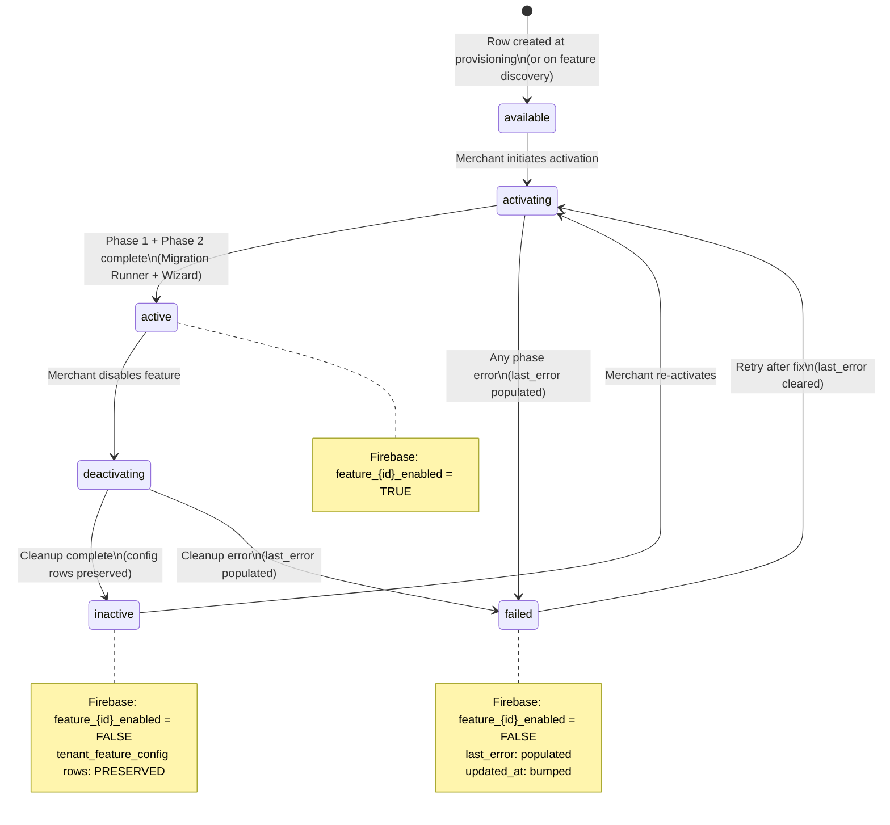

# 06k — Tenant Feature Configuration Schema
# KloudShop Stage 6 — Data Model

> **Artifact:** `06k-tenant-feature-config-schema.md`
> **Stage:** 6 — Data Model
> **Schema target:** `tenant_{tenant_id}` (BASE schema — present from signup)
> **Persona:** Principal Data Engineer
> **Reads from:** `06a1`, `06a2`, `06b` (v2), `06c`, `06d`, `06e`, `06f`, `06g`, `06h`, `06i`, `06j`
> **Cross-schema refs (application-layer only, no DB FK):**
> — `kloudshop_platform.feature_config_schema` → `feature_id`, `config_key`
> — `kloudshop_platform.feature_registry` → `feature_id`
> — `kloudshop_platform.staff_users` → `set_by` / `activated_by` (UUID, app-layer)
> **Tables:** 3 (`tenant_feature_config`, `tenant_migration_state`, `tenant_feature_state`)
> **Migration class:** BASE — created once at tenant provisioning. Never altered by feature migrations.
> **Alembic revision note:** These DDL statements live in the single base migration applied at schema creation. No subsequent Alembic revision may ALTER, DROP, or TRUNCATE any table defined here.

---

## Overview

This artifact defines the three tables that form the **Feature Lifecycle Control Plane** inside every `tenant_{tenant_id}` schema. They are bootstrapped by the **base Alembic migration** at the moment a new merchant signs up — before any feature is activated, before any wizard is run, before any product data exists. This is a deliberate architectural choice: the infrastructure for tracking what features are on, what config the merchant has chosen, and what migrations have been applied must exist *before* any of those things can happen.

Key design decisions documented here:

- **`tenant_feature_config` is BASE, not per-feature.** It is a sparse key-value store. Every feature activation eventually writes rows into it, but the *table itself* is never created by a feature migration. Alembic touches it exactly once — at schema birth.
- **`tenant_migration_state` is the idempotency gate.** The Migration Runner queries this table before applying any Alembic revision. If the revision ID is already present, the migration is skipped. This makes the entire migration system safe to retry, replay, and run in parallel across tenants.
- **`tenant_feature_state` is the single source of truth for feature status.** Firebase Remote Config flags (`feature_{feature_id}_enabled`) are derived from this table on every status change — never independently set.
- **Deactivation is non-destructive.** Setting `tenant_feature_state.status = 'inactive'` never cascades a DELETE to `tenant_feature_config`. Merchant configuration survives deactivation intact and is immediately available upon re-activation.
- **No DB-level foreign keys cross schema boundaries.** All references to `kloudshop_platform.*` tables use plain `VARCHAR` or `UUID` columns validated at the FastAPI application layer. This is a firm architectural constraint across all 06-series artifacts.
- **All primary keys use `gen_random_uuid()`** except `tenant_migration_state`, where the PK is the Alembic revision ID string — a meaningful, externally assigned slug (`VARCHAR(128)`).
- **All timestamps are `TIMESTAMPTZ`.** No `TIMESTAMP WITHOUT TIME ZONE` anywhere in the schema.
- **Separation of concerns is enforced architecturally:** `tenant_migration_state` + Alembic = DB *schema* changes (Migration Runner, Phase 1 of feature activation). `tenant_feature_config` + `kloudshop_platform.feature_config_schema` = application *data* (merchant config choices, FastAPI wizard, Phase 2). These two planes never overlap.
- **`tenant_feature_state.status` is a constrained VARCHAR(20)**, not a PostgreSQL ENUM, to allow adding new statuses via data migration without DDL changes in tenant schemas (which would require a fan-out migration across every tenant).
- **Every index carries a `-- Rationale:` comment** explaining the access pattern it serves. Indexes are intentionally minimal — this is a low-cardinality control-plane table, not a high-throughput data table.

---

## Table: `tenant_feature_config`

This table is the **merchant configuration store** for all features. It is sparse by design: a row exists only when a merchant has explicitly set a value for a given `(feature_id, config_key)` pair during a feature activation wizard (Phase 2) or a subsequent settings update. The schema for what keys are valid and what types they expect lives in `kloudshop_platform.feature_config_schema`. The FastAPI layer casts `config_value TEXT` to the correct type at read time using the `data_type` field from that platform table.

```sql
-- ============================================================
-- TABLE: tenant_feature_config
-- Schema: tenant_{tenant_id}  |  Migration class: BASE
-- ============================================================
-- Purpose:
--   Sparse key-value store of merchant configuration choices
--   per feature. One row per (feature_id, config_key) pair.
--   Created at tenant provisioning — NOT by any per-feature
--   Alembic migration. Alembic never alters this table after
--   the base migration.
--
-- Key business rules:
--   1. config_value is always stored as TEXT. The application
--      layer casts to the correct type using data_type from
--      kloudshop_platform.feature_config_schema.
--   2. Deactivating a feature does NOT delete rows from this
--      table. Config is preserved for re-activation.
--   3. feature_id and config_key reference
--      kloudshop_platform.feature_config_schema via app-layer
--      validation only — no DB FK constraint.
--   4. set_by is a staff_user_id UUID from
--      kloudshop_platform.staff_users — app-layer ref only.
--   5. There is no surrogate PK: (feature_id, config_key) is
--      the natural composite PK and the unit of uniqueness.
-- ============================================================

CREATE TABLE IF NOT EXISTS tenant_feature_config (

    -- ---------------------------------------------------------
    -- Identity
    -- ---------------------------------------------------------

    -- References kloudshop_platform.feature_registry.feature_id
    -- and kloudshop_platform.feature_config_schema.feature_id.
    -- VARCHAR(64) matches the slug width used in platform tables.
    -- App-layer validated — no DB FK.
    feature_id              VARCHAR(64)     NOT NULL,

    -- References kloudshop_platform.feature_config_schema.config_key
    -- for this feature_id. App-layer validated — no DB FK.
    config_key              VARCHAR(128)    NOT NULL,

    -- ---------------------------------------------------------
    -- Value
    -- ---------------------------------------------------------

    -- Always stored as TEXT. Cast to correct type at read time
    -- using kloudshop_platform.feature_config_schema.data_type.
    -- NULL means "not set / use platform default".
    config_value            TEXT            NULL,

    -- ---------------------------------------------------------
    -- Audit
    -- ---------------------------------------------------------

    -- When this config value was last written.
    set_at                  TIMESTAMPTZ     NOT NULL DEFAULT NOW(),

    -- staff_user_id of the actor who wrote this value.
    -- References kloudshop_platform.staff_users — app-layer only.
    -- NULL if set by an automated process (e.g. default seeding).
    set_by                  UUID            NULL,

    -- ---------------------------------------------------------
    -- Constraints
    -- ---------------------------------------------------------

    CONSTRAINT pk_tenant_feature_config
        PRIMARY KEY (feature_id, config_key),

    CONSTRAINT chk_tenant_feature_config_feature_id_not_blank
        CHECK (feature_id <> ''),

    CONSTRAINT chk_tenant_feature_config_config_key_not_blank
        CHECK (config_key <> '')

);

COMMENT ON TABLE tenant_feature_config IS
'Sparse key-value store of merchant config choices per feature.
One row per (feature_id, config_key). Created by the BASE Alembic
migration at tenant provisioning — never altered by per-feature
migrations. config_value is TEXT; cast to correct type at app
layer using kloudshop_platform.feature_config_schema.data_type.
Deactivating a feature does NOT delete rows — config is preserved
for re-activation. feature_id and config_key reference
kloudshop_platform.feature_config_schema via app-layer validation
only (no DB FK constraints cross schema boundaries).';

COMMENT ON COLUMN tenant_feature_config.feature_id IS
'Feature slug. References kloudshop_platform.feature_registry.feature_id.
App-layer validated — no DB FK.';

COMMENT ON COLUMN tenant_feature_config.config_key IS
'Config key slug. References kloudshop_platform.feature_config_schema.config_key
for this feature_id. App-layer validated — no DB FK.';

COMMENT ON COLUMN tenant_feature_config.config_value IS
'Config value stored as TEXT. Cast to correct type at read time using
kloudshop_platform.feature_config_schema.data_type. NULL = not set,
use platform default.';

COMMENT ON COLUMN tenant_feature_config.set_at IS
'Timestamp of the most recent write to this row.';

COMMENT ON COLUMN tenant_feature_config.set_by IS
'staff_user_id of the actor who wrote this value. NULL if set by
an automated process. References kloudshop_platform.staff_users —
app-layer only, no DB FK.';

-- ---------------------------------------------------------
-- Indexes: tenant_feature_config
-- ---------------------------------------------------------

-- Rationale: Primary lookup pattern — retrieve all config rows
-- for a given feature_id (e.g. when re-activating a feature and
-- hydrating the wizard with existing merchant choices). The
-- composite PK already covers (feature_id, config_key) lookups;
-- this partial index on feature_id alone accelerates range scans
-- across all keys for a single feature without a full table scan.
CREATE INDEX IF NOT EXISTS idx_tfc_feature_id
    ON tenant_feature_config (feature_id);

-- Rationale: Audit query pattern — find all config rows written
-- by a specific staff user (compliance, audit trail). Low
-- cardinality on set_by makes a full-table scan acceptable for
-- small tenants, but the index prevents sequential scans as
-- config rows accumulate across many features.
CREATE INDEX IF NOT EXISTS idx_tfc_set_by
    ON tenant_feature_config (set_by)
    WHERE set_by IS NOT NULL;
```

---

## Table: `tenant_migration_state`

This table is the **idempotency gate** for the Migration Runner. Before applying any Alembic revision to this tenant schema, the Migration Runner performs a `SELECT 1 FROM tenant_migration_state WHERE migration_id = $1`. If a row exists, the migration is skipped. This prevents double-application on retry, parallel activation, or any other re-entrant scenario. The `migration_id` is the Alembic revision ID string (e.g. `'a1b2c3d4e5f6'`) — an externally meaningful slug, not a UUID, and therefore the natural PK.

```sql
-- ============================================================
-- TABLE: tenant_migration_state
-- Schema: tenant_{tenant_id}  |  Migration class: BASE
-- ============================================================
-- Purpose:
--   Tracks which Alembic migration revision IDs have been
--   applied to this tenant schema. One row per applied
--   migration. Consulted by the Migration Runner before
--   applying any migration — guarantees idempotency.
--
-- Key business rules:
--   1. migration_id is the Alembic revision ID string
--      (e.g. 'a1b2c3d4e5f6'). VARCHAR(128), not a UUID.
--      This is the PK — externally assigned and meaningful.
--   2. A row is INSERTed by the Migration Runner upon
--      successful completion of a migration. It is NEVER
--      DELETEd or UPDATEd — this table is append-only.
--   3. feature_id links to kloudshop_platform.feature_registry
--      via app-layer only. NULL for base-schema migrations
--      that are not feature-scoped.
--   4. applied_by is a free-text label, not a FK:
--      'system' | 'feature_activation' | 'manual_hotfix'
--      etc. This supports audit without a user-identity
--      constraint on a tooling process.
-- ============================================================

CREATE TABLE IF NOT EXISTS tenant_migration_state (

    -- ---------------------------------------------------------
    -- Identity (meaningful slug PK — not UUID)
    -- ---------------------------------------------------------

    -- Alembic revision ID string. E.g. 'a1b2c3d4e5f6'.
    -- 128 chars to accommodate Alembic's 12-char default IDs
    -- plus any future extended formats or branch suffixes.
    migration_id            VARCHAR(128)    NOT NULL,

    -- ---------------------------------------------------------
    -- Classification
    -- ---------------------------------------------------------

    -- The feature this migration belongs to. NULL for base-schema
    -- migrations. References kloudshop_platform.feature_registry
    -- — app-layer only, no DB FK.
    feature_id              VARCHAR(64)     NULL,

    -- ---------------------------------------------------------
    -- Audit
    -- ---------------------------------------------------------

    -- When the migration was successfully applied.
    applied_at              TIMESTAMPTZ     NOT NULL DEFAULT NOW(),

    -- Who/what triggered the migration application.
    -- Free-text label — not a FK. Expected values:
    --   'system'              — automated base provisioning
    --   'feature_activation'  — Migration Runner during feature on
    --   'feature_deactivation'— Migration Runner during feature off
    --   'manual_hotfix'       — engineer-applied emergency patch
    -- VARCHAR(64) to accommodate future label additions without DDL.
    applied_by              VARCHAR(64)     NOT NULL DEFAULT 'system',

    -- ---------------------------------------------------------
    -- Constraints
    -- ---------------------------------------------------------

    CONSTRAINT pk_tenant_migration_state
        PRIMARY KEY (migration_id),

    CONSTRAINT chk_tms_migration_id_not_blank
        CHECK (migration_id <> ''),

    CONSTRAINT chk_tms_applied_by_not_blank
        CHECK (applied_by <> '')

);

COMMENT ON TABLE tenant_migration_state IS
'Append-only log of Alembic revision IDs applied to this tenant
schema. One row per applied migration. Consulted by the Migration
Runner before applying any revision — guarantees idempotency.
Rows are never deleted or updated. migration_id is the Alembic
revision ID string (VARCHAR(128)), not a UUID. feature_id is NULL
for base-schema migrations not scoped to a specific feature.
applied_by is a free-text process label, not a user FK.';

COMMENT ON COLUMN tenant_migration_state.migration_id IS
'Alembic revision ID string (e.g. ''a1b2c3d4e5f6''). Natural PK —
externally assigned by Alembic. VARCHAR(128) to accommodate
extended formats and branch suffixes.';

COMMENT ON COLUMN tenant_migration_state.feature_id IS
'Feature slug this migration belongs to. NULL for base-schema
migrations. References kloudshop_platform.feature_registry —
app-layer only, no DB FK.';

COMMENT ON COLUMN tenant_migration_state.applied_at IS
'Timestamp at which the migration was successfully applied by
the Migration Runner.';

COMMENT ON COLUMN tenant_migration_state.applied_by IS
'Free-text process label identifying who triggered this migration.
Expected values: ''system'', ''feature_activation'',
''feature_deactivation'', ''manual_hotfix''. Not a FK.';

-- ---------------------------------------------------------
-- Indexes: tenant_migration_state
-- ---------------------------------------------------------

-- Rationale: The primary Migration Runner query pattern is
-- "has migration X been applied?" — answered directly by the PK.
-- This additional index on feature_id supports the secondary
-- pattern: "list all migrations applied for feature Y" —
-- used by the Migration Runner during feature deactivation
-- to identify rollback candidates, and by the admin dashboard
-- to display migration history per feature.
CREATE INDEX IF NOT EXISTS idx_tms_feature_id
    ON tenant_migration_state (feature_id)
    WHERE feature_id IS NOT NULL;

-- Rationale: Operational query pattern — find all migrations
-- applied within a time window (incident postmortem, audit).
-- applied_at is effectively monotonically increasing in normal
-- operation; brin index is cheapest for this range-scan use case.
CREATE INDEX IF NOT EXISTS idx_tms_applied_at_brin
    ON tenant_migration_state USING BRIN (applied_at);
```

---

## Table: `tenant_feature_state`

This table is the **single source of truth** for the activation lifecycle of every feature ever touched by this tenant. One row per `feature_id` — created on first touch (the moment a merchant begins activating a feature), never deleted. The `status` column drives the Firebase Remote Config flag (`feature_{feature_id}_enabled`) on every write: the FastAPI layer is responsible for syncing Firebase after every status transition. The `failed` status is terminal until an explicit re-activation attempt resets it to `activating`.

```sql
-- ============================================================
-- TABLE: tenant_feature_state
-- Schema: tenant_{tenant_id}  |  Migration class: BASE
-- ============================================================
-- Purpose:
--   Current activation state per feature per tenant. One row
--   per feature_id ever touched by this tenant. Drives the
--   Firebase Remote Config flag feature_{feature_id}_enabled
--   on every status change. Never deleted — deactivation sets
--   status = 'inactive', not a DELETE.
--
-- Key business rules:
--   1. feature_id references kloudshop_platform.feature_registry
--      — plain VARCHAR(64), no DB FK.
--   2. status is a VARCHAR(20) CHECK constraint (not ENUM) to
--      allow new statuses via data migration without per-tenant
--      DDL fan-out.
--   3. Valid status transitions (enforced at app layer):
--        [none]        → activating   (first activation attempt)
--        activating    → active       (Phase 1 + Phase 2 complete)
--        activating    → failed       (any phase error)
--        active        → deactivating (merchant disables)
--        deactivating  → inactive     (cleanup complete)
--        deactivating  → failed       (cleanup error)
--        inactive      → activating   (re-activation)
--        failed        → activating   (retry after fix)
--   4. activated_at is NULL until the first time status reaches
--      'active'. Subsequent activations after re-activation do
--      NOT reset it — it records the FIRST activation timestamp.
--   5. Firebase Remote Config flag is synced by FastAPI after
--      every row INSERT or UPDATE. This table is the source;
--      Firebase is the derived copy.
--   6. last_error is populated only when status = 'failed'.
--      It is NULLed on the next activating transition.
-- ============================================================

CREATE TABLE IF NOT EXISTS tenant_feature_state (

    -- ---------------------------------------------------------
    -- Identity
    -- ---------------------------------------------------------

    -- Feature slug. References kloudshop_platform.feature_registry.
    -- VARCHAR(64) PK — one row per feature per tenant, ever.
    -- App-layer validated — no DB FK.
    feature_id              VARCHAR(64)     NOT NULL,

    -- ---------------------------------------------------------
    -- Status
    -- ---------------------------------------------------------

    -- Current lifecycle status. VARCHAR(20) + CHECK (not ENUM)
    -- to allow new statuses without per-tenant DDL fan-out.
    -- Valid values: 'available' | 'activating' | 'active' |
    --               'deactivating' | 'inactive' | 'failed'
    -- 'available' = feature exists in platform registry but has
    -- never been touched by this tenant (row created on discovery).
    status                  VARCHAR(20)     NOT NULL DEFAULT 'available',

    -- ---------------------------------------------------------
    -- Activation audit
    -- ---------------------------------------------------------

    -- Timestamp of the FIRST time status reached 'active'.
    -- NULL until first successful activation.
    -- NOT reset on subsequent re-activations — records first
    -- activation only. See activated_at_last for latest.
    activated_at            TIMESTAMPTZ     NULL,

    -- staff_user_id who triggered the FIRST activation.
    -- References kloudshop_platform.staff_users — app-layer only.
    -- NULL until first activation completes.
    activated_by            UUID            NULL,

    -- ---------------------------------------------------------
    -- Deactivation audit
    -- ---------------------------------------------------------

    -- Timestamp of the most recent deactivation completion
    -- (status reached 'inactive'). NULL if never deactivated.
    deactivated_at          TIMESTAMPTZ     NULL,

    -- ---------------------------------------------------------
    -- Error tracking
    -- ---------------------------------------------------------

    -- Populated only when status = 'failed'. Contains the
    -- error message / stack trace excerpt from the Migration
    -- Runner or wizard. NULLed when status transitions to
    -- 'activating' on retry. Max length 4096 to avoid
    -- unbounded storage from verbose stack traces.
    last_error              TEXT            NULL,

    -- ---------------------------------------------------------
    -- Metadata
    -- ---------------------------------------------------------

    -- Last time this row was written (INSERT or UPDATE).
    -- Used by Firebase sync to detect stale flags.
    updated_at              TIMESTAMPTZ     NOT NULL DEFAULT NOW(),

    -- ---------------------------------------------------------
    -- Constraints
    -- ---------------------------------------------------------

    CONSTRAINT pk_tenant_feature_state
        PRIMARY KEY (feature_id),

    CONSTRAINT chk_tfs_feature_id_not_blank
        CHECK (feature_id <> ''),

    CONSTRAINT chk_tfs_status_valid
        CHECK (status IN (
            'available',
            'activating',
            'active',
            'deactivating',
            'inactive',
            'failed'
        )),

    -- activated_at and activated_by must either both be set
    -- or both be NULL — they are co-dependent.
    CONSTRAINT chk_tfs_activation_fields_consistent
        CHECK (
            (activated_at IS NULL AND activated_by IS NULL) OR
            (activated_at IS NOT NULL AND activated_by IS NOT NULL)
        ),

    -- last_error should only be populated in 'failed' status.
    -- Soft constraint — enforced at app layer; this CHECK prevents
    -- stale error text lingering in non-failed rows.
    CONSTRAINT chk_tfs_last_error_only_on_failed
        CHECK (
            last_error IS NULL OR status = 'failed'
        )

);

COMMENT ON TABLE tenant_feature_state IS
'Single source of truth for feature activation lifecycle per tenant.
One row per feature_id ever touched. Drives Firebase Remote Config
flag feature_{feature_id}_enabled on every status change (synced
by FastAPI after every write). Never deleted — deactivation sets
status = ''inactive''. feature_id references
kloudshop_platform.feature_registry via app-layer validation only
(no DB FK). status is VARCHAR(20) CHECK (not ENUM) to avoid
per-tenant DDL fan-out when new statuses are added. activated_at
records first activation only and is not reset on re-activation.
last_error is populated only when status = ''failed'' and is
NULLed on the next activating transition.';

COMMENT ON COLUMN tenant_feature_state.feature_id IS
'Feature slug. References kloudshop_platform.feature_registry.
One row per feature per tenant, ever. App-layer validated —
no DB FK.';

COMMENT ON COLUMN tenant_feature_state.status IS
'Current lifecycle status. Valid values: available | activating |
active | deactivating | inactive | failed. VARCHAR(20) + CHECK
(not ENUM) — allows new statuses via data migration without
per-tenant DDL fan-out.';

COMMENT ON COLUMN tenant_feature_state.activated_at IS
'Timestamp of FIRST successful activation (status reached ''active'').
NULL until first activation. NOT reset on re-activation.';

COMMENT ON COLUMN tenant_feature_state.activated_by IS
'staff_user_id of the actor who triggered the FIRST activation.
References kloudshop_platform.staff_users — app-layer only,
no DB FK. NULL until first activation completes.';

COMMENT ON COLUMN tenant_feature_state.deactivated_at IS
'Timestamp of the most recent deactivation completion (status
reached ''inactive''). NULL if never deactivated.';

COMMENT ON COLUMN tenant_feature_state.last_error IS
'Error message from the Migration Runner or wizard when
status = ''failed''. NULLed on the next activating transition.
Max useful length ~4096 chars; store excerpt if longer.';

COMMENT ON COLUMN tenant_feature_state.updated_at IS
'Timestamp of the most recent INSERT or UPDATE to this row.
Used by the Firebase sync process to detect stale Remote
Config flags.';

-- ---------------------------------------------------------
-- Indexes: tenant_feature_state
-- ---------------------------------------------------------

-- Rationale: Admin dashboard query — "show all features in
-- a given status for this tenant" (e.g. filter to 'failed'
-- to surface incidents, or 'active' to show the merchant's
-- enabled feature list). Single-column index on status;
-- cardinality is low (6 values) but filter patterns are
-- frequent and the PK (feature_id) does not help here.
CREATE INDEX IF NOT EXISTS idx_tfs_status
    ON tenant_feature_state (status);

-- Rationale: Operational query — "find all features activated
-- in the last N days" (onboarding analytics, cohort analysis).
-- Partial index excludes rows where activated_at is NULL
-- (features never activated), keeping the index compact.
CREATE INDEX IF NOT EXISTS idx_tfs_activated_at
    ON tenant_feature_state (activated_at)
    WHERE activated_at IS NOT NULL;

-- Rationale: Firebase sync recovery query — "find all rows
-- updated after timestamp T" to detect and re-sync any flags
-- that may have drifted (e.g. after a Firebase outage).
-- updated_at is set on every write; this index serves the
-- reconciliation job run by the platform ops team.
CREATE INDEX IF NOT EXISTS idx_tfs_updated_at
    ON tenant_feature_state (updated_at);
```

---

## Seed Data

The base Alembic migration that creates these tables also inserts the single founding row into `tenant_migration_state` — recording its own revision ID as the first applied migration. No seed rows are inserted into `tenant_feature_config` or `tenant_feature_state` at provisioning time; both tables start empty and are populated by feature activation flows.

```sql
-- ============================================================
-- SEED: tenant_migration_state
-- Applied by the base Alembic migration itself upon completion.
-- migration_id is the Alembic revision ID of the base migration.
-- Replace 'BASE_REVISION_ID' with the actual Alembic revision
-- string assigned when the base migration is generated.
-- ============================================================

INSERT INTO tenant_migration_state (
    migration_id,
    feature_id,
    applied_at,
    applied_by
) VALUES (
    'BASE_REVISION_ID',   -- Replace with actual Alembic revision ID
                          -- e.g. 'a1b2c3d4e5f6'
    NULL,                 -- Base migration is not feature-scoped
    NOW(),
    'system'
) ON CONFLICT (migration_id) DO NOTHING;

-- ============================================================
-- NO SEED for tenant_feature_config
-- Table starts empty. Rows are written by FastAPI during
-- feature activation wizard (Phase 2). The Migration Runner
-- never writes to this table.
-- ============================================================

-- ============================================================
-- NO SEED for tenant_feature_state
-- Table starts empty. The first row per feature_id is
-- INSERTed by FastAPI when a merchant initiates activation
-- (status = 'activating'). The platform may optionally
-- pre-populate rows with status = 'available' for all
-- features in kloudshop_platform.feature_registry at
-- tenant provisioning — this is an application-layer
-- decision, not a DDL seed.
-- ============================================================
```

---

## State Machine Reference

The following state machine defines the valid `status` transitions for `tenant_feature_state`. Transitions are enforced at the FastAPI application layer; the CHECK constraint enforces only the set of valid status values.



---

## Separation of Concerns Summary

| Concern | Table(s) | Phase | Actor |
|---|---|---|---|
| DB schema changes (DDL) | `tenant_migration_state` + Alembic | Phase 1 of activation | Migration Runner |
| Merchant config choices (data) | `tenant_feature_config` | Phase 2 of activation | FastAPI wizard |
| Feature lifecycle status | `tenant_feature_state` | Both phases + deactivation | FastAPI + Migration Runner |
| Platform feature catalogue | `kloudshop_platform.feature_registry` | Read-only at activation | App layer |
| Config key schema + types | `kloudshop_platform.feature_config_schema` | Read-only at wizard | App layer |
| Firebase Remote Config flags | Derived from `tenant_feature_state.status` | On every status change | FastAPI sync |

These concerns **never overlap**: the Migration Runner never writes to `tenant_feature_config`; the FastAPI wizard never writes to `tenant_migration_state`; neither writes to the platform schema.

---

## Updated Schema Inventory Entry

Replace the `06k` line in `06-schema-inventory.md` with:

```
| `06k` | `tenant_{tenant_id}` | BASE | `tenant_feature_config` · `tenant_migration_state` · `tenant_feature_state` | Feature lifecycle control plane. Sparse KV config store (config preserved across deactivation). Migration idempotency gate (Alembic revision ID PK). Activation state machine (6 statuses, drives Firebase Remote Config sync). All BASE — present from signup, never altered by feature migrations. Cross-schema refs to `kloudshop_platform.feature_registry` and `.feature_config_schema` are app-layer only. |
```
