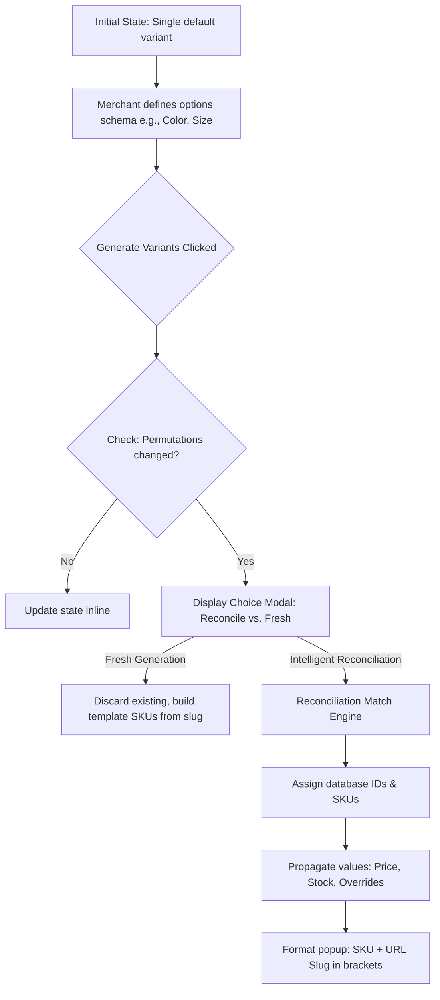
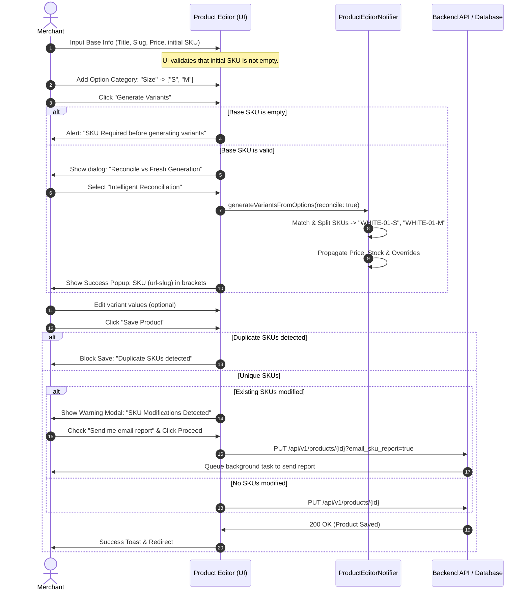

# Product Variations Logic Specification

This document details the variant generation and reconciliation logic, manual verification test cases, deep-dive edge cases, and the concrete, water-tight user flows proposed for the KloudShop Catalog system.

---

## 1. Core Architecture Overview

The variant system generates specific product inventory items (variants) from a set of abstract attributes (options) like `Color` and `Size`. 



### 1.1 Generation Pipeline
1. **Initial Single Variant State**: Initially, the product contains exactly one variant (the default variant) with no options. This variant holds the base pricing, initial stock, and shipping specs.
2. **Options Definition**: The merchant defines options in the `options_schema` (a list of objects containing `name` and a list of `values`).
3. **Cartesian Product**: The combinations are computed as the Cartesian product of all option values.
4. **Reconciliation vs. Fresh Generation Gate**: If the generated permutations differ from the current variants list, the system prompts the user to select a reconciliation mode.
5. **Intelligent Reconciliation Match Engine**:
   - **Intersection Keys**: Determines overlap between each new permutation and existing variants.
   - **Perfect Match**: When the option values match exactly. Preserves the database `variant_id` and the existing SKU.
   - **Partial Match (Splits/Additions)**: When a subset of keys matches. 
     - *Value Propagation*: Inherits price, compare-at price, stock, images, and shipping overrides from the parent/older variant.
     - *SKU Suffixing*: Appends the new option values as uppercase suffixes to the parent variant's SKU (e.g. `WHITE-01` -> `WHITE-01-S`).
     - *Database ID Preservation*: Only **one** of the split permutations retains the database `variant_id` to prevent primary key corruption. The other split permutations receive `null` so they are created as new rows on save.
   - **No Match / Fallback**: Unmatched permutations inherit their defaults (pricing, compare-at price, stock, shipping specs) from the product's primary/default variant instead of resetting to `$0.00`.
6. **Completion Dialog**: Shows the successfully generated variants in the format `SKU (url-slug)` in brackets.

### 1.2 No-Options Base Variant Behavior

When a product is created or edited without option categories (a simple product), it relies on a single **No-Options Base Variant**:

* **Option Structure Immutability**: The variant's `option_values` mapping is strictly empty `{}` and immutable.
* **Auto-generated Default SKU**: Upon product creation, the default base SKU is automatically generated using a normalized version of the product title/slug.
* **SKU Overwrite Capability**: The merchant retains full control to edit or overwrite this auto-generated default SKU with their own custom warehouse SKU.
* **Storefront & Checkout Visibility**: Any placeholder option names/values (e.g. "Default", "Base") are strictly hidden from storefront product listings, cart items, and checkout views.
* **Transition (Adding Options)**:
  * When options/variants are generated for the first time, the base variant **silently disappears from the active list/queue** and is marked deactivated in the database (retaining its historical ID, SKU, price, and stock).
  * Its SKU serves as the template prefix for the new variants (e.g., base SKU `WHITE-01` templates generated variants `WHITE-01-S` and `WHITE-01-M`).
  * Entirely new variants (derived from option permutations) are generated fresh with `variant_id = null` to prevent primary key and order schema corruption.

---

## 2. Expected Behavior & Manual Verification Test Cases

### 2.1 Test Case A: Adding Options to a Single Pre-existing Product
* **Initial Setup**:
  - Product title: `Awesome Tee`, slug: `awesome-tee`
  - 1 default variant with SKU `WHITE-01`, price `$199.99`, stock `50`, and weight `0.5 kg` (shipping overrides active).
  - Add option category `Size` with values `S` and `M`.
* **Action**: Click "Generate Variants" and select **Intelligent Reconciliation**.
* **Expected Result**:
  - Two variants generated:
    1. `Pure white / S` with SKU `WHITE-01-S`, price `$199.99`, stock `50`, weight `0.5 kg` (shipping overrides active), and `variant_id = null`.
    2. `Pure white / M` with SKU `WHITE-01-M`, price `$199.99`, stock `50`, weight `0.5 kg` (shipping overrides active), and `variant_id = null`.
  - The original base variant is marked `is_active = false` (retaining its original SKU `WHITE-01`, price, and stock in the database).
  - The completion popup shows:
    - `WHITE-01-S (awesome-tee-pure-white-s)`
    - `WHITE-01-M (awesome-tee-pure-white-m)`

### 2.2 Test Case B: Adding Values to an Existing Option
* **Initial Setup**:
  - Options schema: `Color` with values `Pure white` ($4.99, SKU: `tee-shirt-WHITE`), `Jet black` ($9.99, SKU: `tee-shirt-BLACK`).
  - Add `Turquoise` to `Color` values list.
* **Action**: Click "Generate Variants" and select **Intelligent Reconciliation**.
* **Expected Result**:
  - Three variants generated:
    1. `Pure white` with SKU `tee-shirt-WHITE` (retains old ID, price, stock).
    2. `Jet black` with SKU `tee-shirt-BLACK` (retains old ID, price, stock).
    3. `Turquoise` with SKU `COTON-TEE-SHIRT-TURQUOISE` (fallback/default SKU derived from product slug), inheriting price/stock/overrides from the default old variant (e.g. `Pure white` ($4.99)).
  - The completion popup shows:
    - `tee-shirt-WHITE (awesome-tee-pure-white)`
    - `tee-shirt-BLACK (awesome-tee-jet-black)`
    - `COTTON-TEE-SHIRT-TURQUOISE (awesome-tee-turquoise)`

### 2.3 Test Case C: Deleting Option Values / Categories
* **Initial Setup**:
  - Options schema: `Color` (`Pure white`, `Jet black`), `Size` (`S`, `M`).
  - Delete `Size` option category completely.
* **Action**: Click "Generate Variants" and select **Intelligent Reconciliation**.
* **Expected Result**:
  - Permutations reduce to 2: `Pure white`, `Jet black`.
  - Matched variants:
    - `Pure white` merges `Pure white / S` and `Pure white / M`. It matches `Pure white / S` (as it was the default or first match), inherits its SKU `WHITE-01-S` (or its custom base SKU), price, stock, and keeps the database ID.
    - `Jet black` matches `Jet black / S` (first match), inherits its SKU, price, stock, and keeps database ID.
    - Orphaned variants (e.g., `M` size database records) are marked for deletion by the backend PUT logic.

---

## 3. Edge Cases Brainstorming

To make the variant variations logic completely watertight, the following edge cases must be handled:

| Edge Case ID | Edge Case Scenario | Impact | Proposed Watertight Solution / Flow |
| :--- | :--- | :--- | :--- |
| **EC-01** | **Renaming an Option Category** (e.g. `Color` -> `Colours`) | Intersection match keys fail because the key name changed, causing the system to treat the option category as brand new, resulting in a loss of matching logic. | **Rename Tracking**: Keep a hidden unique identifier (UUID) for each option category, or map them by index/position if the name changes but the number of categories remains identical. |
| **EC-02** | **Duplicate Option Values** in same category (e.g. `["S", "S"]`) | Cartesian engine generates duplicate permutations, leading to list rendering key collisions. | **Schema Sanitization**: Enforce unique values via validation on the `Add Value` input field and remove duplicates during schema serialization. |
| **EC-03** | **Deactivating the Only Variant** | Product has no active variants. Consumers cannot purchase the product, and DB constraints might fail. | **Toggle Prevention**: Disable the deactivation toggle if `totalCount == 1`. |
| **EC-04** | **Unconfigured SKU on Sole Variant** | Cartesian generation suffixing fails because there is no base SKU to append suffixes to. | **Generation Block Gate**: Block "Generate Variants" and show a validation alert dialog asking the user to define a SKU for the base variant. |
| **EC-05** | **SKU Collisions / Duplicates** (e.g. user manually edits two variant SKUs to be identical) | DB integrity error (Unique constraint violation on SKUs). | **Inline & Save-time Validation**: Check for duplicate SKUs on the client-side. Highlight duplicate text fields in red and block saving until resolved. |
| **EC-06** | **Case-Insensitive Option Changes** (e.g. changing `pure white` to `Pure White`) | Match keys might fail if the intersection comparison is strictly case-sensitive. | **Normalized Keys**: Perform intersection comparisons and matching string normalization (e.g. `trim().toLowerCase()`). |
| **EC-07** | **Default Variant Deletion/Deactivation** | If the variant marked `is_default = true` is deactivated or deleted, the product lacks a default landing variant. | **Auto-Promotion**: When a default variant is deactivated, automatically promote the first available active variant to default. |
| **EC-08** | **Background Email Task Failures** | If the SMTP server or email API fails to deliver the SKU modification report, the PUT request crashes. | **Fault-Tolerant Background Tasks**: Wrap the email sending service inside a `try-except` block in the celery/background task. Log failures without raising exceptions back to the HTTP router. |
| **EC-09** | **Digital Assets Synchronization** | Reconciled variants may lose their distinct `digital_asset_url` mappings if value propagation is incomplete. | **Full Scheme Copy**: Include `digital_asset_url`, `download_limit`, and `download_expiry_hours` in the matching propagation fields list. |
| **EC-10** | **Locale-Specific Decimal Formats** | Pricing inputs with commas (e.g., `4,99` vs `4.99`) cause parse failures. | **Regex Number Cleansing**: Clean string inputs by replacing commas with periods prior to numeric conversion. |
| **EC-11** | **Option Deletion Transition to Single-Variant** (deleting all option categories, leaving 1 active variant) | Stale option mappings (`option_values`) remain on the single variant. Since the "Generate Variants" button is hidden when options are empty, the variant cannot be regenerated to clear the stale values. | **Auto-Collapse & Option Values Purge**: When the options schema becomes empty, automatically collapse the variants list to a single item (the active/default variant) and clear its `option_values` to `{}`. On saving, ensure any remaining option keys are stripped if the options schema is empty. |
| **EC-12** | **Accidental Option Deletion & Multi-Variant Data Loss** | Merchant accidentally deletes all option categories in the UI, instantly discarding the unique pricing, stock, and overrides of all variants in memory. | **Deconstructive Warning Confirmation**: Show a blocking confirmation dialog if multiple variants are configured when deleting the final option category. Require explicit confirmation before collapsing variants state to a single base variant. |
| **EC-13** | **Historical Base Variant Reactivation & DB Bloat** | A product starts as simple (base variant ID 101), transitions to options (base is deactivated, new variants created), and transitions back to simple. If a new base variant is created, it bloats DB and breaks order line history. | **Base Variant Recycling**: When collapsing back to a simple product, query and reactivate the previously retired base variant ID (if it exists) rather than creating a new database record. Overwrite its pricing/stock/overrides with the values of the last active default option variant. |
| **EC-14** | **Stock Reconciliation on Collapse** | Transitioning from multiple variants (e.g. S: 10, M: 15, L: 5 stock) to a single base variant. | **Smart Inventory Summation**: Default to summing the stock values of all active variable variants (e.g., 10 + 15 + 5 = 30) rather than just copying the default variant's stock, avoiding physical inventory discrepancies in warehouse counts. |

---

## 4. Proposed Watertight User Flow

To guide the user through variant setup with zero friction and maximum safety, the following flow is recommended:



### 4.1 Key Implementation Recommendations
1. **Renaming Categories Safe-Guards**: In the database schema, represent `options_schema` with unique IDs per category. The matching logic should map categories by these IDs rather than category names.
2. **Strict Client-Side Validator**: Add a validation rule at step 3 of the product editor:
   ```dart
   bool validateUniqueSkus(List<Map<String, dynamic>> variants) {
     final skus = variants.map((v) => (v['sku'] as String? ?? '').trim()).toList();
     return skus.length == skus.toSet().length;
   }
   ```
3. **Draft vs Active State Divergence**: For draft products, disable the SKU warning dialog entirely during saves. Warnings should only trigger if the product is `active`, as only active products have external index/marketing presence.

---

## 5. Optimized Workflow/User Journey

To streamline merchant productivity when managing catalog catalogs with high numbers of variants (e.g. 20+ items), the following optimized workflow and user journey is recommended:

### 5.1 Keyboard-Driven Navigation & Speed Run
* **Horizontal Traversal**: Pressing `Tab` should navigate left-to-right across inputs: `SKU` → `Price` → `Compare At` → `Initial Stock` → `Weight` → `Active Toggle`.
* **Vertical/Section Jump**: Pressing `Shift + Tab` moves focus back.
* **Instant Option Insertion**: In the Option Category Editor, typing a value and pressing `Enter` instantly registers the option value tag and keeps the focus inside the `Add Value` input box, allowing rapid typing (e.g. `S` → `Enter` → `M` → `Enter` → `L` → `Enter`).
* **Grid Arrow Keys**: Arrow keys allow quick cell-to-cell traversal when rendering variant fields inside a grid-style layout.

### 5.2 Bulk Actions & Management Bar
When a product has more than 5 variants, a floating bulk management bar is displayed:
* **Bulk Price Updater**: Enter a price and apply it to all selected or active variants instantly.
* **Bulk Stock Adjuster**: Increase, decrease, or set inventory levels globally.
* **Toggle Active States**: Select all variants belonging to a specific option value (e.g., all "Jet black" variants) and deactivate or activate them in bulk.
* **Smart Selectors**: One-click select of all matched splits, new variants, or out-of-stock variants.

### 5.3 Clear Visual Indicators for Reconciliation Changes
During reconciliation, before the merchant saves the changes, the variants section lists items with clear color-coded statuses:
* <span style="color: #10B981; font-weight: bold;">[Reconciled]</span> (Green border/badge): Variant matched an existing ID and SKU; pricing, stock, and overrides were preserved.
* <span style="color: #F59E0B; font-weight: bold;">[Matched Split]</span> (Amber border/badge): Variant is a new permutation resulting from an options split (e.g. `WHITE-01-M`). Shows which base SKU it inherited from.
* <span style="color: #3B82F6; font-weight: bold;">[New Variant]</span> (Blue border/badge): Completely new option combination that had no previous matches. Inherited base pricing from the primary default variant.
* <span style="color: #EF4444; font-weight: bold;">[To Be Deleted]</span> (Red strike-through/badge): Existing variants that no longer belong to the option schema and will be purged on save.

### 5.4 Automatic SKU Templating
* Provide a **SKU Schema Generator** link next to the "Generate Variants" button.
* Merchants can define a naming convention (e.g. `[BRAND]-[PRODUCT_SLUG]-[COLOR_SHORT]-[SIZE]`).
* When generating variants, the system parses the schema and generates clean, customized SKUs automatically, reducing the need for manual SKU overrides later.

### 5.5 Real-Time Conflict Resolution & Guard Rails
* **Live SKU Collision Warning**: As the merchant types inside an SKU text field, the system performs a live uniqueness check across all variants. If a duplicate is entered, a subtle warning text is displayed underneath the field, and the "Save" button is disabled.
* **Empty SKU Check**: If the sole parent variant has no SKU configured, the "Generate Variants" button remains disabled with a tooltip indicating "Please define a SKU for the base variant first."
* **Single Active Variant Lock**: To prevent products from going completely out of stock/inactive, the deactivation toggle is disabled for products containing only a single variant.

### 5.6 External Campaign Link Safeguards & Warnings
* **Divergent State Safeguards**: For active products (which may be indexed in Google Merchant Center, Meta Catalog, or email campaigns), changing the SKU or slug of a variant prompts a warning modal: "SKU Modifications Detected."
* **Report Opt-In**: The warning modal offers an opt-in checkbox: *"I understand, send me a report with the old and new SKUs and URL slugs in my email, and I will update my campaigns."*
* **Draft Auto-Bypass**: For draft products, this warning step is automatically bypassed to allow frictionless setup.

---

## 6. Variant Deactivation & Collapse Report Specification

When a variable product transitions back to a simple product (by deleting all option categories or values), the system automatically collapses the configuration back into the reactivated **No-Options Base Variant** (keeping the default base variant clean and structurally immutable). 

To ensure the merchant doesn't lose historical records of their custom variant prices, compare-at rates, stock levels, and SKUs, the system generates a **Collapse Variant Report**.

### 6.1 Report Trigger & Delivery
* **Trigger**: The report is generated automatically upon saving a product transition from `Variable` to `Simple` (empty options schema).
* **Delivery**: Dispatched via a background celery/SMTP worker task directly to the merchant's registered email address. **This email dispatch is completely mandatory, with no opt-out checkbox presented in the user interface.**

### 6.2 Data Schema of the Report
The generated email report must contain:
1. **Product Summary**:
   * Parent Product Title, Slug, and ID.
   * Total active variants prior to collapse.
2. **Deactivated Variants Archive**:
   * A table listing every variable variant that was deactivated during the transition:
     * **SKU**: The custom SKU of the variant.
     * **Options Mapping**: e.g., `Size: S / Color: Red`.
     * **Price**: The last set price before deletion.
     * **Compare-At Price**: The last compare-at price.
     * **Stock Level**: The final inventory count prior to collapse.
     * **Shipping Override Specs**: Weight and dimensions if configured.
3. **Reactivated Base Variant Summary**:
   * The SKU, Price, and summed Stock of the restored, single base variant.

