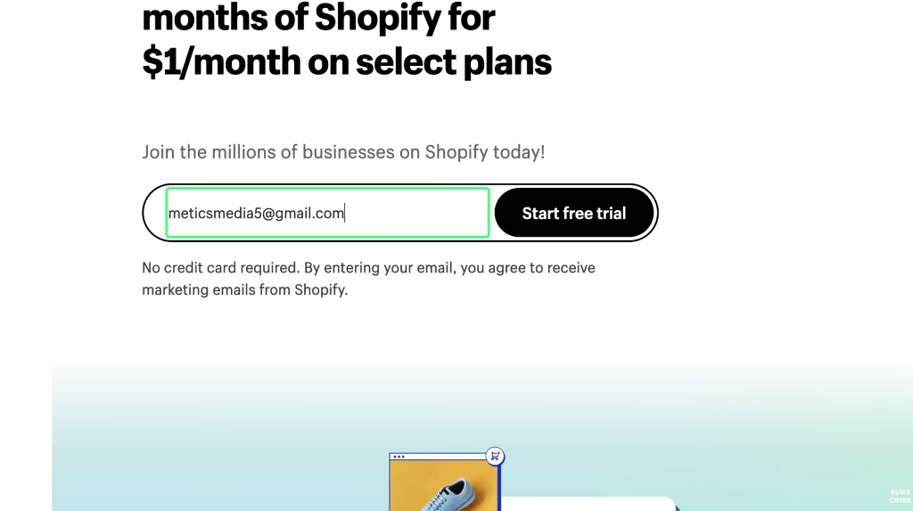
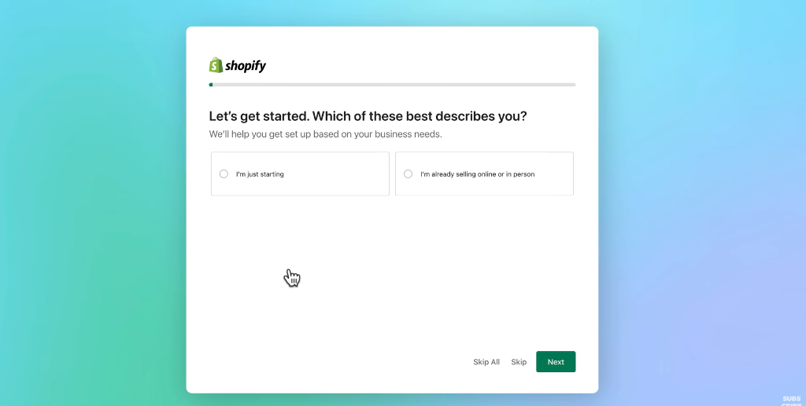
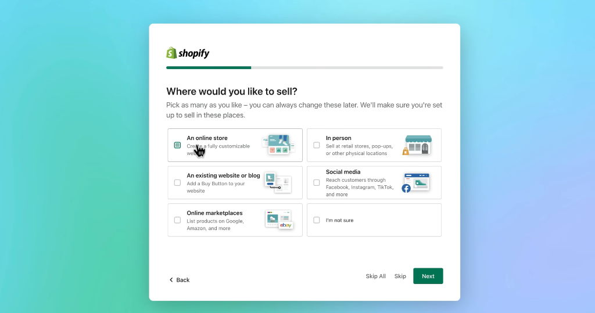
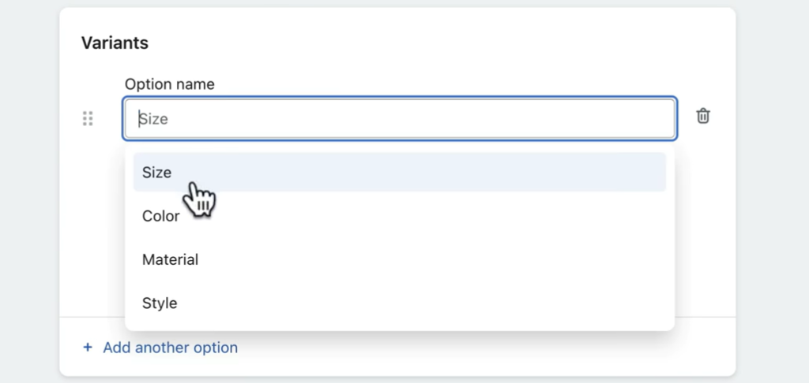
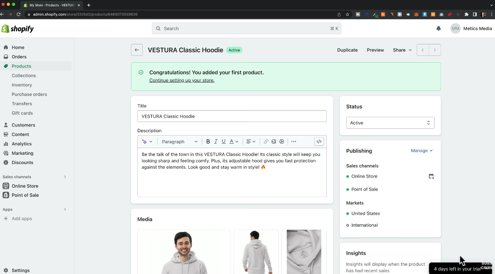
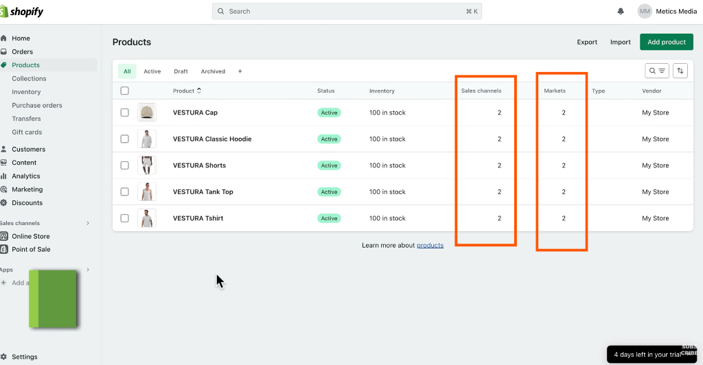

# Shopify Onboarding UX — Inspiration Reference

> **Purpose**: These screenshots are saved for reference and future inspiration only. They are **not** directly part of the Shopify theme customization analysis. They capture Shopify's merchant onboarding journey immediately after signup, which may inform KloudShop's own onboarding experience design at a later stage.
>
> **Source**: Screenshots from a Shopify free trial signup flow (video walkthrough).
> **Filed by**: Observation session, June 2026.
> **Related file**: `../shopify-theme-customization/shopify-theme-customization-analysis.md`

---

## Screen 1: Signup / Free Trial Landing Page

**Stage**: Pre-signup — the merchant hasn't created an account yet.



### What's on screen
- **Headline**: "3 months of Shopify for $1/month on select plans" — a promotional offer prominently anchored at the top.
- **Sub-headline**: "Join the millions of businesses on Shopify today!" — social proof through scale.
- **Single-field form**: Email address input + a pill-shaped **"Start free trial"** CTA button — all in one inline row.
- **Trust reducer**: "No credit card required." in small text directly below the form. Plus fine print about marketing email consent.

### Design patterns worth noting for KloudShop
| Pattern | Shopify implementation | Potential KloudShop application |
| :--- | :--- | :--- |
| **Minimal friction signup** | Single email field only — no name, phone, or password at this step. | KloudShop's merchant signup should be equally minimal. Collect only what's needed to create the trial account. |
| **No credit card required** | Stated explicitly and prominently below the CTA. | If KloudShop has a free trial, make this equally prominent — it's a major conversion lever. |
| **Promotional hook as headline** | Pricing offer (not a feature list) is the first thing seen. | Consider whether KloudShop's landing page leads with value/offer or with features. |
| **Pill-shaped CTA button** | The "Start free trial" button is a rounded pill — softer, more inviting than a square button. | Worth adopting in KloudShop's sign-up UI. |

---

## Screen 2: Onboarding Step 1 — Business Stage Qualifier

**Stage**: Immediately after email entry — first question before the store is created.



### What's on screen
- **Progress bar**: A thin line at the top — partially filled (step 1 of N). Gives the merchant a sense of how much is left.
- **Question**: "Let's get started. Which of these best describes you?"
- **Sub-copy**: "We'll help you get set up based on your business needs." — explains *why* the question is being asked.
- **2 radio options** (large card tiles):
  - "I'm just starting"
  - "I'm already selling online or in person"
- **Navigation**: `Skip All` | `Skip` | `Next` (green primary button) — merchant can always escape the flow.

### Design patterns worth noting
| Pattern | Shopify implementation | Potential KloudShop application |
| :--- | :--- | :--- |
| **Segmentation at onboarding** | First question determines which onboarding path the merchant sees — personalised setup experience. | KloudShop could ask the same question. A "just starting" merchant needs a different first experience than an existing business migrating. |
| **Progress bar** | Thin, subtle — just enough to show progression without feeling like a task list. | If KloudShop has a multi-step onboarding, a progress indicator reduces drop-off anxiety. |
| **Why we're asking** | "We'll help you get set up based on your business needs." — the sub-copy justifies the question. | Never ask questions without explaining why. Trust is built by transparency. |
| **Large card tiles as radio buttons** | The two options are full-width cards, not small radio dots — much easier to read and tap (especially on mobile). | Prefer card-tile selection over small radio buttons for any onboarding question. |
| **Skip / Skip All escape hatches** | Three levels of escape: skip this question, skip all questions, or just go Next. | Mandatory onboarding that can't be skipped has higher abandonment. Always allow escape. |
| **Card layout on teal/purple gradient** | The modal floats on a calm gradient background — focused, not distracting. | A full-screen overlay / modal for onboarding (not an inline page flow) keeps focus on the setup task. |

---

## Screen 3: Onboarding Step 2 — Selling Channels

**Stage**: After answering the business stage question.



### What's on screen
- **Progress bar**: Advanced further (roughly 40% filled).
- **Question**: "Where would you like to sell?"
- **Sub-copy**: "Pick as many as you like – you can always change these later. We'll make sure you're set up to sell in these places."
- **6 tile options** (multi-select checkboxes):
  - ✅ **An online store** — "Create a fully customisable website"
  - **In person** — "Sell at retail stores, pop-ups, or other physical locations"
  - **An existing website or blog** — "Add a Buy Button to your website"
  - **Social media** — "Reach customers through Facebook, Instagram, TikTok, and more"
  - **Online marketplaces** — "List products on Google, Amazon, and more"
  - **I'm not sure**
- **Navigation**: `← Back` | `Skip All` | `Skip` | `Next`

### Design patterns worth noting
| Pattern | Shopify implementation | Potential KloudShop application |
| :--- | :--- | :--- |
| **Multi-select tile grid** | 2×3 grid of large illustrated tiles — checkbox-style (pick many). | Useful for any question with multiple valid answers. Much clearer than a multi-select dropdown. |
| **Illustrated tiles** | Each tile has a small illustration (shopping bag, building, laptop, Facebook icon, eBay logo) — makes options instantly scannable. | Illustrations/icons on tiles dramatically reduce cognitive load vs. text-only options. |
| **"I'm not sure" as a valid option** | Included as a tile — reduces abandonment for uncertain merchants. | Always include an escape/unsure option in categorisation questions. |
| **Permissive language** | "Pick as many as you like – you can always change these later." — reduces commitment anxiety. | Use reassuring language around any choice that feels permanent. |
| **Back button** | The flow is reversible — merchant can go back to the previous step. | Onboarding flows must always be reversible. Never trap the merchant. |
| **Channel strategy reveals scope** | The 6 channels reveal Shopify's full product scope (POS, social commerce, marketplaces, buy buttons). | For KloudShop: which channels will we support? This question would only include: Online Store (always), and possibly future channels. Be honest about current scope. |

---

## Summary: KloudShop Onboarding Takeaways

These three screens, taken together, reveal a coherent onboarding philosophy:

1. **Minimal friction entry** — one field to start, no payment required.
2. **Personalise from the start** — segment the merchant on step 1, tailor the experience.
3. **Progressive disclosure** — don't dump all questions at once; one focused question per screen.
4. **Always escapable** — Skip / Skip All / Back at every step.
5. **Illustrated tile selections** — visual choices over text lists.
6. **Reassure throughout** — "you can always change these later" removes commitment anxiety.

> **Note for KloudShop's future onboarding design**: KloudShop's differentiated features (unlimited variants, custom shipping per variant, B2B buyer portal) are more specialised than Shopify's general-purpose platform. Our onboarding question set should reflect this — e.g., "Do you sell products with complex variants or custom shipping requirements?" could be a meaningful segmentation question that Shopify never asks.

---

## Screen 4: Shopify's Variant Options — The Limitation KloudShop Doesn't Have

**Purpose**: Saved as a **competitor contrast reference** for use in KloudShop's onboarding messaging.



### What this screen shows
The "Variants" section on Shopify's Add Product screen. When a merchant clicks the "Option name" field to add a variant, a dropdown appears with **4 preset suggestions**:
- Size
- Color
- Material
- Style

### ⚠️ Important clarification — Shopify's actual variant limits

The 4 suggestions in the dropdown are just *hints*, not hard limits on names. However, Shopify has **strict structural limits** that matter far more:

| Shopify limit | Value | What it means |
| :--- | :--- | :--- |
| **Max variant option types per product** | **3** | A product can only have 3 attribute dimensions (e.g. Size + Color + Material — you can't add a 4th like "Style") |
| **Max variant combinations (SKUs) per product** | **100** | 5 sizes × 5 colors × 4 materials = 100 combinations — hitting the ceiling. Anything more and the merchant must split into separate products or use a paid app. |
| **Custom shipping per variant** | ❌ Not natively supported | Shopify uses weight/dimensions at the product level, not per-variant. Per-variant shipping requires third-party apps. |
| **Custom variant option names** | ✅ Free text | Merchant can type any option name, not just the 4 suggestions. |

So the real differentiator is **not** "4 presets vs unlimited names" — it's **3 option types max** and the **100 SKU ceiling**, both of which KloudShop removes entirely.

### KloudShop's differentiator — stated clearly

> **"At KloudShop, you are not limited to a fixed number of variant options or a cap on SKU combinations. Your product can have as many variant dimensions as your business needs — Size, Color, Material, Fit, Length, Region, Custom Engraving, and more — with practically unlimited combinations. And uniquely, each variant can carry its own shipping attributes (weight, dimensions, courier rules) — something Shopify cannot do natively."**

### Suggested onboarding messaging (for KloudShop's signup/onboarding flow)

When a merchant indicates they sell products with variants (e.g. apparel, gear, custom goods), show them a differentiator card during onboarding:

```
┌────────────────────────────────────────────────────────────────┐
│  🔓  No variant limits                                         │
│                                                                │
│  Most platforms cap you at 3 variant types and 100 SKUs.       │
│  At KloudShop, add as many variant dimensions as you need —    │
│  Size, Color, Fit, Material, Region, and more — with no        │
│  artificial ceiling on combinations.                           │
│                                                                │
│  Each variant even carries its own shipping rules.             │
└────────────────────────────────────────────────────────────────┘
```

This messaging should appear:
1. During onboarding when the merchant answers they sell physical products with variants.
2. On KloudShop's marketing/landing page under "Why KloudShop?" or a feature comparison table.
3. In the product editor itself — a subtle tooltip or info badge near the "Add variant option" button reinforcing there's no limit.

---

## Screen 5: First Product Saved — The Manual Pipeline & Hero Image

**Stage**: Immediately after saving the first product. Shopify shows a congratulations banner.



### What's on screen
- **Success banner**: "Congratulations! You added your first product. Continue setting up your store." — milestone moment.
- **Product detail**: Title, AI-generated description, Media section (3 hoodie photos), Status (Active), Publishing (Online Store + Point of Sale), Markets, Insights panel.
- **Sidebar**: Products > Collections, Inventory, Purchase orders, Transfers, Gift cards visible.
- **Trial badge**: "4 days left in your trial" — bottom right.

### Observation 1: The Manual Product Pipeline

Shopify's flow is entirely **manual** — merchant creates product → saves → it's live. No automatic pipeline hooks inventory/supplier feeds to the storefront.

For KloudShop, the immediate goal is simpler: `status = Active` → **product is live on the storefront with zero extra steps**. No separate "publish to storefront" action. Parked as **FCL-010**.

Future: Bulk import / supplier feed integration that auto-populates the catalog continuously.

### Observation 2: Product Hero Image — Decision Record

The Media section shows 3 photos. Which one is the PDP hero?

**Decision: First image = hero image (convention over configuration)**

| Approach | Assessment |
| :--- | :--- |
| Merchant manually pins/stars a hero | Adds UI step, cognitive load, easy to forget. ❌ |
| **First image in ordered set = hero** | Zero extra UI. Universal convention. Drag to reorder. ✅ |

**For variants**: Each variant has its own ordered image set. Selecting "Red" on the PDP auto-swaps the hero to the first image in the Red variant's set.


**Product editor UX**: Images shown as a drag-sortable grid. First slot carries a subtle **"Primary"** badge so the convention is self-documenting. Parked as **FCL-009**.

---

## Screen 6: Products List — Sales Channels & Markets

**Stage**: Products index after adding the first batch of products.



### What's on screen
- Products list: VESTURA Cap, Classic Hoodie, Shorts, Tank Top, T-shirt — all Active, 100 in stock.
- Two columns highlighted (orange): **Sales channels = 2** and **Markets = 2** for every product.
- Sidebar shows the 2 sales channels: **Online Store** and **Point of Sale**.
- The 2 markets are **United States** and **International** (from earlier screenshots).

---

### What are Sales Channels?

A **Sales Channel** is any platform where a merchant's products can be sold or discovered. Products can be independently published/unpublished per channel.

| Shopify channel | What it is |
| :--- | :--- |
| **Online Store** | The merchant's own website — primary channel |
| **Point of Sale** | In-person retail via POS hardware/app |
| **Facebook / Instagram** | Catalog synced to social shops |
| **Google Shopping** | Feed to Google Merchant Center |
| **TikTok Shop** | In-app shopping catalog |
| **Buy Button** | Embeddable widget for any third-party site |
| **Amazon / eBay** | Marketplace integrations via apps |

---

### What are Markets?

A **Market** is a geographic grouping (countries/regions) sharing localisation settings:

| Setting | What it controls |
| :--- | :--- |
| Currency | Local currency pricing (USD, EUR, GBP, PKR…) |
| Language | Content language per market |
| Pricing | Market-specific price overrides |
| Domain | mystore.com (US) vs mystore.eu (EU) |
| Product availability | Enable/disable products per market |
| Tax & duties | Per-market tax rules |

Shopify's default: **United States** (primary) + **International** (catch-all).

---

### KloudShop mapping — Sales Channels

| Shopify channel | KloudShop equivalent | Status |
| :--- | :--- | :--- |
| Online Store | `products.status = active` → live on storefront | ✅ Implemented |
| Point of Sale | `products.in_store_eligible = TRUE` | ✅ Implemented |
| Social (TikTok, Instagram, Facebook, Google) | `ChannelConnection` model exists in `modules/channels/models.py` — but **no `product_channels` publish/unpublish table** yet. Products cannot be selectively published per social channel. | ⚠️ Partial — connection only |
| Marketplaces (Amazon, eBay) | Not modelled | ❌ Post-MVP |

**Gap**: A `product_channels` join table is needed before social channel sync ships. Not MVP-blocking but must be designed before social commerce features are built.

---

### KloudShop mapping — Markets

| Shopify Market feature | KloudShop equivalent | Status |
| :--- | :--- | :--- |
| Multi-language | `product_translations`, `collection_translations`, `variant_translations` in schema | ✅ Schema ready — SQLAlchemy model coverage to verify |
| Multi-currency | Not implemented — single tenant currency for MVP | ❌ Post-MVP |
| Market-specific pricing | Not implemented | ❌ Post-MVP |
| Per-market product availability | Not implemented — `is_active` is global | ❌ Post-MVP |
| Per-market domain | Not modelled | ❌ Post-MVP |

**KloudShop MVP position**: Single-market platform — one currency, English primary with optional translated content. Multi-market is post-MVP.

---

### KloudShop differentiator vs Shopify

Shopify treats B2B as a third-party app channel. **KloudShop's B2B buyer portal is a first-class built-in channel** — dedicated price lists, same order pipeline as B2C, no extra app subscription. This is a genuine differentiator worth highlighting in marketing copy.


