# Shopify vs. Kloudshop Theming Experience & UX Analysis

**Source URLs:**

- [Shopify Customizer Guide Video 1](https://www.youtube.com/watch?v=fQZntbd5QGI)
- [Shopify Customizer Guide Video 2](https://www.youtube.com/watch?v=yHHh4AmV1eg&t=1618s)

This document provides a comparative analysis of Shopify's admin navigation and theme-building capabilities against the Kloudshop platform, highlighting key recommendations to elevate the Kloudshop user experience.especially with regards to user journey's involving storefron setup and customization

> [!NOTE]
> **Nomenclature Clarification**: In this analysis, the terms **Storefront**, **Merchant Store**, and the default **DTC (Direct-to-Consumer) storefront** are used interchangeably. On the default plan ($24.99/month), only this DTC storefront sales channel and social commerce integrations (Facebook, Instagram, TikTok, Google) are available. **B2B Storefronts (Buyer Portals)** are advanced, separate sales channels restricted to higher subscription tiers and are not part of this default storefront scope. "Store settings" or "Tenant settings" represent the administrative control pane **scoped ONLY AND ONLY TO THAT USER.** .

Also, although ocassionally but in this analysis, the terms **user** and **merchant** are used interchangeably. both refer to tthe athenticated kloudshop user (who from app'perspective is just an authenticated user with a certain subscription /plan subscribed but from his own perspective, the user is a merchant  who is utilizing kloudshop  as a sales platform to run and grow his business.

> All media assets are siblings of this file inside the `shopify-theme-customization/` folder.

---

## 1. Sidebar Navigation Experience

### Shopify Sidebar Menu Layout

Below is the sidebar structure observed in the Shopify admin panel:

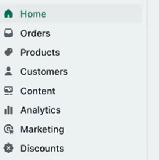

### Comparison Table

| Sidebar Item        | Shopify (As Shown)                                                 | Kloudshop (Current)                                                                      | Analysis & Mapping                                                                                              |
|:------------------- |:------------------------------------------------------------------ |:---------------------------------------------------------------------------------------- |:--------------------------------------------------------------------------------------------------------------- |
| **Home / Overview** | **Home**: Central hub for quick tasks, setups, and announcements.  | **Overview**: Sales metrics graph, latest orders, low inventory alerts.                  | Comparable. Kloudshop's dashboard is data-dense and tailored for operations.                                    |
| **Orders**          | **Orders**: View, edit, filter, and export customer purchases.     | **Orders**: Table with status filters (Pending, Fulfilled) and refund/fulfillment tools. | Both offer robust order management.                                                                             |
| **Products**        | **Products**: List and edit items, variants, media, and inventory. | **Catalog**: Lists products, allows editing, color presets, and bulk CSV import.         | Similar functionality. Kloudshop's "Catalog" represents the exact same product scope.                           |
| **Customers**       | **Customers**: Segmented list of customer profiles and histories.  | **Customers**: List showing customer details and spend.                                  | Both platforms implement customer directories.                                                                  |
| **Content**         | **Content**: Manage files, media, and theme assets.                | **Blog**: Focuses specifically on writing blog posts.                                    | Shopify's "Content" is wider in scope. Kloudshop could rename "Blog" to "Content" if media libraries are added. |
| **Analytics**       | **Analytics**: Built-in graphs, conversion funnels, and reports.   | *(Not in Sidebar)*                                                                       | Kloudshop embeds charts inside "Overview", but lacks a dedicated "Analytics" sidebar tab.                       |
| **Marketing**       | **Marketing**: Create campaigns, coupons, and email drafts.        | *(Not in Sidebar)*                                                                       | Kloudshop has no dedicated marketing module.                                                                    |
| **Discounts**       | **Discounts**: Manage promo codes and automatic cart rules.        | *(Not in Sidebar)*                                                                       | Kloudshop currently handles pricing directly on product cards without custom coupon codes.                      |

---

## 2. Themes Management Page — The Entry Point to Customization

### Shopify Themes Page (2-Pane Layout)

This is the central dashboard a merchant sees under **Online Store → Themes** which serves as the entry point to customization. Unless the merchant is actively editing inside the theme customizer, this screen uses a clean, highly scannable **2-pane layout**:

- **Left Pane (Navigation Panel)**: Displays the primary admin menu list (Home, Orders, Products, Customers, Content, Finances, Analytics, Marketing, Discounts, Online Store [Themes, Blog posts, Pages, Navigation, Preferences], POS, Apps, and Settings).   This menu's equivalent on  kloudshop is  a collapsible side bar  that houses  almost similar functions.   This persistent vertical sidebar allows switching contexts instantly.
- **Right Pane (Theme Viewer Workspace)**: Displays the active theme card (`Dawn — Current theme`) in a full-bleed layout. It features a live dual desktop + mobile device mockup preview that renders current customizations in real time.
- **Header Actions**: Features a dedicated **"View your store"** button in the top right to launch a live storefront preview in a almost full-bleed but easily dismissable pop up modal , allowing merchants to verify changes without leaving the admin area.the merchant or user never leaves his tab.
- **Theme Library Workspace**: Directly underneath the active theme card is the **Theme library** section, where merchants can browse, add, customize, and preview his inactive draft themes before publishing them live.. there is also a link to navigate to the KloudShop's entire full KloudThemeShop ( a full listing of all themes available on Kloudshop assorted and curated by industry style , brandvoice , audience etc. All cloud-shaped teams are free for life. 

> **Notable detail**: The active theme card has a clear primary green CTA (**Customize**) and a utility menu button (**`⋯`**) to access technical/content controls (Rename, Duplicate, Download theme file, Edit code, Edit default theme content) alongside an amber trial warning gate.

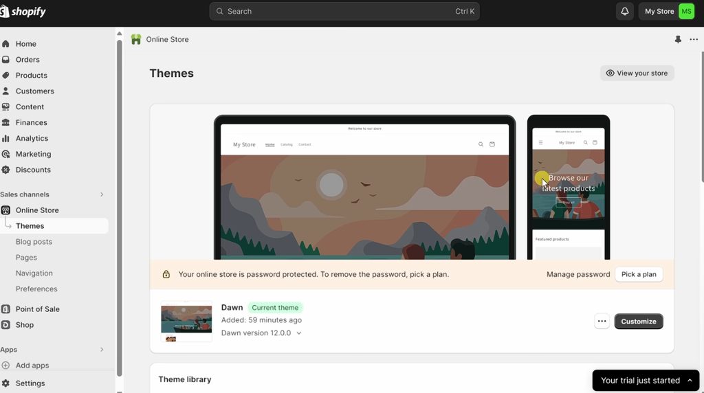

### User's own "My Themes"  Section

The **My Themes** section below the active theme displays themes the user has previously interacted, has starred( favourited), previously activated ,currently customizing  and at some point of cusyomization/launch readiness.This area is the user's primaey hub for managing his  own theme library  of his own handpicked themes inside Kloudshop vast themestore at his disposal  and relevant actions on themes/ themes management . 

#### 1. Popular Themes Shelf

> [!NOTE]
> Below the "**My Themes **" cardcard, Shopify displays a curated selection of "Popular themes" (e.g., Dawn, Spotlight, Refresh). This provides merchants with instant, single-click additions to experiment with different aesthetics.at the end of popular themes, there is a card to visit KloudThemeShop  a vast library of all themes available in Kloud shop assorted and categorized by categiry,industry, brand identityy  design language etc. Popular  themes card is just an appetizer to increase the appetite for exploring more themes and visiting the full-blown Kloud theme shop. 

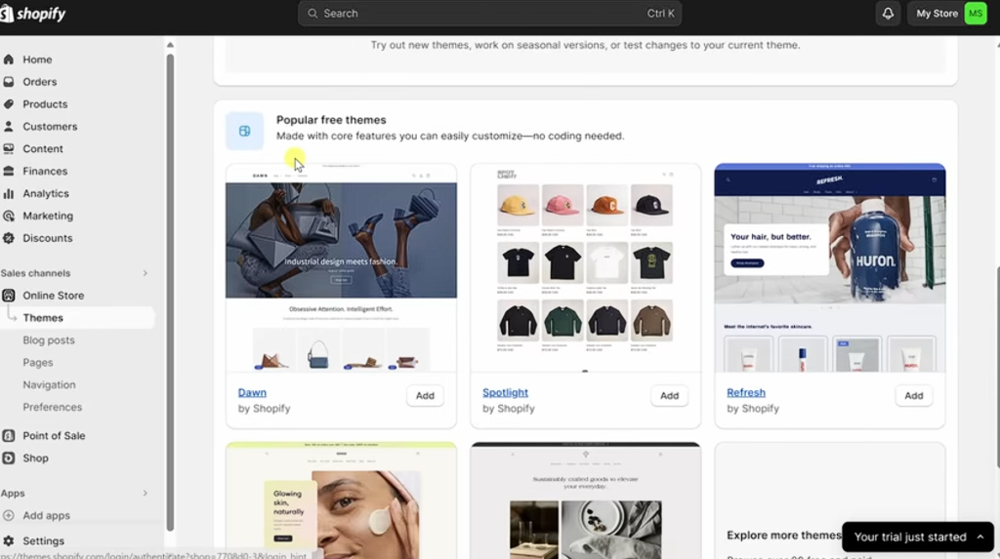

---

#### 2. Theme Store Entry Point

> [!NOTE]
> Scrolling down the theme library lists additional popular themes, culminating in a call-to-action tile: **Explore more themes** with a button to **Visit Theme Store**. This launches the full KloudThemesShop  in a unified experience.

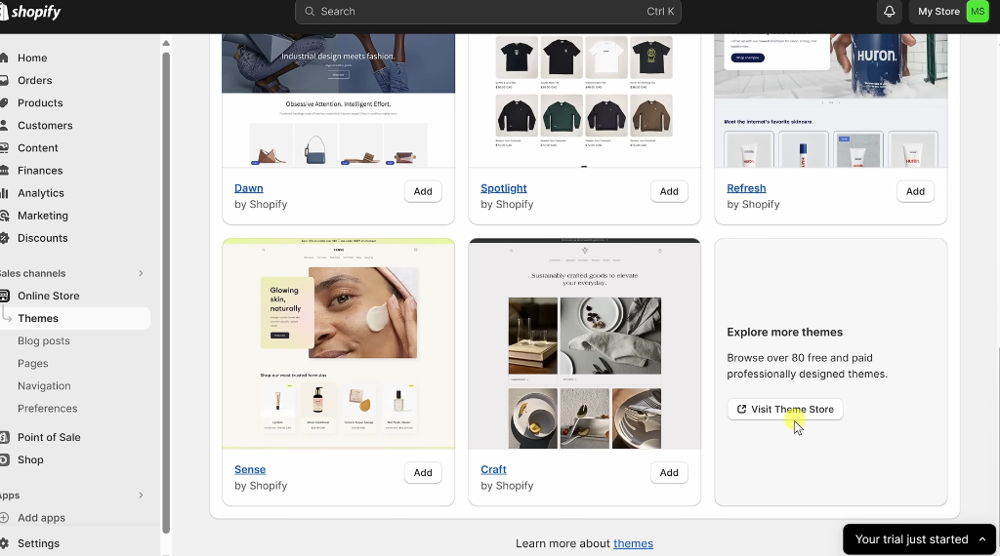

---

#### 3. Full-Blown Theme Store & Industry Filtering

> [!NOTE]
> The full Theme Store leverages a **2-pane filter-and-visual grid layout**:
> 
> - **Left Sidebar Filters**: Allows filtering themes by Price (Free vs. Paid) and Industry (e.g., Arts and crafts, Baby and kids, Books, music, and video, Business equipment and supplies, Clothing).
> - **Right Visual Grid**: Displays high-fidelity card listings showing previews of how the templates look in desktop and mobile viewport mockups.

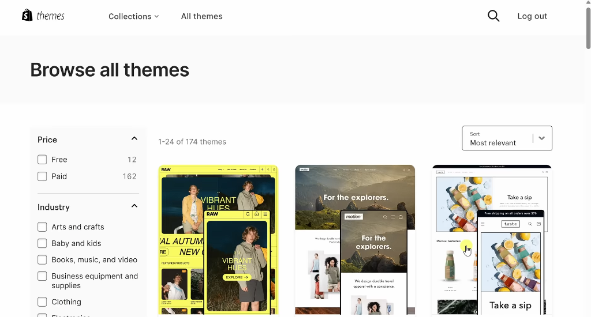

---

### Comparison Table

| Element                        | Shopify Themes Page                                                                                                                               | Kloudshop Equivalent                                                                    | Analysis & Mapping                                                                                                                                 |
|:------------------------------ |:------------------------------------------------------------------------------------------------------------------------------------------------- |:--------------------------------------------------------------------------------------- |:-------------------------------------------------------------------------------------------------------------------------------------------------- |
| **Theme Preview**              | Large desktop + mobile dual-preview thumbnail of the active theme, rendered live inside the admin.                                                | `themes_view.dart` lists themes with a static card and a "Launch Editor" button.        | Shopify's dual-viewport thumbnail gives immediate visual confidence. Kloudshop's theme card is text-heavy.                                         |
| **Primary CTA**                | Green **"Customize"** button — prominent, single action, no ambiguity.                                                                            | "Launch Editor" button that opens the old WYSIWYG editor.                               | Shopify's button label "Customize" sets the right mental model — you're styling, not coding. KloudShop's "Launch Editor" implied a technical tool. |
| **Secondary Actions (⋯ menu)** | Rename, Duplicate, Download, Edit code, Edit default content — all non-destructive, grouped under overflow.                                       | Separate buttons/icons scattered on theme cards.                                        | Shopify cleanly separates the primary flow (Customize) from utility actions (overflow menu). Reduces cognitive load.                               |
| **Theme Library**              | Dedicated section below the active theme for browsing and adding new themes from Shopify's store.                                                 | Single flat list of all themes; no visual hierarchy between active and library themes.  | Shopify creates a clear hierarchy: active theme above, library below.                                                                              |
| **Sidebar context**            | Under "Sales channels → Online Store → **Themes**" in the left nav. "Blog posts", "Pages", "Navigation", "Preferences" are visible as peer items. | "Themes" is a top-level sidebar item.                                                   | Shopify's grouping under "Online Store" makes the connection between storefront and themes explicit.                                               |
| **Password / Plan gate**       | An inline amber warning bar when the store is not yet published.                                                                                  | No equivalent — KloudShop doesn't surface a launch-readiness status on the themes page. | A "Store health / readiness" banner here would be a valuable addition to KloudShop.                                                                |
| **Theme Price Model**          | Hybrid: Offers 12 free default themes and 162 paid commercial themes ($150–$380+) listed in the Shopify Theme Store.                              | **All themes are 100% free** for all merchants. No paid tiers exist.                    | Kloudshop does not implement commercial themes; all templates are accessible instantly without payment processing gates.                           |
| **Theme Browsing / Store**     | Interactive theme store with left-sidebar filters (price, industry) and visual card previews.                                                     | Basic list selector inside the dashboard.                                               | Kloudshop can catalog its free themes using categories like "Popular Free Themes", "New This Week", and industry segments (e.g. fashion, food).    |

---

## 3. Theme Editor Customizer — Entry Point & Overall Layout

### Shopify Theme Customizer Interface

When a merchant enters the customization view, the workspace is structured as a **3-pane workspace layout**:

1. **Leftmost Control Panel (Utility Bar)**:
   A narrow column containing three toggleable icons:
   - **Sections Editor (Top Icon)**: Focuses the middle pane on the visual page layout tree (header, template sections, footer).
   - **Theme Settings (Middle Cog Icon)**: Loads the global design system variables (typography, custom logo, favicon, colors, component styling social links).
   - **App Embeds (Bottom Icon)**: Focuses on script integrations and third-party widgets.Kloudshop does not hae a third part app ecosystem like Shopify. we need to think of a better  use for this third icon.
2. **Middle Panel (Contextual Configuration Workspace)**:
   - **Outline Mode**: Displays the hierarchical section outline (Announcement bar, Header, template sections like Image Banner, and Footer) with add controllers.
   - **Properties Mode**: Replaces the outline list dynamically with input fields, sliders, and selectors when a section or the global settings cog is clicked.
3. **Right Panel (Live Preview Canvas)**:
   Renders the live, responsive storefront simulation in real time. It reacts instantly to changes made in the configuration panels.

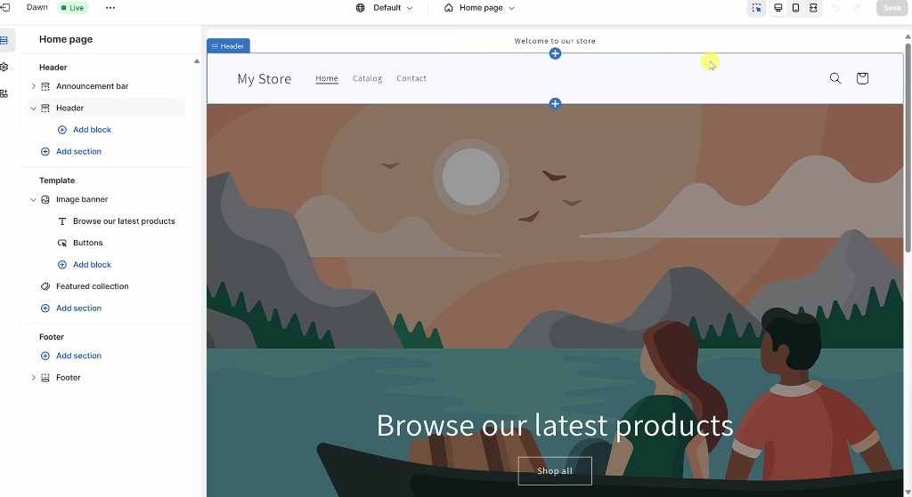

---

### Bi-directional Outline Highlighting & Page Regions

The middle panel's **Sections Editor** maps the page layout into three primary regions: **Header** (includes Announcement bar and Navigation menu header), **Template** (the page body sections like Image banner, Collections lists, Featured collections), and **Footer**.

#### 1. Announcement Bar Outline Selection

> [!NOTE]
> Selecting or hovering over the **Announcement bar** item in the middle panel outlines the element dynamically on the live preview canvas (Welcome to our store). Merchants use this block to highlight sales banners (e.g., Black Friday promo campaigns).

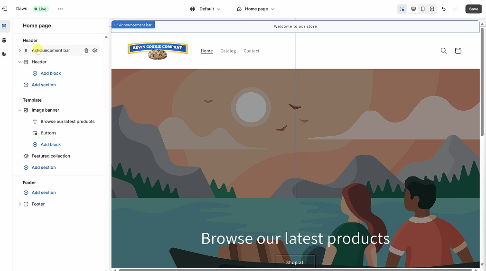

---

#### 2. Body Section Selection (Image Banner)

> [!NOTE]
> Hovering over or clicking a section item in the middle outline (e.g., **Image banner**) draws a blue boundary around that specific block in the live preview canvas. Clicking it collapses the outline view in the middle panel and displays that section's customizable properties (text, buttons, background image alignment).

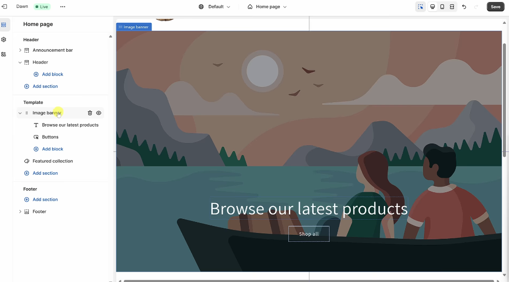

---

#### 3. Outline Node Visibility Toggles

> [!NOTE]
> Each layout section or sub-block within the Header, Template, and Footer hierarchy features a contextual **visibility toggle (eye icon)** on hover in the middle outline pane. This enables merchants to hide or reveal sections dynamically (e.g., hiding a seasonal announcement bar or placeholder collections list) without permanently deleting them.

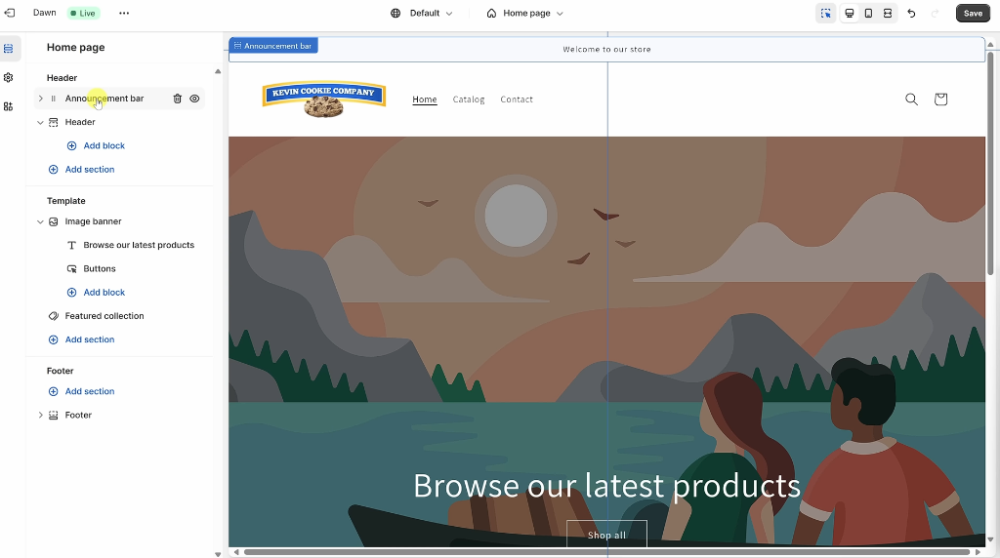

---

### Global Theme Settings (Cog Panel)

Selecting the middle settings cog icon updates the middle pane to display global theme customization categories.

#### 1. Theme Settings Directory (Top Section)

> [!NOTE]
> This displays the upper half of the theme settings list. Merchants can customize the global Logo, Colors schemes, Typography, Layout constraints, Animation behaviors, Buttons, Variant pills, Inputs, and card elements.

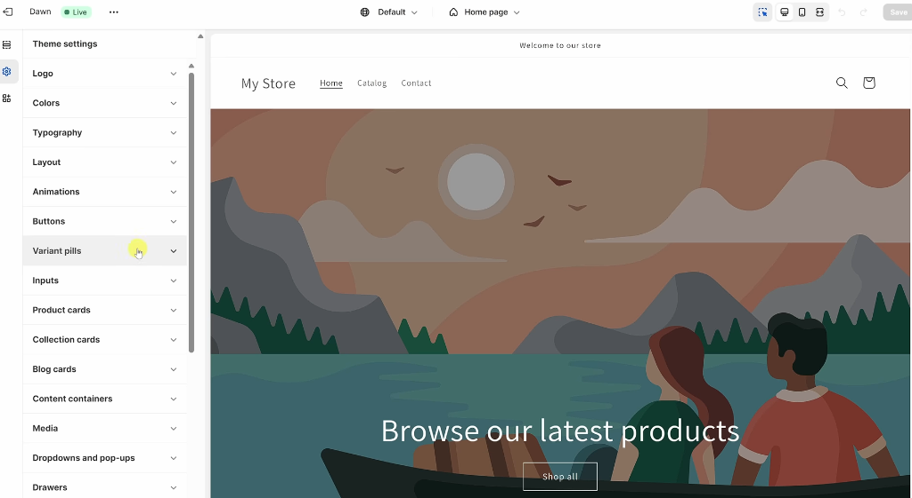

---

#### 2. Theme Settings Directory (Bottom Section)

> [!NOTE]
> Scrolling down reveals additional properties: Badges, Brand information presets, Social media URLs, Search input behaviors, Currency formats, Cart behaviors, Checkout forms, Custom CSS, and active Theme style states.(some options displayed in Shopify's Theme settings cog might not apply to Kloudshop for instance custom CSS, since Kloudshop is not CSS based but we may be we can use it to save "named" styling profiles for the same theme. e.g. having a "summer/winter/spring/christmas" presets of styling the same theme ).

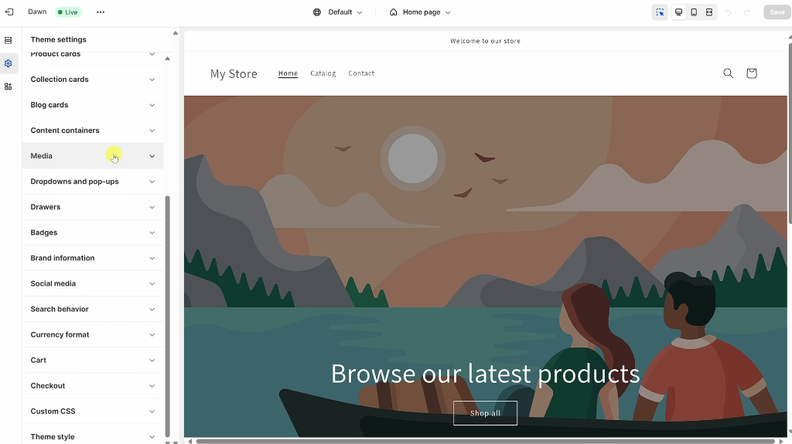

---

#### 3. Social Media Fields Extension

> [!NOTE]
> Expanding the **Social media** tile exposes standard input fields for linking social channels (Facebook, Instagram, YouTube, TikTok, Twitter, Snapchat, Pinterest, Tumblr, Vimeo). These URLs dynamically populate footer icons in compatible templates.

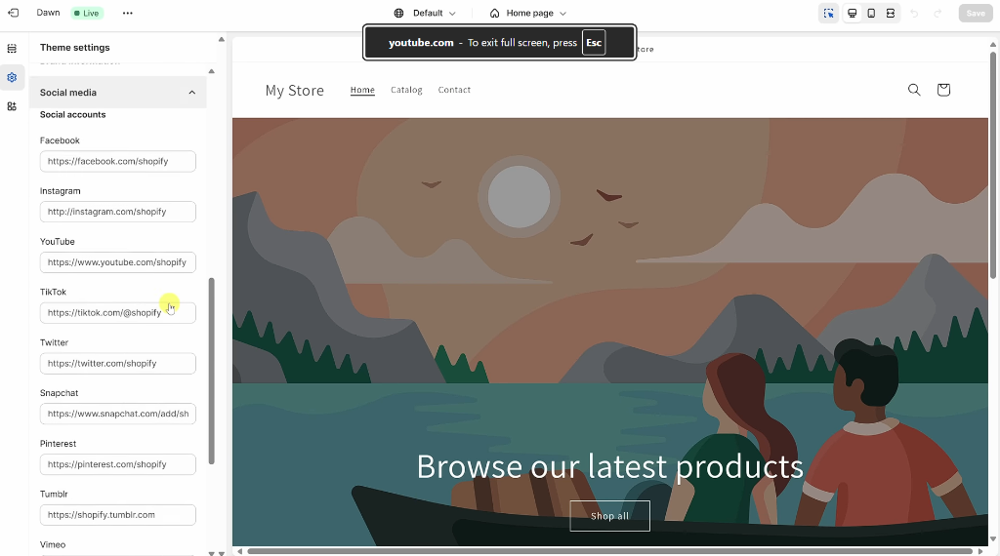

---

#### 4. Logo, Favicon & Brand Presets

> [!NOTE]
> Expanding the **Logo** tile provides controls to upload or edit the logo asset, adjust the desktop logo width via a pixel slider, set a custom storefront Favicon (scaled to 32x32px), and adjust structural elements like logo placement (middle-left, top-left, etc.).

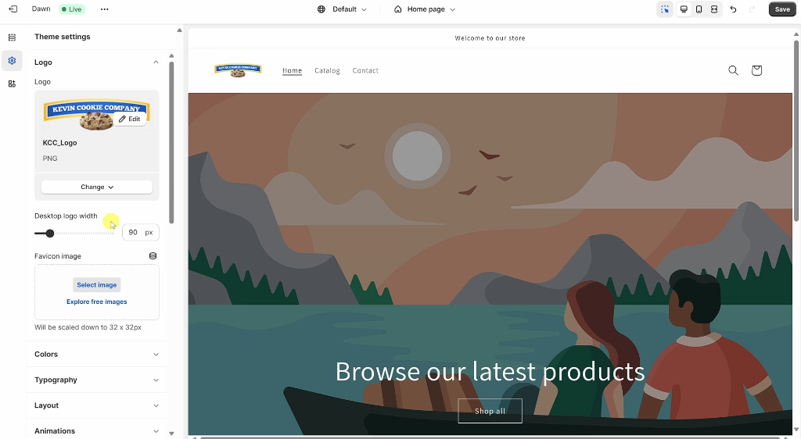

---

### Comparison Table

| Capability                  | Shopify Customizer                                                                                                                                       | Kloudshop Old WYSIWYG                                                                                                | Analysis & Mapping                                                                                                                                               |
|:--------------------------- |:-------------------------------------------------------------------------------------------------------------------------------------------------------- |:-------------------------------------------------------------------------------------------------------------------- |:---------------------------------------------------------------------------------------------------------------------------------------------------------------- |
| **Panel Layout**            | **3-pane (dynamic collapsing)**: Leftmost icon column (sections/settings/apps switcher) + contextual middle properties/outline pane + right live canvas. | **3-panel (static)**: Left component library/layers \| Center canvas \| Right properties — fixed and always visible. | Shopify's leftmost vertical utility bar keeps layout concerns separated. The middle panel collapses from outline into properties, maximizing canvas real estate. |
| **Outline Hierarchy**       | Left panel groups items into logical `HEADER`, `TEMPLATE` (body sections), and `FOOTER` regions. Each region is expandable.                              | Single flat list in the Layers Tree with no semantic grouping.                                                       | Shopify's structure maps directly to how a web page is actually built. Far more intuitive for a non-technical merchant.                                          |
| **Section → Block nesting** | Sections (e.g. "Image banner") can contain sub-blocks (e.g. "Browse our latest products" text, "Buttons"). Both shown as indented tree items.            | Nodes nested inside containers with an abstract layer model.                                                         | Shopify's Section/Block vocabulary is simpler and more predictable.                                                                                              |
| **Drag & Drop**             | Supports reordering sections by dragging them in the left outline. Blocks inside a section can also be reordered.                                        | Dragging components from a library into the canvas.                                                                  | Shopify's drag is scoped to the outline list (predictable), not free-form canvas placement (error-prone).                                                        |
| **Component Selection**     | Click anywhere on the canvas element to highlight it; the left sidebar auto-navigates to that section's settings.                                        | Double-outline neon highlight overlay; auto-expands the layer tree.                                                  | Shopify's click-to-configure is simpler and more discoverable for merchants.                                                                                     |
| **Page Context Switcher**   | Dropdown at the top center to switch between pages (Home, Products, Collections, Cart, Checkout, etc.)                                                   | Top bar dropdown (Home, PDP, Checkout, Cart).                                                                        | Identical intent; Shopify's is more complete with more page types.                                                                                               |
| **Undo / Redo**             | Undo/Redo icons in the top right corner.                                                                                                                 | Top left, grouped near save.                                                                                         | Minor layout preference.                                                                                                                                         |
| **Save**                    | Single **"Save"** button top-right. Saves directly to the live theme.                                                                                    | Split "Save Draft" and "Save & Publish" with a confirmation modal.                                                   | Shopify's single save is simpler but dangerous (live changes). KloudShop's draft/publish split is safer.                                                         |

## 3a. Page Template Switcher & Product Page Customization

This section details how the storefront customizer manages multi-page templates and highlights the product detail page customization flow.

#### 1. Page Template Switcher (Entry Point)

> [!NOTE]
> Clicking the dropdown at the top center of the theme customizer header launches the **Page Selector** directory. It displays a searchable list of page types and templates: Products, Collections, Collections list, Pages, Blogs, Blog posts, Cart, and Checkout.

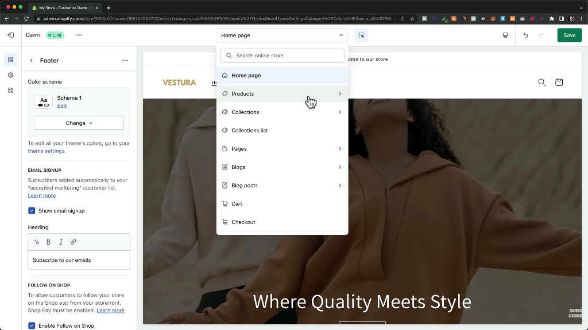

#### 2. Sub-Category Template Directory (Products Example)

> [!NOTE]
> Expanding a page category (e.g. Products) displays its active templates (e.g., "Default product (Assigned to 5 products)" with a star icon indicating the system default) and a "+ Create template" action to generate new layouts for specific product groups.

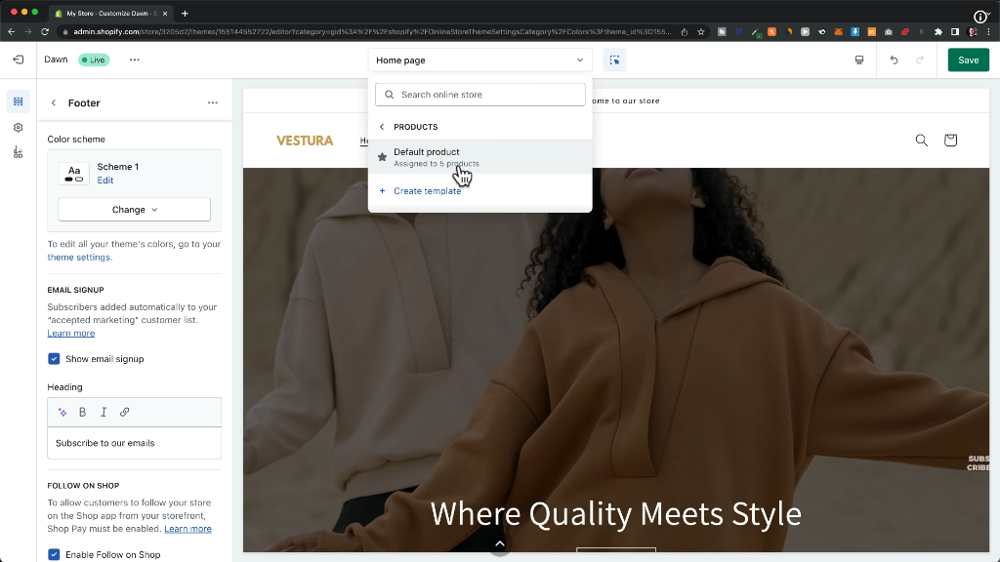

#### 3. Default Product Page Preview & Outline

> [!NOTE]
> Selecting the "Default product" template updates the customizer's page preview context. The center canvas renders the product detail page layout preview (showing a VESTURA Cap, dynamic price, quantity picker, and checkout buttons), and the left sidebar outline displays the product-specific template blocks (Product information: Text, Title, Price, Variant picker, Quantity selector, Buy buttons, Description, Share).

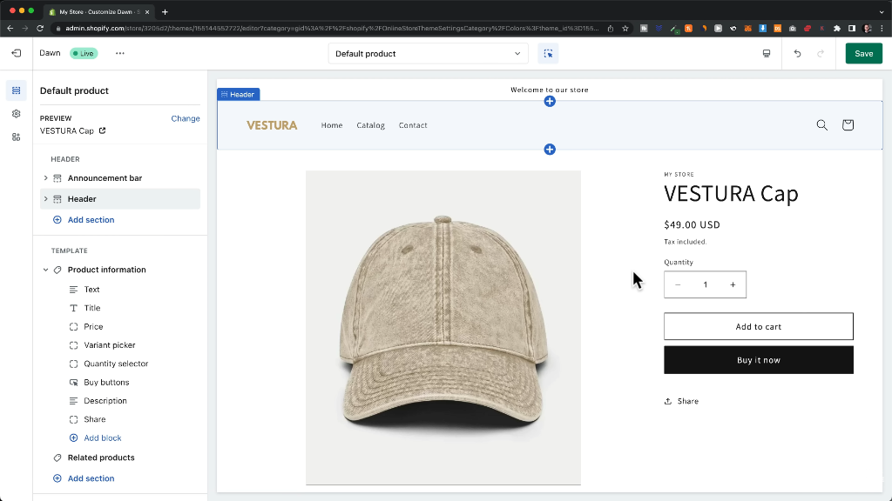

#### 4. Bi-Directional Highlight & Selection

> [!NOTE]
> Selecting the "Product information" container on the canvas highlights it in blue with a dotted border, while simultaneously expanding and highlighting the corresponding node in the left outline sidebar. This selection synchronization works bi-directionally.

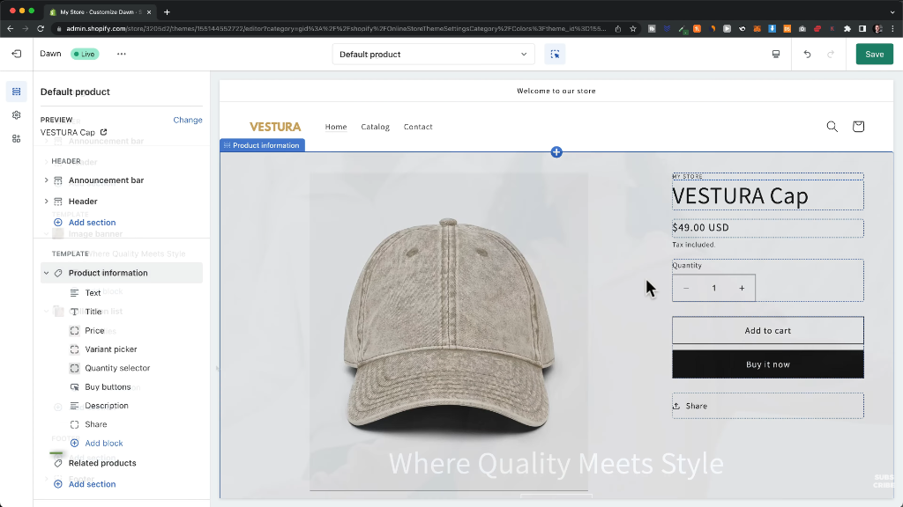

### Comparison Table

| Feature / UI Element         | Shopify Page Switcher / PDP Customizer                                                                                                             | Kloudshop Old Component Editor                                                                 | Analysis & Mapping                                                                                                                     |
|:---------------------------- |:-------------------------------------------------------------------------------------------------------------------------------------------------- |:---------------------------------------------------------------------------------------------- |:-------------------------------------------------------------------------------------------------------------------------------------- |
| **Page Selector / Switcher** | Centralized top-center dropdown segmenting the storefront into different page templates (Products, Blogs, Cart).                                   | Flat page select list in a secondary dropdown.                                                 | Shopify's top-center layout establishes the page template as the active canvas scope.                                                  |
| **Template Reusability**     | A single "Default product" template is assigned to multiple products (e.g., "Assigned to 5 products"). Additional custom templates can be created. | Standard hardcoded views for the Product Details Page (PDP) across all catalog items.          | Decoupling layouts from individual product data allows changing default styles globally while supporting custom product landing pages. |
| **Bi-Directional Selection** | Clicking components on the canvas highlights them and auto-scrolls/focuses the outline node, and vice versa.                                       | Clicking outline layers selects nodes, but clicking canvas elements is sometimes unresponsive. | Bi-directional synchronization is essential to help non-technical merchants quickly map canvas widgets to outline settings.            |

### Architectural Recommendations for Kloudshop

1. **Dynamic Page Router Switcher**: Implement a top-center page switcher dropdown allowing merchants to transition between standard route templates (Home, PDP, Collection, Cart, Checkout, Custom Pages).
2. **Template-to-Asset Mapping (Reusability)**: Support database-level mapping where page layout JSON templates are stored separate from catalog items, and a single product template can be assigned dynamically to multiple products (with support for custom templates per product).
3. **Bi-Directional Node Synchronization**: Create a shared selection state broker in the storefront editor. When a widget on the canvas is clicked, trigger a selection event that highlights the matching layer node in the outline tree (and vice versa) for optimal usability.

---


## 4. Section Properties & Asset Selectors

### 4a. Left Sidebar in Section-Properties Mode — Image Banner (Close-up)

This screenshot shows the left sidebar **after clicking the "Image banner" section** on the canvas. The sidebar transitions from the outline tree into a dedicated property editor for that section. Key things to note:

- **`← Image banner` header with `⋯` overflow**: A back-arrow (`<`) returns the merchant to the outline tree. The section name ("Image banner") becomes the sidebar title. The `⋯` gives section-level actions (hide, duplicate, remove).
- **Image pickers (empty state)**: "First image" and "Second image" — each is a dashed-border drop zone with two CTAs: **"Select image"** (opens media library) and **"Explore free images"** (Shopify's stock photo search). The active/hovered picker turns blue.Kloud does not have stock  photos. may be we remove the Explore free images options and may be reintroduce it later to let merchants generate on demand  images using AI image gen but this is post MVP. 
- **Image overlay opacity slider**: A horizontal drag slider at 40% — visual and immediate.
- **Banner height dropdown**: Set to "Large". Below it, an inline helper note: *"For best results, use an image with a 3:2 aspect ratio. [Learn more](#)"* — this is Shopify's educational micro-copy pattern.
- **Desktop content position dropdown**: "Bottom Center" — controls where text blocks inside the banner are anchored.
- **Left icon ribbon (3 icons)**: Visible on the far left edge — outline/sections icon (active), gear/settings icon, and a grid/blocks icon. These are the sidebar mode switchers.
- **Canvas label tag**: On the canvas, the selected section shows a blue outline + "Image banner" label chip at the top-left corner.

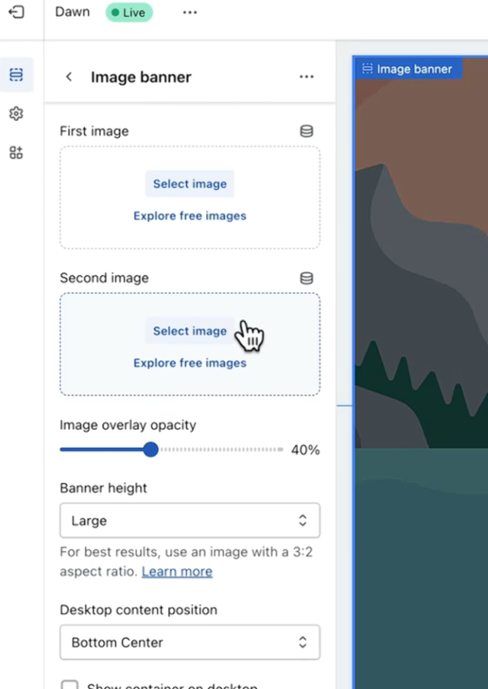

### 4b. Image Banner Properties — Empty State (Wide view)

Below is the property editor when the "Image banner" section is selected in Shopify (Empty State):

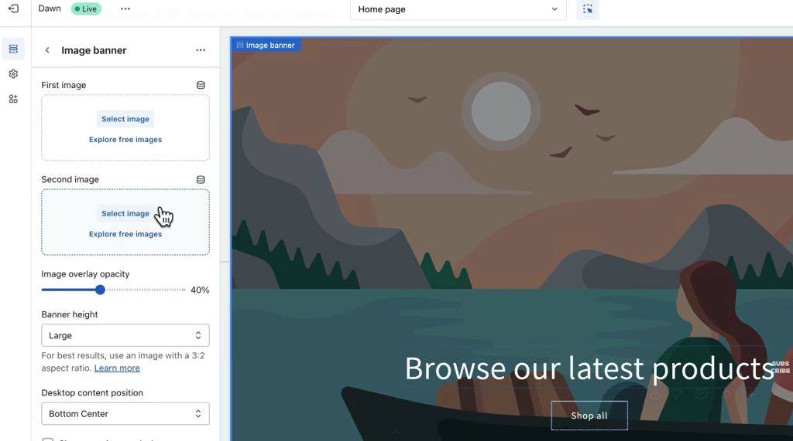

### 4c. Block-Level Editing — Heading Block (Live Text Edit)

This screenshot shows what happens when a merchant clicks directly on the **"Heading" block** inside the Image banner section. The sidebar drills one level deeper: from section-properties into **block-properties**. This is a critical UX pattern to note.

Key observations:

- **`← Heading` header**: Back arrow now returns to the *section* (Image banner) rather than the outline — sidebar is always context-aware, one level up is always reachable.
- **Inline rich-text input**: The heading text ("Where Quality Meets Style") is editable directly in a plain text input field. Above it, a mini formatting toolbar shows:
  - ✦ Sparkle / AI — AI copywriting assist
  - **B** — Bold
  - *I* — Italic
  - 🔗 — Link
- **Heading size dropdown**: "Large" — controls the typographic scale of the heading.
- **`Remove block` (destructive, red)**: Placed at the very bottom of the sidebar, clearly separated from editing controls. Removes the block from the section.
- **Canvas: real-time update** — The heading "Where Quality Meets Style" is rendered live on the canvas as the merchant types, overlaid on the banner image.
- **Canvas: blue label chip** — "⊕ Heading" label appears at the top-left of the selected block on canvas.
- **Canvas: floating block toolbar** — A small contextual toolbar floats *below* the selected text block on the canvas, containing: move/reposition, align, emoji/insert, visibility toggle, and delete (🗑️).

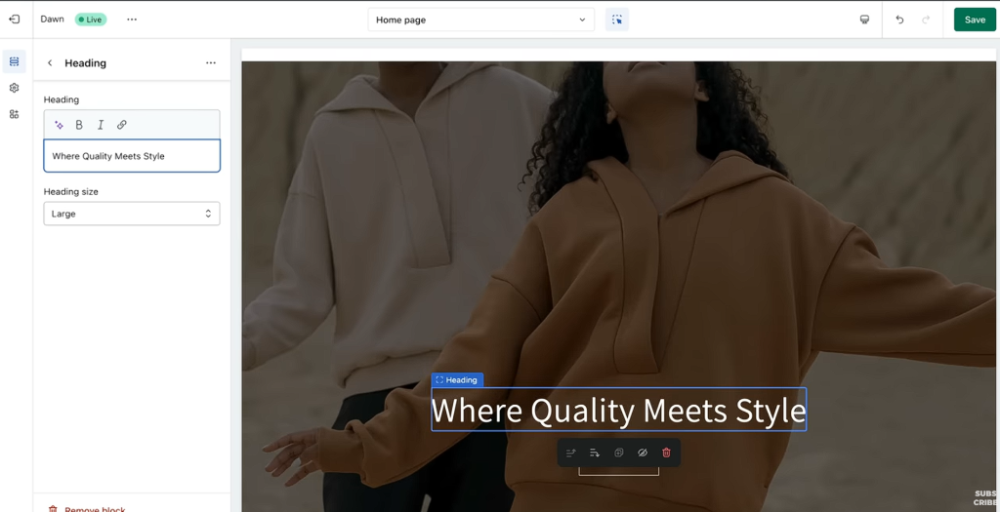

### 4d. Selected Image State

Below is the property editor after selecting/uploading a background banner image in Shopify:

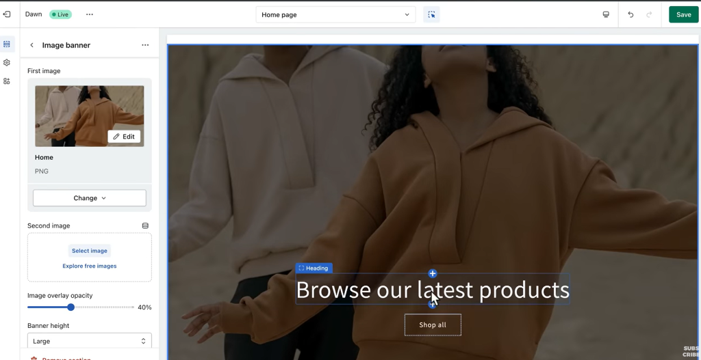

### 4e. Inline Text/Tagline Editing State

Below is the property editor when selecting a text block (Heading) inside the banner:

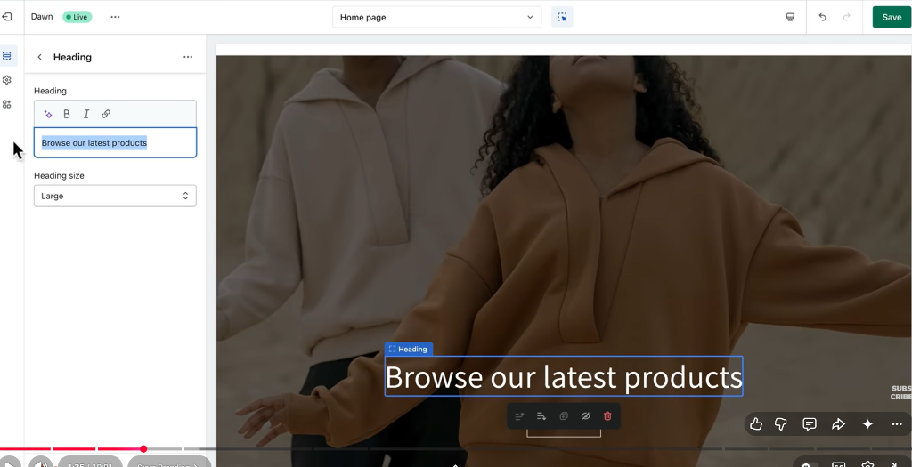

### 4f. Media Selector Modal (Empty vs. Populated)

Below are the empty and populated states of the asset browser pop-up (Media Library) when choosing images:

#### Empty State (Initial Upload Zone)

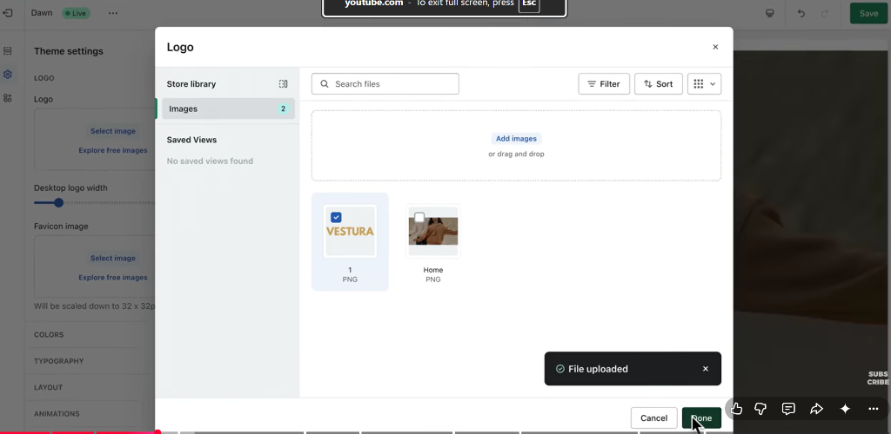

#### Populated State (Accumulated Media Assets)

> [!NOTE]
> This populated modal is a direct continuation of the **Media Selector Modal** journey. It shows the library after the merchant has uploaded assets throughout the setup (e.g. logos from **[§15](#15-branding--centralized-brand-assets)**, product images). It introduces checkbox selection, a green `✓ File uploaded` toast indicator, and left-sidebar category segmentation ("Store library" -> "Images" and "Saved Views").

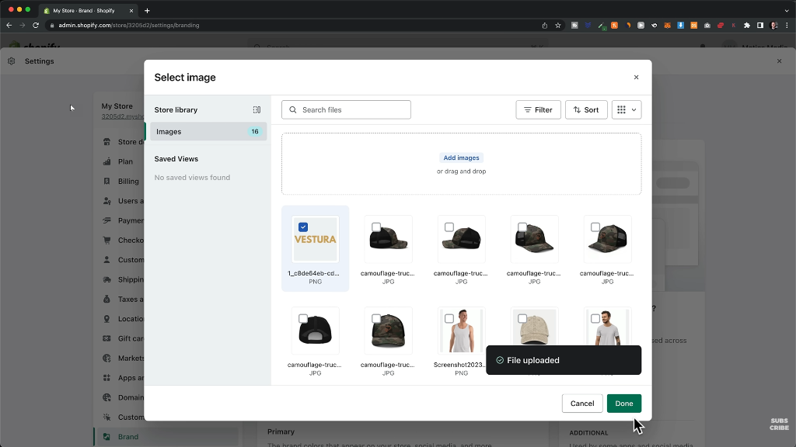

### 4g. Footer Customization & Policy Links

#### 1. Configured Footer & Policy Links

> [!NOTE]
> This screen shows the customization view when configuring the storefront **Footer** section. The left sidebar shows the Footer outline containing the "Quick links" block. The canvas renders a visual preview of these links (mapping to the standard legal policies created under **Settings → Policies** in **[§16](#16-implied-admin-settings--navigation-map-triangulation-tracker)**), the newsletter subscribe box, and active payment gateway badges (e.g. PayPal, representing enabled providers from **[§12a](#12a-payment-gateways-capture-methods--transaction-fees)**).

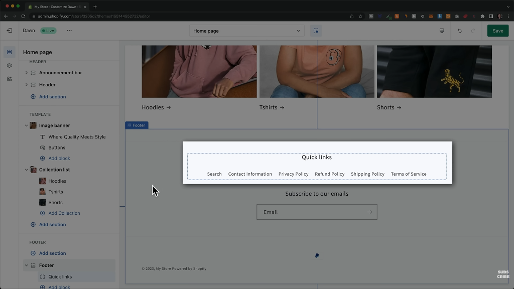

#### 2. Footer Block Selection & Discovery Dropdown

> [!NOTE]
> This screen captures the dialog overlay when a merchant clicks "+ Add block" under the Footer in the customizer outline panel. It presents a searchable directory split into "THEME BLOCKS" (Menu, Brand information, Text, and Image) and "APP BLOCKS" (which houses integrations from third-party ecosystems). For Kloudshop, where all extended block functionalities are provided natively on the platform itself, this picker represents the primary entry point for modular storefront layout assembly.

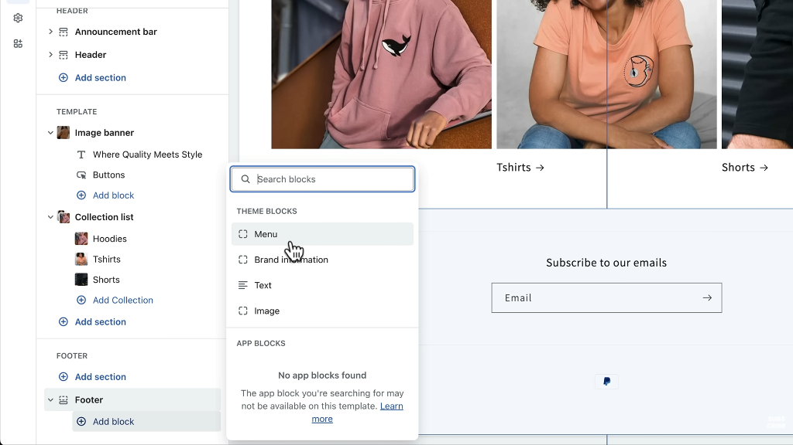

### Comparison Table

| Feature / UI Element              | Shopify Section Editor / Modal                                                                                                                 | Kloudshop Old Component Config                                  | Analysis & Mapping                                                                                                                                                                                                    |
|:--------------------------------- |:---------------------------------------------------------------------------------------------------------------------------------------------- |:--------------------------------------------------------------- |:--------------------------------------------------------------------------------------------------------------------------------------------------------------------------------------------------------------------- |
| **Block Directory & App Blocks**  | Pop-up block selector directory with search box, categorized by core "Theme Blocks" and extensible "App Blocks" (third-party extensions).      | Hardcoded widget selector or static layout configurations.      | Pre-integrating custom feature blocks natively (e.g. loyalty cards, store locator blocks) under a unified block discovery modal replicates the modularity of app-store plugins without merchant integration overhead. |
| **Asset Pickers (Empty)**         | Stylized dashed outline boxes for "First image" and "Second image" with "Select image" and "Explore free images" options.                      | Simple input fields or image URL text entries.                  | Shopify's asset pickers are highly visual and user-friendly.                                                                                                                                                          |
| **Asset Pickers (Selected)**      | Renders a card preview of the selected image, showing filename, file type (PNG/JPG), an overlay "Edit" button, and a "Change" dropdown action. | Text input field displays the updated URL string.               | Shopify encapsulates file selection, alt text editing, and replacements into a compact card widget.                                                                                                                   |
| **Asset Library Browser**         | Dedicated modal overlay: search bar, sort/filter, drag-and-drop upload zone, and a grid of previously uploaded assets.                         | Direct text URL field entries.                                  | Shopify offers a centralized media library interface. Kloudshop requires pasting URLs.                                                                                                                                |
| **Inline Rich-Text Editor**       | Direct inline tagline text input with formatting shortcuts (Bold, Italic, Link, AI copywriter).                                                | Text fields inside the right properties sidebar.                | Shopify supports rich text formatting on blocks easily.                                                                                                                                                               |
| **Canvas Selection & Toolbars**   | Selected element shows outline, type label tag, plus inline floating toolbar (align, duplicate, hide, delete).                                 | Selection outline overlay. Actions handled in properties panel. | Shopify's floating toolbar enables quick context edits directly over the canvas.                                                                                                                                      |
| **Overlay Opacity Slider**        | Horizontal slider with tick marks and percentage indicators (e.g., 40%).                                                                       | Compact spin inputs with manual typing and increment buttons.   | Kloudshop uses spin inputs to save vertical space. Shopify uses traditional sliders.                                                                                                                                  |
| **Helper Notes**                  | Inline helper text ("For best results, use an image with a 3:2 aspect ratio. Learn more").                                                     | Simple property labels.                                         | Similar intent; Shopify is slightly more educational.                                                                                                                                                                 |
| **Footer Structure & Blocks**     | Outline isolates a specific footer container supporting nested blocks (e.g., Quick links list, newsletter subscribe inputs).                   | Flat footer layouts with static or global widgets.              | Splitting footer content into dynamic, rearrangeable blocks (link list, text, newsletter) allows merchants to adapt their bottom-page real estate to showcase policies or trust badges dynamically.                   |
| **Automatic Policy Mapping**      | Footer "Quick links" automatically map to standard store policies (Refund, Privacy, Terms) configured in administrative settings.              | Footer links are manual custom menu URLs.                       | Binding administrative policy models directly to standard theme link lists ensures legal compliance is maintained across storefront templates without manual page routing.                                            |
| **Gateway Badge Synchronization** | Renders enabled gateway icons (e.g., PayPal logo) in the footer metadata strip based on payments settings.                                     | Footer credit card logos are static design files.               | Querying the active payment configuration dynamically to render accepted checkout badges ensures the customer is shown accurate trust indicators.                                                                     |

### 4h. Page Template Sections & Collection Lists

This section details the merchant's workflow when adding new sections to the main storefront body and binding them to product collections.

#### 1. Section Selection Directory (Search sections)

> [!NOTE]
> Clicking "+ Add section" under `TEMPLATE` opens a popup directory displaying available storefront widgets (Featured collection, Featured product, Collection list, Rich text, Image with text, Image banner, Slideshow, Collage, Multicolumn, Multirow, Collapsible content). Hovering over an item displays a thumbnail layout preview on the right.

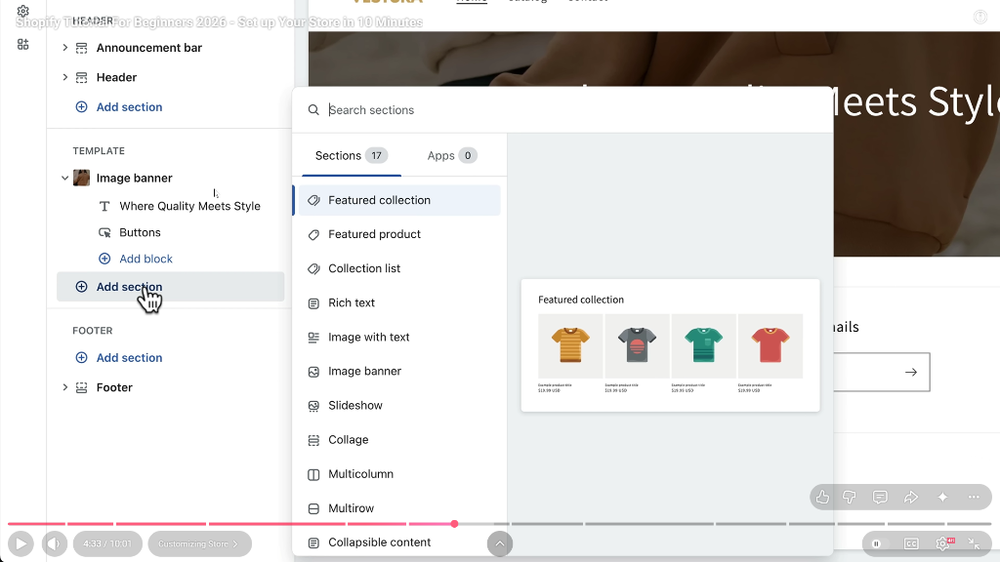

#### 2. Collection List Added (Empty State)

> [!NOTE]
> When the "Collection list" section is added, it displays three default empty cards with generic placeholder graphics and "Your collection's name" labels, maintaining grid visual balance prior to data binding.

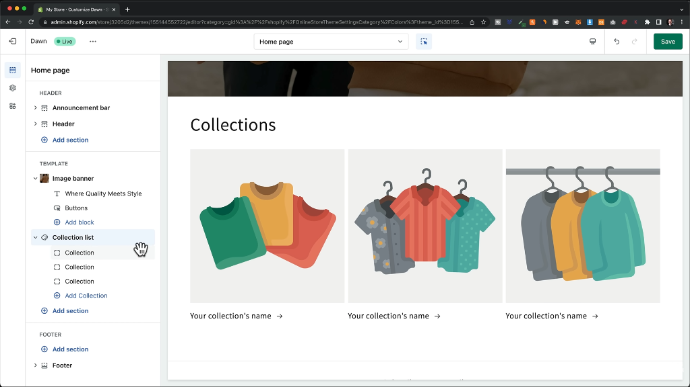

#### 3. Block Selection on Canvas

> [!NOTE]
> Clicking a collection card on the canvas selects it with a blue outline container, preparing the left sidebar to load configuration fields for that specific nested block.

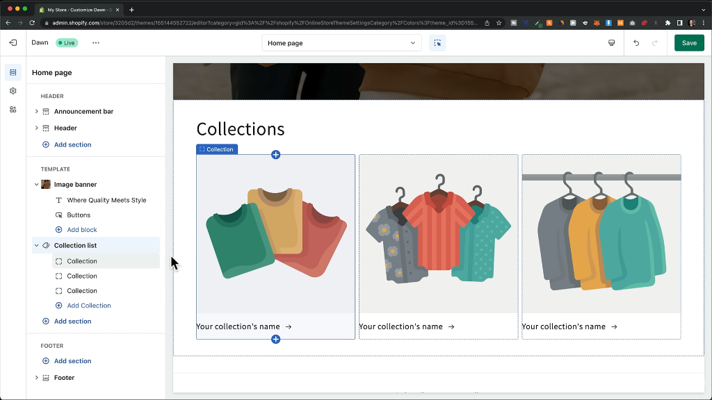

#### 4. Collection Binder Sidebar Panel

> [!NOTE]
> The left sidebar transitions to the "Select collection" view, showing a search input, "+ Create collection" shortcut button, and a list of configured catalog collections (Home page, Hoodies, Shorts, Tshirts). A Kloudshop merchant can create any number of Collection in his inventory/product catalogue.

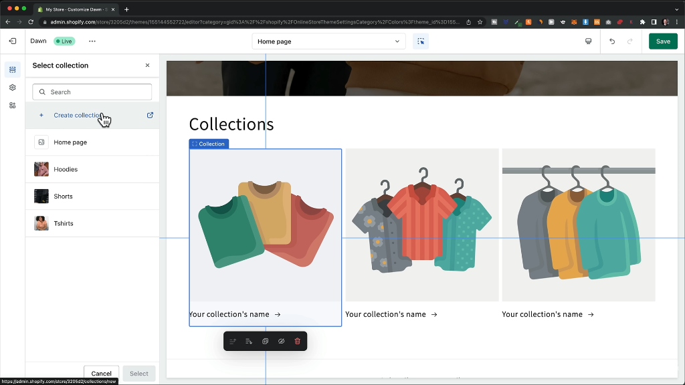

#### 5. Collection Data Binding Populated

> [!NOTE]
> Once the merchant selects the "Hoodies" collection, the block binds the collection's primary image and text label ("Hoodies") to the card instantly, rendering live on the storefront preview.

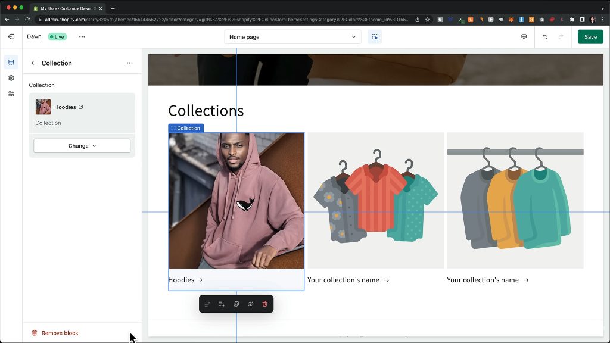

### Comparison Table Updates

| Feature / UI Element              | Shopify Section Editor / Modal                                                                                                      | Kloudshop Old Component Config                                                       | Analysis & Mapping                                                                                                             |
|:--------------------------------- |:----------------------------------------------------------------------------------------------------------------------------------- |:------------------------------------------------------------------------------------ |:------------------------------------------------------------------------------------------------------------------------------ |
| **Interactive Section Directory** | Searchable sections directory popup presenting live visual mockups of widgets (e.g. Featured collection grid thumbnail) upon hover. | Simple text drop-down list of components in the property editor.                     | Hover previews help merchants identify what a section does before adding it, reducing layout trial-and-error.                  |
| **Dynamic Catalog Binding**       | Selecting a category card allows picking from merchant-managed collection models instead of entering static paths or IDs.           | Requires manually inserting component IDs or hardcoding item lists inside templates. | Coupling storefront sections directly to database models (like Collections) keeps layouts synchronized with inventory updates. |
| **Placeholder Hanger Graphics**   | Displays clean placeholder visuals (hanger graphics, generic cards) to maintain layout aesthetics before data is bound.             | Renders blank panels or loading spinners on the canvas preview.                      | Using styled placeholder graphics guides the merchant visually and keeps the builder feeling premium.                          |

---

## 5. Global Theme Settings (Design Tokens)

### Shopify Theme Settings Panel

Below is the sidebar for global theme styling, accessed by clicking the **gear icon** on the left vertical icon ribbon:

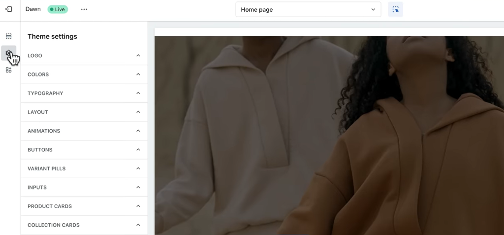

### 5a. Logo Upload & Width Control (Theme Settings → Logo)

This is the **first category** inside Theme Settings — the Logo section. The merchant has already uploaded their logo ("VESTURA" as a PNG), and it is now rendering live in the canvas header. Key UI elements:

- **Logo image card**: Shows a thumbnail preview of the uploaded logo (partial, since the file name is longer than the card width). Overlaid on hover: an **"✏ Edit"** button. Below the thumbnail: the filename ("1") and file type ("PNG").
- **"Change ▾" button**: An outlined button with a dropdown arrow — clicking reveals options to Replace, Remove, or Add alt text for the logo. Clean separation from the Edit action.
- **Desktop logo width slider**: A continuous drag slider, currently set to **90px**. Lets the merchant scale the logo without re-uploading.
- **Favicon image field** (partially visible): The next setting below, indicating the Logo category also manages the favicon.
- **Canvas real-time feedback**: The "VESTURA" logo renders immediately in the store header on the canvas as settings are changed — with a green arrow annotation in this screenshot pointing to where it appears on the live canvas.
- **Context**: The gear icon on the left icon ribbon is active (highlighted) — confirming we are in "Theme settings" mode, not "Outline" mode.

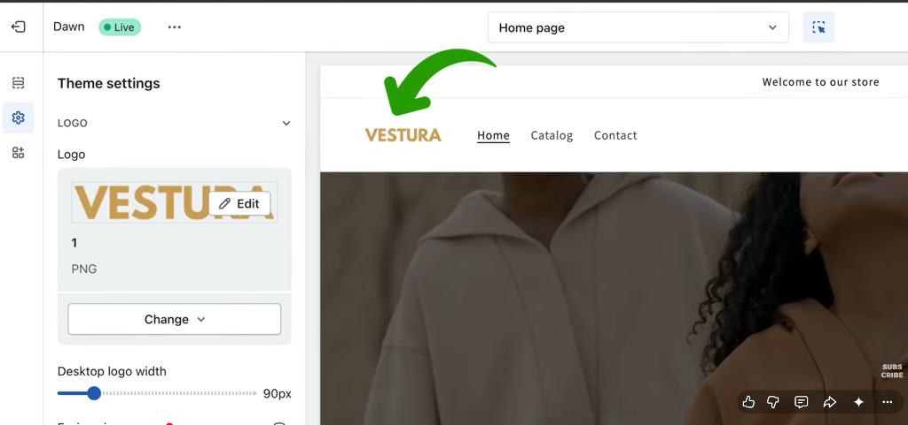

### 5b. Colors & Typography (Theme Settings — Color Schemes)

This screenshot shows the **Colors** category expanded inside Theme Settings, accessed via the **gear/settings cog** on the left icon ribbon (highlighted in blue at the top of the ribbon).

**About the left icon ribbon (3 icons):**

- 🔲 **Top icon** (list/sections): Switches sidebar to the **Outline** view — showing the Header / Template / Footer section tree.
- ⚙️ **Middle icon** (gear/cog, currently active): Switches sidebar to **Theme Settings** — global design tokens (Logo, Colors, Typography, Layout, etc.).
- 🔳 **Bottom icon** "App blocks". the question for kloudshop is how to use it since it does not have a3rd part app ecosystem. but yes, app although native in kloudshop can and do brinng in additional blocks  that can be added to storefront e.g. a "product bundler" app that just allows customers to bundle in an additional cart item (selecting from a list of options made available by the merchant for this app) to  add to cart at pennies on pieces. 

**Color Schemes — a key concept:**
Shopify does not use a single set of global colors. Instead it uses **Color Schemes** — pre-defined named palettes (Scheme 1 through Scheme 5 visible here) that can each be independently applied to any section on any page. Each scheme card shows an "Aa" preview with the scheme's background, text color, and a button-color swatch strip.

- Schemes 1–3 appear as light variations
- Scheme 4 is a dark/inverted variant
- **Scheme 5** is the currently active/selected one (highlighted in blue dashed border)
- **"+ Add Scheme"** — merchants can create additional custom schemes beyond the defaults

**All Theme Settings categories visible (full list):**
| Category | Status shown | Purpose |
| :--- | :--- | :--- |
| LOGO | Collapsed | Logo image, width, favicon |
| COLORS | **Expanded** | Color schemes for sections |
| TYPOGRAPHY | Collapsed | Font families and sizes |
| LAYOUT | Collapsed | Page width, spacing |
| ANIMATIONS | Collapsed | Scroll/load animation toggles |
| BUTTONS | Collapsed | Button shape, border radius |
| VARIANT PILLS | Collapsed | Product variant selector style |
| INPUTS | Collapsed | Form input styling |

> **Note**: "Color Schemes" is a fundamentally different model from a flat global palette. Each section can independently use a different scheme, allowing sections of a page to alternate between light and dark backgrounds while staying brand-consistent. This is a very powerful concept worth replicating in KloudShop.

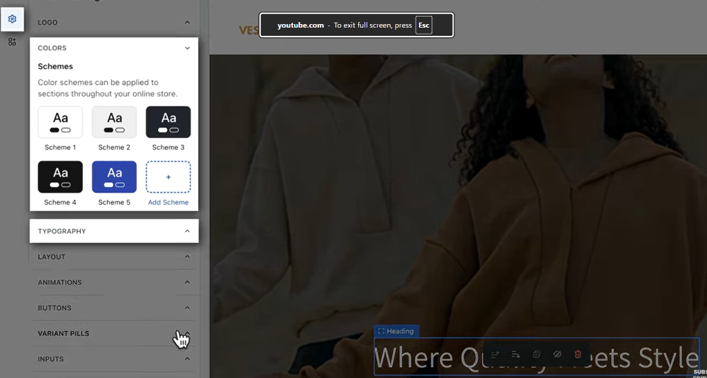

### Comparison Table

| Style Configuration          | Shopify Theme Settings                                                                                                                | Kloudshop Old Design Tokens                                              | Analysis & Mapping                                                                   |
|:---------------------------- |:------------------------------------------------------------------------------------------------------------------------------------- |:------------------------------------------------------------------------ |:------------------------------------------------------------------------------------ |
| **UI Toggle Access**         | Persistent vertical icon ribbon on the left edge. Clicking the gear icon swaps the left sidebar from outline view to global settings. | Token list in the right properties sidebar when no node was selected.    | Shopify's icon ribbon is a clean pattern — same sidebar space serves multiple modes. |
| **Categorization Structure** | Grouped into 10 collapsible subcategories: Logo, Colors, Typography, Buttons, Inputs, Cards, etc.                                     | Single flat list of design parameters (colors, font, background shader). | Shopify's grouping is far more organized and scalable for a full design system.      |

---

## 6. Actionable Recommendations for Kloudshop (Re-Engineering Goals)

> The following recommendations form the basis of the upcoming theme customization re-engineering effort. The old WYSIWYG 3-panel editor will be replaced by a Shopify-inspired approach.

1. **Adopt a 2-Panel Layout (Sidebar + Canvas)**:
   - Replace the 3-panel editor with a left sidebar that toggles between "Outline" and "Settings" modes, plus a dominant center canvas. No permanent right panel.
2. **Section Grouping in the Outline**:
   - Organize the left sidebar outline into `Header`, `Sections` (body), and `Footer` accordion groups matching Shopify's structure.
3. **Section/Block Vocabulary**:
   - Replace the abstract node/slot/primitive model with plain "Section" and "Block" concepts that merchants can intuitively understand.
4. **Inline Property Panel (Left Sidebar Swap)**:
   - When a section or block is clicked (on canvas or in outline), the left sidebar transitions to show that element's properties. A "Back" arrow returns to the outline.
5. **Add Standalone Analytics Tab**:
   - Extract detailed charts from Overview into a dedicated "Analytics" sidebar item.
6. **Establish a Content Hub**:
   - Evolve "Blog" into a broader "Content" hub for managing uploaded images/videos and articles.
7. **Visual Asset Pickers**:
   - Replace plain URL text inputs with visual card selectors (thumbnail, filename, Change/Remove actions).
8. **Centralized Media Browser Modal**:
   - Build a popup modal for choosing images: supports drag-and-drop upload, search, and a grid of previously uploaded files (backed by `/internal/media/upload` API).
9. **Contextual Helper Text**:
   - Add italicized hints below complex properties (e.g., *"Use 3:2 ratio for banners"*).
10. **Vertical Icon Ribbon for Mode Switching**:
    - Left edge icon ribbon to switch between Outline, Global Theme Settings, and future modes (e.g., Page Navigator, App Blocks).
11. **Global Theme Settings with Categories**:
    - Design tokens split into semantic collapsible groups: Colors, Typography, Buttons, Inputs, Cards, Layout.
12. **Rich-Text Formatting for Text Blocks**:
    - Add Bold, Italic, Link inline formatting to text block inputs.
13. **Single "Save" with Live Preview + Draft/Publish Safety**:
    - Consider Shopify's simplicity but keep KloudShop's safe draft/publish distinction. Explore auto-save-to-draft with an explicit "Publish" action only.
14. **Color Schemes per Section**:
    - Replace the flat global token palette with named Color Schemes (e.g., Light, Dark, Accent) that can be applied independently to each section, allowing page sections to alternate visual treatments while staying brand-consistent.
15. **Theme Settings as a Full Design System**:
    - Expand beyond colors/fonts to include Layout (page width, spacing), Animations, Buttons, Variant Pills, Inputs — mirroring Shopify's 8+ category structure.
16. **Dynamic Link Mapping in Footer Blocks**:
    - Enable theme block schemas to specify dynamic data-source bindings. For example, a menu block inside the footer region should be configurable to pull links directly from admin-defined collections, such as legal store policies or default footer menus.
17. **Dynamic Gateway Badge Rendering**:
    - Implement a component helper on storefront layout files that checks active tenant payment gateway configurations. If a gateway (e.g. PayPal) is configured and active, automatically render its official logo badge in the footer metadata strip without manual HTML code editing.

---

## 7. Returning to Admin — Themes Page & Navigating to Products

### Context

The merchant has exited the theme customizer (clicked the save button in theme editor and then the exit editor icon in the top-left of the customizer) and returned to the **Online Store → Themes** page. Notice:

- The theme card now shows **"Last saved: 6 minutes ago"** — Shopify auto-saved the session's changes on exit.
- The theme preview thumbnails are now **updated** — the desktop preview shows the VESTURA logo and a darker banner, and the mobile preview shows "Where Quality Meets Style" heading and a "Shop it" button — reflecting all the edits made during the customization session.
- The merchant is now hovering over **"Products"** in the main left sidebar, about to navigate there to add products to the store.

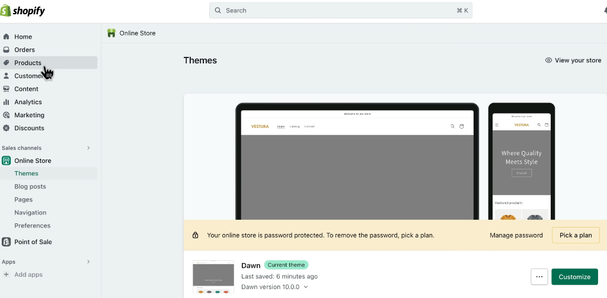

### Key Architectural Insight: Theme vs. Content are Completely Separate Concerns

This is perhaps the most important conceptual point in Shopify's model:

> **In Shopify, products are NOT part of the theme.** You add products to the store's catalog, and the theme dynamically pulls them in using Liquid templates. The theme just says "display a Featured Collection section here" — which products appear is controlled by the merchant's catalog and collection settings, not the theme editor.

| Concern             | Where it lives in Shopify                | How theme accesses it                           |
|:------------------- |:---------------------------------------- |:----------------------------------------------- |
| Products / catalog  | Products sidebar → separate admin screen | Theme uses `{{ collection.products }}` Liquid   |
| Collections         | Products → Collections                   | Theme binds a section to a collection ID        |
| Blog posts          | Content → Blog posts                     | Theme renders blog via `{{ blog.articles }}`    |
| Navigation menus    | Online Store → Navigation                | Theme renders `{{ linklists.main-menu.links }}` |
| Logo / brand assets | Theme Settings → Logo                    | Stored as theme asset, referenced via settings  |
| Layout & colors     | Theme Settings → Colors / Typography     | Stored as theme settings JSON                   |

### How This Maps to KloudShop — Analysis

KloudShop already has the same **separation** at the sidebar level:

- **Catalog** = Products
- **Themes** = Theme customization
- **Blog** = Content

However, the crucial difference is in **how the theme displays data**:

| Model                        | Shopify                                                                                                                                | KloudShop (current)                                                                                                                 |
|:---------------------------- |:-------------------------------------------------------------------------------------------------------------------------------------- |:----------------------------------------------------------------------------------------------------------------------------------- |
| **Product display in theme** | Dynamic — theme template queries the product catalog at render time. Drop in a "Featured Collection" section, pick a collection, done. | Static-ish — merchant configures which product data appears in specific component slots inside the WYSIWYG editor. Tightly coupled. |
| **Content independence**     | A merchant can swap themes entirely and all their products, blog posts, and navigation menus carry over seamlessly.                    | Switching themes may require reconfiguring data bindings in the editor.                                                             |
| **Data binding**             | Implicit — theme templates know how to query catalog data. Merchant only chooses *which* collection or product to feature.             | Explicit — merchant manually maps data to layout nodes.                                                                             |

**Recommendation for KloudShop**: When we re-engineer the theme customizer, sections that display products (e.g. "Featured Products", "New Arrivals") should simply let the merchant **pick a collection or a product tag** from a dropdown — and the theme renders it dynamically from the existing catalog. The merchant should never have to copy-paste product IDs or re-enter product data inside the theme editor.

---

## 8. Product Management & Catalog

### 8a. Add Product Screen & AI Description Generation

> **Note**: This section steps outside the pure theme customization journey and into general product management. Included because it reveals UX patterns and AI features relevant to KloudShop's product editor roadmap.

The merchant is on the "Add product" screen for "VESTURA Classic Hoodie". They have clicked the **AI sparkle button (✦)** in the description editor toolbar, opening an inline popup for AI-assisted content generation.

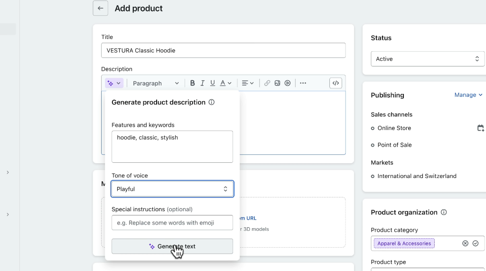

### What this screen reveals

**1. Product form layout (left panel):**

- **Title**: Plain text input — single, prominent field.
- **Description**: Full rich-text editor with toolbar: Paragraph style, Bold, Italic, Underline, Font colour, Alignment, Link, Emoji, `<>` (HTML view), `···` overflow.
- The **AI button (✦)** lives directly in the toolbar — not buried in a separate menu.

**2. AI "Generate product description" popup:**
| Field                               | What it does                                               |
| :---------------------------------- | :--------------------------------------------------------- |
| **Features and keywords**           | Free-text seed: *"hoodie, classic, stylish"*               |
| **Tone of voice**                   | Dropdown: Playful, Professional, Persuasive, etc.          |
| **Special instructions** (optional) | Open override: *"Replace some words with emoji"*           |
| **✦ Generate text**                 | Submits to Shopify AI; inserts copy into description field |

**3. Right sidebar:**

- **Status**: Active / Draft dropdown.
- **Sales channels**: Per-channel publishing with scheduling (Online Store, Point of Sale).
- **Markets**: Geo-targeting (International and Switzerland).
- **Product organization**: Category ("Apparel & Accessories" — structured taxonomy), Product type.

### Comparison with KloudShop's Product Editor

| Feature                       | Shopify                                     | KloudShop (`product_editor_view.dart`)                                           | Gap / Opportunity                                                                                                     |
|:----------------------------- |:------------------------------------------- |:-------------------------------------------------------------------------------- |:--------------------------------------------------------------------------------------------------------------------- |
| **Description editor**        | Full rich-text WYSIWYG with toolbar.        | Basic text area.                                                                 | Upgrade to proper rich-text editor.                                                                                   |
| **AI description generation** | Built-in sparkle icon + keyword/tone popup. | Not present (post-MVP).                                                          | High-value. Integrate post-MVP via Gemini/OpenAI API.                                                                 |
| **Product variants**          | Standard Size × Color grid.                 | **Unlimited variants + custom shipping attributes per variant** — more powerful. | KloudShop's variant model is a genuine differentiator. UI must surface this power without overwhelming new merchants. |
| **Status toggle**             | Right sidebar dropdown, prominent.          | Present — ensure it's equally prominent.                                         | Minor UX polish.                                                                                                      |
| **Product categorization**    | Structured Google Product Taxonomy picker.  | Freeform tags/categories.                                                        | Consider structured taxonomy for analytics and future ad integrations.                                                |

### Post-MVP AI Features for KloudShop Roadmap

```NOTE: this section was introduced just to park few architectural insights developed during building this artifact that have application-wide relevance. they DO NOT necessarily belong to "Shopify vs. Kloudshop Themeing Experience & UX Analysis" intent but arise as a result/aftermath of the analysis ```

When adding AI description generation:

1. **✦ sparkle icon** directly in the description toolbar — not hidden in settings.
2. **Inline popup panel**: keywords field, tone of voice dropdown, optional instructions.
3. **"Generate text"** inserts directly into the field — merchant edits before saving.
4. Tones to offer: Professional, Playful, Persuasive, Minimalist, Luxury.

---

### 8b. Product Right Sidebar — Publishing, Organization & Collections

#### Card 1: Status & Publishing

- **Status** (Active / Draft) — store-wide product visibility.
- **Sales channels** — per-channel publishing with scheduling (post-MVP for KloudShop).
- **Markets** — geographic targeting per product (post-MVP).

*Pattern to adopt now*: The two-column product editor layout (main content left, status/meta right sidebar) is cleaner than a single-column form. KloudShop's product editor should adopt this.

#### Card 2: Product Organization

- **Product category**: Structured, standardised taxonomy (Shopify uses Google Product Taxonomy). Powers tax settings, analytics, ad feed exports.
- **Product type**: Freeform merchant label (e.g. "Hoodie").

*KloudShop gap*: Currently uses freeform tags. A structured taxonomy — even a simplified KloudShop-defined one — unlocks better storefront filtering, analytics, and future marketplace integrations.

#### Card 3: Collections ← Architecturally Critical

Collections in Shopify are **named product groupings** that:

- Exist as first-class database entities (not just tags)
- Can be **manual** (hand-picked) or **automated** (rule-based: tag = "sale", price < 500)
- Are the **binding point between the theme and the catalog** — theme sections reference a collection by ID, not individual product IDs

> [!NOTE]
> **Collections Management Entry Point**: This screen under **Products → Collections** displays the merchant's active collection directory. Each card lists a visual thumbnail, collection Title (e.g. Shorts, Tshirts, Hoodies), Product counts, and automated condition rules, serving as the data feed source for customizer widgets.

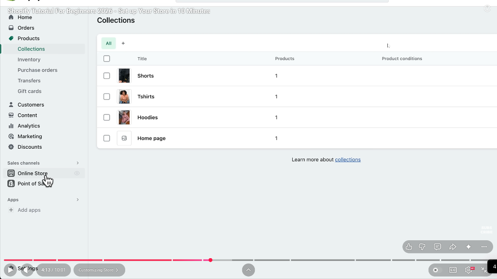

> [!NOTE]
> **Manual Product Association (Add Products Modal)**: This screen captures the modal popup window when manually associating products to a collection (e.g., searching "hoo" to select and link "VESTURA Classic Hoodie"). It verifies that manual collections rely on query-based multi-select search modals to bind catalog product IDs to the collection grouping.

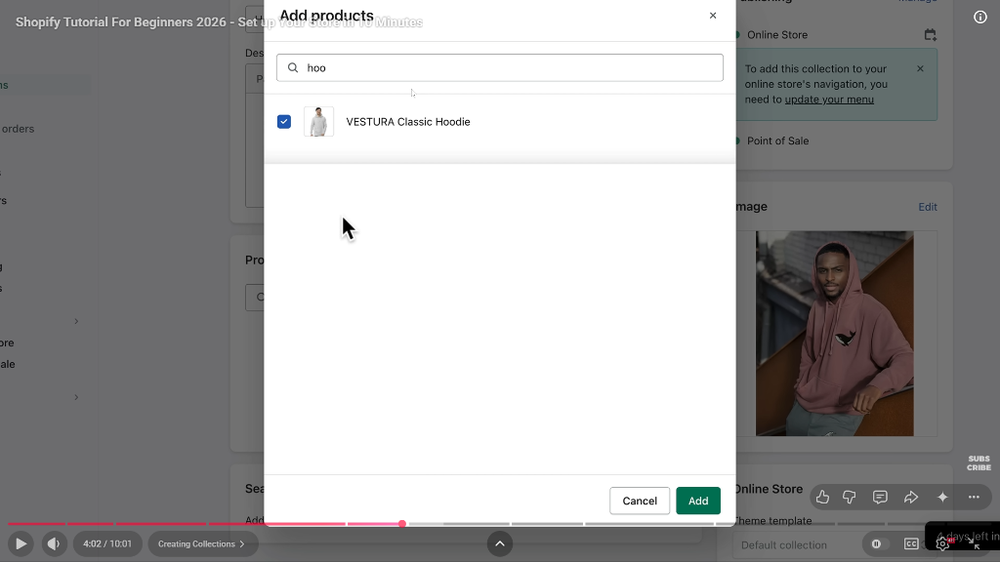

**Examples by merchant type:**
| Store type               | Example collections                                                    |
| :----------------------- | :--------------------------------------------------------------------- |
| Apparel                  | Winter Wear, Kids Wear, Party Wear, Essentials, Sale                   |
| Mountaineering / Outdoor | Mountaineering Gear → Alpine Climate Wear, Climbing Gear, Fishing Gear |
| Electronics              | Smartphones, Accessories, Refurbished, Best Sellers                    |
| Home & Living            | Living Room, Bedroom, Outdoor, New Arrivals                            |

Hierarchical potential: "Mountaineering Gear" as parent → "Alpine Climate Wear" as child. Requires `parent_collection_id` in schema.

#### Architectural Insight for KloudShop

> KloudShop currently lacks a formal **Collections** model. This is a gap affecting both product management and theme customization.

**Why this matters for the theme customizer re-engineering:**

- "Featured Products" / "Collection Grid" theme sections must bind to a collection ID — not a hardcoded product list.
- Without Collections, the theme shows all products (useless) or forces manual product ID entry (fragile).

**Parked for schema-level action** — see `FCL-008` in [Feature-catalogue-parking-lot.md](../Feature-catalogue-parking-lot.md).

---

## 9. Store Upgrades, Billing, & Subscription Flow

### Shopify Plan Confirmation & Billing Setup Screen

This screen is presented to merchants who have finished initial catalog setup/onboarding and are transitioning to a paid plan. It highlights the billing cycle structure, timeline of charges, payment methods, and package details.

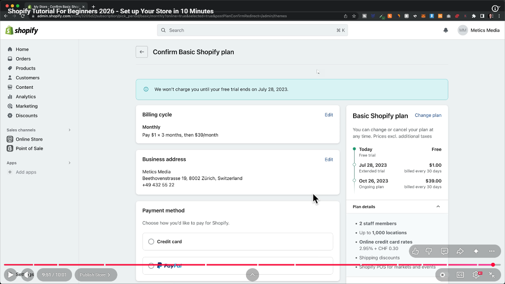

### Comparison Table

| Element / Flow                | Shopify (As Shown)                                                                                                                                           | Kloudshop (Plan)                                                    | Analysis & Mapping                                                                                        |
|:----------------------------- |:------------------------------------------------------------------------------------------------------------------------------------------------------------ |:------------------------------------------------------------------- |:--------------------------------------------------------------------------------------------------------- |
| **Billing Cycle Info**        | Clear breakdown of pricing promos (e.g., "Pay $1 × 3 months, then $39/month") with a direct "Edit" option.                                                   | Standard billing cycle setting inside subscription management.      | Shopify handles discount/tier promo transparency beautifully right at confirmation.                       |
| **Trial Timeline Visualizer** | A vertical timeline graph outlining trial progression: Today (Free) $\rightarrow$ Future date (Promo Trial: $1.00) $\rightarrow$ End date (Ongoing: $39.00). | A simple text list or invoice breakdown in tenant billing settings. | The visual timeline graph builds immediate trust and removes surprises. Highly recommended for Kloudshop. |
| **Plan Details Breakdown**    | Collapsible detailed accordion summarizing tier allowances (e.g., staff members, locations, credit card transaction rates, shipping discounts).              | Static comparison tables or pricing sheets.                         | Keeping tier allowances visible inline at the moment of payment reduces cart abandonment.                 |
| **Payment Options**           | Clean selectors for Credit Card and PayPal, embedded inline inside cards.                                                                                    | Stripe / merchant gateway integrations.                             | Comparable setup. Shopify embeds the options inside a unified payment form card.                          |

### Architectural Recommendations for Kloudshop

1. **Visual Subscription Timelines**: Implement a visual step-graph/timeline on the checkout/upgrade screen showing when the trial ends, when the promotion/discount expires, and when full billing begins.
2. **Tier-Limit Disclosures**: Provide an inline accordion breakdown of what is included (e.g., staff accounts, custom domain allowances) during confirmation so merchants know exactly what they are paying for.

---

## 10. Post-Customization Setup Checklist & Store Launch (Publishing)

### Shopify Setup Guide & Launch Readiness

Once core theme customizations are saved and products are populated, Shopify displays a **Setup Guide** checklist on the Home dashboard to track remaining steps before the store is fully ready to open to the public. 

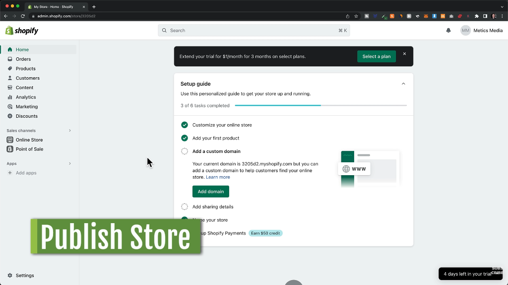

### Comparison Table

| Element / Flow                         | Shopify (As Shown)                                                                                                                         | Kloudshop (Current)                                                                                           | Analysis & Mapping                                                                                                     |
|:-------------------------------------- |:------------------------------------------------------------------------------------------------------------------------------------------ |:------------------------------------------------------------------------------------------------------------- |:---------------------------------------------------------------------------------------------------------------------- |
| **Interactive Progress Guide**         | A "Setup guide" section showing `X of Y tasks completed` accompanied by a progress bar.                                                    | Flat overview page with standard graphs and alerts.                                                           | Progress bars and checklist metrics reduce launch anxiety by giving merchants a clear finish line.                     |
| **Task Detail Progressive Disclosure** | Clicking a task in the list expands details inline (e.g., detailing the temporary domain and offering an "Add domain" primary CTA button). | Actions are scattered across different navigation settings (e.g., Domains in settings, payments in settings). | Shopify keeps the merchant focused by exposing descriptions and actions directly within the list.                      |
| **Milestone Mapping**                  | Checklist covers: Customizing theme, adding products, custom domain mapping, sharing details, naming store, and setting up payments.       | No centralized checklist to track launch status.                                                              | Guidance on payments, domains, and store metadata are essential to ensure the store is functional on day one.          |
| **Password Protection Gate**           | Trial stores are password-protected by default. The guide is the gateway to "Publishing" (removing the password).                          | Store is public/live as soon as products are active; no password mode exists.                                 | While auto-publish is simple, a "maintenance/coming soon password" state is highly requested for merchants setting up. |

### Architectural Recommendations for Kloudshop

1. **Dashboard Setup Guide Checklist**: Build a collapsible launch checklist on the Overview dashboard for new accounts. Keep it simple: Theme Customized, Catalog Populated, Custom Domain Added, Payments Active.
2. **Inline Guidance CTAs**: Instead of forcing users to search through settings submenus, place direct CTAs (like "Connect Domain" or "Link Payment Account") inline inside the checklist cards.
3. **Coming Soon / Password Mode**: Introduce a simple tenant toggle to keep the storefront behind a customizable "Under Construction / Password" page during initial design phases.

---

## 11. Domain Management & DNS Mapping

### Shopify Settings — Domains Page

This is the screen under **Settings → Domains** where merchants manage how customers access their online storefront. It provides clear options for buying new domains or mapping external custom domains.

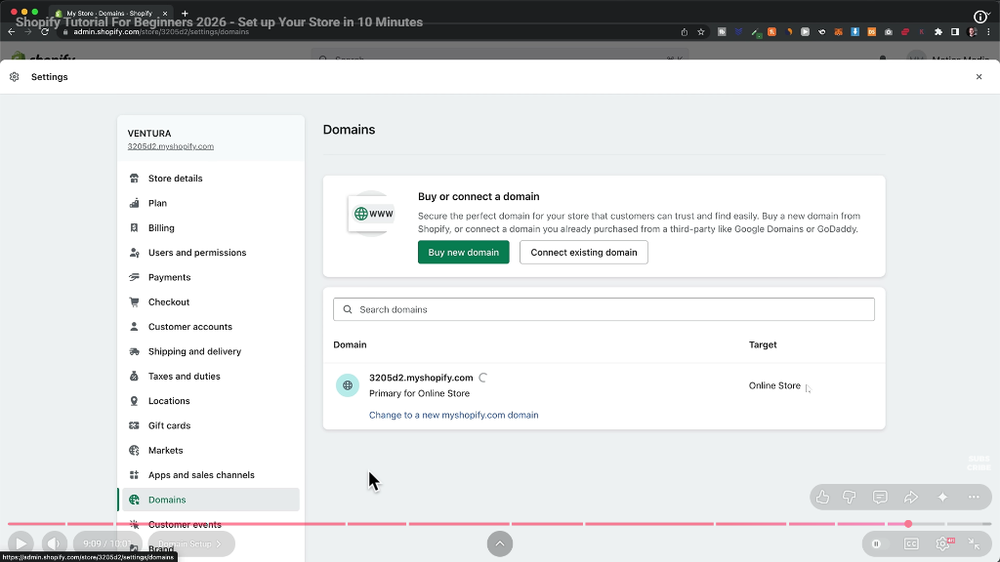

### Comparison Table

| Element / Flow                      | Shopify (As Shown)                                                                                              | Kloudshop (Current)                                                                                               | Analysis & Mapping                                                                                                                                                                            |
|:----------------------------------- |:--------------------------------------------------------------------------------------------------------------- |:----------------------------------------------------------------------------------------------------------------- |:--------------------------------------------------------------------------------------------------------------------------------------------------------------------------------------------- |
| **Buy vs. Connect Split**           | Two clear actions: "Buy new domain" (in-platform purchase) and "Connect existing domain" (third-party routing). | Only manual setup instructions for third-party domains.                                                           | Consolidated registrar integrations (e.g. via GoDaddy or Namecheap APIs) is a massive convenience post-MVP. MVP only requires third-party CNAME/A record mapping.                             |
| **Default Subdomain Customization** | Provides a free default `<store-name>.myshopify.com` subdomain, with an inline link to rename it.               | Provides a free default `<tenant>.kloudshop.com` subdomain, but renaming is handled via support or db migrations. | Allowing merchants to change their default subdomain name during setup prevents tenant recreation when store name changes.                                                                    |
| **Target Storefront Mapping**       | Lists the domain and its routing target (e.g., target = "Online Store").                                        | Domain maps globally to the tenant storefront.                                                                    | Mapping domains to targets will be critical for Kloudshop once B2B buyer portals and B2C storefronts are split onto separate domains/channels (e.g., `shop.brand.com` vs `portal.brand.com`). |

### Architectural Recommendations for Kloudshop

1. **Self-Service Subdomain Renaming**: Allow merchants to change their default `*.kloudshop.com` subdomain name from the admin settings page (with checks for uniqueness).
2. **DNS Validation Tools**: When connecting an existing domain, provide a "Verify Connection" utility that queries DNS servers to check if the CNAME or A records are correctly pointed to Kloudshop's servers before confirming.
3. **Target Routing**: Design the domain database tables to support target mapping (e.g. mapping `domain_id` to a specific channel/storefront) to support separate B2B/B2C domains in the future.

---

## 12. Store Details, Currency & Payout Settings

### Shopify Settings — Store Details & Address Panels

This section manages core tenant-level meta information including primary currency selection and the default business address.

#### 1. Store Currency Settings

> [!NOTE]
> This screen under **Settings → Store details** manages general storefront settings including currency code settings.

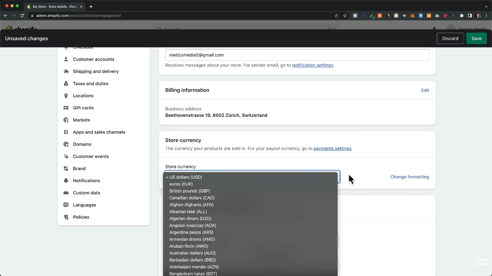

#### 2. Default Business Address Setup

> [!NOTE]
> This modal popup appears during payment setup or general configuration to collect default business details (country, name, street address, postal code, city, and phone number). This information acts as the merchant's billing address and the default shipping origin coordinate.

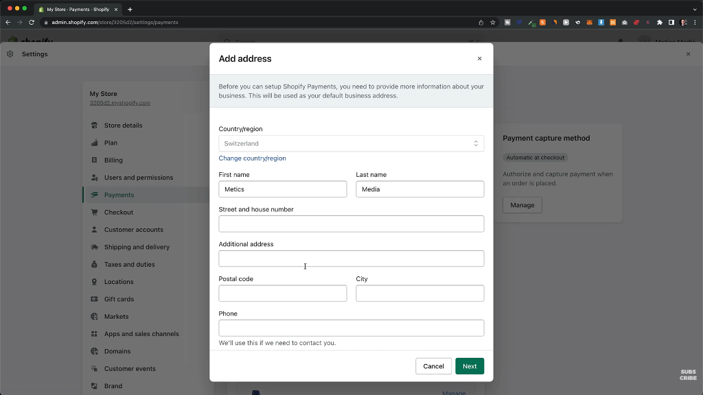

### Comparison Table

| Element / Flow                                  | Shopify (As Shown)                                                                                                                  | Kloudshop (Current)                                                                                | Analysis & Mapping                                                                                                                                                         |
|:----------------------------------------------- |:----------------------------------------------------------------------------------------------------------------------------------- |:-------------------------------------------------------------------------------------------------- |:-------------------------------------------------------------------------------------------------------------------------------------------------------------------------- |
| **Unified Currency Dropdown**                   | Standardized currency selector (e.g., USD, EUR, GBP) containing localized symbols and codes.                                        | Database defaults to USD or single tenant currency without runtime selection tools.                | A global currency registry is required to format catalog and checkout prices cleanly.                                                                                      |
| **Separation of Catalog vs. Payout Currencies** | States explicitly: *"The currency your products are sold in. For your payout currency, go to payments settings."*                   | Single currency maps across both catalog pricing and payouts.                                      | Tying the product display currency (pricing) separately from the gateway settlement currency (payouts) allows merchants to capture foreign orders and receive local funds. |
| **Currency Format Customization**               | "Change formatting" link redirects to configure how money displays (e.g. `$100.00` vs `USD 100` vs `100 kr`).                       | Standard hardcoded formatting templates.                                                           | Supporting decimal formatting options, symbol positioning, and localized currency strings is critical for international conversions.                                       |
| **Default Business Address Entry**              | Modal popup forces collection of complete address fields (street, city, country, phone, zip) prior to enabling processing gateways. | Stored as optional, flat text fields without strict structural validation gates during onboarding. | Enforcing standard address fields during setup prevents down-stream checkout failures on shipping carrier quotes or automatic tax generation.                              |
| **Address Reuse Utility**                       | Address collected once is mapped across Shopify Payments, shipping profiles (origins), tax zones, and invoice billing blocks.       | Individual modules (shipping origin vs. billing address) require manual, repetitive setup.         | Mapping a central `default_business_address` prevents manual data entry errors and aligns fulfillment origins with billing identities automatically.                       |

### Architectural Recommendations for Kloudshop

1. **Tenant Base Currency Configuration**: Store a `currency_code` (ISO 4217, e.g. `USD`, `EUR`) on the tenant model. Allow this to be configured during initial store setup.
2. **Currency Presentation Formatter**: Create a robust money formatter utility that parses formatting strings (e.g. `{{amount_no_decimals}}`, `{{amount_with_comma_separator}}`) per merchant settings, rather than hardcoding price displays.
3. **Structured Tenant Address Schema**: Define a structured database model for `TenantAddress` (e.g. `street_1`, `street_2`, `city`, `state`, `postal_code`, `country`, `phone`). Require this relation on the tenant record.
4. **Onboarding Validation Gates**: Add block validations that check for the presence of a complete `TenantAddress` before allowing the merchant to save custom shipping zones or configure checkout processors, ensuring the rating engine has a valid shipping origin coordinate.

---

### 12a. Payment Gateways, Capture Methods & Transaction Fees

This section details how merchants configure customer-facing payment gateways, capture methods, and external express checkout channels.

#### 1. True Entry Point Payments Dashboard (Empty State)

> [!NOTE]
> This is the initial, unconfigured state of the Payments settings dashboard. It displays the primary landing card prompting the merchant to "Activate Shopify Payments" to see competitive credit card rates, and includes a link to "See all other providers" to set up secondary gateways.

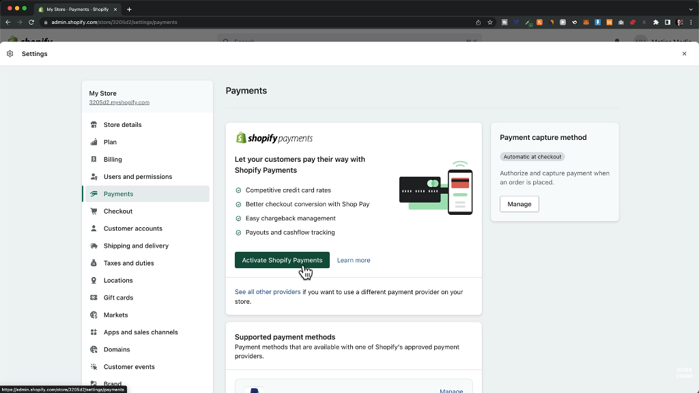

#### 2. Configured Payments Dashboard (Setup Incomplete)

> [!NOTE]
> This is the primary Payments settings screen after activation is initiated. It manages native provider settings (Shopify Payments, showing accepted cards), transaction fee structures, credit card rates, and payment capture methods (such as "Automatic at checkout" or manual), with an onboarding alert showing "Complete account setup".

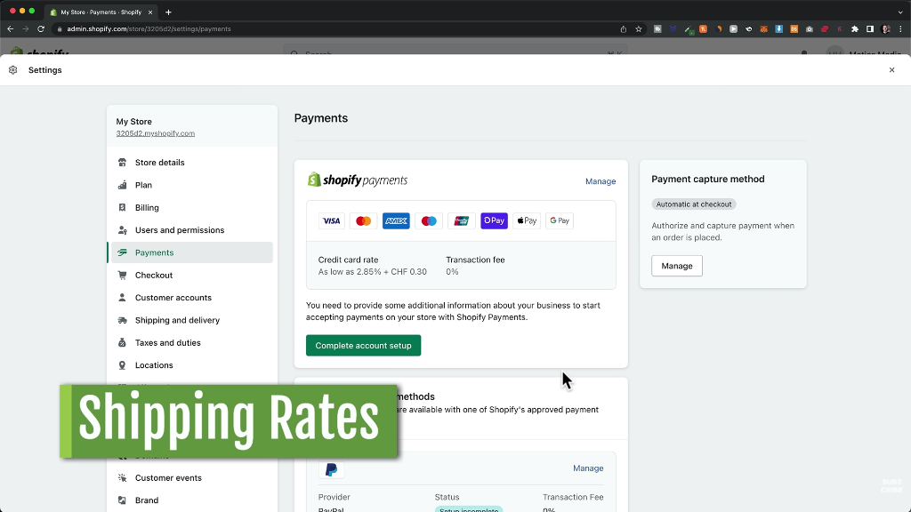

#### 3. Gateway Detail Config — PayPal Express Checkout

> [!NOTE]
> This screen shows the configuration view when setting up or managing PayPal Express Checkout. It details the connected account status ("Setup incomplete"), transaction fees (0%), and dynamic account pre-generation mapping using the store's primary registration email (`meticsmedia5@gmail.com`).

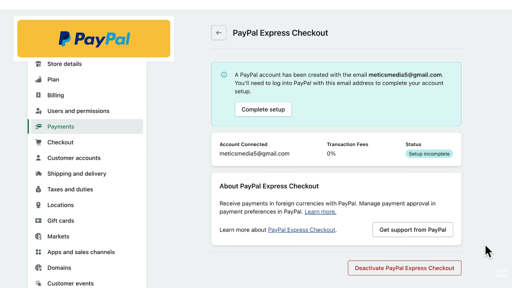

#### 4. Additional & Manual Payment Methods Settings

> [!NOTE]
> This screen details the sub-panels for discovering extra payment gateways ("Add payment methods" selector) and configuring manual offline payment channels (e.g., Cash on Delivery (COD), bank deposits), stating that orders placed through manual methods require merchant review before fulfillment.

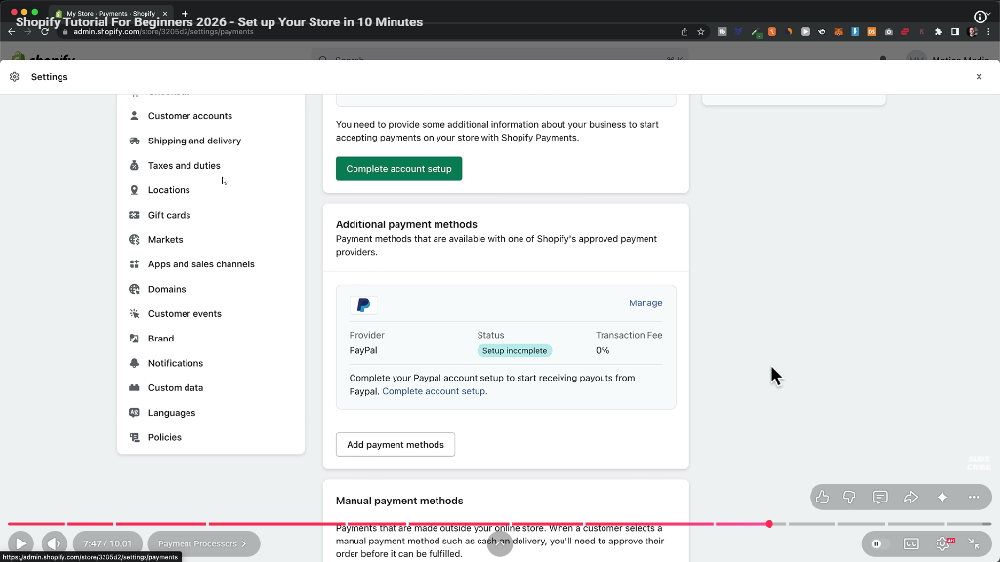

### Comparison Table

| Element / Flow                                          | Shopify (As Shown)                                                                                                                                                                 | Kloudshop (Current)                                                                                                      | Analysis & Mapping                                                                                                                                                                                       |
|:------------------------------------------------------- |:---------------------------------------------------------------------------------------------------------------------------------------------------------------------------------- |:------------------------------------------------------------------------------------------------------------------------ |:-------------------------------------------------------------------------------------------------------------------------------------------------------------------------------------------------------- |
| **Integrated Payment Gateway Setup / Activation State** | Splits onboarding into an initial promotional card ("Activate Shopify Payments") and a detailed rates dashboard once onboarding begins ("Complete account setup").                 | Gateway setup is typically a single API key field (e.g., Stripe, PayPal) with fees managed entirely on the gateway side. | A guided onboarding and promotional entry point drives merchant adoption of default gateways. Surfacing rates and benefits directly in the dashboard ensures transparency.                               |
| **Separation of Payment Capture Methods**               | Dedicated capture setting card ("Automatic at checkout" vs. manual authorization on fulfillment) with explicit tooltips.                                                           | Payments are usually captured automatically upon order placement without dynamic authorization gating options.           | Dynamic authorization splits (authorizing at checkout, capturing during fulfillment/shipping) are crucial for high-ticket items, fraud checks, or custom products where supply chain delays can happen.  |
| **Supported Methods Visualizer**                        | Displays recognizable brand badges (Visa, Mastercard, AMEX, Shopify Pay, Apple Pay, Google Pay) to represent active checkout options.                                              | Lists configured gateways as text descriptors or simple dropdown list entries.                                           | Visual badge indicators let merchants verify at a glance which checkout payment options their buyers will see, enhancing trust.                                                                          |
| **Implicit/Automated Gateway Account Mapping**          | Automatically maps the store registration email (`meticsmedia5@gmail.com`) to pre-provision a PayPal express gateway connection, requiring only external confirmation to complete. | Requires manual copy-pasting of API client keys, secrets, and merchant IDs from developer consoles.                      | Automatic mapping using the store's primary contact email significantly reduces gateway setup complexity and onboarding abandonment.                                                                     |
| **Express Checkout Deactivation Gate**                  | Exposes a clear, red-bordered button for "Deactivate PayPal Express Checkout" at the bottom of the gateway detail screen.                                                          | Requires deleting the credentials or toggling a global active/inactive gateway switch.                                   | Standardized gateway deactivation patterns ensure that disabling a third-party checkout button safely and immediately updates the live checkout layout.                                                  |
| **Manual / Offline Payment Channels**                   | Built-in controls for manual checkout methods (Cash on Delivery, Bank Transfer, custom options) that route orders to an unfulfilled state requiring manual payment confirmation.   | Hardcoded payment options or missing support for offline merchant workflows.                                             | Offline billing options are vital for regional customization (e.g. COD in developing markets). Integrating manual checkouts with order approval states prevents accidental shipments before funds clear. |
| **Extensible Gateway Discovery**                        | "Add payment methods" discovery picker allows merchants to search and activate third-party payment providers on demand.                                                            | Hardcoded dropdown list of supported payment providers.                                                                  | Providing a searchable payment gateway directory makes it easy for developers to add new gateway adapters without modifying core checkout configuration templates.                                       |

### Architectural Recommendations for Kloudshop

1. **Dynamic Capture Gating (Authorize vs. Capture)**: Implement two distinct statuses in the checkout and order schema: `authorized` and `captured`. Allow merchants to configure a global default payment capture policy (e.g., immediate capture at checkout vs. authorization only, with manual capture triggered during warehouse fulfillment).
2. **Gateway Fee Disclosures**: Store processing fee schedules on payment method configurations so that estimated payout amounts can be calculated dynamically for orders in admin sales reports.
3. **Checkout Badging Engine**: Map active checkout methods to a visual badge array on checkout layouts so customers are immediately assured of payment credibility.
4. **Auto-Provisioning Email Handlers**: Pre-populate gateway configuration fields with the tenant's primary email address so that express checkout configurations (like PayPal or Stripe Connect) can be set up in a single click.
5. **Clean Gateway Deactivation Controls**: Build a secure payment-method event broker. When a merchant deactivates a payment method in the admin panel, the broker must trigger storefront mutations to remove the express checkout buttons instantly, preventing checkout failures.
6. **Offline Order Approval Workflows**: Implement a payment status of `awaiting_payment` for offline channels (e.g. COD, Wire Transfer). Order fulfillment modules should disable fulfillment actions for these orders until an admin clicks a "Mark as Paid" action, which transitions the order status to `paid` and releases the warehouse lock.
7. **Searchable Gateway Adapter Registry**: Define a standard gateway adapter interface in the backend. Expose a discovery endpoint so the frontend settings UI can query and dynamically render setup forms for any newly registered gateway plugin.

---

## 13. Fulfillment & Shipping Rate Profiles

### Shopify Settings — Shipping & Delivery Page

Below are the entry point, configured, and detailed setup profiles for fulfillment:

#### 1. True Entry Point (Initial State)

> [!NOTE]
> This is the initial unconfigured state of the Shipping settings dashboard. It splits the general shipping rates default zones into `Domestic` and `International` and prompts the merchant to click "Manage" to configure locations and rates.

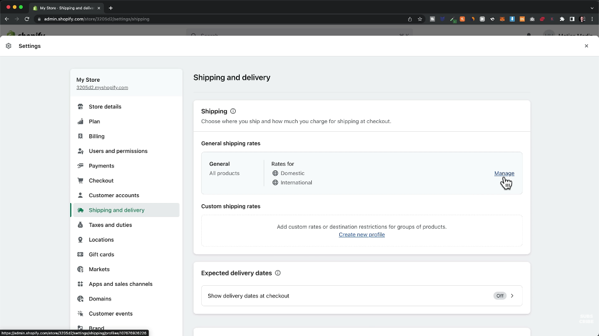

#### 2. Configured State (General Dashboard)

> [!NOTE]
> This is the configured state of the shipping dashboard, summarizing active configurations as `Rates for 2 locations -> 2 zones` once routing zones have been mapped.

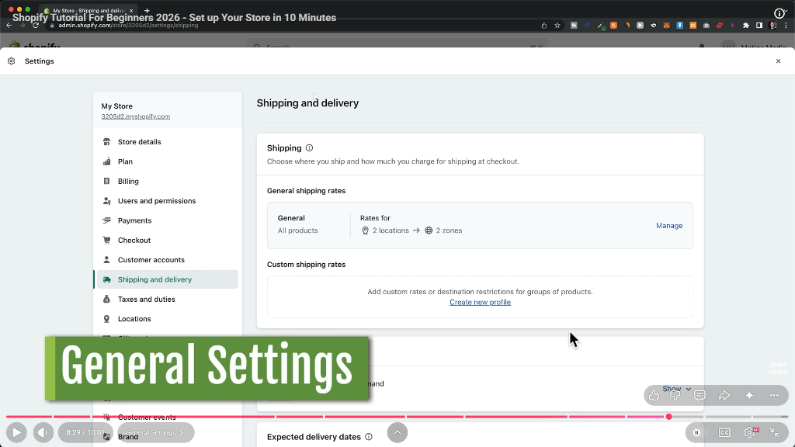

#### 3. Shipping Origins & Zonal Inactivity Alerts

> [!NOTE]
> This screen displays the details inside a specific shipping profile, listing the shipping origin (warehouse location, correlating to `Locations` settings in **[§16](#16-implied-admin-settings--navigation-map-triangulation-tracker)**) and associated shipping zones (Domestic vs. International). It surfaces inactivity checks linking directly to the `Markets` configurations in **[§16](#16-implied-admin-settings--navigation-map-triangulation-tracker)**.

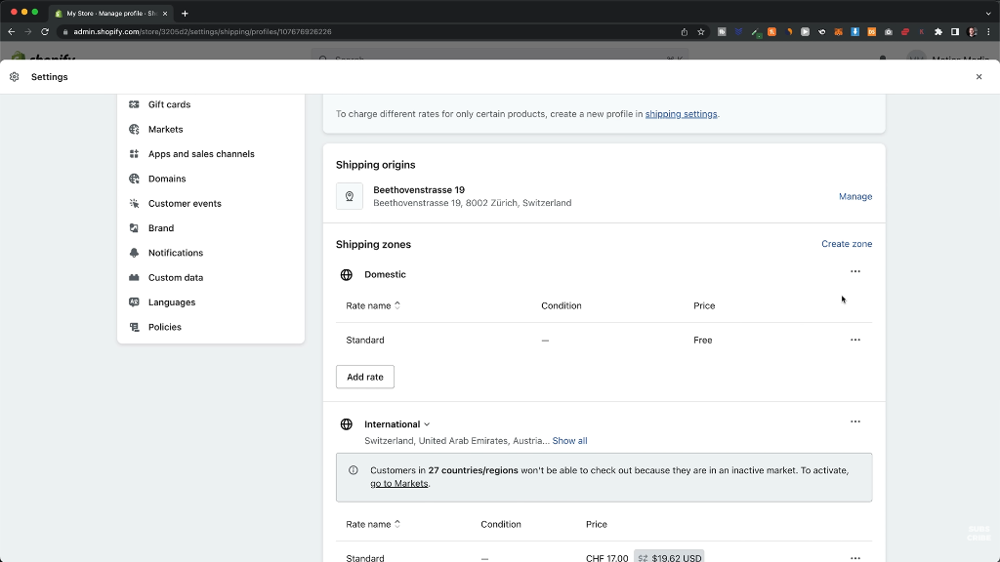

#### 4. Custom Manual Shipping Rates (Weight vs. Price)

> [!NOTE]
> This screen displays the modal popup when clicking "Add rate", allowing merchants to configure manual (flat) rates instead of third-party carrier calculations. It supports weight limits and cart basket thresholds.

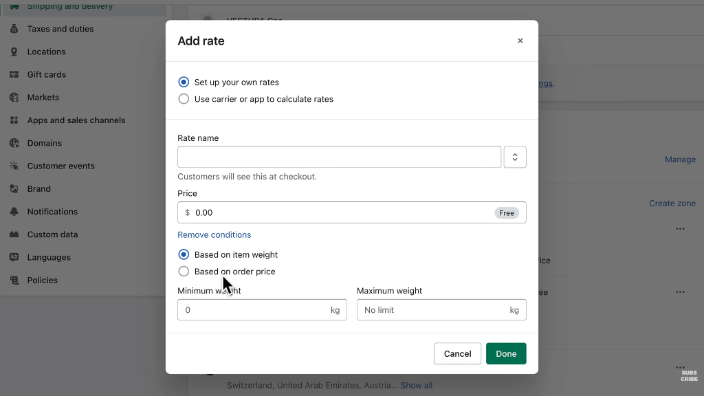

### Comparison Table

| Element / Flow                        | Shopify (As Shown)                                                                                                                              | Kloudshop (Current)                                                                            | Analysis & Mapping                                                                                                                          |
|:------------------------------------- |:----------------------------------------------------------------------------------------------------------------------------------------------- |:---------------------------------------------------------------------------------------------- |:------------------------------------------------------------------------------------------------------------------------------------------- |
| **General vs. Custom Shipping Rates** | General profile applies to all products by default. Custom profiles allow specific rules for groups of products (e.g., fragile or heavy items). | Each product variant carries its own weight and dimensions, but global rate profiles are flat. | Shopify's custom profile layout keeps shipping configuration simple by grouping products by profile, rather than forcing setup per variant. |
| **Locations and Zones Mapping**       | Groups rates in formats like `2 locations → 2 zones`.                                                                                           | Flat rules mapped directly to checkout calculation engines.                                    | Linking warehouses (locations) and regional boundaries (zones) creates a clear routing model for fulfillment.                               |
| **Tax Setup Dependency**              | Taxes and duties page (**[§14](#14-taxes-duties--international-tax-compliance)**) requires these shipping zones to compute tax liability.       | Independent checkout tax configuration.                                                        | Taxes can only be collected where shipping is enabled. Coupling shipping zones to tax regions is a vital structural pattern.                |

### Architectural Recommendations for Kloudshop

1. **Fulfillment Zone Schema**: Implement models for `ShippingProfile`, `ShippingZone`, and `ShippingRate` (e.g. flat rate, weight-based, price-based).
2. **Variant Shipping Profile Assignment**: Add a `shipping_profile_id` foreign key to variants or products to quickly assign item groups (e.g., "Heavy Goods") to specific rates, leveraging Kloudshop's native per-variant shipping capacity.
3. **Cross-Module Validation Alerts**: Implement a verification check at checkout and in settings that warns the merchant if they have shipping rates defined for a region but that region's market/channel is inactive.
4. **Conditional Flat Rates Builder**: Equip Kloudshop's shipping panel with an inline rate creator allowing flat pricing based on weight limits or checkout basket thresholds (e.g., Free Shipping for orders > $100).

---

## 14. Taxes, Duties & International Tax Compliance

### Shopify Settings — Taxes & Duties Page

Below are the entry point (upper half) and continuation (lower half) screens for configuring taxes and duties:

#### 1. Entry Point (Upper Half)

> [!NOTE]
> This is the initial entry point when clicking **Taxes and duties**. It displays the "Manage sales tax collection" card, directing merchants to configure shipping zones first. It lists country-specific collection statuses and includes regional search/sorting filters.

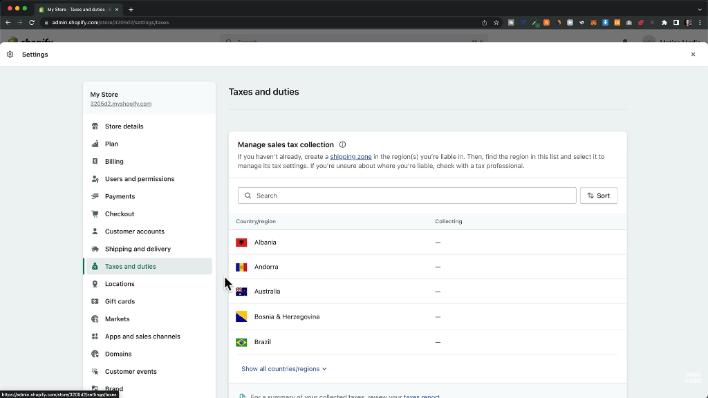

#### 2. Continuation (Lower Half)

> [!NOTE]
> This is the continuation of the Taxes and duties dashboard (scrolled down), showcasing duties upsell configurations and transaction fee disclosures.

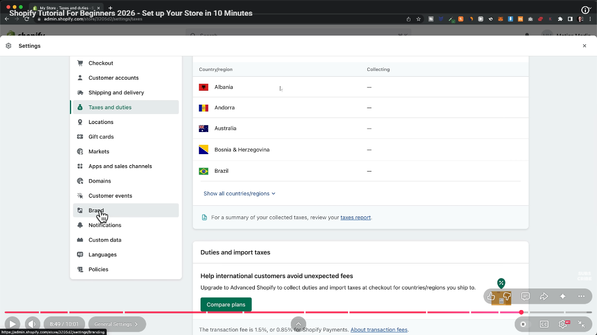

### Comparison Table

| Element / Flow                         | Shopify (As Shown)                                                                                                                   | Kloudshop (Current)                                                                                    | Analysis & Mapping                                                                                                                                             |
|:-------------------------------------- |:------------------------------------------------------------------------------------------------------------------------------------ |:------------------------------------------------------------------------------------------------------ |:-------------------------------------------------------------------------------------------------------------------------------------------------------------- |
| **Country-Specific Tax Registrations** | Shows a list of countries (Albania, Andorra, etc.) where tax collection is active or inactive.                                       | No multi-country tax registration tables; tax rate is a single default percentage or handled manually. | In international commerce, a merchant needs to declare exactly which countries they collect tax for, mapping to localized rules (e.g. EU VAT vs US sales tax). |
| **Duties & Import Fees Upsell**        | Upsells the "Advanced Shopify" plan to enable automatic calculation and collection of duties at checkout for cross-border customers. | No equivalent; cross-border duties are not calculated.                                                 | Plan-gating automated tax and customs compliance utilities is a highly effective upselling vector for premium software tiers.                                  |
| **Transaction transparency**           | States transaction fee rates (1.5%, or 0.85% for Shopify Payments) when collecting international duties.                             | No fee disclosures.                                                                                    | Clear fee breakdowns build confidence and prevent surprise bills for merchants running cross-border sales.                                                     |

### Architectural Recommendations for Kloudshop

1. **Tax Rates Table**: Add a database model mapping countries/states to tax percentages (e.g., `country_code`, `state_code`, `tax_percentage`, `collect_tax`). Query this during checkout billing calculations.
2. **Standardized Product Taxonomy Integration**: Tie product tax codes to the categories set during product listing (cross-referencing **[§8a](#8a-add-product-screen--ai-description-generation)**) so that digital goods, groceries, or apparel are taxed automatically according to local legal exemptions.
3. **Advanced Compliance Gating**: Gated features like automated tax engine calculations (e.g. via TaxJar or Avalara integrations) should be positioned behind premium Kloudshop plans to replicate Shopify's upselling strategy.

---

## 15. Branding & Centralized Brand Assets

### Shopify Settings — Brand Page

Below are the empty, populated, and color configuration states of the global brand settings dashboard:

#### 1. Empty State (Initial Brand Definition)

> [!NOTE]
> This represents the initial, empty layout of the **Settings → Brand** screen before the merchant has uploaded assets. It displays placeholder upload targets with recommended dimensions, an empty sidebar checklist, and an external integration suggestion ("No logo? Create one with Hatchful").

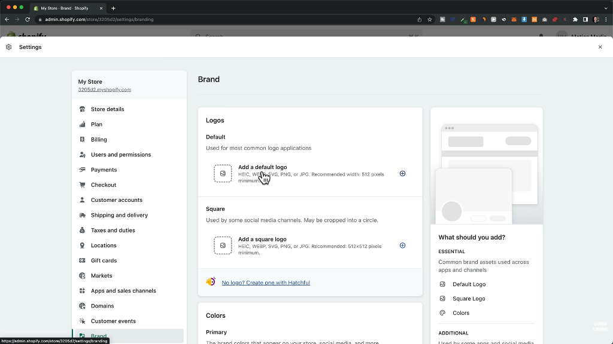

#### 2. Populated State (Active Brand Identity)

> [!NOTE]
> This settings panel serves as the data source for the logo configuration seen inside the Theme Customizer in **[§5a](file:///e:/Non_Office/Dev_Space/vibe_skool/kloudShop/specifications/shopify-theme-customization/shopify-theme-customization-analysis.md#L169-L180)**. The `VESTURA` PNG uploaded here automatically populates the theme editor's logo preview card, demonstrating the direct link between global tenant branding settings and individual theme customize views.

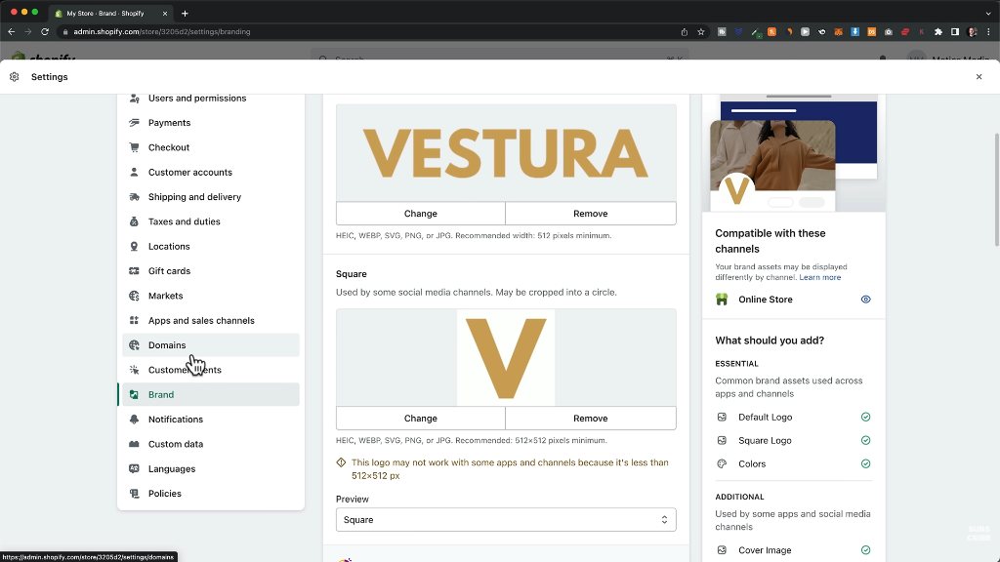

#### 3. Color & Contrast Selection

> [!NOTE]
> This captures the color selection popover inside the Brand Settings screen. The primary and secondary colors defined here automatically populate the default **Color Schemes** cards inside the Theme settings customizer (**[§5b](file:///e:/Non_Office/Dev_Space/vibe_skool/kloudShop/specifications/shopify-theme-customization/shopify-theme-customization-analysis.md#L182-L215)**).

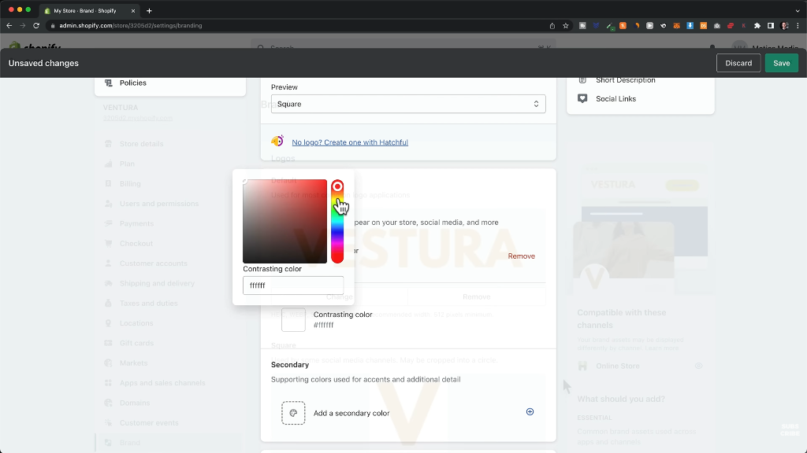

### Comparison Table

| Element / Flow                            | Shopify (As Shown)                                                                                                                                               | Kloudshop (Current)                                                                | Analysis & Mapping                                                                                                                                     |
|:----------------------------------------- |:---------------------------------------------------------------------------------------------------------------------------------------------------------------- |:---------------------------------------------------------------------------------- |:------------------------------------------------------------------------------------------------------------------------------------------------------ |
| **Centralized Brand Schema**              | Logos, colors, cover images, and taglines are defined globally once under Settings.                                                                              | Stored as ad-hoc fields in theme customization configurations or specific layouts. | Centralized brand assets prevent merchants from re-uploading logos when switching themes. It creates a unified design token base.                      |
| **Image Requirements & Warnings**         | Displays inline warnings (e.g. "This logo may not work with some apps and channels because it's less than 512x512 px") if file dimensions don't meet guidelines. | Standard file upload fields with no post-upload dimension verification warnings.   | Providing dimensional guides and warning feedback prevents merchants from uploading blurry or incorrectly sized icons.                                 |
| **Multi-Channel Compatibility Checklist** | Sidebar lists essential/additional brand checklist items (Logo, Colors, Cover Image) with checks indicating completion.                                          | Simple list of configuration fields.                                               | Checklist structures guide merchants to prepare all assets required to look professional across B2C storefronts and channels (e.g. B2B buyer portals). |
| **Visual Asset Previews**                 | Previews how logos render in different containers (Default, Square, Rounded) before applying.                                                                    | Shows standard text file names or small thumbnails.                                | Interactive previewers let merchants visualize cropping behavior immediately.                                                                          |

### Architectural Recommendations for Kloudshop

1. **Centralized Tenant Brand Guidelines**: Implement a unified `BrandSettings` model in the database that stores tenant-wide brand guidelines (logos, favicons, primary/secondary colors). Reference these in theme template rendering via a global settings context.
2. **Dimension-Aware Asset Uploads**: Add client-side and server-side dimension validation when merchants upload brand assets (especially logos and favicons), surfacing warnings if sizes are below standard recommendations (e.g., 512x512px for icons).
3. **Common Theme Design Token Binding**: Ensure theme editors bind to the centralized brand assets by default, so if a merchant updates their logo in settings, it updates globally across storefronts, emails, and invoices automatically.
4. **Contrast Ratio Auditing**: When a merchant picks a primary brand color, dynamically calculate the WCAG 2.1 contrast ratio and automatically recommend/lock a readable high-contrast text color (e.g., black or white) to prevent unreadable text overlays.
5. **Persistent Unsaved Actions Bar**: Implement a floating header banner in settings editors that locks screen exit and prompts the user to explicitly "Save" or "Discard" changes.

## 15a. Navigation Menu Builder & Custom Policy Links

This section covers the step-by-step merchant configuration journey for storefront menus, showing how links are created, resolved, and bound to handles.

#### 1. Entry Point — Add Menu Item Sidebar

> [!NOTE]
> This screen shows the navigation menu editor inside **Online Store → Navigation** when configuring the `Footer menu`. Clicking "+ Add menu item" launches a right-side drawer containing input fields for the menu item's Name and Link routing.

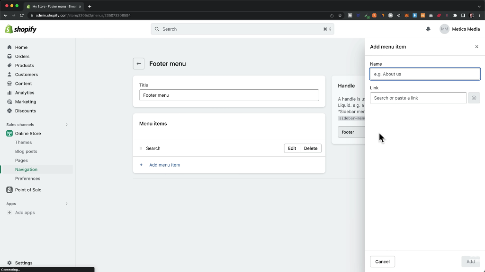

#### 2. Suggestion & Search Suggestions Popover

> [!NOTE]
> This screen captures the popover suggestions when a merchant clicks the **Link** input field. It displays a categorized list of standard store assets, specifically suggesting administrative legal policies (Contact Information, Privacy Policy, Refund Policy, etc.) configured in Settings.

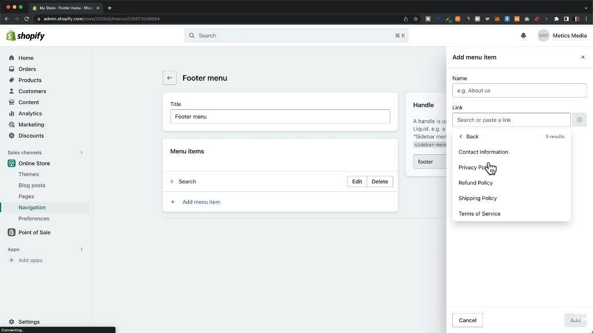

#### 3. Menu Item Link Mapping

> [!NOTE]
> This screen shows the modal state after the merchant selects a suggested link target (e.g. "Contact Information"). It automatically pre-populates the "Name" input field with the target's label to reduce manual naming effort.

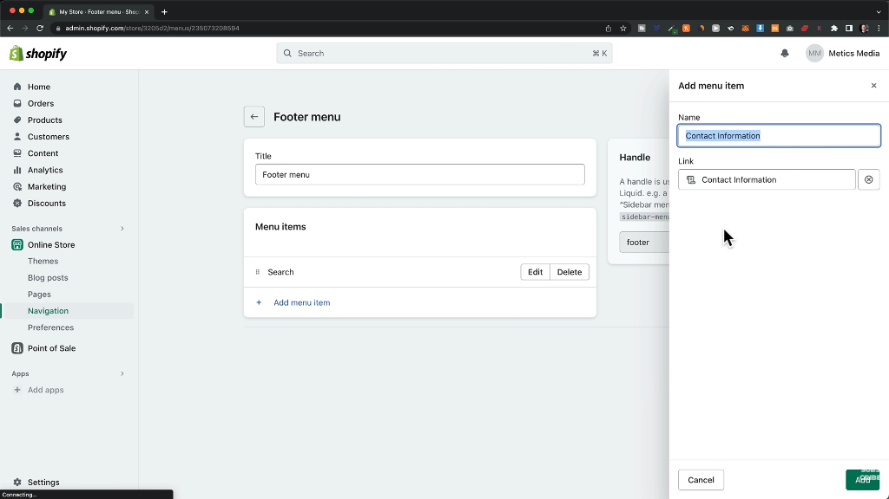

#### 4. Fully Configured Navigation Menu

> [!NOTE]
> This screen displays the completed footer menu listing all mapped links (Search, Contact Info, Policies). It lists a unique text "Handle" (value = `footer`) on the right, which Liquid theme templates use to dynamically retrieve and render this menu in the storefront footer layout.

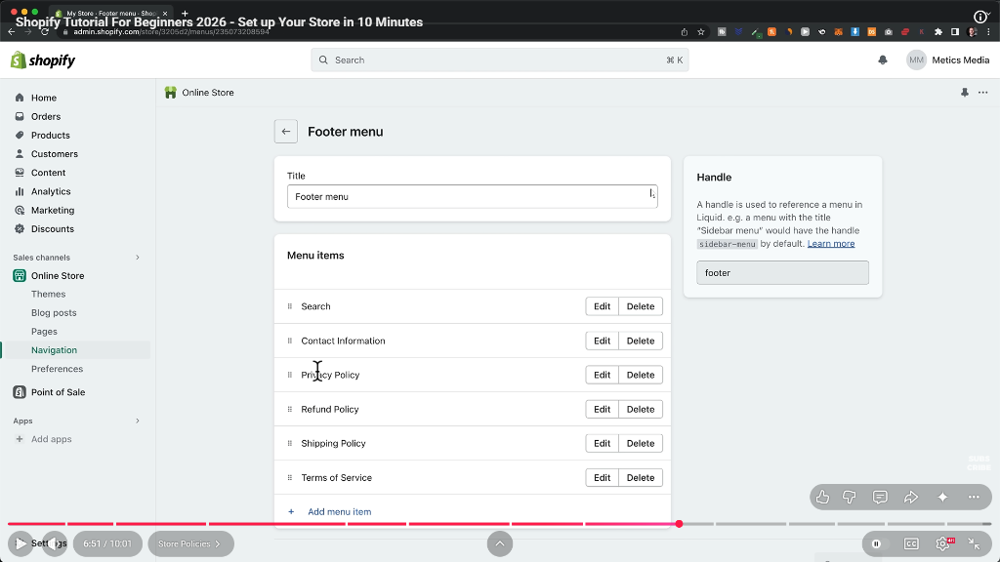

### Comparison Table

| Element / Flow                       | Shopify (As Shown)                                                                                                           | Kloudshop (Current)                                                           | Analysis & Mapping                                                                                                            |
|:------------------------------------ |:---------------------------------------------------------------------------------------------------------------------------- |:----------------------------------------------------------------------------- |:----------------------------------------------------------------------------------------------------------------------------- |
| **Dynamic Navigation Handles**       | Uses unique string handles (e.g., `footer`, `main-menu`) to bind dynamic menu layouts in code to merchant-controlled lists.  | Sidebar links and main headers are often hardcoded in views or theme configs. | Decoupling templates from specific menu lists via handles lets merchants rearrange navigation without developer changes.      |
| **Auto-Populate Link Naming**        | Automatically populates the item Name input field with the target page or policy title once the link is selected.            | Requires typing names manually even after selecting target page routing.      | Auto-populating titles cuts down on layout entry times and ensures visual labels match destination headers.                   |
| **Administrative Asset Suggestions** | Link input popover acts as an asset auto-suggest search, querying active collections, blog posts, pages, and legal policies. | Text fields or standard URL selectors requiring manual path entries.          | Standardized auto-suggest panels prevent broken links by forcing paths to bind to registered database models (e.g. policies). |

### Architectural Recommendations for Kloudshop

1. **Handle-Based Navigation Schema**: Implement `NavigationMenu` and `NavigationItem` database models. Assign a unique, immutable index handle (e.g. `header`, `footer`) to core menus, letting storefront renderer loops query menus dynamically.
2. **Dynamic Link Resolver Engine**: Build an auto-suggest link field that fetches routing paths from across system modules (e.g., `policies/privacy`, `collections/hoodies`, `products/tshirt`). Return a unified schema containing both the absolute route path and its default label to pre-fill the name field.
3. **Menu Reordering Drag-and-Drop**: Equip the menu builder panel with drag handles to allow easy nesting (up to 3 levels deep) and simple reordering of items.

## 15b. Store Policies, Return Rules & HTML Document Editors

This section covers the creation, formatting, and administrative setup of standard legal storefront policies.

#### 1. Entry Point Settings Navigation

> [!NOTE]
> This screen shows the merchant clicking on **Settings → Policies** at the bottom of the Shopify settings sidebar to configure storefront terms and conditions.

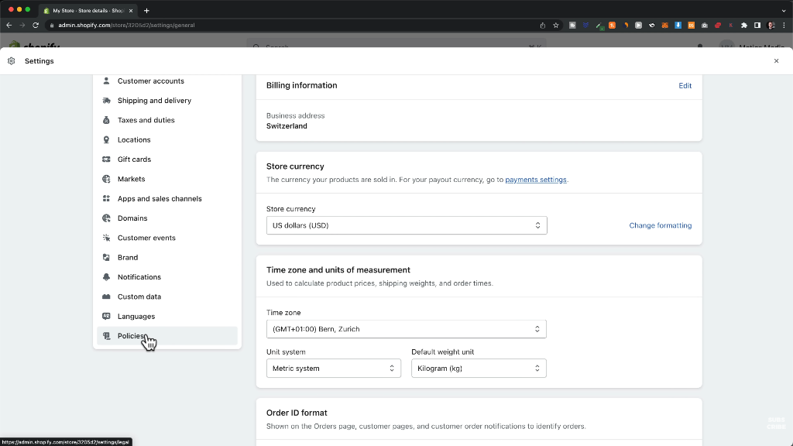

#### 2. Onboarding Return Rules

> [!NOTE]
> This screen details the configuration of automated refund policies (toggling return windows, restocking fees, and free return shipping rules) before editing the policy document text.

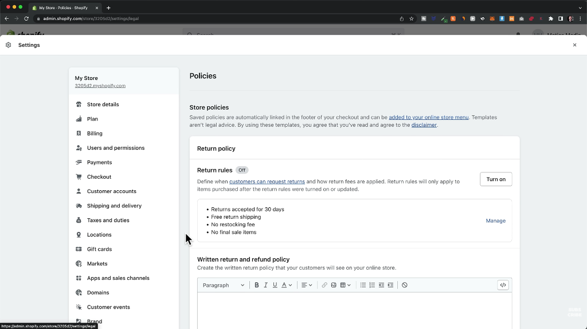

#### 3. Configurable Policies Directory

> [!NOTE]
> This screen showcases the multiple legal policy sections that can be configured (Return & Refund, Privacy Policy, Terms of Service, Shipping, Contact info), each providing a rich-text textarea editor.

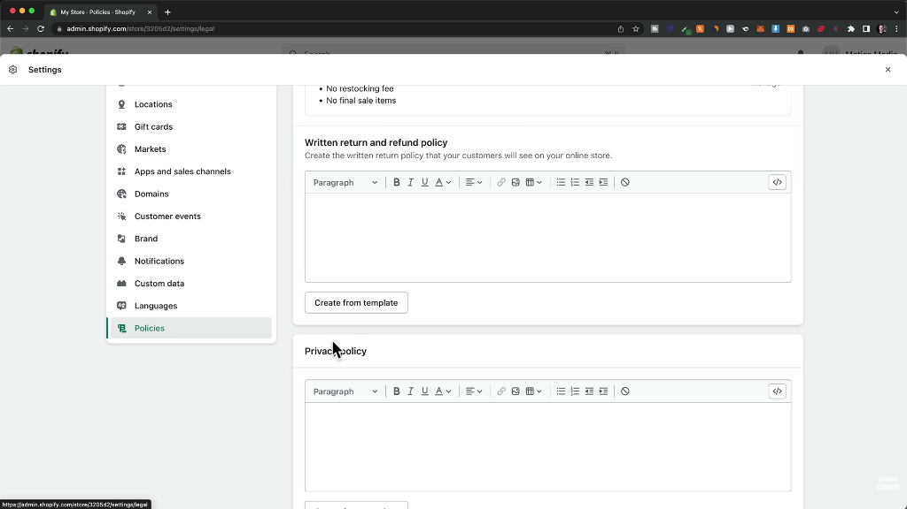

#### 4. Rich HTML Document Inline Editor

> [!NOTE]
> This screen captures a populated Return & Refund Policy editor. The toolbar features a raw HTML source code toggle (`</>`), letting merchants paste external styled document structures directly. It also exposes a "Create from template" utility that auto-fills templates with default tenant values (email, business address).

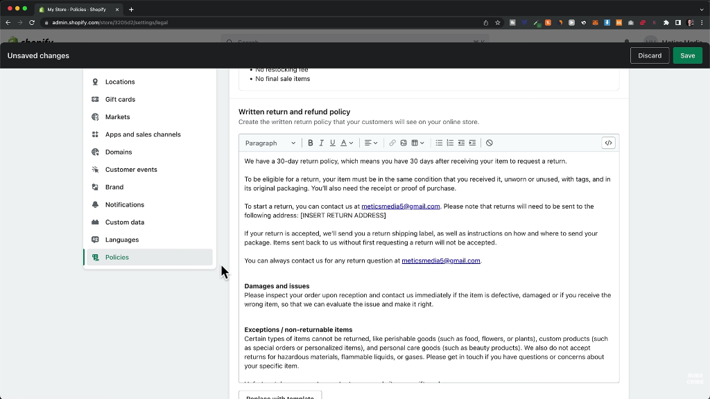

### Comparison Table

| Element / Flow                     | Shopify (As Shown)                                                                                                                               | Kloudshop (Current)                                                                                    | Analysis & Mapping                                                                                                           |
|:---------------------------------- |:------------------------------------------------------------------------------------------------------------------------------------------------ |:------------------------------------------------------------------------------------------------------ |:---------------------------------------------------------------------------------------------------------------------------- |
| **Full HTML Source Editor**        | Exposes a raw HTML source toggle (`</>` code button) inside policy textareas, letting merchants paste custom formatting, embeds, or CSS layouts. | Offers basic rich-text formatting inputs or standard text textareas without HTML source editing modes. | Full HTML editing lets merchants insert custom legal branding, standard tables, or accordion structures without dev support. |
| **Dynamic Policy Templates**       | Includes a "Create from template" utility that auto-populates legal drafts containing tenant metadata (emails, return addresses).                | Requires copying and pasting templates from external generator sites.                                  | Building automated generator scripts based on tenant profiles removes merchant friction during store setup.                  |
| **Automated Return Window Engine** | Rules engine defining global return logic (e.g. 30-day limits, restocking fees) that checkout and order systems query automatically.             | Manual policies page; return logic is not queryable by backend processes.                              | Tying return rules directly to order database models allows the customer portal to validate self-service return eligibility. |

### Architectural Recommendations for Kloudshop

1. **HTML Source Editor Toggles**: Equip Kloudshop's text areas with a source code toggle (WYSIWYG <=> raw HTML) so merchants can inject inline custom layout styles, tables, or anchor links.
2. **Policy Generation Templates**: Provide "Create from template" scripts that fetch the tenant's primary address, business name, and support email to populate boilerplate legal documents dynamically.
3. **Versioned Policies Database Model**: Save legal documents in a `StorePolicy` database model designed to support strict compliance versioning. The schema must include:
   - `id`: Unique identifier.
   - `type`: Enum indicating policy category (`refund`, `privacy`, `terms`, `shipping`, `contact`).
   - `version`: Integer tracking the document iteration.
   - `html_content`: The full-text markup of that specific policy version.
   - `created_at`: The datetime the draft was created.
   - `updated_at`: The datetime the policy draft was last modified.
   - `activated_at`: The timestamp when this specific version was activated (applied to checkout/storefront).
   - `deactivated_at`: The timestamp when this version was deactivated (superseded by a newer active version).
   - `is_active`: Boolean flag indicating if this version is the currently live storefront document.
     Ensure that a database transaction automatically sets the `deactivated_at` timestamp of the old version to the current time when a newer version's `is_active` flag is set to `true`.

## 15c. Storefront Header Navigation & Menu Binding

This section analyzes the customization and dynamic data-binding of the storefront's primary header navigation menu.

#### 1. Header Navigation Menu (Initial State)

> [!NOTE]
> This screen captures the storefront preview canvas in the Theme Customizer, highlighting the main header navigation menu links (Home, Catalog, Contact). In the coming screenshots, this layout block will be edited to map custom menus created in the navigation settings.

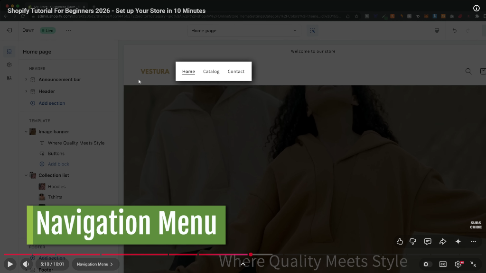

---

#### 2. Navigation Dashboard & Menu Entry Point

> [!NOTE]
> This dashboard serves as the central control panel for online store navigation. Merchants can manage menus (link lists) such as the main header navigation or footer links. It also provides entry points for configuring collection filters.

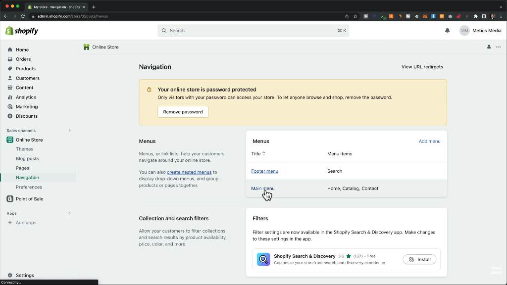

---

#### 3. Main Menu Configurations & Handles

> [!NOTE]
> Selecting a menu opens its detailed editor. The menu title determines its administrative name, while the system generates a unique **Handle** (e.g., `main-menu`). This handle is referenced in theme Liquid files to fetch and iterate over the link list dynamically. Menu items can be reordered via drag-and-drop or nested by dragging them under parent items.

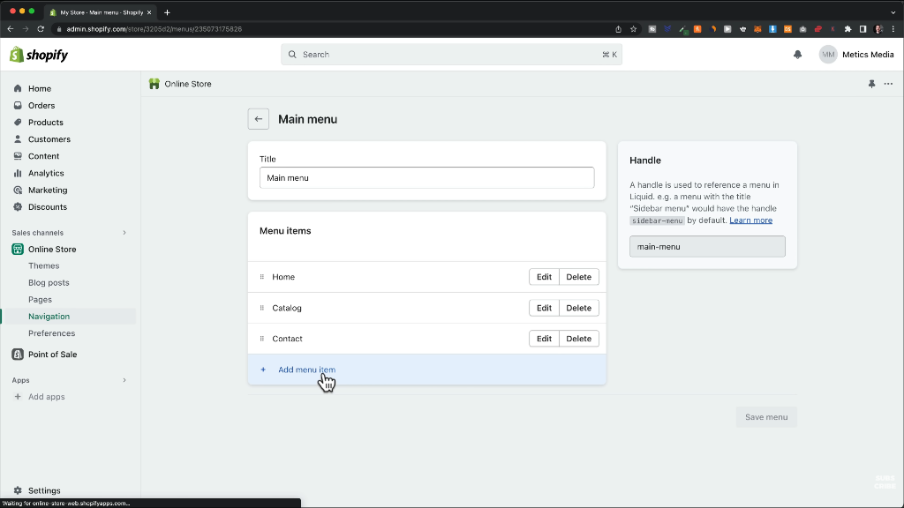

---

#### 4. Adding Menu Items (Sidebar Drawer)

> [!NOTE]
> Clicking "Add menu item" opens a context-sensitive sidebar drawer. This avoids displacing the merchant from the main menu hierarchy while inputting the link details.

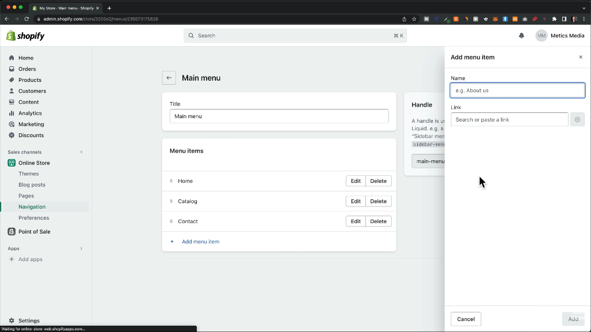

---

#### 5. Link Resolution & Dynamic Routing

> [!NOTE]
> The link input acts as both a search bar and a dropdown for pre-loaded site resources. Merchants can link to collections, products, pages, blogs, or administrative policy pages.

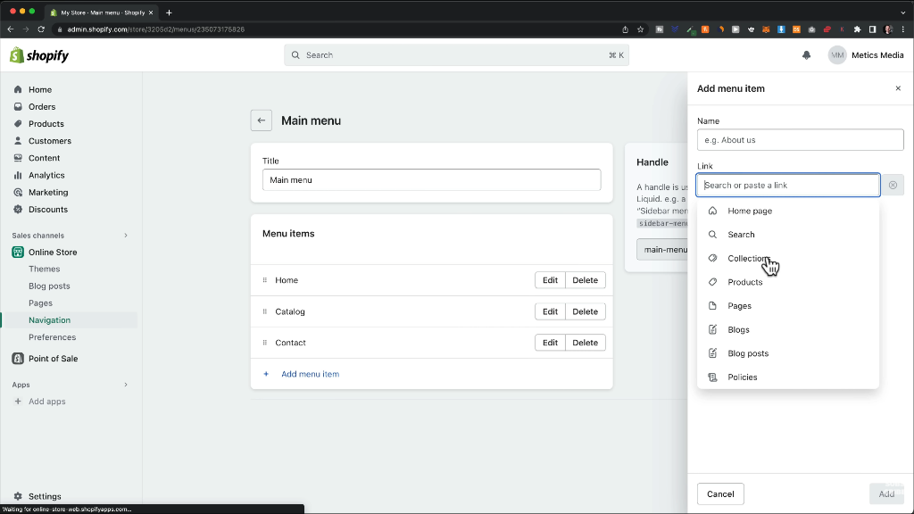

---

#### 6. Nested Menu Levels (Sub-collections Binding)

> [!NOTE]
> Selecting an option like "Collections" expands into a sub-navigation list showing all active collections on the store (e.g., Hoodies, Shorts, Tshirts). This allows merchants to bind a menu link directly to a database resource group.

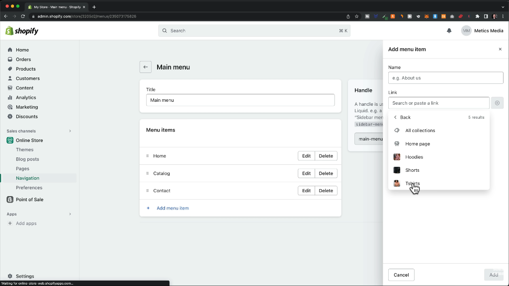

---

#### 7. Drag & Drop Hierarchy (Initiating Drag)

> [!NOTE]
> Merchants can structure nested menus (sub-menus) using an interactive drag-and-drop interface. Dragging a menu item (e.g., `Tshirts`) slightly to the right triggers a blue placement line showing it will be nested as a child of the item above it (`Womens`).

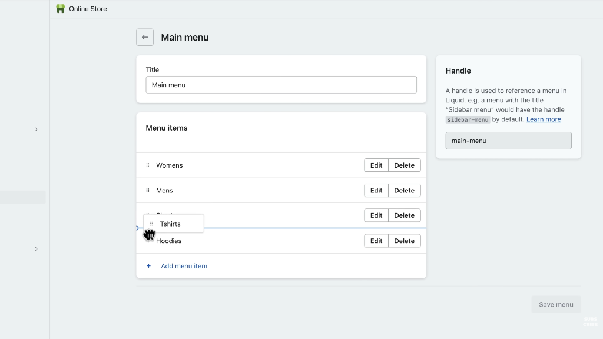

---

#### 8. Drag & Drop Hierarchy (Nested Result)

> [!NOTE]
> Releasing the drag nests the item under the parent. The child item is indented, and the parent item gets an expand/collapse chevron to toggle visibility of its sub-items in the editor.

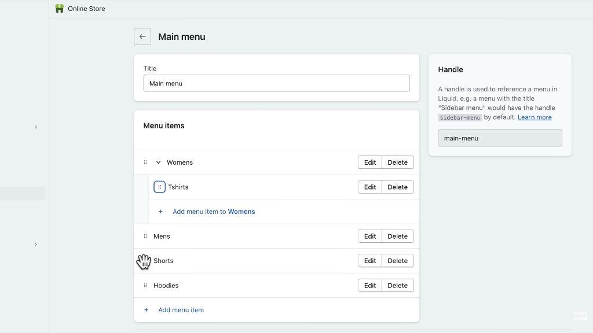

---

#### 9. Inline Sub-menu Additions

> [!NOTE]
> Once a nested hierarchy is established, the interface provides a dedicated "+ Add menu item to [Parent Name]" action nested directly inside the parent container. This allows the merchant to continue adding items directly within the sub-menu hierarchy.

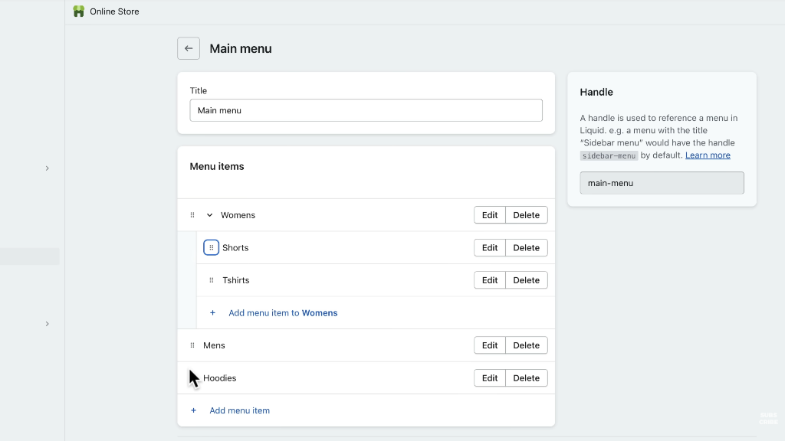

---

#### 10. Separation of Concerns (Multi-Level Structuring)

> [!NOTE]
> A completed nested structure separates distinct product categories (e.g., nesting category links like Hoodies, Shorts, and Tshirts under gendered parents like `Womens` and `Mens`). This builds a clean, semantic mapping tree.

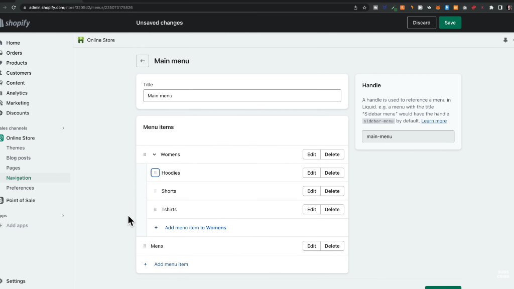

---

#### 11. Storefront Rendering & Customizer Binding

> [!NOTE]
> The storefront's layout rendering engine pulls the menu hierarchy dynamically using the bound handle. Hovering over a parent menu item (`Womens`) in the header automatically triggers a dropdown listing the nested sub-links. The left side panel in the Theme Customizer binds this menu to the header and provides configuration toggles like desktop menu type (dropdown vs. mega menu).

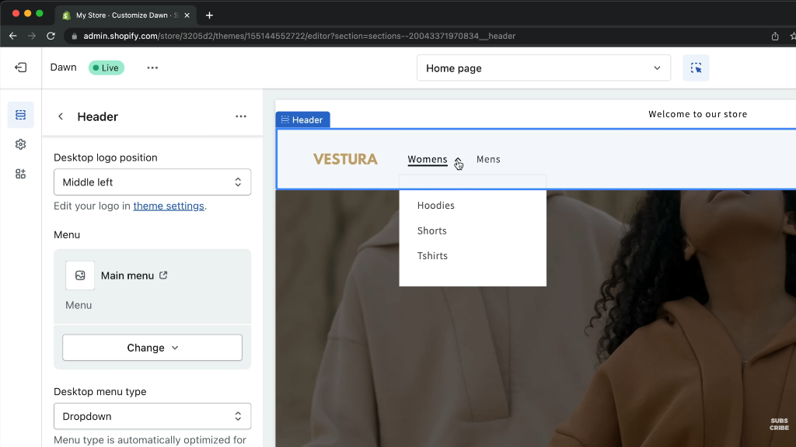

---

### Kloudshop Implementation Recommendations

To support dynamic multi-level navigation and nested menus in Kloudshop:

1. **Database Schema Design**:
   A single self-referencing `navigation_items` table enables infinite nesting levels (although UI typically restricts to 3 levels):
   
   - `id`: Primary key.
   - `menu_id`: Reference to parent menu definition (e.g., main header, footer).
   - `parent_id`: Nullable self-referencing foreign key pointing to the parent `navigation_item.id`.
   - `title`: Display text of the link.
   - `url_path`: Hardcoded fallback URL or relative route path.
   - `resource_type`: Polymorphic string (e.g., `product`, `collection`, `page`, `policy`, `external`).
   - `resource_id`: Polymorphic foreign key matching the selected resource.
   - `position`: Integer defining the visual sort order among sibling items.

2. **Handle-Based Binding**:
   Front-end themes should query menus using a unique string identifier (`handle` or `slug`, e.g., `main-menu`) rather than database primary keys. This ensures that even if a database is restored or items are replaced, theme configuration bindings remain intact.

---

## 16. Implied Admin Settings & Navigation Map (Triangulation Tracker)

This section acts as a running map of all administrative options observed in sidebars and secondary menus across Shopify screenshots. These menu paths represent the broader merchant configuration journey and will be triangulated at the end of the analysis session.

### Settings Sidebar Navigation Items Tracked

The following items are visible in Shopify's **Settings** panel:

1. **Store details** — Basic store name, contact email, region, timezone, default currency (*Actively Analyzed in §12*).
2. **Plan** — Current plan selection, upgrade/downgrade cycles.
3. **Billing** — Invoices, statement history, connected payment cards.
4. **Users and permissions** — Staff access lists, roles, and collaborative permissions.
5. **Payments** — Checkout gateways (Shopify Payments, PayPal, third-party processors) (*Actively Analyzed in [§12a](#12a-payment-gateways-capture-methods--transaction-fees)*).
6. **Checkout** — Form requirements (optional/mandatory fields), customer contact methods, marketing opt-ins.
7. **Customer accounts** — Toggle classic vs. new customer login accounts, self-service portals.
8. **Shipping and delivery** — Profiles, shipping zones, rates, transit times, packaging dimensions (*Actively Analyzed in §13*).
9. **Taxes and duties** — Country-specific tax collection profiles, duties estimation settings (*Actively Analyzed in §14*).
10. **Locations** — Inventory locations (warehouses, physical stores) to route fulfillment.
11. **Gift cards** — Issuance policies, expiry limits.
12. **Markets** — Multi-region localized sales settings (currencies, translations).
13. **Apps and sales channels** — Connections to external channels (POS, TikTok, Google) and app installations.
14. **Domains** — DNS record setups, default/custom URL bindings (*Actively Analyzed in §11*).
15. **Customer events** — Pixel tracking, custom app tracking scripts.
16. **Brand** — Brand guidelines (logos, colors, typography presets, cover images, descriptions, social links) shared across templates (*Actively Analyzed in §15*).
17. **Notifications** — Setup email/SMS templates sent to customers during orders, shipping, and billing.
18. **Custom data** — Define metafields and custom schemas for products, variants, collections, orders, etc.
19. **Languages** — Multi-language localization settings.
20. **Policies** — Standard store policies (Refund, Privacy, Terms of Service, Shipping, Contact info) auto-populated at checkout (*Actively Analyzed in [§15b](#15b-store-policies-return-rules--html-document-editors)*).
