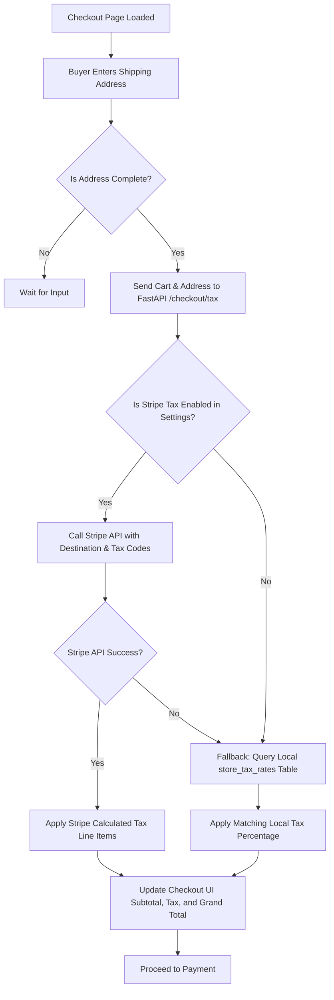

# Tax Compliance & Calculation Architecture

This document specifies the technical design, database schemas, and checkout integration workflows for calculating and collecting taxes on Kloudshop merchant storefronts.

---

## 1. Architectural Strategy

Kloudshop uses a **hybrid tax compliance model** designed to balance automation for global commerce with cost savings for local operations. 

### A. Stripe Tax Automated Calculations (Primary)
* **Merchant of Record (MoR)**: The merchant is the direct seller of record. Funds flow directly from the customer to the merchant’s connected Stripe account.
* **Calculation Engine**: Stripe Tax. During checkout, Kloudshop calls the Stripe API with the buyer's shipping address. Stripe Tax determines the correct tax liability (UK VAT, EU VAT, US Sales Tax) and adds it to the payment transaction.
* **Onboarding & Setup**: Surfaced via Stripe Connect embedded components (`ConnectTaxSettings` and `ConnectTaxRegistrations`) loaded inside the merchant settings dashboard.

### B. Manual Tax Rates Table (Fallback & Free Tier)
* **Purpose**: Allows merchants to set up flat, regional tax rules for free without paying Stripe’s transaction calculation fees. Also serves as a fallback to ensure checkout functions when Stripe is not connected or APIs are unavailable.
* **Calculation Engine**: Local Kloudshop backend query.

---

## 2. Checkout Calculation Flow

The tax calculation executes dynamically during checkout based on the buyer's shipping address:



---

## 3. Database Schema Requirements

To support this architecture, changes are required across the Catalog, Settings, and Orders modules.

### A. New Models to Add

#### 1. Manual Tax Rates Table (`store_tax_rates`)
Used when Stripe Tax is disabled. Stores manual merchant-configured percentages.
```python
class StoreTaxRate(Base):
    __tablename__ = "store_tax_rates"
    
    tax_rate_id = Column(String, primary_key=True, default=lambda: str(uuid.uuid4()))
    tenant_id = Column(String, nullable=False, index=True)
    
    country_code = Column(String(2), nullable=False) # e.g. "US", "GB"
    state_code = Column(String(8), nullable=True)     # e.g. "CA", "NY" (Null means country-wide)
    
    tax_percentage = Column(Numeric(5, 2), nullable=False, default=0.00) # e.g. 20.00 for UK VAT
    tax_name = Column(String(32), nullable=False, default="VAT")         # e.g. "VAT", "Sales Tax"
    
    is_active = Column(Boolean, nullable=False, default=True)
    created_at = Column(DateTime, default=datetime.utcnow)
```

---

### B. Modifications to Existing Models

#### 1. Catalog Module (`backend/modules/catalog/models.py`)
To map products to the correct Stripe tax categories (to support tax exemptions on items like digital goods or books):

* **`Product` Table Changes**:
  * Add `tax_category = Column(String(64), nullable=False, default="standard_physical")` (maps to predefined categories: General, Digital, Groceries, Clothing).
  * Add `stripe_tax_code = Column(String(32), nullable=True)` (stores Stripe's official tax code, e.g. `txcd_99999999` for general physical goods).

* **`Variant` Table Changes**:
  * Keep the existing `taxable` (Boolean, default `True`) column. If `False`, the checkout engine skips tax calculation for this variant.

#### 2. Storefront Settings Module (`backend/modules/storefront/models.py`)
To configure the store-wide tax policy:

* **`BrandProfile` Table Changes**:
  * Add `collect_tax_automatically = Column(Boolean, nullable=False, default=False)` (toggles Stripe Tax on/off).
  * Add `tax_calculation_fallback = Column(Boolean, nullable=False, default=True)` (enables falling back to manual rates if Stripe API fails).

#### 3. Orders Module (`backend/modules/orders/models.py`)
To record the exact taxes charged on the final invoice for legal accounting:

* **`Order` Table Changes**:
  * Add `tax_breakdown = Column(JSON, nullable=False, default=[])` 
    * *Format*: `[{"name": "UK VAT (20%)", "amount": 10.00}, {"name": "County Sales Tax", "amount": 2.50}]`
  * Add `tax_calculation_source = Column(String(16), nullable=False, default="manual")` # `stripe` | `manual`
