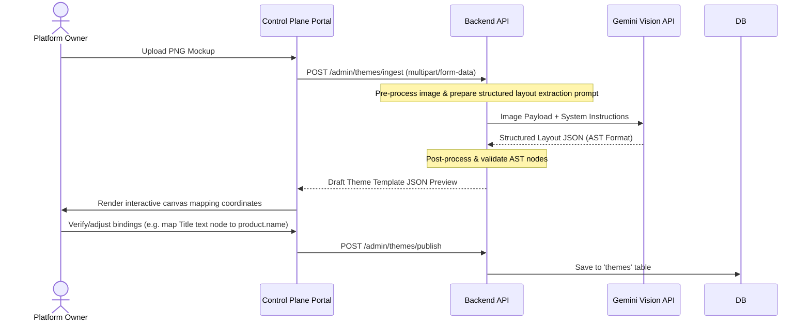

# Theme Ingestion & Dynamic Data-Binding Architecture
This document details the software architecture, database models, API interfaces, and AI pipeline required to ingest flat image mockups (e.g., Dribbble PNGs) and turn them into configurable, data-bound storefront themes for the Kloudshop SaaS platform.

---

## 1. Architectural Overview

To transform static visual assets into fully functional store builder templates, Kloudshop must separate visual layout from business data. The architecture is split into a **Control Plane Ingestion Pipeline** (for platform admins) and a **Data Binding Resolver** (for merchant storefront rendering).

```mermaid
flowchart TD
    PNG[1. Flat PNG Mockup Upload] --> VisionAI[2. Control Plane Vision AI Parser]
    VisionAI --> CleanJSON[3. Hierarchical Layout AST JSON]
    CleanJSON --> AdminEditor[4. Admin Binding Console]
    AdminEditor --> DB[(5. PostgreSQL Database)]
    DB --> Resolver[6. Storefront Binding Resolver]
    Resolver --> UI[7. Dynamic Storefront Widget Tree]
    
    subgraph Control Plane (Platform Admin)
        VisionAI
        AdminEditor
    end
    
    subgraph Data Plane (Storefront Client)
        Resolver
        UI
    end
```

---

## 2. Layout Abstract Syntax Tree (AST) Specification

The storefront layout is represented as a nested tree of nodes (Abstract Syntax Tree). Each node is either a structural container (`flexCol`, `flexRow`, `grid`, `stack`) or a leaf component (`text`, `image`, `button`, `gallery`).

### Dynamic Data Bindings

To support a multi-page store editor, any node in the AST can declare a `binding` object. At runtime, the client-side rendering engine maps the node to the active page context's data model:

- `source`: The contextual database model query key (e.g., `product`, `collection`, `cart`, `blog_post`, `policy`, `shop`).
- `field`: The attribute path in the resolved database record.
- `formatter`: Formatting functions (`currency`, `date`, `truncate_words`, `html`).
- `fallback`: Static placeholder value when database records are null or empty.

### Storefront Page Types & Binding Schema Maps

The binding resolver evaluates coordinates and data fields depending on the active page type:

| Page Type | Key / Handle | Primary Data Source (`source`) | Binding Fields (`field`) | Typical Components |
| :--- | :--- | :--- | :--- | :--- |
| **Home Page** | `home` | `shop` / `featured` | `shop.name`, `featured.products`, `featured.collections` | Hero banners, Slideshows, Product carousels |
| **Product Detail** | `pdp` | `product` | `product.name`, `product.price`, `product.images`, `product.variants` | Image gallery, Variant selectors, Add to Cart |
| **Collection Detail**| `collection` | `collection` | `collection.title`, `collection.description`, `collection.products` | Product grid, Filter sidebars, Sorting headers |
| **Collections List** | `collections_list`| `collections` | `collections.all` (list of title + image) | Grid of collection cover cards |
| **Blog Directory** | `blog` | `blog` | `blog.title`, `blog.articles` | Article grids, Category tabs, Author profiles |
| **Blog Post Page** | `blog_post` | `blog_post` | `blog_post.title`, `blog_post.content`, `blog_post.published_at` | Rich text article body, Comments, Social share |
| **Shopping Cart** | `cart` | `cart` | `cart.items`, `cart.subtotal_price`, `cart.item_count` | Line item drawers, Quantity selectors, Checkout CTAs |
| **Checkout/Success** | `checkout` | `order` | `order.id`, `order.total_price`, `order.shipping_address` | Address inputs, Order summary, Payment indicators |
| **Policy Page** | `policy` | `policy` | `policy.title`, `policy.html_content`, `policy.updated_at` | Legal document readers, HTML renderers |
| **Custom Page** | `custom_page` | `page` | `page.title`, `page.body_json` | Flexbox sections, Rich text blocks, Custom grids |

---

### Example JSON Layout AST (Product Detail Page)

```json
{
  "id": "root_pdp",
  "type": "flexRow",
  "styles": {
    "padding": 24,
    "spacing": 32,
    "crossAxisAlignment": "start"
  },
  "children": [
    {
      "id": "gallery_container",
      "type": "flexRow",
      "styles": {
        "width": 500,
        "spacing": 16
      },
      "children": [
        {
          "id": "image_gallery_picker",
          "type": "image_gallery",
          "styles": {
            "thumbnailPosition": "left",
            "thumbnailWidth": 80,
            "spacing": 8
          },
          "binding": {
            "source": "product",
            "field": "images",
            "fallback": ["https://assets.kloudshop.io/placeholder-pdp.png"]
          }
        }
      ]
    },
    {
      "id": "details_container",
      "type": "flexCol",
      "styles": {
        "flex": 1,
        "spacing": 12
      },
      "children": [
        {
          "id": "product_title",
          "type": "text",
          "styles": {
            "fontSize": 24,
            "fontWeight": "bold",
            "color": "#111827"
          },
          "content": "Product Title Placeholder",
          "binding": {
            "source": "product",
            "field": "name",
            "fallback": "Premium Product"
          }
        },
        {
          "id": "product_price_group",
          "type": "flexCol",
          "styles": {
            "spacing": 4
          },
          "children": [
            {
              "id": "product_price",
              "type": "text",
              "styles": {
                "fontSize": 20,
                "fontWeight": "800",
                "color": "#ea580c"
              },
              "content": "Rp0",
              "binding": {
                "source": "product",
                "field": "price",
                "formatter": "currency",
                "fallback": "Rp 0.00"
              }
            }
          ]
        }
      ]
    }
  ]
}
```

---

## 3. Database Schema Mapping (PostgreSQL / SQLAlchemy)

The backend handles template metadata and active configurations using two primary models: `themes` (the global template definitions) and `theme_configurations` (the tenant-specific layout state).

```python
from sqlalchemy import Column, String, Boolean, Text, JSON, DateTime, ForeignKey
from sqlalchemy.orm import relationship
from datetime import datetime, timezone
import uuid
from shared.db import Base

class Theme(Base):
    """
    Global template blueprint defined by the platform owner (Control Plane).
    """
    __tablename__ = "themes"

    theme_id = Column(String, primary_key=True) # e.g., "beli-beli-theme"
    name = Column(Text, nullable=False)
    description = Column(Text)
    preview_url = Column(Text)
    
    # Stores the default layout structures, including default slots & tokens
    # e.g., {"tokens": {...}, "slots": {"layout_pdp": {...AST...}, "layout_home": {...AST...}}}
    base_config = Column(JSON, nullable=False)
    created_at = Column(DateTime, default=lambda: datetime.now(timezone.utc))


class ThemeConfiguration(Base):
    """
    Tenant customizer configurations containing layout overrides (Data Plane).
    """
    __tablename__ = "theme_configurations"

    config_id = Column(String, primary_key=True, default=lambda: str(uuid.uuid4()))
    tenant_id = Column(String, nullable=False, index=True)
    theme_id = Column(String, ForeignKey("themes.theme_id"), nullable=False)
    name = Column(Text, nullable=False, default="Active Layout")
    
    # Store token variables (colors, typography)
    draft_tokens = Column(JSON, nullable=False, default={})
    live_tokens = Column(JSON, nullable=False, default={})
    
    # Store page-level slots layout AST (Home, PDP, Checkout, Cart, etc.)
    # slots contain the complete layout AST JSON representing the page
    draft_slots = Column(JSON, nullable=False, default={})
    live_slots = Column(JSON, nullable=False, default={})
    
    is_active = Column(Boolean, nullable=False, default=False)
    updated_at = Column(DateTime, default=lambda: datetime.now(timezone.utc), onupdate=lambda: datetime.now(timezone.utc))

    theme = relationship("Theme")
```

---

## 4. The AI Ingestion Pipeline (Vision-to-AST)

To eliminate manual coding, a platform administration endpoint converts uploaded mockups into Layout AST templates automatically using Vision AI.



### Vision AI Prompt Specification

To extract the correct page layout and dynamic mappings, the ingestion endpoint passes the target page type metadata (`pdp`, `home`, `collection`, `blog_post`, etc.) and uses a structured system prompt to auto-map data bindings:

```text
You are a senior UI/UX parser. Analyze the provided storefront image and classify it into one of these page types: [home, pdp, collection, collections_list, blog, blog_post, cart, checkout, policy].
Parse the image into Kloudshop's Layout AST JSON structure following these rules:
1. Detect structural layout segments: Header, Template sections (grids, lists, custom rows), and Footer.
2. For identified interactive components, tag them with the correct dynamic data "binding" object:
   - If PDP: Map product images to "product.images", titles to "product.name", price displays to "product.price".
   - If Collection Detail: Map the collection title header to "collection.title", and map repeating catalog grid tiles to bind dynamically to products inside "collection.products".
   - If Collections List: Map grid item cells to "collections.all" list properties (title, cover image, link path).
   - If Blog Post: Map article title to "blog_post.title", date to "blog_post.published_at" (formatted as "date"), and main article body to "blog_post.content" (formatted as "html").
   - If Cart/Checkout: Map repeating item rows to "cart.items", subtotal text to "cart.subtotal_price".
   - If Policy Page: Map document body to "policy.html_content".
3. Auto-detect design tokens: Identify dominant colors and register primary, secondary, and background color tokens in the style settings.
4. Output JSON ONLY conforming to the target Layout AST Schema. Do not output markdown code blocks or explanations.
```

---

## 5. Storefront Data-Binding Resolver (Runtime Engine)

At client runtime, the storefront app uses a recursive lookup resolver to bind merchant inventory details dynamically into layout placeholders before rendering. Depending on the active page route, the resolver is supplied with the appropriate page-level context payload (`product` for PDP, `collection` for collection page, `blog_post` for article view, etc.):

### Flutter Binding Resolver Implementation Example

```dart
class StorefrontBindingResolver {
  /// Resolves the layout AST node dynamically by looking up database models
  static Map<String, dynamic> resolveNode(
    Map<String, dynamic> node, {
    required Map<String, dynamic> contextData,
  }) {
    // Create a copy of the node to avoid mutating cached configuration templates
    final resolvedNode = Map<String, dynamic>.from(node);

    // If node has children, resolve them recursively
    if (resolvedNode.containsKey('children') && resolvedNode['children'] is List) {
      final childrenList = resolvedNode['children'] as List;
      resolvedNode['children'] = childrenList.map((child) {
        return resolveNode(
          Map<String, dynamic>.from(child),
          contextData: contextData,
        );
      }).toList();
    }

    // Process binding declaration
    if (resolvedNode.containsKey('binding') && resolvedNode['binding'] is Map) {
      final binding = resolvedNode['binding'] as Map<String, dynamic>;
      final String source = binding['source'] ?? '';
      final String field = binding['field'] ?? '';
      final String? formatter = binding['formatter'];
      final dynamic fallback = binding['fallback'];

      // Look up target database source object
      if (contextData.containsKey(source)) {
        final dataSource = contextData[source];
        final boundValue = _getPropertyPath(dataSource, field);

        if (boundValue != null) {
          resolvedNode['content'] = _formatValue(boundValue, formatter);
          
          // Custom mapping for specialized component views
          if (resolvedNode['type'] == 'image_gallery' || resolvedNode['type'] == 'image') {
            resolvedNode['images'] = boundValue;
          }
        } else {
          resolvedNode['content'] = fallback;
        }
      } else {
        resolvedNode['content'] = fallback;
      }
    }

    return resolvedNode;
  }

  static dynamic _getPropertyPath(dynamic obj, String path) {
    if (obj == null) return null;
    if (obj is Map) {
      return obj[path];
    }
    // Reflective lookup if parsing an instantiated model class
    try {
      return obj.toJson()[path];
    } catch (_) {}
    return null;
  }

  static String _formatValue(dynamic val, String? formatter) {
    if (val == null) return '';
    if (formatter == 'currency') {
      // Dynamic currency formatting (e.g. converting 187500 -> Rp 187.500)
      return 'Rp ${val.toString().replaceAllMapped(RegExp(r'(\d{1,3})(?=(\d{3})+(?!\d))'), (Match m) => '${m[1]}.')}';
    }
    return val.toString();
  }
}
```

---

## 6. Comparison Analysis: Custom Ingestion Tool vs. Visual Coding Builders

| Capability | Ingestion & Binding Tool (Proposed) | Visual builders (e.g., Webflow, Elementor) | Flutter WYSIWYG Editors |
| :--- | :--- | :--- | :--- |
| **Merchant Focus** | Highly scoped to product catalog mappings. Dynamic parameters are bound directly. | Generic visual nodes, requiring manual data connectivity or CMS hookups. | Fixed widget schemas, hardcoded parameters. |
| **Template Sourcing** | Fast deconstruction from flat image files (PNG/Figma exports) using Vision AI. | Manual component reconstruction from scratch on a blank canvas. | Hardcoded theme libraries inside the binary build folder. |
| **Control Plane Scope** | Platform-level automation utility built specifically for SaaS operations. | Integrated front-end editing client packages. | Ad-hoc templates. |
